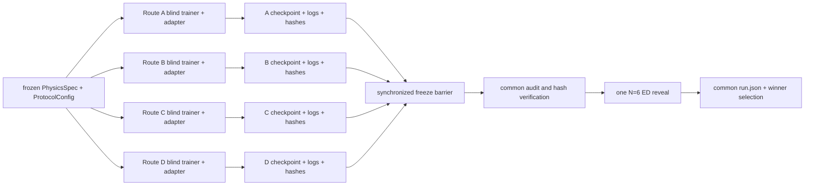

# Challenge #15 Scalable NQS v1 Design

> Status: parallel amendment approved; Step 1 protocol/evaluator implemented
>
> Date: 2026-07-28
>
> Project: BOTS:848, Harnessing Quantum 2026 Challenge #15
>
> Baseline: [Benchmark v0](../../../tracks/qmc/solutions/BOTS-848/docs/benchmark-v0.md)

## 1. Outcome and boundary

Benchmark v0 remains the minimum acceptance benchmark. It has already passed at
`N=6`, but its projected random-feature candidate uses an ED-sized exact
`L^2` projector and Ritz optimization. Scalable v1 must reproduce the same
physical target without using a complete many-body basis, a complete
Hamiltonian, an exact angular-momentum projector, or ED-derived variational
coefficients in the candidate path.

The immediate outcome is a fair, parallel comparison of four bounded
candidates developed in isolated repository lanes:

1. Route A, occupation-space autoregressive NQS, owned by `TensorSpicyJ`;
2. Route B, continuous fixed-degree holomorphic NQS, owned by `AroundPeking`;
3. Route C, an `L=2` CF-Flow-style prototype, owned by `bhjia-phys`;
4. Route D, analytic `L=2` seed times an LLL-closed neural correlator, owner
   `unassigned`.

One candidate advances only if it passes the frozen `N=6` gates through a
scalable code path. The winner is then trained at `N=8`; successful `N=8`
evidence unlocks cluster runs at `N=10` and `N=12`.

Chiral spectral weights, Landau-level mixing, thermodynamic extrapolation, and
the paper's `L=N` transport gap remain later research extensions. They do not
enter the scalable-v1 route comparison.

## 2. Fixed physical contract

Every route uses the same problem definition:

- Haldane sphere with `N` fully spin-polarized electrons;
- filling `nu=1/3` and flux `2Q=3(N-1)`;
- strict lowest-Landau-level Hilbert space;
- chord-distance Coulomb interaction
  `1/(sqrt(Q) * |Omega_i-Omega_j|)`;
- raw LLL energy in `e^2/(epsilon*l_B)` as the primary comparison convention;
- background-subtracted and density-corrected paper convention as a derived
  report field only;
- an `L=0` ground state and the lowest `L=2` neutral excitation;
- the primary quantity `Delta_2=E_2-E_0`;
- one shared variational family for the two sectors, with sector-specific heads
  allowed;
- one reduced `L=2` state from which the five `M=-2,...,2` components are
  generated. Five independently trained networks are not a valid multiplet.

Benchmark v0's `N=6, 2Q=15` ED result is the accuracy oracle. Candidate
training and model selection may use the Hamiltonian and symmetry definition,
but not the oracle energies, eigenvectors, projectors, or gaps.

## 3. What “scalable” means

A candidate is scalable when all training, sampling, local estimators, and
symmetry diagnostics operate on individual configurations or polynomial-size
connected neighborhoods. Runtime and memory may grow with `N`, orbital count,
network width, sample count, or Monte Carlo autocorrelation time; they may not
grow because the code allocates or enumerates the complete many-body Hilbert
space.

The candidate path must not:

- enumerate the full fixed-`M` or full-LLL basis;
- construct a dense or sparse matrix for the complete many-body Hamiltonian;
- diagonalize `H` or `L^2`;
- build or apply an exact many-body `L` projector;
- solve a Ritz/generalized-eigenvalue problem over the ED-sized space;
- import or read Benchmark v0 oracle values, vectors, or projected features
  during training, early stopping, hyperparameter selection, or checkpoint
  selection.

The candidate path may use:

- analytic monopole harmonics, Clebsch-Gordan coefficients, Wigner matrices,
  and one-body ladder rules;
- the polynomial-size configurations connected to one sampled configuration by
  the two-body Hamiltonian or by `L_+`, `L_-`, and `L^2`;
- tiny exact fixtures at `N<=4` in unit tests, provided they are not imported by
  a production candidate run;
- the `N=6` ED oracle inside the separate post-freeze evaluator.

`scalable_path_valid` is a new hard gate. Static dependency checks, runtime
manifests, peak-memory measurements, and an `N=8` smoke test provide evidence
for it; a low wall time at `N=6` alone does not.

## 4. Architecture and common contract

The implementation is split into small components with one-way dependencies:

- `PhysicsSpec`: immutable geometry, flux, interaction, sectors, and energy
  conventions;
- `ProtocolConfig`: frozen seeds, optimization/sample budgets, thresholds, and
  resource ceilings;
- route-specific trainer: produces a frozen checkpoint without access to the
  ED oracle;
- `CandidateAdapter`: exposes a common evaluation surface;
- `ScalableEvaluator`: runs symmetry, VMC, resource, and post-freeze ED checks;
- result writer: emits one common `run.json`, resource record, and concise
  attempt journal.

Production modules and the frozen protocol live under
`tracks/qmc/solutions/BOTS-848/scalable_v1/`; route-specific code is isolated
under its `routes/` subdirectory so the evaluator does not depend on route
internals. The committed protocol is
`tracks/qmc/solutions/BOTS-848/scalable_v1/protocol.json`.

The approved candidate interface is:

```text
sample(n_samples, seed) -> SampleBatch
logpsi(config_batch) -> complex log amplitudes
local_energy(config_batch) -> complex local estimators
local_l2(config_batch) -> complex local Casimir estimators
generate_multiplet() -> map M=-2,...,2 to derived state handles
resource_metrics() -> wall, peak RSS/VRAM, throughput, ESS/s
```

`config_batch` is a typed native representation: fixed-particle-number orbital
occupations for Route A and sphere spinor coordinates for Routes B, C, and D.
The evaluator never assumes a route's internal network architecture. Training
is a route-specific command, but it must consume `PhysicsSpec` and
`ProtocolConfig` and produce the same frozen-checkpoint manifest.



## 5. Candidate routes

### Route A: occupation-space autoregressive NQS

Owner: `TensorSpicyJ`.

This route samples fixed-`N`, fixed-`M` orbital occupations with an
autoregressive amplitude/phase model. Occupation states are Slater determinants
of the `2Q+1` monopole orbitals, so LLL membership and fermionic antisymmetry
are exact by construction.

The `L=0,M=0` and `L=2,M=0` states share the autoregressive trunk and use
sector-specific heads. Training uses energy plus stochastic `L^2` mean and
variance penalties. `local_l2` is evaluated from the polynomial-size
configurations reached by analytic angular-momentum ladder moves; it never uses
an exact projector. The other four `M` components are obtained by applying
analytic many-body ladder actions to the frozen reduced state. If direct
autoregressive sampling is unavailable for a ladder-derived component, its
adapter uses Metropolis sampling of the derived amplitude.

For the required finite-rotation check, the evaluator estimates the rotated
Fock-space amplitude with importance sampling. A matrix element between two
Slater configurations is the determinant of a one-body Wigner-rotation
submatrix, so each sampled contribution is polynomial-cost and no rotated full
basis vector is formed.

Primary risk: a flexible fixed-`M` model can lower its energy while retaining
unwanted `L` admixture. The deciding evidence is therefore `Var(L^2)` and the
finite-rotation five-component covariance test, not energy alone.

### Route B: continuous fixed-degree holomorphic NQS

Owner: `AroundPeking`.

This route evaluates the wavefunction directly on sphere spinors. It uses a
polynomial-width sum of antisymmetrized determinants whose single-particle
orbitals are learned linear combinations of degree-`2Q` monopole polynomials.
The coefficients are coordinate-independent outputs of the parameterization;
no anti-holomorphic coordinate or unconstrained coordinate-dependent
coefficient may enter. This makes exchange antisymmetry and LLL closure exact
while avoiding a full determinant-basis expansion.

The ground and excited states share the determinant generator. Angular-momentum
coupling supplies scalar and rank-2 heads, and a single rank-2 head generates
the five-component tower. Direct coordinate-space Metropolis sampling provides
energies and symmetry residuals.

Primary risk: a polynomial-rank determinant expansion may be too weak to reach
the Laughlin correlations at a useful cost. Rank is therefore a declared model
capacity, and both energy variance and peak memory are reported as it changes.

### Route C: `L=2` CF-Flow-style prototype

Owner: `bhjia-phys`.

This route starts from a Clebsch-Gordan-coupled composite-fermion particle-hole
seed in the `L=2` sector, rather than the paper's maximally separated `L=N`
transport-gap excitation. A shared SO(3)-equivariant flow deforms the `L=0`
and reduced `L=2` states, after which the rank-2 tower is generated from the
same equivariant object.

Generic coordinate backflow is not automatically LLL. The route therefore
measures the covariant anti-holomorphic derivative/cyclotron residual without
using a many-body LLL projector. A finite but small leakage labels the result
`prototype` and fails `lll_valid`; the route can pass only if the implemented
flow is restricted to a fixed-degree holomorphic map with an accompanying
construction-level certificate. There is no fallback to exact projection.

Primary risk: the paper's useful expressivity may rely on higher-Landau-level
content. A hard-gate failure is still a useful result because it identifies the
precise obstruction to using CF-Flow as the Challenge #15 final ansatz.

### Route D: analytic `L=2` seed times a neural correlator

Owner: `unassigned`.

This route starts from the spherical projected-density state
`rho_bar(2,M)|Laughlin>` for `M=-2,...,2`. The Laughlin parent is an `L=0`
strict-LLL state at `2Q=3(N-1)`, and `rho_bar(2,M)` is an analytic rank-2
one-body tensor acting entirely inside that fixed LLL. The resulting mother
state is therefore fermionic, fixed-flux, strict LLL, and exactly `L=2` before
any optimization.

An arbitrary coordinate-space multiplicative neural factor is not allowed: it
can introduce anti-holomorphic dependence, change the per-particle degree, or
mix total angular momentum. The admissible neural correlator is instead a
fixed-depth network of LLL-projected SO(3)-scalar operators, generated by scalar
contractions such as
`S_l=sum_m (-1)^m rho_bar(l,m) rho_bar(l,-m)`. The same scalar network acts on
the `L=0` Laughlin parent and the five analytic `L=2` mother components, with
sector-specific scalar coefficients allowed. Because every layer acts within
the LLL and commutes with total angular momentum, the construction preserves
flux, antisymmetry, and exact `L` by design rather than by a penalty.

Primary risk: a shallow scalar-operator network may preserve all certificates
but lack enough variational freedom, while deeper operator strings may make the
local-amplitude estimator too noisy. The route is decided by energy variance
and cost after the four exact construction certificates have passed; it may not
trade those certificates for a lower energy.

## 6. Parallel collaboration, freeze, and oracle-isolated reveal

### Shared starting point and lane ownership

All route work starts from the same public collaboration baseline:

```text
repository:      https://github.com/TensorSpicyJ/quantum.harness-collab
branch:          collab/challenge-15-scalable-v1
common ancestor: 78577cd8f70adf918648fb02962e3b7bc09255e8
```

Route D was approved after the original Step 1 close. Before any Step 2 lane
starts, one common route-admission amendment must add the frozen
`analytic_seed_correlator` capacity mapping and its tests without changing the
physics, seeds, optimizer/sample budgets, thresholds, or resource ceilings.
The resulting child commit on the branch above becomes the exact four-route
comparison base and its SHA is copied into every attempt journal. Starting one
lane from the bare common ancestor and another from the admission commit is not
a valid comparison.

Route A uses the collaboration repository itself; Routes B and C use their own
forks, and Route D uses its eventual owner's isolated fork or branch. Each
owner creates only their assigned route branch, worktree, logs, and artifacts.
If a GitHub fork does not expose the collaboration branch, the owner fetches it
from the repository above and creates the route branch directly at the fixed
post-admission SHA. The exact SHA, rather than a moving branch name, is the
comparison authority.

Route code and result artifacts must not be merged or imported across lanes
before the synchronized freeze. Public visibility means the people are not
blind to one another's code; the enforceable fairness claim is only that no
route's training or selection pipeline consumes another route's code, weights,
metrics, or ED-derived information. A critical defect in the common protocol or
evaluator pauses all four lanes. Fixing it requires a documented common
amendment, a new shared base SHA, and fresh attempts in every affected lane;
one lane may not receive a private common-contract fix.

### Pipeline blinding and synchronized reveal

True human blinding is impossible: Benchmark v0 values are already committed
and have been inspected. Scalable v1 therefore makes a narrower, auditable
claim called **pipeline blinding**:

- `human_blind=false` is always recorded;
- `oracle_isolated=true` requires that training, early stopping, capacity
  choice, and checkpoint choice consume no ED artifact or ED-derived number;
- the legacy summary field `blind_training_valid` is true only when
  `oracle_isolated=true` and the frozen-manifest audit passes.

Before reveal, every route writes and hashes its checkpoint, optimizer state,
training log, selected capacity, and manifest. Large artifacts remain outside
Git. A small tracked freeze receipt records the route, attempt, source commit,
protocol hash, logical artifact names, byte sizes, and SHA-256 digests; the
transport location stays in the out-of-band handoff. The coordinator copies
each bundle into a route-labelled immutable location, recomputes every digest,
and records receipt before any ED artifact is opened. The storage backend and
transfer mechanism do not enter the route score.

The ED evaluator remains disabled until A, B, C, and D have each produced
either a verified freeze receipt or a terminal five-attempt stop report. It
then audits all four terminal records first and loads the `N=6` ED reference
once for the common comparison. A stopped or unverifiable lane is ineligible
rather than allowed to delay or weaken the other routes. Post-reveal retraining
cannot enter the same comparison; it requires a new protocol version and
comparison cycle and records `blind_training_valid=false` for the revealed
cycle.

### Frozen common protocol

Step 1 produces and commits the exact `ProtocolConfig` before any route code is
implemented. It fixes:

- comparison seeds and the number of independent training runs;
- total optimizer updates and local-energy evaluations per sector;
- post-training sample count, burn-in, chains, blocking rule, and minimum ESS;
- symmetry residual, Casimir, multiplet-splitting, and MC-error thresholds;
- model-capacity ceilings and allowed route-specific capacity mapping;
- placement-selected wall-time, peak-RSS, and checkpoint-size ceilings used by
  the Step 1 `resource_budget_valid` gate;
- `remote_max_cpus=32`, enforced in Step 5 by testing the actual `using-slurm`
  job request rather than by the Step 1 resource record;
- peak VRAM and device details as observed-only evidence until a
  hardware-specific ceiling is approved and frozen; no VRAM ceiling is implied
  by the Step 1 gate;
- the fixed `N=8` no-training smoke batch used for growth measurements.

The values are chosen using oracle-free microbenchmarks and resource
calibration; the public Hamiltonian and local estimators may be used, but no ED
reference may be read. They cannot be changed after the first route begins. If a
shared budget is physically impossible for one route, Step 1 must fail rather
than silently granting that route a different budget.

The Route D admission freezes `operator_layers=2`,
`density_ranks=[2,3,4]`, and `hidden_width=64`, still under the common
`max_trainable_parameters=262144` ceiling. This additive mapping changes the
protocol hash and comparison-base commit but does not reopen any other budget
or threshold.

## 7. Gates, metrics, and winner selection

### Hard gates

The scalable-v1 candidate must pass all Benchmark v0 gates:

- `lll_valid`;
- `antisymmetry_valid`;
- `so3_equivariance_valid`;
- `l2_casimir_valid`;
- `fivefold_multiplet_valid`;
- `mc_error_valid`;
- `ed_crosscheck_valid` after reveal;
- `reproducible_run_valid`.

It must also pass:

- `scalable_path_valid`;
- `oracle_isolated` / `blind_training_valid` under the pipeline-blind
  definition;
- `resource_budget_valid`.

LLL and antisymmetry require a construction-level argument plus numerical
tests. A sampled residual alone cannot turn a non-LLL ansatz into a strict-LLL
one. The `L=2` state must satisfy `<L^2>=6` within the frozen uncertainty rule,
have variance compatible with zero, generate all five components, and meet the
frozen finite-rotation and multiplet-splitting criteria.

### Continuous metrics

Every route reports:

- `abs_gap_error` and combined-error-normalized `gap_z_score` after ED reveal;
- ground and excited variational energy errors;
- post-reveal normalized ED fidelity for the `L=0` state and each of the five
  `L=2,M` components, with a sampling error and overlap-estimator wall time;
- local-energy variance for `L=0` and `L=2`;
- `<L^2>` error, `Var(L^2)`, SO(3) residual, swap residual, and multiplet
  splitting;
- effective sample size, autocorrelation time, ESS/s, and estimator throughput;
- optimizer/seed spread;
- wall time, peak RSS, peak VRAM, checkpoint size, and device details;
- `N=8/N=6` smoke ratios for evaluator time and peak memory.

### Winner rule

Selection is lexicographic rather than a hand-tuned weighted score:

1. eliminate every route that fails a hard gate;
2. among survivors, minimize the median `abs_gap_error` across the frozen
   seeds; `gap_z_score` remains a diagnostic and cannot reward inflated error
   bars;
3. if gap errors are statistically tied under the frozen combined-error rule,
   prefer the larger median of the minimum five-component `L=2` ED fidelity,
   then the larger ground-state fidelity;
4. if still tied, prefer lower median excited-state local-energy variance,
   then lower seed spread;
5. if still tied, prefer better `N=8` smoke growth, then higher ESS/s and lower
   peak memory.

Fidelity is reveal-only and has no hard threshold in scalable v1. It may rank
two gate-passing energy ties, but it may not influence training, checkpoint
selection, or pre-reveal route closure.

Exactly one survivor advances. If no route passes, Step 3 closes with a failure
comparison and Step 4 does not start. The evaluator may identify the strongest
failed route, but it is not called a winner and is not promoted to larger
systems.

## 8. Five research steps and attempt accounting

The project has **five research steps**, not five total attempts:

1. freeze the common oracle-isolated protocol, evaluator, schema, budgets, and
   failure-report format;
2. run four implementation lanes concurrently:
   - Step 2A: Route A, occupation-space autoregressive NQS;
   - Step 2B: Route B, continuous fixed-degree holomorphic NQS;
   - Step 2C: Route C, CF-Flow `L=2` prototype;
   - Step 2D: Route D, analytic `L=2` seed times a neural correlator;
3. cross-fork audit, synchronized freeze, one ED reveal, and winner selection;
4. train and evaluate the winner at `N=8`;
5. after `N=8` passes, run the winner at `N=10` and `N=12` on SCNet.

Steps 1, 3, 4, and 5 each have an attempt counter `a01` through `a05`. The four
Step 2 lanes have independent counters: `s02a-a01` through `s02a-a05`,
`s02b-a01` through `s02b-a05`, `s02c-a01` through `s02c-a05`, and
`s02d-a01` through `s02d-a05`. An attempt tests one explicit technical
hypothesis, receives at most 90 minutes of active implementation time, and runs
in its own branch and worktree. The recommended first-attempt names are:

```text
Route A branch: challenge/qmc-chiral-graviton-scalable-v1-s02a-a01
Route B branch: challenge/qmc-chiral-graviton-scalable-v1-s02b-a01
Route C branch: challenge/qmc-chiral-graviton-scalable-v1-s02c-a01
Route D branch: challenge/qmc-chiral-graviton-scalable-v1-s02d-a01

worktree example:
D:/Playground/worktrees/quantum.harness/
challenge-qmc-chiral-graviton-scalable-v1-s02a-a01
```

Every first route attempt starts at the fixed collaboration base SHA. Later
attempts in one lane start from that lane's last terminal commit and may not
merge another lane. `slice-pass`, `failed`, and `inconclusive` closures consume
an attempt; `step-pass` completes the step or route lane. An infrastructure
retry with identical commit and configuration remains inside the same attempt.
The next implementation attempt must change one named technical hypothesis,
not only its random seed.

If `a05` closes without `step-pass` in Step 2, only that route stops and writes
a terminal five-attempt report; the other three routes continue. Step 3 begins
only after all four lanes are terminal as either `route-frozen` or
`route-stopped`. For Steps 1, 3, 4, or 5, exhaustion at `a05` stops every
downstream step and produces the corresponding five-attempt report. Thus the
old serial rule does not apply between Steps 2A, 2B, 2C, and 2D, but the
freeze barrier and Steps 3 to 5 remain ordered.

`step-pass` means that the step's evidence target is complete, not that a
candidate necessarily passed the physics gates. The exit criteria are:

- Step 1: the common protocol, evaluator, schema, and guard tests are committed
  and pass;
- Steps 2A, 2B, 2C, and 2D: the route produces a complete reproducible
  pre-reveal evaluation and verified freeze receipt with a decisive non-ED
  gate classification; a well-demonstrated hard-gate failure is a completed
  route result;
- Step 3: the four terminal records pass the hash and forbidden-dependency
  audit where applicable, the ED oracle is revealed once, and the winner rule
  is applied to all eligible routes;
- Step 4: the winner's full `N=8` run passes all applicable non-ED physics and
  resource gates and produces a complete evaluation record;
- Step 5: both `N=10` and `N=12` produce complete non-ED evaluation records on
  SCNet.

An optional post-freeze `N=8` ED check may be reported if it remains feasible,
but it is evaluator-only and is not required to unlock `N=10` and `N=12`.
At those larger sizes `ed_crosscheck_valid` is recorded as `not_applicable`, not
silently set to true.

Before the Step 3 reveal, audit failures may be repaired only in coordinator
code or bookkeeping and may not change a frozen route artifact. After the ED
oracle has been loaded, any rerun must use the same four verified hash sets;
Step 3 cannot substitute a newly trained checkpoint under a later attempt.

The original design preceded Step 1. This approved parallel amendment changes
only post-Step-1 orchestration and does not consume an implementation attempt.

## 9. Logging and failure handling

Each attempt has two evidence layers:

```text
tracked route journal:
  tracks/qmc/solutions/BOTS-848/logs/scalable-v1/s02[a|b|c|d]-aYY.md

tracked freeze receipt:
  tracks/qmc/solutions/BOTS-848/logs/scalable-v1/freezes/
    s02[a|b|c|d]-aYY.json

ignored or externally transferred raw artifacts:
  tracks/qmc/results/BOTS-848-scalable-v1-s02[a|b|c|d]-aYY/
    commands.log
    environment.txt
    stdout.log
    stderr.log
    training-manifest.json
    resource.json
    run.json
    checkpoints/
```

The tracked journal records the hypothesis, fixed base and starting commits,
physics contract, budget, exact commands, exit codes, result classification,
failure mechanism, and the single changed assumption recommended for the next
attempt. The tracked freeze receipt contains no model data: it commits only the
identity, size, and SHA-256 digest of every immutable external artifact. Raw
logs record progress and retain the last valid checkpoint.

NaN/Inf, complex local-energy drift, low ESS, failed symmetry gates, resource
exhaustion, timeout, and scheduler failure are explicit result states. The run
must flush progress, persist partial statistics, and preserve its last valid
checkpoint before closing whenever the process remains responsive. No password,
private key, token, full SSH configuration, or secret-bearing environment value
may enter either evidence layer.

## 10. Compute placement

- `N=6` development and comparison runs are local only when the cost estimate is
  below 10 minutes and 16 GB resident memory; otherwise they use SCNet.
- Every route instantiates its `N=8` shape through the same committed capacity
  mapping and performs the same fixed no-training smoke batch for growth
  evidence. No `N=6` checkpoint is assumed to be shape-compatible. Full `N=8`
  optimization is reserved for the Step 3 winner and runs in Step 4, placed
  locally or remotely from a fresh cost estimate.
- `N=10` and `N=12` production runs use the `scnet` Slurm profile. The current
  profile exposes `hx1hdnormal01` with 128 CPU cores, about 510 GB memory, and
  Hygon DCUs, but live partition state and the exact job request must be probed
  again before submission.
- The first implementation uses CPU-compatible kernels. DCU acceleration is an
  optional later attempt only after a compute-node device/runtime smoke test;
  CUDA compatibility is never assumed.
- Generated data and environments stay under `D:/Playground` locally and the
  declared remote project/results roots. No large artifact or tool installation
  is written to `C:`.

## 11. Verification strategy

Step 1 builds the verification harness before route implementation:

1. contract tests for `CandidateAdapter`, result schema, deterministic seeds,
   checkpoint hashing, and oracle-isolation guards;
2. tiny `N<=4` exact tests comparing sparse `local_energy`, ladder action, and
   `local_l2` against direct matrices;
3. route-specific LLL and antisymmetry construction tests;
4. numerical particle-swap and random finite-SO(3) tests;
5. `L=2` tower normalization, Casimir, variance, and fivefold-energy tests;
6. MC blocking, ESS, independent-seed, and error-propagation tests;
7. forbidden full-basis/projector/oracle dependency tests;
8. peak-resource capture and the common `N=8` smoke test;
9. a one-command frozen-checkpoint evaluation that writes the complete
   `run.json`.

A route cannot waive a failed gate by arguing that its energy is close to ED.
Conversely, a valid but inaccurate run is retained as evidence and classified
by the exact gate that failed.

## 12. Explicit non-goals

Scalable v1 does not yet implement:

- chiral metric operators `O_+`, `O_-`, weights, or helicity polarization;
- finite-`kappa` Landau-level-mixing scans;
- thermodynamic extrapolation or production sizes above `N=12`;
- the CF-Flow paper's `L=N` transport-gap figure;
- a universal benchmark leaderboard or weighted aggregate score;
- a new cluster environment before the winning route identifies its actual
  dependencies.

These are eligible only after the winning scalable route passes Step 4 at
`N=8`.
