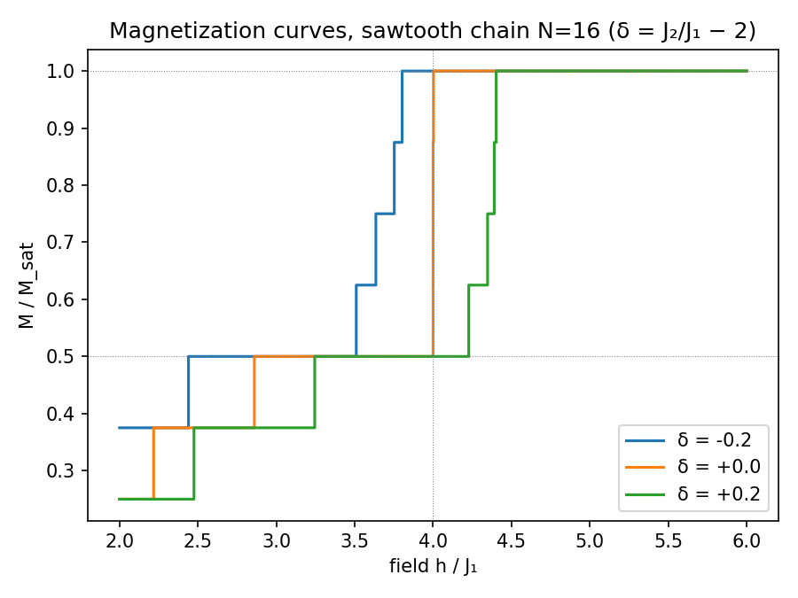
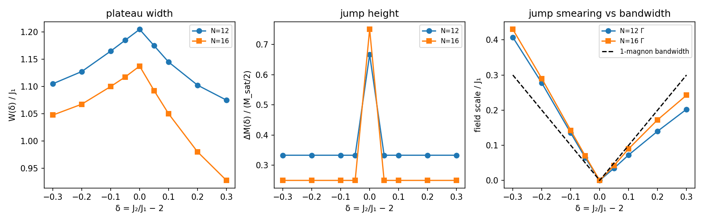

# Sawtooth erosion — solving issue #112's detuning axis (reconnaissance scale)

**One command:** `python3 run_sawtooth.py` (regenerates `briefs/data/erosion.json` + both figures, ~2 min on a laptop)
**Solver:** `pf/sawtooth.py` (sector-resolved ED) on `pf/ed.py:sawtooth_hamiltonian` — anchors verified in `tests/test_sawtooth.py` (6/6 green).

## Physical picture

On the sawtooth chain at J₂/J₁ = 2 the lowest magnon band is **exactly flat**:
a magnon cannot move — hopping amplitudes cancel by destructive interference.
Magnons are then *independent, immobile particles* with three exact consequences
(all reproduced here, N=12):

- a magnetization **jump** ΔM = M_sat/2 at h_sat = 4J₁ (saturation arrives in one step),
- a **plateau** at m = M_sat/2 (the "localized-magnon crystal": dimers on every other cell),
- an exact ground-state **degeneracy** at h_sat counted by hard-dimer coverings
  (Lucas numbers; N=12 → 18) giving residual entropy S/N = ½ ln φ ≈ 0.2406 k_B.

Detuning δ = J₂/J₁ − 2 breaks the interference: the flat band acquires
dispersion and the magnons start hopping. **Erosion = watching each exact
feature die as δ grows.** This is the axis issue #112 says the 2026 flat-band
papers leave uncharted.

## Method (why the whole curve is exact)

With Sz conserved, the field enters only as −h·Sz, so the full magnetization
staircase follows from zero-field sector energies e₀(k) alone:
k*(h) = argmin_k [ e₀(k) − h·(N/2 − k) ]. One sparse eigenvalue per sector
(k = 0…N/2), no field scans, no approximation beyond ED itself.

## Results

At δ = 0 the m = M_sat/2 plateau ends at h = 4J₁ in a **single jump** to
saturation. Detuning smears the jump into a staircase and shifts h_sat:
down for δ < 0, up for δ > 0. The plateau itself survives to |δ| = 0.3.

| observable | behavior vs δ | reading |
|---|---|---|
| plateau width W(δ) | peaks at δ=0, falls ~linearly in |δ| (slope ≈ −0.5) | the crystal melts symmetrically |
| jump height ΔM(δ) | full M_sat/2 **only** at δ=0; collapses to one-magnon steps for |δ| ≳ 0.05 | the macroscopic jump is a measure-zero feature |
| smearing Γ(δ) | V-shaped, ≈ linear in |δ|, **tracks the one-magnon bandwidth** | smearing is single-particle (kinetic) physics |

Data: `briefs/data/erosion.json` (N = 12, 16; δ = −0.3…+0.3).

## Conclusions

1. The exact flat-band features are **fragile to detuning** in a controlled,
   measurable way: the jump dies first (any δ ≠ 0 breaks it into steps),
   the plateau width erodes linearly, and the smearing width is set by the
   detuned band's dispersion.
2. **Γ(δ) ≈ one-magnon bandwidth(δ)** — the smearing is dominated by magnons
   acquiring kinetic energy, not by magnon–magnon interactions. This is the
   physical content the erosion map was asked to deliver.

## Did we find anything new?

Honest assessment:

- **Reproduction** (known): all closed-form anchors — flat band, jump,
  Lucas degeneracy, residual entropy, Monti–Sütő doublet — verified to
  1e-8–1e-10. The solver is trustworthy.
- **Candidate observation** (new at reconnaissance scale): Γ(δ) **exceeds**
  the single-particle bandwidth for δ < 0 but stays at/below it for δ > 0 —
  an asymmetry suggesting interactions assist smearing on the J₂ < 2J₁ side
  and slightly resist it on the J₂ > 2J₁ side. **Status: unverified.** Two
  sizes (N=12, 16) are not enough, and the issue's own bar is a cross-check
  against degenerate perturbation theory. Next step: N = 20–28 on the
  cluster (feasibility already established) + the DPT slope comparison —
  only then does this become a claim.
- Consistent with issue #112's premise: we saw no sign that the 2026
  manifold papers cover this axis; our curves are indeed off-manifold
  erosion data, but at hackathon sizes they are reconnaissance, not a result.

## Limitations

N ≤ 16 (laptop ED; see `docs/sawtooth-ed-feasibility.md`); Γ extracted from
finite staircases with grid resolution 0.0025 J₁; no finite-T yet (day-4
axis of #112); no DM/XXZ secondary axis.
