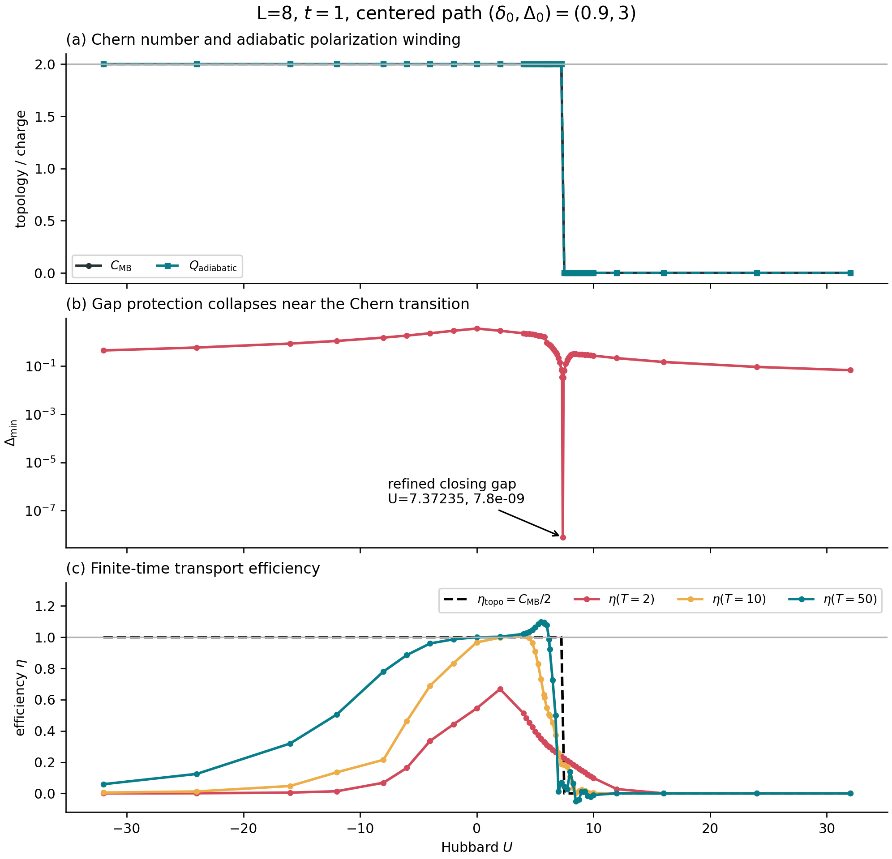
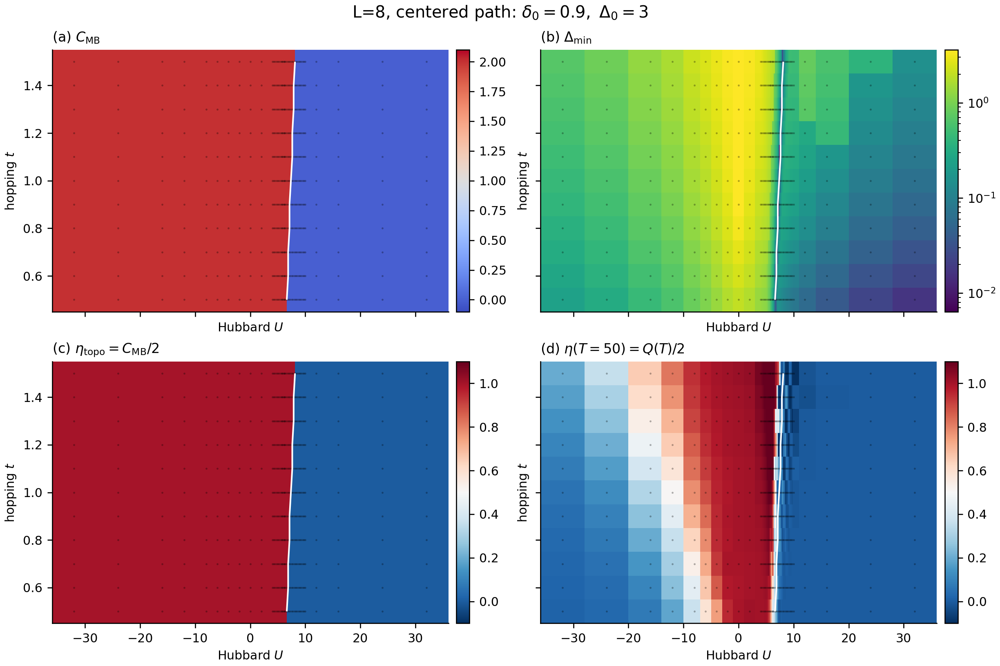
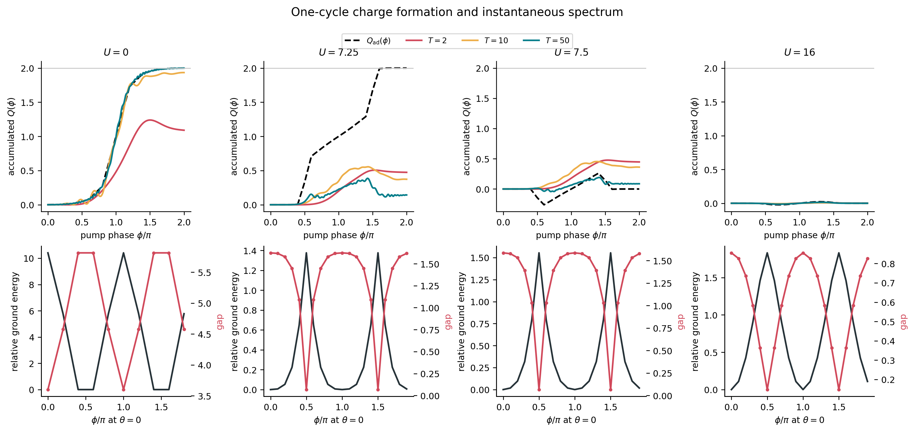
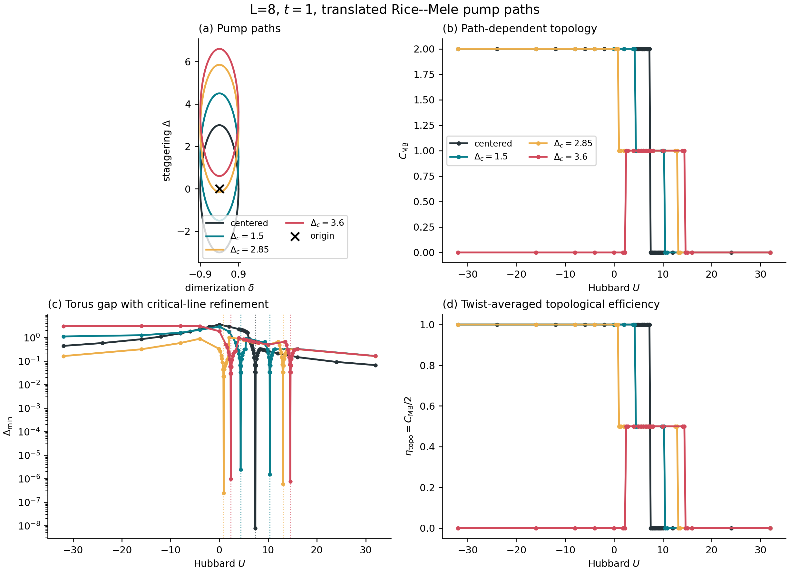
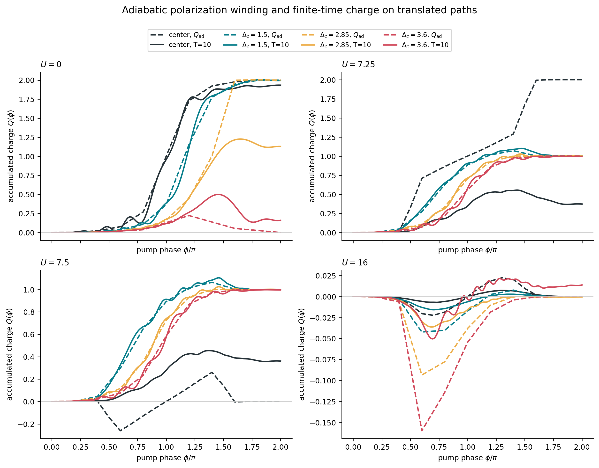
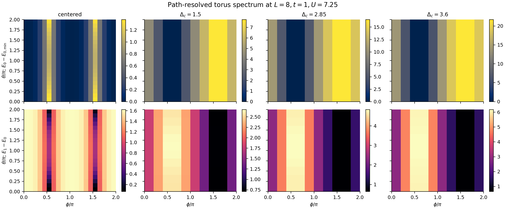
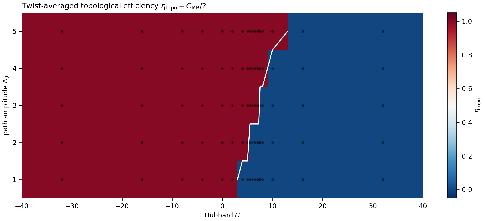
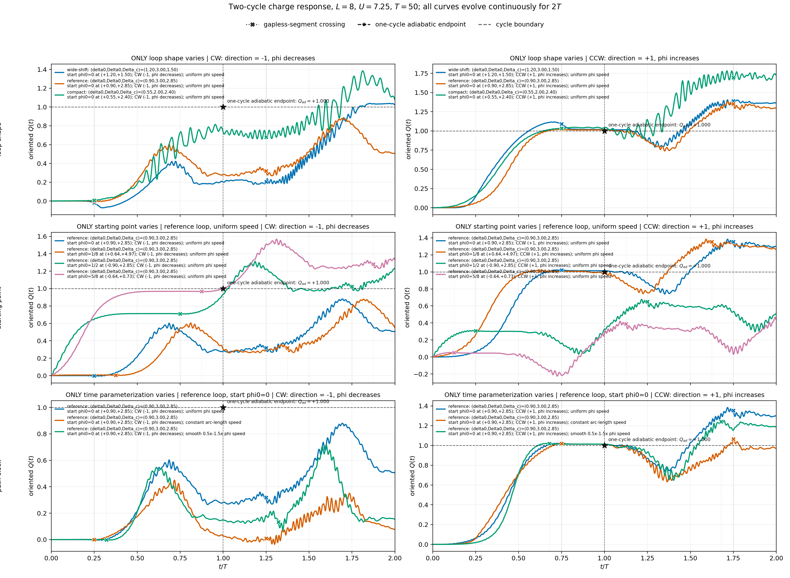
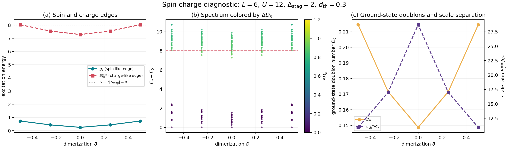

# Interacting Rice-Mele-Hubbard Thouless Pump: Many-Body Topology, Gaps, and Finite-Period Transport

**Method:** Exact Diagonalization (ED)  
**Main system sizes:** $L=6,8$  
**Released by:** Chen Cheng, Lanzhou University  
**Contact:** chengchen@lzu.edu.cn  
**Date:** 2026-07-30

## 1. Background

A Thouless pump converts slow, periodic parameter modulation in a one-dimensional system into quantized transport. For a noninteracting insulator, the charge transported over one complete pump cycle is determined by a Chern number defined in a two-dimensional parameter space. In the spin-degenerate Rice-Mele model, the two spin components are pumped in the same direction, so the ideal transported charge per cycle is $Q=2$.

After an onsite Hubbard interaction $U$ is introduced, the problem can no longer be described completely by single-particle bands. The transport observables must instead be extracted directly from the many-body ground state, twisted boundary conditions, Berry curvature, polarization, and real-time wavefunction evolution. The central physical questions are:

> When do interactions preserve, destroy, or generate a quantized Thouless pump? Can the adiabatic transport capacity predicted by many-body topology actually be realized within a finite pump period?

We study a half-filled, spinful Rice-Mele-Hubbard chain:

$$
H(\phi)=-\sum_{j,\sigma}
\left[t+(-1)^j\delta(\phi)\right]
\left(c^\dagger_{j\sigma}c_{j+1,\sigma}+\mathrm{h.c.}\right)
+\Delta_{\rm stag}(\phi)\sum_{j,\sigma}(-1)^j n_{j\sigma}
+U\sum_j n_{j\uparrow}n_{j\downarrow}.
$$

To avoid ambiguity in notation, throughout this report $\Delta_{\rm stag}$ denotes the staggered onsite potential and $g$ denotes an energy gap. A general elliptical path is written as

$$
\delta(\phi)=\delta_0\cos\phi,
\qquad
\Delta_{\rm stag}(\phi)=\bar\Delta+\Delta_0\sin\phi,
\qquad \phi:0\rightarrow2\pi.
$$

Here $\bar\Delta$ is the displacement of the path center along the $\Delta_{\rm stag}$ direction. The label "$\Delta_c$" used in some earlier figures refers to the same quantity $\bar\Delta$, not to a charge gap. The production calculations use a common charge twist,

$$
c_{L,\sigma}=e^{i\theta}c_{0,\sigma},
$$

with the same $\theta$ for both spin components. Under the twist-phase and plaquette-orientation conventions fixed in this work, the noninteracting benchmark is $C_{\rm MB}=+2$.

## 2. Overview of the Work

We completed the four core quantities required by Challenge 36 and evaluated them using the same Hamiltonian, the same fixed-particle-number sector, and the same sign conventions:

$$
C_{\rm MB},\qquad g_{\min},\qquad Q_{\rm ad},\qquad Q(T).
$$

| Objective | Implementation and output | Main conclusion |
|---|---|---|
| Many-body low-energy spectrum and minimum gap | Scan the full $(\theta,\phi)$ torus and save $E_0$, $E_1$, and the ground state | $g_{\min}\to0$ at a topological transition |
| Many-body Chern number | Gauge-invariant FHS discretization, nested grids, and gauge-invariance checks | The centered path undergoes a $2\to0$ transition |
| Adiabatic transported charge | Many-body polarization/Wilson-loop winding | A complete gapped cycle satisfies $Q_{\rm ad}=C_{\rm MB}$ |
| Finite-period transport | Midpoint-Magnus/Krylov evolution with integrated boundary current | Near a small gap, $Q(T)$ can remain far from the topological target |
| $L=8$ interaction scan | 41 values of $U$ and 11 values of $t$, for 451 static points | Obtain the $U$-$t$ topology, gap, and efficiency maps |
| Real-time scan | Evaluate $T=2,10,50$ for every static point, for 1,353 results | Separate topological destruction from nonadiabatic transport failure |

Building on these results, we also completed:

- topological phase diagrams and accurately located critical points for translated pump paths;
- an interaction-induced single-charge pump with $C_{\rm MB}=1$;
- the effect of path translation on the minimum gap and finite-period efficiency;
- the center-of-charge displacement efficiency $\eta$ in the $(U,t,\Delta_0)$ parameter space;
- the dependence of two-cycle transport on path, direction, starting point, and time parametrization;
- a spin-charge separation diagnostic.

## 3. Unified Definitions and Numerical Methods

### 3.1 Fixed-Particle-Number Basis

Every point along the pump uses the same fixed sector,

$$
N_\uparrow=N_\downarrow=L/2.
$$

For $L=6$ and $L=8$, the Hilbert-space dimensions are

$$
\binom{6}{3}^2=400,
\qquad
\binom{8}{4}^2=4900,
$$

respectively. The same many-body basis and basis ordering are reused over the entire parameter torus, so eigenvectors from different mesh points can be overlapped directly.

### 3.2 Many-Body Gap

At each $(\theta,\phi)$ point, the neutral many-body gap in the fixed half-filled sector is defined as

$$
g(\theta,\phi)=E_1(\theta,\phi)-E_0(\theta,\phi),
$$

and its minimum over the full parameter torus is

$$
g_{\min}(U,t)=\min_{\theta,\phi}g(\theta,\phi).
$$

A discrete torus is used for the global scan, while refinement along the high-symmetry gap-closing line is used to locate transition points accurately.

### 3.3 FHS Many-Body Chern Number

The normalized link variable between neighboring ground states is

$$
U_\mu(\mathbf{k})=
\frac{\langle\psi(\mathbf{k})|\psi(\mathbf{k}+\hat\mu)\rangle}
{|\langle\psi(\mathbf{k})|\psi(\mathbf{k}+\hat\mu)\rangle|},
\qquad \mu\in\{\theta,\phi\}.
$$

Summing the principal-branch Berry flux over all plaquettes gives

$$
C_{\rm MB}=\frac{1}{2\pi}\sum_{m,n}F_{mn}.
$$

Gauge invariance of the FHS result is verified by applying random local $U(1)$ phase transformations.

### 3.4 Adiabatic Charge, Finite-Period Charge, and Efficiency

The adiabatic pumped charge $Q_{\rm ad}$ is the continuous winding of the many-body polarization over a complete cycle. For a gapped cycle,

$$
Q_{\rm ad}=C_{\rm MB}.
$$

The finite-period calculation starts from the ground state at $\theta=0$, evolves the state unitarily in real time, and integrates the boundary current $J=\partial H/\partial\theta$:

$$
Q(T)=\int_0^T\!dt\,\langle\psi(t)|J(t)|\psi(t)\rangle.
$$

If the distance between neighboring sites is $a$, the unit-cell length is $d=2a$. At half filling, the displacement efficiency of the atomic-cloud center of mass over one cycle is

$$
\eta(T)=\frac{\Delta x_{\rm COM}}{d}=\frac{Q(T)}{2},
\qquad
\eta_{\rm topo}=\frac{C_{\rm MB}}{2}.
$$

Thus, $Q=2$ corresponds to a center-of-mass displacement of one unit cell, or $\eta=1$.

## 4. The Four Quantities Required by the Challenge

### 4.1 Noninteracting Benchmark and Algorithm Validation

For the $L=6$, $U=0$, $(\delta_0,\Delta_0)=(0.5,0.3)$ benchmark, the nested $5\times5$, $10\times10$, and $20\times20$ FHS grids all stably give $|C_{\rm MB}|=2$. After adopting the production orientation used throughout this report, the result is $C_{\rm MB}=+2$.

On the $20\times20$ grid, the discrete minimum gap is $0.6000$, the minimum neighboring-state overlap is $0.83593$, and the maximum single-plaquette flux is $0.26809$. The Hamiltonian Hermiticity error is zero, the link-modulus error is no larger than $3.4\times10^{-16}$, and the Chern number changes by no more than $5.5\times10^{-15}$ under random gauge transformations.

### 4.2 Topological Transition and Gap Closing on the $L=8$ Centered Path

The main scan uses

$$
L=8,\quad t=1,\quad \delta_0=0.9,\quad \Delta_0=3,
\quad \bar\Delta=0.
$$

The centered path undergoes a $C_{\rm MB}:2\to0$ transition at

$$
U_c=7.372348498.
$$

Refinement along the high-symmetry gap-closing line gives $g_{\min}=7.8\times10^{-9}$ at the fitted critical point; this residual value is due to truncating $U_c$ to a finite number of decimal places. Full $20\times20$ FHS torus calculations on the two sides of the critical point give the adjacent integer topological sectors, confirming that the gap closing coincides with the Chern-number transition.

**Figure 1.** The upper panel shows pointwise agreement between $C_{\rm MB}$ and $Q_{\rm ad}$; the middle panel shows the gap closing at the topological transition; and the lower panel shows the actual transport efficiency for $T=2,10,50$. The topological quantity changes stepwise, whereas the finite-period response develops a broad dynamical crossover region near the critical point.

Extending the hopping to $t=0.5,0.6,\ldots,1.5$ causes the topological boundary to move continuously with $t$. The low-gap valley coincides with the Chern-number boundary, but the high-efficiency region at $T=50$ is visibly narrower than the topological region. A nontrivial Chern number and efficient transport within a specified period are therefore distinct conditions.

**Figure 2.** The upper-left panel shows $C_{\rm MB}$, the upper-right panel shows $g_{\min}$, the lower-left panel shows $\eta_{\rm topo}=C_{\rm MB}/2$, and the lower-right panel shows $\eta(T=50)=Q(T=50)/2$. The white line marks the refined phase boundary.

### 4.3 Adiabatic and Finite-Period Transport

Representative results for the centered path are:

| $U$ | $C_{\rm MB}$ | $Q_{\rm ad}$ | $g_{\min}$ | $Q(2)$ | $Q(10)$ | $Q(50)$ |
|---:|---:|---:|---:|---:|---:|---:|
| -32 | 2 | 2 | 0.44444 | 0.00091 | 0.01125 | 0.11827 |
| 0 | 2 | 2 | 3.60000 | 1.09025 | 1.93412 | 1.99979 |
| 7.25 | 2 | 2 | 0.06788 | 0.47402 | 0.37277 | 0.14265 |
| 7.50 | 0 | 0 | 0.06607 | 0.44754 | 0.36155 | 0.08677 |
| 16 | 0 | 0 | 0.14734 | 0.00123 | 0.00011 | -0.00006 |

At $U=0$, $Q(50)=1.99979$, differing from $Q_{\rm ad}=C_{\rm MB}=2$ by only $2.1\times10^{-4}$ and clearly demonstrating the long-period limit. In contrast, $U=7.25$ remains in the $C_{\rm MB}=2$ sector but lies very close to the gap-closing point; its value $Q(50)=0.14265$ remains far from the adiabatic topological target. The strongly attractive region at $U=-32$ likewise retains $C_{\rm MB}=2$, but its finite-period response is extremely slow.

**Figure 3.** The upper row shows accumulated charge, and the lower row shows the relative ground-state energy and instantaneous gap at $\theta=0$. Finite-time transport is not required to approach the adiabatic value monotonically as $T$ increases; coherent excitations and pronounced history dependence can arise near a small gap.

## 5. Interactions Generate and Destroy Pumping

### 5.1 Translated Elliptical Paths and Their Topological Sequences

We further study four paths with $\bar\Delta=0,1.5,2.85,3.6$. The refined critical points are:

| Path center $\bar\Delta$ | Lower critical $U_c$ | Upper critical $U_c$ | Topological sequence with increasing $U$ |
|---:|---:|---:|:---|
| 0 | 7.372348498 | simultaneous | $2\to0$ |
| 1.5 | 4.352096694 | 10.354477369 | $2\to1\to0$ |
| 2.85 | 0.882883835 | 13.039003998 | $2\to1\to0$ |
| 3.6 | 2.343682390 | 14.531681175 | $0\to1\to0$ |

The $\bar\Delta=3.6$ path is a trivial pump at $U=0$, but an intermediate repulsive interaction drives it into a $C_{\rm MB}=1$ sector. This is direct finite-size evidence that interactions **generate** a single-charge pump. At still larger $U$, every path eventually enters the $C_{\rm MB}=0$ sector, corresponding to the interaction-driven **destruction** of pumping.

**Figure 4.** Translating the path splits the single $2\to0$ transition of the centered path into two transitions and creates an intermediate $C_{\rm MB}=1$ plateau. Every change in the Chern number coincides with a critical gap-closing line.

### 5.2 Path-Dependent Topology and Dynamical Accessibility

At $U=7.25$, the centered path still has $C_{\rm MB}=2$, but its minimum gap is only 0.06788. The three translated paths all lie in the $C_{\rm MB}=1$ sector and have minimum gaps of 0.7083, 0.6387, and 0.6586, respectively. The available $T=10$ evolutions give

$$
Q(T=10)=1.0072,\quad1.0016,\quad0.9952,
$$

which are already close to their respective adiabatic target of 1. By comparison, the centered path at the same point has only $Q(T=10)=0.3728$. Path translation therefore changes not only the topological integer but also moves the evolution path away from the small-gap region, bringing finite-period transport closer to the adiabatic limit.

**Figure 5.** Dashed lines show $Q_{\rm ad}(\phi)$ and solid lines show $Q(T=10,\phi)$.

**Figure 6.** The upper row shows the relative ground-state energy, and the lower row shows $E_1-E_0$. The centered path develops a narrow small-gap valley, whereas the translated paths remain more strongly gapped over the torus. This spectral structure explains the improvement in finite-period transport.

### 5.3 Amplitude and Transport Efficiency

Changing the path amplitude $\Delta_0$ shifts the interaction-driven topological boundary. For the centered path, the full-torus quantity gives

$$
\eta_{\rm topo}(U,\Delta_0)=\frac{C_{\rm MB}(U,\Delta_0)}{2}.
$$

Increasing $\Delta_0$ generally moves the topological region toward larger repulsive $U$, so a larger path covers a broader interaction range. This figure represents the adiabatic topological capacity; the experimental efficiency at a specified period must still be evaluated as $\eta(T)=Q(T)/2$.

**Figure 7.** The red region has $\eta_{\rm topo}=1$, the blue region has $\eta_{\rm topo}=0$, and the white line is the topological boundary as it moves with amplitude.

## 6. Path and History Dependence of the Finite-Period Response

To determine when the transported charge develops after the system passes through a small-gap or nominally gapless segment, we evolve two consecutive cycles at $L=8,U=7.25,T=50$ while independently changing:

- the shape of the ellipse;
- the starting point of the evolution;
- the clockwise (CW) or counterclockwise (CCW) direction;
- the time parametrization along the same geometric path.

For the compact path, the response delays are $0.285T$ for CW evolution and $0.307T$ for CCW evolution, close to the often-discussed $T/4$. The wide-shifted path, however, responds almost immediately after the crossing. For the same reference path, changing only the time parametrization expands the CCW delay across $0.293T$-$0.469T$. A quarter-period delay is therefore not invariant under changes of path, direction, or time reparametrization.

**Figure 8.** The left column shows CW evolution and the right column shows CCW evolution. Vertical markers indicate the nominal gapless-segment crossing, while horizontal dashed lines show the adiabatic endpoint after one cycle. The second cycle differs substantially from the first, showing that excitations and phase memory generated while passing through the small-gap region continue to affect the following cycle. Across the 16 main trajectories, the maximum norm drift is $1.13\times10^{-13}$. Refining a representative trajectory from 500 to 1,000 steps per cycle changes the extracted delay by only $5\times10^{-4}T$.

## 7. Spin-Charge Separation and the Spin-Like Low-Energy Edge

To distinguish low-energy spin excitations from high-energy charge excitations, we compute the complete spectrum in the fixed half-filled sector and measure the doublon number in each eigenstate:

$$
D_n=\left\langle n\left|\sum_j n_{j\uparrow}n_{j\downarrow}\right|n\right\rangle,
\qquad
\Delta D_n=D_n-D_0.
$$

For a threshold $d_{\rm th}$, we define

$$
g_s=\min_{n>0,\,\Delta D_n<d_{\rm th}}(E_n-E_0),
\qquad
E_{\rm ch}^{\min}=\min_{\Delta D_n>d_{\rm th}}(E_n-E_0).
$$

Here $g_s$ is the low-energy edge of spin-like states whose doublon number changes only weakly, whereas $E_{\rm ch}^{\min}$ is the edge of charge-like excitations that substantially change the doublon number. For the full 400-state spectrum at $L=6,U=12,\Delta_{\rm stag}=2$, the thresholds $d_{\rm th}=0.2,0.3,0.4$ all give the same classification. At $\delta=0$,

$$
g_s=0.25376,
\qquad
E_{\rm ch}^{\min}=7.28766,
\qquad
\frac{E_{\rm ch}^{\min}}{g_s}=28.72.
$$

The edge of the charge-like excitations is close to the atomic-limit scale $U-2|\Delta_{\rm stag}|=8$, while the spin-like low-energy edge is nearly two orders of magnitude lower. At the same time, the ground-state doublon number falls to $D_0=0.14873$ at $\delta=0$. These results directly show a separation of low-energy spin and high-energy charge scales in the strongly repulsive regime.

**Figure 9.** **(a)** Spin-like low-energy and charge-like excitation edges versus $\delta$; **(b)** the full spectrum colored by $\Delta D_n$; **(c)** the ground-state doublon number and the ratio of charge to spin energy scales. The results are symmetric under $\delta\to-\delta$, and the separation is strongest at $\delta=0$.

## 8. Numerical Reliability and Auditability

The core numerical checks in this project include:

- common basis ordering at every $(\theta,\phi)$ point;
- Hamiltonian Hermiticity and $2\pi$ periodicity in both $\theta$ and $\phi$;
- low-lying eigenstate residuals and eigenvector normalization;
- the FHS neighboring-overlap threshold, link modulus, and plaquette admissibility;
- Chern-number invariance under independent random $U(1)$ phases;
- exact reuse of nested-grid vertices through <code>Fraction</code> cache keys;
- norm conservation and time-step refinement for real-time evolution;
- cross-validation between full-torus Chern numbers on both sides of a critical point and the gap on the gap-closing line.

The main $L=8$ run stores 451 static results and 1,353 real-time results. The path analysis additionally stores critical gap-closing lines, refined $20\times20$ FHS points, and representative finite-period trajectories. A total of 275 canonical and extended experiment tests pass in the merged project. The five-point full-spectrum spin-charge calculation takes 2.4 s and has a maximum eigenvalue-equation residual of $1.07\times10^{-13}$.

## 9. Conclusions

Using one consistent set of many-body ED conventions, this work compares the Chern number, minimum gap, adiabatic charge, and finite-period charge and reaches the following conclusions:

1. **The adiabatic topological relation holds.** For a complete gapped cycle, $Q_{\rm ad}=C_{\rm MB}$; the long-period noninteracting evolution gives $Q(50)=1.99979\simeq2$.
2. **A nontrivial topology does not guarantee efficient finite-period transport.** Near a gap closing or in the strongly attractive regime, the system can retain $C_{\rm MB}=2$ while $Q(T)$ remains small over the accessible periods.
3. **Interactions can both destroy and generate a pump.** The centered path undergoes $2\to0$ as $U$ increases, whereas a translated path can undergo $0\to1\to0$ and realize an interaction-induced single-charge pump.
4. **Path engineering can substantially improve the dynamics.** At $U=7.25$, translating the path increases the minimum gap by approximately one order of magnitude and brings the transported charge at $T=10$ close to 1.
5. **The response delay is not a universal constant.** It depends on path shape, direction, and time parametrization, and retains history across consecutive cycles.
6. **The strongly repulsive regime shows a clear separation of spin and charge scales.** At a representative point, the charge-like excitation edge is about 28.7 times the spin-like low-energy edge, while doublon occupation is strongly suppressed.

These results resolve the central problem of Challenge 36 into three related but distinct levels: the many-body topological integer, the gap that protects that integer, and the transported charge actually realized within a finite experimental time.

## 10. Reproduction Entry Points and Data Locations

Main program and validation:

~~~bash
cd hubbard-pump
python scripts/run.py benchmark --config configs/default.yaml
python -m pytest -q tests
~~~

Spin-charge diagnostic:

~~~bash
cd hubbard-pump/experiments/spin-charge
python spin_charge_spectrum.py --smoke --L 6 --method full_ed
~~~

Main artifacts:

- <code>results/transport_analysis/</code>: $U,t$, path translation, gaps, Chern numbers, and transport figures;
- <code>results/response_delay/</code>: two-cycle response trajectories and delay analysis;
- <code>results/spin-charge/</code>: the full spectrum, doublon numbers, and spin-charge diagnostics;
- <code>results/grid_data/</code>: the $L=6$ nested-grid FHS benchmark;
- <code>results/reference/</code>: reference Hamiltonian and complete eigensystem data.

### 10.1 Related Quantum Harness Workflow Documents

Two accompanying documents place this calculation in the broader Quantum Harness workflow:

- [<code>quantum-harness-功能改动汇报.md</code>](docs/quantum-harness-功能改动汇报.md) reports the platform-level Quantum Harness changes, including staged experiment workflows, recoverable cluster scans, and the project-specific knowledge layer. It is distinct from the physical results reported here.
- [<code>quantum-2-reproducible-prompt-playbook.md</code>](docs/quantum-2-reproducible-prompt-playbook.md) collects reusable English prompts and concise execution routes for repository inspection, staged ED calculations, cluster submission, parameter scans, transport diagnostics, and research-report handoff.

## References

1. D. J. Thouless, *Quantization of particle transport*, Phys. Rev. B **27**, 6083 (1983).
2. A.-S. Walter *et al.*, *Quantization and its breakdown in a Hubbard-Thouless pump*, Nature Physics **19**, 1471 (2023).
3. K. Viebahn *et al.*, *Interactions enable Thouless pumping in a nonsliding lattice*, Phys. Rev. X **14**, 021049 (2024).
