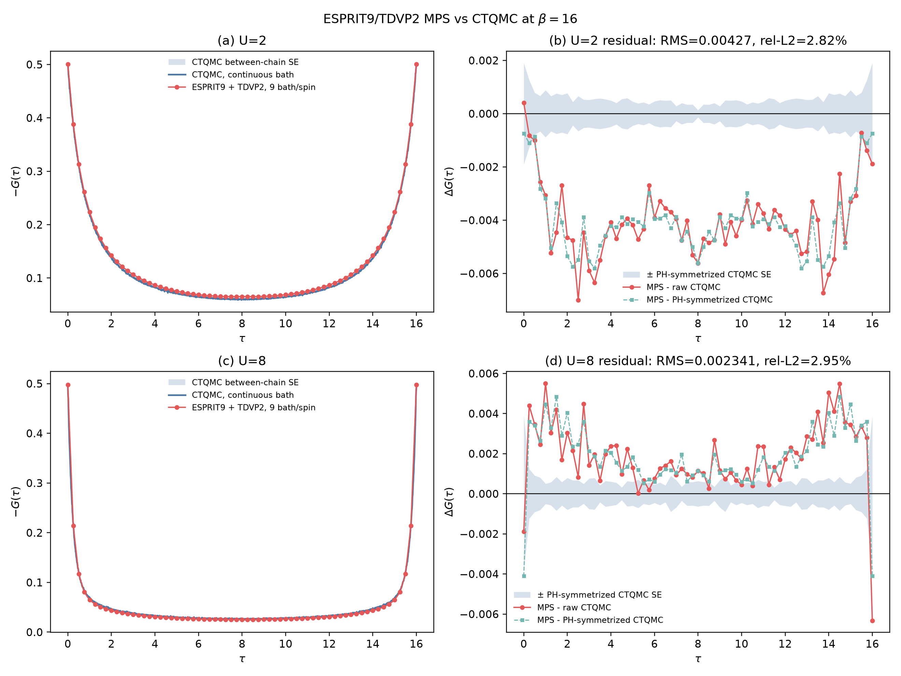

## Team

| | |
|---|---|
| **Team name** | ImpuriTree |
| **Members** | Weiyi Guo (`@weiyiguo9`), Linjie Chen, Wenfeng Wu, Xiaoteng Huang |

## Challenge

| Row | |
|---|---|
| **Challenge** | Build a trustworthy purified tensor-network solver for the continuous-bath single-orbital Anderson impurity model, then test whether implicit logarithmic imaginary-time evolution with adaptive bond expansion can reach β = 100 at controlled error. |
| **Catalog issue** | Addresses #81 — released by Weiyi Guo, University of Amsterdam. |
| **Track** | `mps`, from the issue's “MPS Based Algorithm” method field. |

## Development repositories

- [Graft.jl](https://github.com/GraftTN/Graft.jl) provides the general tree
  tensor-network core: symmetry-aware states and operators, purification,
  time evolution, linear solves, and adaptive bond machinery.
- [GraftImpurity.jl](https://github.com/GraftTN/GraftImpurity.jl) provides the
  impurity-specific layer: bath fitting and mounting, impurity Hamiltonian
  construction, tree-topology mappings, and Green-function workflows.

## Brief development history

- **July 9, 2026:** Established the Graft.jl tree tensor-network core and the
  first bath-fitting, global-Krylov, fixed-manifold, and implicit-step
  primitives.
- **July 11, 2026:** Added deterministic purification and thermal
  correlators, then separated the impurity workflow into GraftImpurity.jl.
- **July 12–14, 2026:** Developed real-pole bath fitting, typed impurity
  Hamiltonians, and star-to-Cayley-tree bath mappings.
- **July 28, 2026:** Added direct global-Krylov bootstrapping to open the
  initially small bonds of a purified state without changing that state.
- **July 29–30, 2026:** Implemented residual-driven bond expansion and added
  gauge safety, exact-residual bounds, certified right-hand-side truncation,
  and variable-time thermal correlators.

## Current evidence

The supplied β = 16 benchmark compares deterministic purification with a
9-pole ESPRIT bath and two-site TDVP against continuous-bath TRIQS/CTSEG
quantum Monte Carlo. It covers two particle-hole-symmetric auxiliary parameter
sets with half-bandwidth D = 2:

| U | ε_d | −G(0⁺) | RMS ΔG | Relative L₂ error | Maximum deviation |
|---:|---:|---:|---:|---:|---:|
| 2 | −1 | 0.5003 | 4.27×10⁻³ | 2.82% | 5.8×10⁻³ |
| 8 | −4 | 0.4978 | 2.34×10⁻³ | 2.95% | 4.8×10⁻³ |

These results demonstrate the continuous-bath comparison workflow at two
auxiliary parameter points. They do **not yet complete** issue #81's reference
calculation at D = 1, U = 0.8, Γ = 0.1, its finite-bath ED agreement target,
or its full four-part error budget.

### Reproducibility artifacts

- [Standalone challenge report](results/report.html)
- [Challenge report source](results/report.json)
- [Detailed technical report](results/report.md)
- [Comparison data](results/comparison_data.h5)
- [Graft β = 16 runner](results/graft_solve_tdvp_beta16.jl)
- [TRIQS/CTSEG reference runner](results/triqs_ctseg_u2_u8.py)
- [Comparison plotting script](results/plot_beta16_u2_u8_tdvp_cthyb.py)
- [Reproducibility bundle](results/beta16_latest_tau025_reproducibility_bundle.zip)
