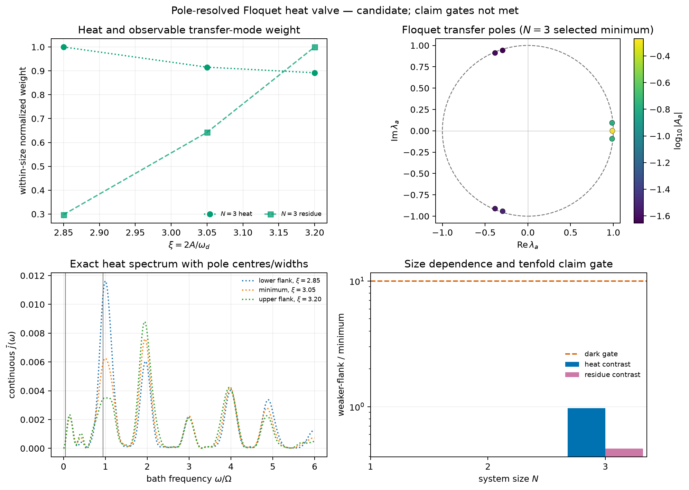

# Floquet pole heat-valve pilot：准能隙塌缩不等于暗通道

## 结论

本轮新增实验完成了一个固定频率、固定浴、可由 transfer poles 独立审计的
\(N=1,2,3\) Floquet heat-valve 搜索。结果是否定性的：

\[
\boxed{
\text{闭系统 quasienergy/cat gap 的深极小}
\;\not\Rightarrow\;
\text{开放系统 heat 或 observable residue 变暗}
}
\]

在 \(N=3\) 的闭系统扫描中，

\[
\omega_d=3\Omega,\qquad J=\Omega,\qquad
\xi=\frac{2A}{\omega_d},
\]

于 \(\xi=3.05\) 得到

\[
\Delta_{\rm cat}=5.85\times10^{-5}\Omega.
\]

但是同一点的 UniformTEMPO 结果显示：

- integrated absolute continuous heat 只从左侧的 0.009806 降到
  0.008976，之后在右侧继续降到 0.008747；
- visible transfer-pole residue weight 从 0.4547 增至 0.9812，并继续
  增至 1.5278；
- dominant residue 同样从 0.2411 增至 0.5370，再增至 0.8276。

所以 \(\xi=3.05\) 既不是双侧 heat minimum，也不是 residue minimum。
独立审计器正确拒绝 `dark channel` 文字。根据预先规定的 go/no-go gate，
没有扩展到九个 \(N=1,2,3\) UniformTEMPO 点，也没有提交集群。



## 1. 为什么要把 drive 和 bath normalization 分开

旧基准使用同一算符同时表示纵向驱动和共同浴耦合：

\[
S_N=\frac1N M_z.
\]

这会让“相同 drive amplitude”实际对应不同的每自旋驱动力。新实验明确
使用

\[
H_{\rm drive}(t)=A\cos(\omega_dt)M_z,
\qquad
H_{SB}=\frac{M_z}{N}\otimes B.
\]

因此不同 \(N\) 之间保持物理驱动 \(A\) 相同，同时继续使用 bounded bath
coupling。代码默认仍为旧的 `drive_normalization="coupling"`，只有本实验
选择 `per_spin`，所以历史结果语义没有改变。

## 2. 预先规定的判据

只有同时满足以下条件，结果才允许称为 dark channel：

1. \(\omega_d,J,\alpha,\omega_c,T_B\) 和 bath normalization 在扫描中固定；
2. minimum 相对左右两个 flank 的 continuous heat 均至少降低十倍；
3. 相应 observable transfer-pole residue 相对两个 flank 均至少降低十倍；
4. transfer eigenpair residual 不超过 \(10^{-8}\)；
5. 所有物理 poles 满足 \(|\lambda|\le1+10^{-6}\)；
6. pole reconstruction 的 normalized \(L^1\) residual 不超过 5%；
7. trace、Hermiticity、fixed point 和 connected tail 通过物理门槛。

在 pilot 阶段，只有 heat 和 residue 都至少降低三倍，才值得分配资源给完整
九点网格。这个 pilot gate 远未满足。

## 3. 闭系统预扫描

预扫描固定

\[
\Omega=1,\quad J=1,\quad\omega_d=3,\quad
\xi\in[1.8,4.0],
\]

采用步长 0.05。每个点用 240 个 midpoint Floquet steps。\(N=2\) 投影到
triplet，\(N=3\) 投影到 reflection-even 六维 sector。

| \(N\) | fitted \(\xi_\ast\) | cat gap | cat-subspace overlap | \(M_z/N\) brightness |
|---:|---:|---:|---:|---:|
| 1 | 2.35 | \(1.1402\times10^{-2}\) | 1.0000 | 1.8813 |
| 2 | 3.65 | \(6.5304\times10^{-2}\) | 0.9378 | 1.8800 |
| 3 | 3.05 | \(5.8516\times10^{-5}\) | 0.8638 | 1.7279 |

\(N=1\) minimum 靠近第一 Bessel 零点 \(x_1=2.4048256\)。相互作用把
\(N=2,3\) 的 minima 明显推移。尤其 \(N=3\) gap 很深，但 bath operator 的
闭系统 brightness 仍为 \(O(1)\)，已经预示它可能不是 selection-rule dark
channel。

## 4. UniformTEMPO transfer-pole pilot

只运行 \(N=3\) 的三点：

\[
\xi=2.85,\quad3.05,\quad3.20.
\]

统一数值控制为：

\[
M=60,\quad \epsilon=10^{-6},\quad N_\phi=3,\quad
\tau_{\max}=12T,\quad K=8.
\]

共同浴参数为

\[
\alpha=0.05,\qquad\omega_c=2.5,\qquad T_B=0.
\]

UniformTEMPO 固定在 revision
`b76a018c32e5415989761d902b1b0e95f1a337da`，生产代码 snapshot 为
`b42725363a01e2ca88b951c3d28026df8104aa40`。

| \(\xi\) | \(\int d\omega\,|\bar j|\) | visible residue | dominant residue | pole fit residual | connected tail |
|---:|---:|---:|---:|---:|---:|
| 2.85 | 0.0098063 | 0.45465 | 0.24109 | 0.04171 | 0.12827 |
| 3.05 | 0.0089765 | 0.98121 | 0.53697 | 0.04452 | 0.19073 |
| 3.20 | 0.0087470 | 1.52779 | 0.82761 | 0.06341 | 0.20993 |

三点 bond dimension 均为 13。trace error 约 \(8\times10^{-5}\)，
Hermiticity error 约 \(10^{-10}\)，fixed-point residual 约
\(1.2\times10^{-4}\)。最大 eigenpair residual 为
\(7.04\times10^{-11}\)，最大 pole modulus 为 0.99087；因此 Krylov
eigenpairs 和单位圆检查通过。

三点的 connected tail 均未降到 0.05 以下，右侧点的 pole reconstruction
也略高于 5%。所以这些数据被诚实标为 pilot / unconverged，而不是最终
精确热谱。

## 5. 为什么当前证据足以停止扩展

长时间窗可能改变有限窗口 Fourier 积分的精确数值，因此本项目不把三点热谱
称为完全收敛的负结果。但停止九点扩展不依赖这种细节：

1. \(\xi=3.05\) 相对右侧的 heat ratio 为 1.026，不存在 minimum；
2. \(\xi=3.05\) 相对较弱 residue flank 的 ratio 为 2.158，方向与
   suppression 相反；
3. dominant residue 也单调增大，不是多个小 residues 求和造成的假象；
4. 前两个点的 pole reconstruction 已低于 5%，但 residue 增强已经超过
   两倍。

要从这些数据得到十倍 residue suppression，需要的不是数值微调，而是改变
物理机制。因此继续延长三点的 correlation window，或把相同假设扩到
\(N=1,2\) 的六个昂贵点，不能通过 go/no-go 的资源合理性门槛。

## 6. 物理解读

高频纵向驱动给出近似

\[
\Omega_{\rm eff}\simeq \Omega J_0(2A/\omega_d).
\]

在铁磁 cluster 中，cat tunneling gap 可以比单自旋 gap 更快塌缩。但共同浴
同样通过 \(M_z\) 耦合；在 cat basis 中，\(M_z\) 并不会因 tunneling gap
变小而自动失去矩阵元。这个 pilot 直接展示了两件事必须分开：

\[
\text{quasienergy collapse}
\quad\text{与}\quad
\text{bath-dark observable residue}.
\]

本例中前者极强，后者反而增强。这是比单纯画一条低热流曲线更有价值的
诊断：它排除了“看到小 gap 就宣称 many-body dark channel”的常见误判。

## 7. 当前最合理的后续方向

不建议为同一 heat-valve 假设提交集群。若继续 Issue #123，优先级应改为：

1. 把 transfer-pole/residue decomposition 用于已经收敛的 \(N=3\)
   even/odd 热谱，建立 peak–pole 对应；
2. 搜索真正满足
   \(S_{\alpha\beta}^{(m)}=0\) 的 symmetry-protected operator/drive
   组合，而不是只搜索 quasienergy crossing；
3. 只有新的闭系统预扫描同时显示 bright matrix element suppression，才运行
   新的 UniformTEMPO pilot；
4. 不扩展 \(N=4\)，也不做 thermodynamic 或 critical claim。

## 8. 可复现命令

```bash
.venv/bin/python -m floquet_if_manybody.cli heat-valve \
  --pilot \
  --output results/heat-valve \
  --cache results/cache/uniform_tempo \
  --figures figures/heat-valve

.venv/bin/python -m floquet_if_manybody.cli \
  heat-valve-audit results/heat-valve
```

第二条命令预期返回非零，因为 scientific claim gates 被正确拒绝。完整输入、
三点结果、manifest、PNG/PDF 和审计失败原因均已保留。
