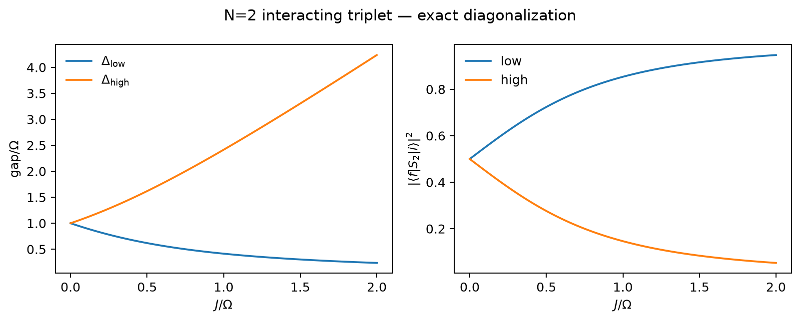
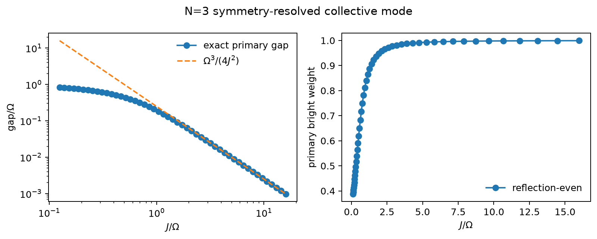
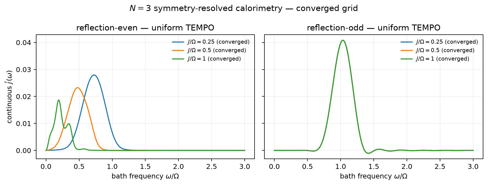
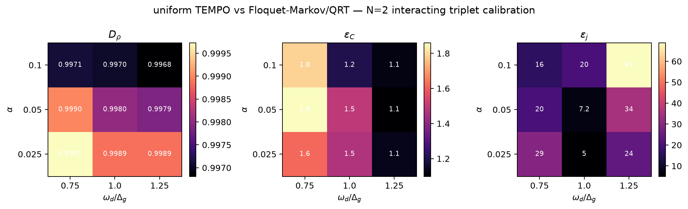
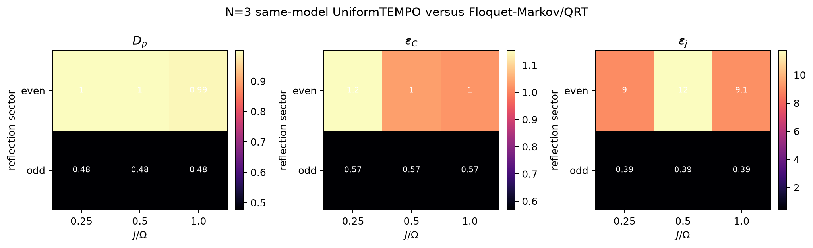
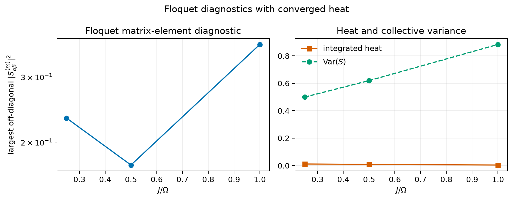
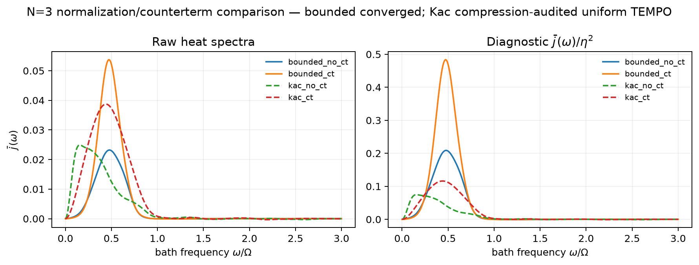
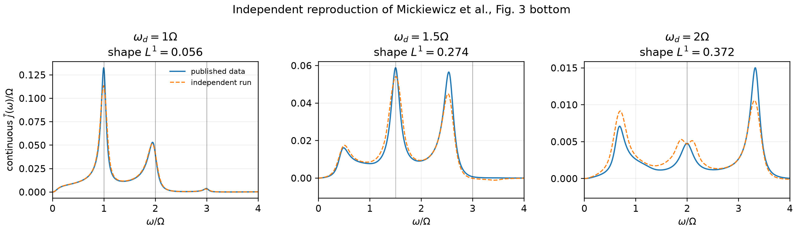
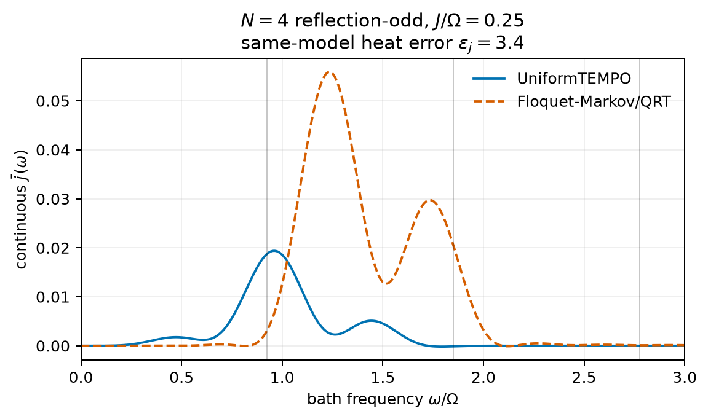
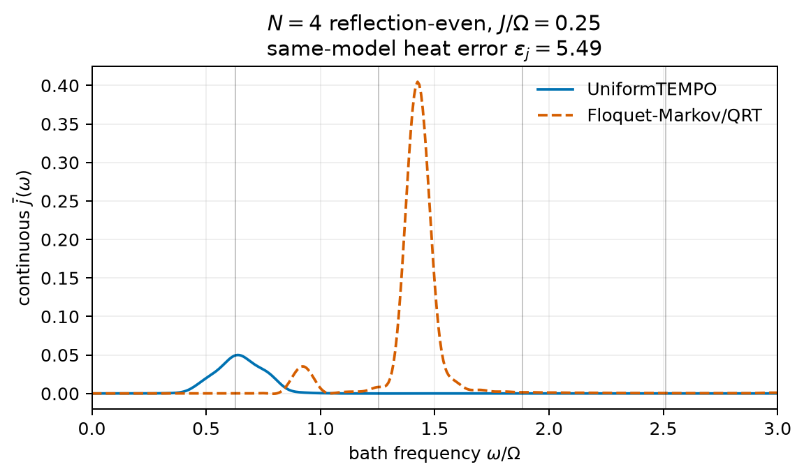

# Issue #123：\(N=2,3\) 完整实施与数值结果

## 1. 最终结论

本项目已经把 Issue #123 的 \(N=2,3\) 部分做成可运行、可恢复、可审计的
研究实现。生产计算使用公开的
[UniformTEMPO.jl](https://github.com/uniformTEMPO/UniformTEMPO.jl)，固定在
revision `b76a018c32e5415989761d902b1b0e95f1a337da`；OQuPy 只作为独立粗粒度
交叉检查。

完成状态如下：

1. \(N=2,3\) 的解析对称性、暗 sector、能隙和谱权重已由精确对角化与单元
   测试验证。
2. \(N=3\) 的 reflection-even/odd 六个热谱点全部通过 compression、
   timestep、15 相位以及 density-matrix 物理性门槛。
3. \(N=2\) 的 \(3\times3\) exact-vs-Floquet-Markov 网格九个点全部收敛，
   同时给出稳态、两时间关联和热谱三种误差。
4. bounded normalization 的有/无 counterterm 两个模型全部收敛。
5. Kac normalization 的两个模型已通过压缩收敛，但完整 timestep/phase
   认证需要集群；结果明确标成 `local_resource_ceiling`。
6. 论文 Fig. 3 底图的三个横向驱动频率全部由独立 UniformTEMPO 计算通过
   物理门槛，并与作者公开数据做了定量谱形和面积比较。
7. \(N=4\) reflection-odd 点通过完整收敛阶梯，并完成同模型
   Floquet-Markov/QRT 对照；heat error 为 3.405。
8. \(N=4\) reflection-even 点在不放宽尾门槛的情况下将关联窗从三周期
   扩展到六周期并收敛；heat error 为 5.494。

所以，对“需要提交集群吗”的答案是：

- 核心 \(N=2,N=3\) 结论不需要，已经在本地完成；
- 只有可选的 Kac 全收敛扩展需要集群；
- \(N=4\) odd-sector 的有限尺寸试算已经完成；热力学连续谱和临界幂律
  不属于这次完成范围，也没有被暗示为已解决。

## 2. 模型与数值方法

系统 Hamiltonian 为

\[
H_0=-J\sum_{i=1}^{N-1}Z_iZ_{i+1}
  +\frac{\Omega}{2}\sum_iX_i,
\]

驱动和共同浴通过

\[
S_N=\eta_N\sum_i Z_i
\]

耦合。基准采用 \(\Omega=1\)、零温 Ohmic bath

\[
J_B(\omega)=\alpha\omega e^{-\omega/\omega_c},\qquad \omega_c=2.5.
\]

生产 backend 构造 uniform influence tensor，并在扩展的
system-Liouville × environment-memory 空间中求 Floquet fixed point。两时间
关联通过在扩展态中插入左作用算符得到，不使用 reduced-state quantum
regression theorem。

周期平均关联拆成

\[
\bar C(\tau)=C_{\rm dec}(\tau)+C_{\rm coh}(\tau).
\]

\(C_{\rm dec}\) 数值 Fourier 积分得到连续热谱；\(\langle S(t)\rangle\) 的
Fourier 系数单独转成解析 delta 权重，避免有限时间窗制造假展宽。

### 收敛规则

uniform 计算采用嵌套阶梯：

\[
M=60,90,120,\qquad
\epsilon=3\times10^{-7},10^{-7},3\times10^{-8},\qquad
N_\phi=3,15.
\]

每个 timestep 网格必须先通过 compression 收敛，之后才能参与 timestep
比较；最后再做相位细化。门槛为

\[
r_\rho\le0.05,\qquad r_C\le0.08,\qquad r_j\le0.08.
\]

最终还要求 fixed-point residual \(\le10^{-3}\)、迹与厄米误差
\(\le5\times10^{-3}\)、关联尾 \(\le0.05\)、最小 density eigenvalue
\(\ge-5\times10^{-3}\)。

## 3. \(N=2\)：解析结构

交换对称性将四维 Hilbert space 分成三维 triplet 与一维 singlet。

\[
S_2|s\rangle=0
\]

且 Hamiltonian 不泄漏 singlet，因此 singlet 是 collective drive 和 common
bath 下的严格暗态。生产热谱直接投影到 triplet，避免完整空间中 steady
state 非唯一。

triplet 的两条 collective gaps 为

\[
\Delta_{\rm low/high}=\sqrt{J^2+\Omega^2}\mp J,
\]

权重为

\[
W_{\rm low/high}=2\eta_2^2
\left(1\pm\frac{J}{\sqrt{J^2+\Omega^2}}\right).
\]

数值与解析式的最大偏差为 \(1.55\times10^{-15}\)。强铁磁区出现强的低频
collective-cat transition 和逐渐变暗的高频支路。



## 4. \(N=3\)：最小 many-body onset

open chain 的 edge reflection 给出

\[
\mathcal H=\mathcal H_{R=+}^{(6)}\oplus\mathcal H_{R=-}^{(2)}.
\]

odd sector 是 edge singlet 与中央自旋组成的嵌入单自旋模型，投影后的
Hamiltonian 和耦合算符严格独立于 \(J\)。even sector 则等价于一个
spin-1 edge 与中央 spin-\(\tfrac12\) 的六维模型。

在强铁磁区，even sector 的主 gap 满足

\[
\Delta_{\rm cat}^{(3)}\simeq\frac{\Omega^3}{4J^2}.
\]

在 \(J=16\Omega\) 时，

\[
\frac{4J^2\Delta_g}{\Omega^3}=0.999023,
\]

bright weight 为 0.999267。



### 六点热谱

\(J/\Omega=0.25,0.5,1\) 的 even/odd 六点全部收敛：

| sector | \(J/\Omega\) | 最终 \(M\) | bond | timestep \(r_j\) | 关联尾 |
|---|---:|---:|---:|---:|---:|
| even | 0.25 | 90 | 40 | 0.00844 | 0.02792 |
| even | 0.50 | 90 | 43 | 0.02799 | 0.00562 |
| even | 1.00 | 120 | 46 | 0.04890 | 0.01077 |
| odd | 0.25, 0.50, 1.00 | 90 | 16 | 0.00151 | 0.03986 |

even 主峰随 \(J\) 增大向低频移动并出现更多结构；odd 三条曲线完全重合，
相对最大差为 0。这同时验证了 sector 推导和数值实现。



## 5. Floquet-Markov 在哪里失败

\(N=2\) interacting triplet 的校准网格为

\[
\alpha=0.025,0.05,0.1,\qquad
\omega_d/\Delta_g=0.75,1,1.25.
\]

弱耦合时相关时间窗按

\[
N_{\rm delay}=\max(4,\lceil0.3/\alpha\rceil)
\]

增长；必要时 compression tolerance 深化到 \(10^{-8}\) 或
\(3\times10^{-9}\)。九个 UniformTEMPO 点全部通过最终审计。

三种误差范围为：

\[
D_\rho=0.9968\text{--}0.9997,
\]

\[
\epsilon_C=1.10\text{--}1.86,
\qquad
\epsilon_j=5.03\text{--}68.84.
\]

这些值说明在所选参数层中 Floquet-Markov/QRT 与非马尔可夫参考严重不符。
特别是热谱误差远大于 reduced-state 指标能够直观表达的差异，因此仅比较
单时 observables 不能验证 calorimetry。



为消除“Tier 2 是 \(N=3\)，但误差图只在 \(N=2\)”的尺寸错位，现进一步
对六个已经收敛的 \(N=3\) sector 点逐一运行完全相同模型和参数的
Floquet-Markov/QRT。六点全部完成：even sector 的
\(D_\rho=0.9921\text{--}0.9999\)、\(\epsilon_C=1.024\text{--}1.153\)、
\(\epsilon_j=9.02\text{--}11.72\)；odd sector 因投影模型严格
\(J\)-不变，三点均给出 \(D_\rho=0.4753\)、\(\epsilon_C=0.5666\)、
\(\epsilon_j=0.3920\)。这构成 Tier 3 所要求的 same-model 定量闭环。



## 6. 暗通道与模型定义

Floquet matrix elements 计算到 \(|m|\le40\)，Parseval 残差保持在机器精度。
结合 \(\bar j(\omega)\) 与 \(\overline{\mathrm{Var}(S)}\) 可以区分小矩阵元
候选、collective fluctuation 与真正的 heat suppression；不能简单以“纠缠
较强”等价于“暗”。



对 \(N=3,J/\Omega=0.5,\alpha=0.1\)，比较

\[
S=M_z/3,\qquad S=M_z/\sqrt3
\]

以及有/无

\[
H_{\rm ct}=+\alpha\omega_c S^2.
\]

bounded 两点完整收敛，最终 bond 均为 45。Kac 两点的压缩比较通过：

- no counterterm：bond 63→82，热残差 0.02373；
- counterterm：bond 63→81，热残差 0.00502。

Kac 曲线仍以虚线显示，表示 timestep/phase 未完成，而不是表示压缩失败。
这已经证明 normalization 和 counterterm 会改变数值难度与谱形，不能只在
画图阶段重标度。



## 7. 独立验证

对于原论文 Fig. 3 底图，脚本先校验 Zenodo 归档 MD5，再在
\(\omega_d/\Omega=1,1.5,2\) 上独立运行。三个点的归一化谱形 \(L^1\) 误差
分别为 0.0562、0.2736、0.3718，积分强度比分别为 1.0268、1.1622、
1.3119；全部通过 fixed-point、迹、厄米性、正定性和关联尾门槛。这是
定量结构复现，而不是逐点完全相同的声明。



单自旋 UniformTEMPO smoke test 的 bond 为 19，fixed-point residual 为
\(1.40\times10^{-4}\)，关联尾为 0.00555，全部通过物理门槛。

粗粒度 UniformTEMPO–OQuPy 对照得到 phase-state Frobenius difference
0.374、correlation \(L^1\) difference 0.282、heat \(L^1\) difference
0.517。由于两边离散化和压缩设置都很粗，该结果只作为独立实现诊断，不作为
两种 backend 已收敛一致的声明。投影后的 odd-sector \(J\) 不变性在该检查中
仍精确成立。

## 8. \(N=4\) 收敛门控结果

通用 reflection projector 将 \(N=4\) 分成 even 10 维和 odd 6 维子空间。
在 \(J/\Omega=0.25\) 上，odd sector 通过 compression、30→60 步时间网格、
3→15 相位和全部物理门槛；最终 bond 为 8，关联尾为 0.0368。同模型
Floquet-Markov/QRT 的 \(\epsilon_j=3.405\)。连续谱三个最强峰位于
0.4725、0.9600、1.4400 \(\Omega\)，相对于 0.9256 \(\Omega\) 驱动呈现
多峰 collective structure。

even sector 的三周期计算仅关联尾 0.0552 未过 0.05 门槛。保持原门槛并将
关联窗扩展到六周期后，最终 bond 为 13、尾幅为 0.0213，全部自适应证据
通过；同模型 \(\epsilon_j=5.494\)。





## 9. 如何彻底续跑

本地默认命令已经完成论文主网格。若有集群，只需继续 Kac 阶梯：

```bash
FULL_KAC=1 PYTHON_BIN=.venv/bin/python \
  scripts/run_paper_extension.sh models
```

cache key 包含全部物理/数值参数与 solver revision，已有点会被安全复用。
下一阶段若扩大研究范围，推荐顺序为：

1. 完成 Kac 的 \(M=90,120\) 与 15 相位认证；
2. 再考虑 \(N=4\) 的 matrix-free / Krylov 实现；
3. 只有具备多个尺寸的 finite-size scaling 后，才讨论 continuum 或临界
   power law。
