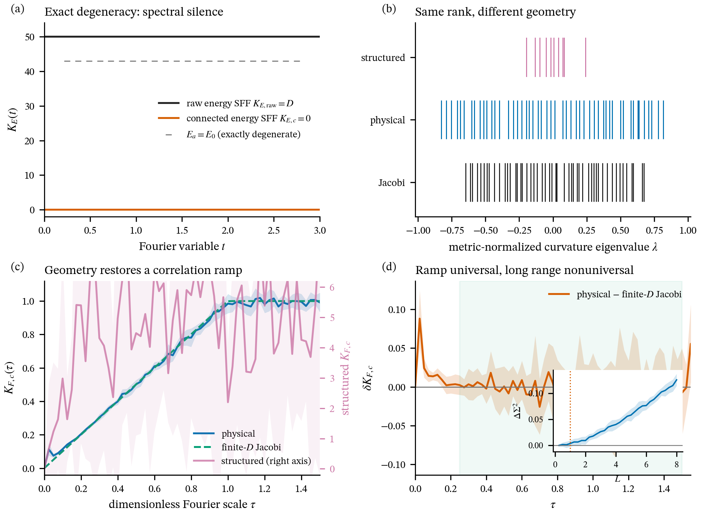
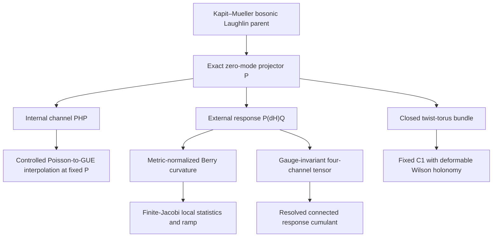

# Spectral Silence and Geometric Chaos

> **One exactly flat energy band. Three geometric correlation scales. A reproducible route to Geometric ETH.**



This task provides a self-contained analytic and numerical baseline for chaos diagnostics inside an exactly degenerate bosonic Laughlin zero-mode manifold. It resolves the spectrum, local non-Abelian curvature, invariant response tensors, and closed-surface holonomy as complementary layers of one quantum-geometric structure.

## Result at a Glance

| Question | Evidence | Advance |
|---|---|---|
| What replaces internal level statistics under exact degeneracy? | \(K_{E,\mathrm{raw}}=D\) and \(K_{E,c}=0\) identically | An exact spectral-flatness reference |
| Does geometry develop universal correlations? | Physical curvature follows the finite-\(D\) Jacobi ramp over the registered window | Local geometric chaos |
| How does the full response tensor behave? | Median \(R_4\) evolves \(0.37093\to0.24715\to0.20906\) across \(N=3,4,5\) | `deformed_geometric_eth` |
| Can topology and relative transport move independently? | \(C_1=6,10\) and the complete spectrum stay fixed while Wilson statistics change significantly | `fixed_chern_deformed_holonomy` |
| What global structure survives? | Wilson gap-ratio and form-factor data define a structured universality class distinct from CUE | Measurable microscopic memory |

The central article is [*Spectral Silence and Geometric Chaos in an Exactly Degenerate Topological Manifold*](script/output/spectral_silence_and_geometric_chaos_v3.pdf). Its final SHA-256, page count, figures, and source artifacts are recorded by the release manifest and delivery audit.

## Scientific Flow



## Why the Kapit–Mueller Parent Is Essential

The Kapit–Mueller lattice realizes an exactly flat Chern band whose projected contact interaction supports bosonic Laughlin zero modes. This gives the calculation four rare ingredients simultaneously:

1. an exactly known degenerate kernel;
2. a finite external excitation gap;
3. boundary twists that form a closed parameter torus;
4. local tangent operators whose response maps can be computed and compared at fixed topology.

The parent Hamiltonian is positive semidefinite and frustration free: the target manifold is its exact kernel. This algebraic structure makes spectral flatness exact while allowing the projector to rotate through Hilbert space, which is precisely the regime where quantum geometry becomes the informative observable.

## Algorithmic Innovations

### 1. Metric-normalized signature compression

Projector-to-complement response maps are assembled into a channel matrix and whitened by the quantum metric. The curvature reduces to a compression of a fixed signature matrix by a Stiefel row space. A Haar row space therefore produces an exact finite-dimensional complex-Jacobi point process. This converts a many-body geometric response into a parameter-free random-matrix benchmark at the actual finite rank.

### 2. Exact finite-Jacobi form factor with boundary atoms

The implementation evaluates the determinantal kernel directly by Gauss–Jacobi quadrature. When \(D>M\), exact eigenvalues at \(\lambda=\pm1\) are separated algebraically, yielding the plateau law

$$K_{J,c}^{\mathrm{full}}=\frac{k}{D}K_{J,c}^{(k)},\qquad k=2M-D.$$

This preserves the continuous Jacobi ramp and accounts exactly for deterministic geometric modes.

### 3. Gauge-invariant matrix-element Geometric ETH

For response maps \(X_\mu\), the release whitens the channel covariance and evaluates

$$T_{\mu\nu\rho\sigma}=\frac{1}{D}\operatorname{Tr}(\widetilde X_\mu\widetilde X_\nu^\dagger\widetilde X_\rho\widetilde X_\sigma^\dagger).$$

The finite-size reference uses independently generated covariance-matched complex-Gaussian samples. The residual therefore measures a genuine connected operator-channel component while remaining invariant under independent frame rotations in the zero-mode and complementary subspaces.

### 4. Fixed-Chern holonomy engineering

A smooth periodic ambient unitary \(\mathcal U_g:T^2\to U(\mathcal H)\) produces an exactly isospectral family \(H_g=\mathcal U_gH_0\mathcal U_g^\dagger\). The bundle isomorphism preserves \(C_1\), while the projected connection acquires a tunable one-form. This creates a controlled laboratory for separating determinant topology from relative non-Abelian transport.

## Reproduction Tiers

### Tier 0: inspect the frozen evidence

- [Combined article audit](script/output/geometric_eth_topology_delivery_audit_v3.json)
- [Matrix-element result](script/output/matrix_element_geometric_eth_v3.json)
- [Topology result](script/output/topological_holonomy_v3.json)
- [Release manifest](script/output/release_manifest_v1.json)
- [Technical report](../../docs/2026-07-30-task05-technical-report.md)

### Tier 1: quick verification

```bash
cd 01_task_folder/task_05/script
python -m venv .venv
source .venv/bin/activate
python -m pip install -r requirements.txt
bash run_quick_verify_v1.sh
```

This read-only path verifies result labels, paper and figure hashes, task isolation, tracked-file size policy, exact Jacobi/form-factor identities, holonomy algebra, Wick contractions, and 38 focused tests.

### Tier 2: rebuild the article

```bash
cd 01_task_folder/task_05/script
bash run_geometric_eth_topology_article_v3.sh
```

The article build uses compact published artifacts and performs a full PDF delivery audit. System tools: `latexmk` and `pdftoppm`.

### Tier 3: full numerical recomputation

```bash
cd 01_task_folder/task_05/script
bash run_full_recompute_v1.sh
```

This production path rebuilds the large-scale, spectral-flatness, matrix-element, topology, figure, and paper layers with resumable checkpoints.

## Artifact Contract

Git contains every source file, test, compact result table, figure, manuscript input, and final verdict required for review. The release manifest records 25 production arrays totaling 447704793 bytes with exact paths, byte sizes, SHA-256 hashes, storage classes, and producing commands. These arrays can be regenerated by Tier 3 and are ready for a future DOI-backed archive.

In a compact checkout, the complete test command reports 86 passing tests and 6 data-dependent tests marked as skipped. Restoring the listed production arrays activates those six tests automatically.

## Figure Guide

| Figure | Scientific role |
|---|---|
| [Figure 1](script/output/figure_1_spectral_silence_v2.png) | Exact spectral flatness beside the geometric ramp |
| [Figure 2](script/output/figure_2_falsification_triangle_v2.png) | Structured, physical, and finite-Jacobi comparison triangle |
| [Figure 3](script/output/figure_3_independent_channels_v2.png) | Independently tunable spectral and projector-geometric axes |
| [Figure 4](script/output/figure_4_geometric_hierarchy_v2.png) | Local-to-ramp-to-long-range correlation hierarchy |
| [Figure 5](script/output/figure_5_jacobi_atoms_v2.png) | Finite-Jacobi boundary atoms and plateau law |
| [Figure 6](script/output/figure_6_wick_factorization_v3.png) | Gauge-invariant four-channel residual along \(N=3,4,5\) |
| [Figure 7](script/output/figure_7_topological_holonomy_v3.png) | Fixed Chern numbers with deformable Wilson holonomy |

## Established Scope and Growth Path

This release establishes exact spectral flatness, finite-rank Jacobi-like local curvature correlations, causal independence of \(PHP\) and \(P(\partial H)Q\), a shrinking connected four-channel component, and changing relative holonomy at fixed complete spectrum and fixed first Chern number.

The next research horizon extends the matrix-element sequence through \(N=6\), derives its scaling from locality, realizes the same invariant law in a second exact-degeneracy mechanism, and connects the geometric hierarchy to real-time dynamics.

The issue-ready handoff is [the Quantum Harness challenge draft](../../docs/2026-07-30-quantum-geometry-harness-challenge-draft.md).
