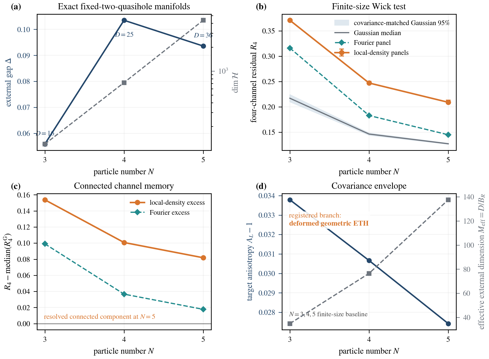
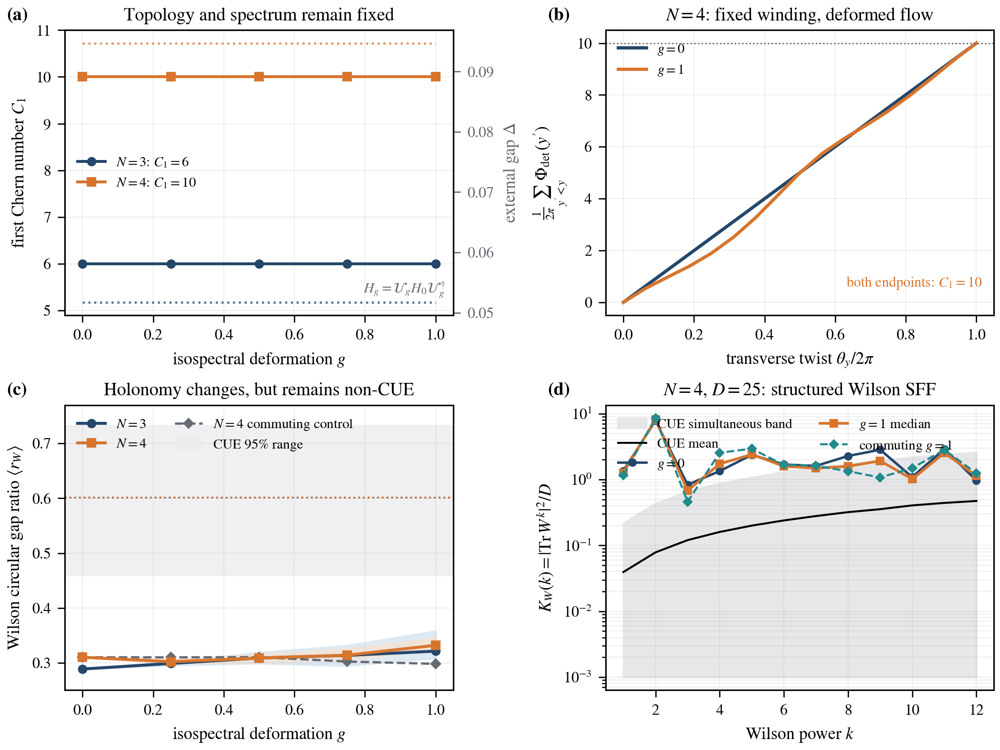

# task_05: Spectral Silence and Geometric Chaos
Status: 🟡 Ongoing
Last Updated: 2026-07-30 (v35) [Codex]

Provenance: `docs/plans/2026-07-28-large-scale-geometric-eth-companion-design.md`
Primary execution zone: `01_task_folder/task_05/script/`
Article target: `overleaf_sync/geometric_eth_large_scale/`
Main outputs: `script/output/spectral_silence_v2.{json,npz}`, `script/output/matrix_element_geometric_eth_v3.{json,npz}`, `script/output/topological_holonomy_v3.{json,npz}`, `script/output/geometric_eth_topology_delivery_audit_v3.json`, plus the immutable v1/v2 artifacts
Article: `script/output/spectral_silence_and_geometric_chaos_v3.pdf`
Verdict: Exact degeneracy turns projector geometry into the operative chaos signal. The v3 extension resolves a shrinking gauge-invariant connected four-channel component (`deformed_geometric_eth`) and a fixed-Chern, exactly isospectral twist bundle with tunably deformed Wilson holonomy (`fixed_chern_deformed_holonomy`). Both results, their analytic derivations, seven figures, and forward scaling program are integrated into an audited 17-page article and a tiered public release.

## Objective

Create an independent large-scale numerical companion, *From Local Repulsion to Global Geometry: Large-Scale Tests of Geometric ETH*. Expand the physical ensemble to 20000 tangent pairs, extend exact root-response calculations through \(D=800\) across the Jacobi boundary-atom transition, replace rough histograms and sparse bars with uncertainty-aware publication graphics, and deliver a separately audited PDF without importing task-04 executables or artifacts.

**Scope addendum (2026-07-28) [Human/Codex]:** Expand the same article around *Spectral Silence and Geometric Chaos in an Exactly Degenerate Topological Manifold*: contrast the identically trivial energy SFF with the nontrivial curvature SFF, add a same-parent structured tangent control, vary intrafiber spectral and projector-geometric chaos independently, derive the finite-Jacobi/atom form factor analytically, and retain explicit non-SUSY and nondynamical claim boundaries.

**Scope addendum (2026-07-28) [Human/Codex]:** Extend the delivered article with both approved post-delivery programs: a gauge-invariant four-channel Wick-factorization test on a genuine fixed-two-quasihole particle-number sequence, and a closed twist-torus calculation that separates fixed \(U(1)\) Chern topology from tunable \(SU(D)\) Wilson-loop holonomy.

## Version Log

**v1 (2026-07-28) [Codex]:** Created task_05 from the human's request for substantially larger calculations, improved figures, and a separate PDF. Froze the independent-workspace rule, physical \(20000\)-pair train/validation/test design, fixed-eigenvalue-budget rank sequence through \(D=800\), exact atom handling, hierarchical inference, five-figure visual contract, manuscript architecture, and completion gates.

**v2 (2026-07-28) [Codex]:** Saved the eight-task implementation plan `docs/plans/2026-07-28-large-scale-geometric-eth-companion-implementation-plan.md`. It specifies task-local module interfaces, test-driven physical/covariance/scaling runners, exact atom labels, matrix-level statistical estimators, five figure contracts, a separate REVTeX source tree, and a fail-closed one-command delivery audit. Execution is inline because unrequested subagents are prohibited.

**v3 (2026-07-28) [Codex]:** Built the independent `lgeth` numerical package. Task 05 now owns its combinatorics, Kapit--Mueller lattice, channel, Jacobi, Grassmannian, root-operator, and statistics algorithms; an AST import audit forbids task-04 dependencies. Four focused tests verify \(D(3,20)=800\), \(M(3,20)=680\), \(120\) exact atoms on each boundary when \(r=800,M=680\), algebraic atom removal, and \(YY^\dagger=I\).

**v4 (2026-07-28) [Codex]:** Generated the preregistered \(20000\)-pair Kapit--Mueller physical ensemble in eight independently seeded blocks and 104.33 s. The fixed split is \(12000/4000/4000\); every sample has active and curvature rank \(50\), the parent kernel width is \(5.78\times10^{-16}\), the external gap is \(0.106672\), and no exact \(\pm1\) atoms occur. The reduced deterministic runner test passes.

**v5 (2026-07-28) [Codex]:** Fit the covariance model on \(1024\) training row spaces, selected the eigenvalue floor \(0.05\) from five candidates using validation data only, and generated \(10000\) Haar plus \(10000\) covariance-deformed spectra. On the untouched \(4000\)-matrix test set, the deformed model reduces density \(L^1\) error from \(0.290988\) to \(0.123720\) (\(57.48\%\)) while matching the mean gap ratio within \(6.06\times10^{-4}\). The registered outcome is `leading_covariance_capture`; six focused tests pass.

**v6 (2026-07-28) [Codex]:** Completed all seven root-response cases with no sample-count reduction: \(2000,2000,2000,1000,1000,500,250\) matrices at \(D=16,50,112,210,352,546,800\). Interior density error falls \(0.43375\to0.05226\), participation rises \(0.77394\to0.97000\), and the exact atom transition produces \(6+6\) atoms at \(D=546\) and \(120+120\) at \(D=800\). All checkpoint files are resumable, all six scaling gates pass, and the nine accumulated focused tests pass.

**v7 (2026-07-28) [Codex]:** Added \(10000\)-replicate seed-block/matrix-level simultaneous bands for density, \(P(r)\), number variance, rigidity, form factor, and moments through eighth order. Covariance improvement holds at every registered KDE bandwidth; local ratios are stable under bulk-window, unfolding, and binning choices. Finite-size fits favor a free density exponent \(p=0.5929\), \(D^{-1}\) for the gap-ratio difference, and \(D^{-1/2}\) for participation deficit, but are explicitly treated as finite-range evidence rather than a thermodynamic theorem. All six inference gates and three analytic statistics tests pass.

**v8 (2026-07-28) [Codex]:** Generated and visually audited five \(7.0\)-inch vector figures with \(2100\)-pixel, \(300\)-dpi previews: physical density/residuals/moments; the local-to-global hierarchy; continuous-spectrum/atom crossover; confidence-aware size fits; and the covariance mechanism. Removed two data-label collisions after original-resolution inspection. The figure manifest hashes all seven numerical inputs and every output, and generated LaTeX macros/tables carry the exact registered values.

**v9 (2026-07-28) [Codex]:** Wrote and compiled the independent REVTeX PRB-style article *From Local Repulsion to Global Geometry: Large-Scale Tests of Geometric ETH*. The 10-page PDF has correct authors and affiliations, five vector figures, an analytic signature-compression/Jacobi derivation, the exact \(r-M\) atom theorem, a covariance-deformed ETH ansatz, held-out physical results, finite-size limitations, and a numerical appendix. The final log has no undefined citations/references, overfull boxes, or stuck floats; PDF SHA-256 is `004a8615aa293e121b3cc20b5b2b9f80b19e10adbcecdafa91913b7feae1781f`.

**v10 (2026-07-28) [Codex]:** Clarified the random-matrix/ETH claim boundary. The project already contains exact finite-rank Haar--Jacobi theory, independent Wishart--Jacobi and covariance-deformed ensembles, and local-to-long-range spectral tests. Its ETH content is presently an operational covariance-deformed Geometric-ETH ansatz, not the conventional energy-resolved ETH matrix-element law or a thermodynamic theorem. The next priority is a gauge-invariant tangent-channel Wick-factorization test on a genuine many-body sequence, followed by a controlled comparison with intramultiplet spectral chaos and dynamics.

**v11 (2026-07-28) [Codex]:** Completed the fail-closed delivery workflow. The one-command runner regenerated \(20000\) physical matrices, \(10000\) Haar matrices, \(10000\) covariance-deformed matrices, \(8750\) rank-sequence matrices through \(D=800\), \(10000\)-replicate matrix-level confidence bands, all five vector figures, and the independent article. Twenty-nine bibliography records resolve online, 14 tests and all 27 delivery gates pass, and all 10 final PDF pages were rendered and visually inspected. The synchronized manuscript/archive SHA-256 is `aae68de7569aae83c7ff500718ab0e3635595f050f5b7afc0d60a0e63db55417`.

**v12 (2026-07-28) [Codex]:** Repositioned the proposed SFF expansion after a literature and falsification audit. The new recommended spine is “spectral silence versus geometric ramp,” but only with a same-rank/same-gap structured curvature control and independent \(PHP\) versus \(P(\partial H)Q\) interventions. Registered an A+B target: causal channel separation plus a finite-\(D\) Jacobi form-factor derivation, including exact boundary-atom terms. Saved the clickable research memo at `docs/2026-07-28-curvature-sff-research-positioning.md`; no implementation is approved yet.

**v13 (2026-07-28) [Codex]:** The human approved the recommended A+B expansion with “做吧.” Saved the frozen design at `docs/plans/2026-07-28-spectral-silence-geometric-ramp-design.md`. The primary structured control uses momentum-resolved cosine/sine tangent quadratures on the same Kapit--Mueller zero-mode projector; an exploratory audit finds full active rank \(50\) but only \(10\) distinct curvature eigenvalues. The approved analytic target is the unfolded finite-\(D\) Jacobi determinantal-kernel SFF plus the exact \(K_{c}^{\rm full}=(k/D)K_{c}^{\rm cont}\) boundary-atom theorem.

**v14 (2026-07-28) [Codex]:** Saved the eight-task test-driven implementation plan at `docs/plans/2026-07-28-spectral-silence-geometric-ramp-implementation-plan.md`. It freezes task-local v2 interfaces, registered control grids and sample counts, finite-Jacobi quadrature tests, simultaneous-band crossover rules, five argument-ordered figures, the retitled REVTeX article, and a fail-closed one-command delivery audit. Inline execution begins with the exact form-factor module.

**v15 (2026-07-28) [Codex]:** Implemented the exact form-factor core. A single \(1/D\)-normalized decomposition now returns raw, disconnected, and connected parts; the exactly degenerate energy band gives \(K_{E,\mathrm{raw}}=D\) and \(K_{E,c}=0\) to machine precision. The finite complex-Jacobi connected SFF is evaluated from the unfolded Gauss--Jacobi determinantal kernel, agrees with an independent rank-\(16\) Monte Carlo curve within the preregistered tolerance, and is stable at rank \(50\) between quadrature orders 384 and 512. The \(D>M\) theorem \(K_{c}^{\rm full}=(k/D)K_{c}^{\rm cont}\) and raw atom decomposition are executable and tested; 15 focused/regression tests pass.

**v16 (2026-07-28) [Codex]:** Implemented the two causal controls. All 24 nonzero \(5\times5\) Fourier tangent quadratures preserve the physical active rank \(D=50\) but have at most 10 distinct metric-normalized curvature eigenvalues, giving a full-rank structured negative control. The independent fixed-\(P\) interpolation moves the mean energy gap ratio from \(0.392116\) to \(0.598531\), while the numerically reconstructed target projector changes by at most \(1.13\times10^{-14}\) and the repeated curvature spectrum is invariant exactly. Thirteen focused/control regressions pass.

**v17 (2026-07-28) [Codex]:** Generated the registered `spectral_silence_v2` artifact in 113.03 s: 24 exact Fourier controls in 12 momentum-inversion orbits, \(7\times4000\) positive-\(g\) geometric-scrambling spectra, \(8\times4000\) fixed-projector energy spectra, the \(4000\)-matrix physical test set, \(10000\) independent Haar spectra, and form factors for all seven rank cases. At \(\tau=0.5\), \(K_{F,c}=4.476\) for the structured control, \(0.502\) for the physical ensemble, and \(0.501\) for the finite-\(D\) Jacobi kernel. The fixed-\(P\) energy ratio moves \(0.385645\to0.598677\); all ten production gates pass.

**v18 (2026-07-28) [Codex]:** Completed \(10000\)-replicate simultaneous-band inference. The physical curvature SFF is compatible with the exact finite-\(D\) Jacobi curve throughout the registered \(\tau\in[0.25,1.5]\) window, whereas the structured control is decisively rejected. Along geometric scrambling, the gap-ratio interval first overlaps Haar at \(g=0.20\), but a registered Jacobi SFF window first appears at \(g=0.40\). Number-variance compatibility ends at \(L=1\); at \(L=8\) the physical excess is \(0.12582\) with simultaneous interval \([0.11428,0.13736]\). All nine inference gates pass.

**v19 (2026-07-28) [Codex]:** Generated and visually audited the five-figure v2 package: spectral silence versus geometric ramp; the structured/physical/Jacobi falsification triangle; independent \(PHP\) and \(P(\partial H)Q\) channels; the controlled geometric correlation hierarchy; and the exact Jacobi boundary-atom form factor. Every figure is a 7-inch vector PDF with a 2100-pixel/300-dpi preview, synchronized hashes, generated TeX inputs, and exact scientific annotations. Both figure tests pass after replacing a nonmonotonic onset plot by the monotone RMS SFF residual.

**v20 (2026-07-28) [Codex]:** Rewrote the article as *Spectral Silence and Geometric Chaos in an Exactly Degenerate Topological Manifold*. The 12-page REVTeX manuscript now begins from the exact \(K_{E,\mathrm{raw}}=D,\ K_{E,c}=0\) theorem, derives the metric-normalized signature compression and unfolded finite-Jacobi determinantal-kernel SFF, proves \(K_{J,c}^{\mathrm{full}}=(k/D)K_{J,c}^{(k)}\) with exact boundary atoms, and organizes all five v2 figures as falsification and causal controls. Added verified AGP, Hilbert-space-geometry, and non-energy-SFF references; clean compilation has no undefined citations/references, overfull boxes, or stuck floats, and all 12 pages pass original-render visual inspection. A new fail-closed audit and delivery test pass on the current PDF.

**v21 (2026-07-28) [Codex]:** Executed the complete v2 one-command delivery at full registered scale: regenerated 24 Fourier controls, \(7\times4000\) geometric-interpolation matrices, \(8\times4000\) fixed-projector spectral matrices, all seven rank form factors, \(10000\)-replicate simultaneous bands, five vector figures, and the 12-page PDF. Both immutable v1 and live v2 delivery tests now coexist; 34/34 tests and 37/37 final gates pass. The final manuscript/archive SHA-256 is `5d51ad4997a8cc95fa60fdafa02ef5aa13ad86cd31f10764b61a8f8903c2895c`, and the newly rendered pages are pixel-identical to the manually inspected audit set.

**v22 (2026-07-28) [Codex]:** Triaged the post-delivery research program. The recommended next extension is no longer another curvature-spectrum statistic, but a covariance-whitened, gauge-invariant four-channel Wick-factorization test on a genuine many-body sequence. A closed two-cycle topology/holonomy calculation is the second priority, and a lifted-band dynamical comparison is retained only as external validation. This is a discussion-stage recommendation; no new implementation or numerical claim is approved.

**v23 (2026-07-28) [Codex]:** The human approved both post-delivery programs. Froze the joint design at `docs/plans/2026-07-28-matrix-element-geometric-eth-and-topology-design.md`: the Wick test uses fixed local operators rather than tautological Gaussian tangent combinations, the true many-body sequence is \(N=3,4,5\) at \(n_\phi=2N+2\), and the topology test uses a smooth periodic quasi-local ambient unitary orbit over the twist torus so exact degeneracy, the full energy spectrum, the gap, and \(C_1\) remain fixed while traceless Wilson holonomy can change. Preliminary feasibility checks validate the three registered kernel ranks and open gaps; no production result is yet claimed.

**v24 (2026-07-28) [Codex]:** Saved three test-driven implementation plans: `docs/plans/2026-07-28-matrix-element-geometric-eth-implementation-plan.md`, `docs/plans/2026-07-28-topological-holonomy-implementation-plan.md`, and `docs/plans/2026-07-28-geometric-eth-topology-article-integration-plan.md`. They define task-local module interfaces, exact sequence and mesh gates, covariance-matched finite-size references, isospectral topology controls, seven-figure manuscript integration, and fail-closed delivery. Execution is inline because unrequested subagents are prohibited.

**v25 (2026-07-28) [Codex]:** Completed the registered matrix-element production calculation on the genuine fixed-two-quasihole sequence \((N,n_\phi,D)=(3,8,16),(4,10,25),(5,12,36)\). All exact-kernel, open-gap, resolvent, support, gauge, and reference gates pass. The physical median \(R_4\) decreases \(0.37093\to0.24715\to0.20906\), but remains above the covariance-matched Gaussian medians \(0.21708\to0.14638\to0.12723\); the non-Gaussian excess decreases \(0.15385\to0.10078\to0.08183\). The registered branch is `deformed_geometric_eth`, not finite-size Wick compatibility.

**v26 (2026-07-28) [Codex]:** Generated and visually audited `figure_6_wick_factorization_v3` as a 7-inch vector PDF with a 2100-pixel preview. The four-panel figure exposes the exact many-body/gap sequence, finite-size Gaussian reference bands, physical and Fourier four-channel residuals, shrinking non-Gaussian excess, and covariance effective dimension. The independent matrix-element delivery audit passes all 18 scientific, provenance, isolation, reference-count, checkpoint, and figure-hash gates.

**v27 (2026-07-29) [Codex]:** Completed the closed-twist-torus Chern/Wilson production calculation for \((N,n_\phi,D)=(3,8,16),(4,10,25)\). A retained \(12\times12\) audit exposed one \(N=4,g=1\) plaquette-phase alias; upgrading the accepted convergence pair to \(16\times16\) and \(20\times20\) restores \(C_1=6,10\) for every one of eight noncommuting seeds, all five \(g\) values, and the commuting control. All ten topology, gap, branch, overlap, determinant/trace, gauge, and isospectral gates pass. Wilson gap ratios change significantly under the periodic ambient conjugation but remain far below CUE, selecting `fixed_chern_deformed_holonomy`.

**v28 (2026-07-29) [Codex]:** Generated and visually audited `figure_7_topological_holonomy_v3` as a 7-inch vector PDF with a 2100-pixel preview. Its four panels show fixed \(C_1\) and gap, fixed determinant winding with deformed local spectral flow, significant Wilson gap-ratio changes that remain outside CUE, and a structured Wilson SFF. The independent topology delivery audit preserves the coarse-mesh failure and passes every production, per-loop shape, checkpoint-hash, alias, figure, branch-recomputation, and negative-corruption gate; 21 focused tests pass.

**v29 (2026-07-29) [Codex]:** Integrated the matrix-element and topology results into the REVTeX article, including the gauge-covariant four-channel tensor, separable complex-Gaussian Wick law, Gram-spectrum reduction, periodic bundle-isomorphism proof for fixed \(C_1\), and connection-shift explanation for changing Wilson holonomy. The one-command v3 build now synchronizes Figures 6/7, validates 35 references, compiles and archives a clean 17-page PDF, passes all 24 delivery gates and 89 task-local tests, and survives original-resolution inspection of all pages. A fixed source-date epoch makes Figures 6/7 and the article byte-reproducible across consecutive clean builds; the final PDF SHA-256 is `68f565e7152d910e78ffb9c42e17e753f497fde1849dda5c4be8a08c5e50c985`.

**v30 (2026-07-30) [Codex]:** Designed the public Task 05 release around the innovation ladder from spectral silence to curvature statistics, gauge-invariant channel memory, and fixed-Chern holonomy. Added the public-release design and implementation plans, a reviewer-first artifact map, and tiered compact/full reproduction paths.

**v31 (2026-07-30) [Codex]:** Added the machine-readable release contract, quick and full runners, compact-checkout support, external-artifact provenance, citation metadata, and release tests. The manifest registers 14 compact artifacts, seven figures, 25 production records, exact result branches, and executable verification commands.

**v32 (2026-07-30) [Codex]:** Reframed the repository, Task 05 entry point, article, release notes, and technical report around the condensed-matter advance and the four new algorithms. Added the challenge draft, PR body, reviewer comment with `@OkongOyangO`, and public-release checklist. Figure 6 now presents the measured quantity directly as connected channel memory.

**v33 (2026-07-30) [Codex]:** Completed the PR-ready delivery audit. The quick path passes 17 release checks and 38 focused tests; the full compact suite reports 86 passing tests plus six manifest-activated production tests; the article audit passes 25/25 gates across 17 pages and seven synchronized figures. The final PDF SHA-256 is `a75377f76acd78eb3354e186a57933abdf11abbbe5e9a8abd43482ca8c4e05ad`. Task 05 remains 🟡 Ongoing for Issue-linked review and PR discussion.

**v34 (2026-07-30) [Codex]:** Reconciled the public landing page, citation metadata, and PR body with the repository's GNU GPL v3.0 license, then revalidated the quick release path before the final remote push.

**v35 (2026-07-30) [Codex]:** Linked the release to `QuantumBFS/quantum.harness#276` and sharpened the PR's direct answer: non-Abelian projector geometry over coupling space is the chaos probe that remains operative inside an exactly degenerate eigenspace. Synchronized the PR body, collaborator review comment, and public checklist for draft-PR submission.

## Canvas

### Central numerical question

When the active rank and Monte Carlo resolution grow, do local correlations, smooth density, channel covariance, and higher Grassmannian cumulants approach the Jacobi law at the same scale?

The new paper tests a hierarchy rather than a single yes/no random-matrix gate:

$$\text{local repulsion}\ \longrightarrow\ \text{global density}\ \longrightarrow\ \text{higher Grassmannian cumulants}.$$

The \(D=546\) and \(D=800\) cases additionally cross the exact \(r=M\) boundary and expose forced \(\pm1\) atoms. This converts a previously rough finite-size extension into a qualitatively new geometric regime.

### Independent-core checkpoint

The executable namespace is now fully task-local. The first completion gate passes with `4 passed`: no task-05 Python source imports `task_04` or `gaccess`, the registered largest root space has \((D,M)=(800,680)\), the Jacobi intersection theorem fixes \(120\) eigenvalues at each of \(\lambda=\pm1\), and the normalized-curvature rows satisfy the numerical isometry identity.

### Physical high-statistics checkpoint

The physical anchor is now \((N,n,D,M)=(3,10,50,170)\), with one million normalized curvature eigenvalues. All \(20000\) tangent pairs are retained together with the tangent coefficients and eight seed-block labels. The train, validation, and test sets are disjoint, so covariance learning, hyperparameter choice, and the final density comparison cannot leak into one another.

### Held-out Geometric-ETH checkpoint

The physical row spaces are manifestly non-Haar: their mean-projector relative anisotropy is \(0.86743\), coordinate participation is \(0.62494\), mean frame overlap is \(12.8384\) versus the exact Haar value \(7.35294\), and the entry fourth ratio is \(3.32657\). Nevertheless, local eigenvalue repulsion is already Jacobi-like:

$$\langle r\rangle_{\rm phys}=0.599806,\qquad \langle r\rangle_{\rm Haar}=0.599395,\qquad \langle r\rangle_{\rm cov}=0.599200.$$

The covariance deformation explains most of the global one-point discrepancy and closely tracks moments through eighth order. The supported statement is therefore a hierarchical Geometric ETH: local correlations forget microscopic tangent structure before the global density and Grassmannian frame statistics do.

### Rank and boundary-atom checkpoint

The increasing-rank result separates two effects. Before the capacity crossing, the continuous root-response spectrum approaches the exact Jacobi law:

| \(D\) | \(M\) | matrices | \(\Delta\langle r\rangle\) | interior density \(L^1\) | participation |
|---:|---:|---:|---:|---:|---:|
| 16 | 80 | 2000 | 0.03023 | 0.43375 | 0.77394 |
| 50 | 140 | 2000 | 0.00767 | 0.22916 | 0.85413 |
| 112 | 216 | 2000 | 0.00403 | 0.14094 | 0.89476 |
| 210 | 308 | 1000 | 0.00173 | 0.09624 | 0.92125 |
| 352 | 416 | 1000 | 0.00290 | 0.06866 | 0.94097 |

After \(D>M\), the intersection theorem forces \((D-M)\) eigenvalues at each boundary while the algebraically stripped interior remains random-matrix-like:

| \(D\) | \(M\) | interior dimension | atoms at each boundary | \(\Delta\langle r\rangle_{\rm int}\) | interior density \(L^1\) |
|---:|---:|---:|---:|---:|---:|
| 546 | 540 | 534 | 6 | 0.00024 | 0.05149 |
| 800 | 680 | 560 | 120 | 0.00423 | 0.05226 |

Thus exact geometric modes at \(\lambda=\pm1\) do not destroy chaos in the complementary continuous sector. This coexistence is the companion paper's new structural result.

### Matrix-level inference checkpoint

Every visual confidence band is now based on independent matrices or the eight physical seed blocks. At the longest displayed scale \(L=8\), the number variance retains a measurable physical excess,

$$\Sigma^2_{\rm phys}(8)=0.696,\qquad \Sigma^2_{\rm Haar}(8)=0.570,\qquad \Sigma^2_{\rm cov}(8)=0.570,$$

while the connected form-factor ramp is already close at \(\tau=0.5\),

$$K_{c,\rm phys}(0.5)=0.502,\qquad K_{c,\rm Haar}(0.5)=0.495,\qquad K_{c,\rm cov}(0.5)=0.502.$$

This refines the hierarchy: short-range repulsion and the ramp are nearly universal, the one-point density is largely covariance controlled, and number variance at the largest available windows still resolves physical memory. Across bandwidths \(h=0.015\) to \(0.05\), the covariance model's density error remains \(0.105\)–\(0.119\), compared with \(0.280\)–\(0.290\) for Haar.

### Principal result figure

The v2 argument-ordered figure package is:

- [Structured/physical/Jacobi falsification triangle](script/output/figure_2_falsification_triangle_v2.png)
- [Independent spectral and geometric chaos channels](script/output/figure_3_independent_channels_v2.png)
- [Controlled geometric correlation hierarchy](script/output/figure_4_geometric_hierarchy_v2.png)
- [Finite-Jacobi and exact boundary-atom SFF](script/output/figure_5_jacobi_atoms_v2.png)

The v1 high-statistics density, covariance, rigidity, and finite-size figures remain immutable provenance and will be retained as supporting material rather than discarded.

### Independent article

[Spectral Silence and Geometric Chaos in an Exactly Degenerate Topological Manifold](script/output/spectral_silence_and_geometric_chaos_v2.pdf)

The article is deliberately positioned as a non-supersymmetric condensed-matter extension of Chen \emph{et al.}: exact degeneracy is supplied by a frustration-free fractional topological zero-mode manifold, not SUSY cohomology. The sharpened central result is that exact degeneracy removes the energy ramp while projector geometry retains a finite-Jacobi correlation ramp independent of intrafiber spectral chaos. For \(r>M\), exact \(\pm1\) atoms have multiplicity \(r-M\) per boundary and suppress the full connected plateau to \((2M-r)/r\), while the continuous complement remains Jacobi correlated.

### Random-matrix and ETH claim boundary

Random matrices have already been computed at three distinct levels:

1. The exact null model is the finite-\((D,M)\) complex Jacobi ensemble obtained by Haar compression of the signature matrix \(J\).
2. Independent Wishart--Jacobi samples provide \(10000\) Haar reference matrices at the physical anchor and matched references for every rank from \(D=16\) through \(D=800\).
3. A second \(10000\)-matrix ensemble uses the training-only channel covariance and tests a covariance-deformed random-plane law on an untouched physical test set.

The present Geometric-ETH statement is correspondingly specific. It decomposes the tangent-channel distribution into a deterministic two-point covariance envelope and a locally Gaussian random residual. The observed hierarchy is

$$\text{Jacobi local repulsion}\ \prec\ \text{covariance-controlled one-point law}\ \prec\ \text{non-Haar higher cumulants}.$$

This is not yet the conventional energy-resolved ETH ansatz, because all states in the target manifold are exactly degenerate and there is no internal frequency variable. It is also not yet a microscopic or thermodynamic Geometric-ETH theorem.

### Next decisive extension

The next calculation should test an invariant matrix-element form of Geometric ETH before adding more curvature histograms. For tangent channels

$$X_\mu=P(\partial_\mu H)Q\,[Q(H-E_0)Q]^{-1},$$

the target statement is that, after removing a smooth channel covariance, connected invariant cumulants approach their Gaussian Wick contractions along a many-body sequence:

$$\mathcal{K}^{(4)}_{\mu\nu\rho\sigma}=\operatorname{Tr}(X_\mu X_\nu^\dagger X_\rho X_\sigma^\dagger)-\operatorname{Wick}_{\mu\nu\rho\sigma}\longrightarrow0.$$

The implementation priority is:

1. Derive the two- and four-channel invariant contractions, their finite-\((D,M)\) Gaussian predictions, and the expected scaling of the connected residual.
2. Replace the fixed-\(N=3\) dilution sequence by a genuine many-body Laughlin/FCI sequence with increasing particle number, a fixed physical scaling prescription, an open external gap, and a growing exact multiplet.
3. Measure covariance-whitened channel cumulants, multi-curvature correlators, quantum-metric statistics, and the joint metric--curvature law rather than only eigenvalue statistics of one curvature matrix.
4. Add an independent intramultiplet perturbation \(PHP\) that crosses Poisson to GUE while leaving the full projector \(P\) fixed. This separates conventional spectral chaos from external geometric scrambling \(P(\partial_\mu H)Q\).
5. Compare the resulting geometric crossover with projected-operator ETH, entanglement, fidelity susceptibility, and, where feasible, an OTOC or dynamical structure factor. Berry curvature is decisive only if it detects chaos in the exactly degenerate limit where the internal spectrum remains silent.

The immediate paper-level target is therefore not “more RMT.” It is a falsifiable matrix-element Geometric-ETH law: two-point covariance sets the smooth envelope, Wick factorization controls the universal residual, and connected higher cumulants vanish with a script-derived finite-size exponent.

### SFF expansion: revised positioning

The curvature SFF is scientifically useful only if it survives the following objection: an arbitrary generic Hermitian matrix can display a ramp after unfolding. The revised design therefore does not treat the existing \(K_{F,c}(\tau)\) curve as a standalone chaos proof.

For the exactly degenerate target energies \(E_a=E_0\),

$$K_{E,\mathrm{raw}}(t)=D,\qquad K_{E,c}(t)=0,$$

under the task's \(1/D\) normalization. This analytic spectral silence should be placed beside the nontrivial connected curvature ramp, while displaying raw and connected conventions for both objects so that the comparison is statistically fair.

The decisive control is a three-way comparison at fixed rank, exact target bandwidth, external-gap condition, and topology:

$$\text{structured tangent geometry}\ \longleftrightarrow\ \text{physical scrambled geometry}\ \longleftrightarrow\ \text{Haar--Jacobi}.$$

The paper must then separate two independent mechanisms. An internal \(PHP\) intervention changes intramultiplet Poisson/GUE statistics at fixed projector \(P\), whereas an external \(P(\partial_\mu H)Q\) intervention changes the projector geometry while the target energy spectrum remains exactly degenerate. A \(2\times2\) quadrant figure—neither chaotic, spectral only, geometric only, both chaotic—would make Berry curvature's nonredundant role explicit.

Three routes were compared:

1. **A: spectral silence versus geometric ramp.** Best narrative and shortest causal test.
2. **B: exact finite-\(D\) Jacobi SFF and boundary-atom decomposition.** Best immediate analytic upgrade, but insufficient by itself to establish physical meaning.
3. **C: covariance-whitened matrix-element Geometric ETH and Wick factorization on a genuine many-body sequence.** Strongest ultimate theory, but most expensive and not required before repairing the main story.

The recommended synthesis is A+B now, with the first invariant four-channel cumulant from C as a final or supplemental result. The proposed main figures are: (1) exact energy silence versus geometric ramp; (2) structured/physical/Jacobi falsification triangle; (3) independent spectral and geometric chaos axes; (4) confidence-defined geometric correlation scale; (5) exact full versus atom-stripped Jacobi SFF across \(D=M\); and optionally (6) covariance-whitened Wick-factorization residuals. The current spectral-rigidity panel should move to the supplement.

The complete literature position, equations, figure contracts, acceptance gates, and overclaim boundaries are recorded in [the curvature-SFF research memo](../../docs/2026-07-28-curvature-sff-research-positioning.md). This remains a discussion-stage design pending human choice between Route A alone and the recommended A+B synthesis.

The human subsequently approved the A+B synthesis. The implementation ground truth is now [the spectral-silence/geometric-ramp design](../../docs/plans/2026-07-28-spectral-silence-geometric-ramp-design.md). Existing v1 scripts and artifacts remain immutable provenance; all extension code and results will use v2 names.

The structured control is now concrete rather than schematic. Its momentum quadratures are local site-potential operators evaluated through the same physical channel cache as the random-local ensemble. Because they remain full active rank but organize into only ten curvature eigenvalues, failure of RMT cannot be dismissed as an accessibility-rank artifact.

The fixed-projector control separately establishes the algebraic mechanism: \(PHP\) can develop GUE energy correlations while the complete fiber projector and its curvature do not move. This control is effective rather than a microscopic local path and will be labeled as such in the manuscript.

### Spectral-silence production checkpoint

The primary v2 artifact contains three genuinely different objects rather than three relabelings of one random ensemble:

1. the structured momentum-resolved curvature spectra, with exact magnetic-translation multiplets;
2. the physical random-local-potential curvature spectra and their continuous \(g\)-interpolation from the structured endpoint;
3. the independent finite-\(D\) Haar--Jacobi reference, including the exact boundary-atom normalization.

At the headline Fourier scale,

$$K_{F,c}^{\rm structured}(0.5)=4.476,\qquad K_{F,c}^{\rm physical}(0.5)=0.502,\qquad K_{J,c}^{(50,170)}(0.5)=0.501.$$

The structured control therefore fails in the opposite direction from a weak finite-size deviation: its unresolved symmetry multiplets create a large coherent form-factor excess despite full active rank. Along the geometric-scrambling axis, the mean gap ratio is already \(0.577596\) at \(g=0.02\) and approaches \(0.600307\) at \(g=1\). Whether the SFF residual is statistically compatible with Jacobi over a registered non-plateau interval is deferred to the simultaneous-band analysis rather than inferred from these point values.

The exact-parent checks remain unchanged throughout this axis:

$$\operatorname{bandwidth}(PHP)=5.78\times10^{-16},\qquad \Delta_{\rm ext}=0.106672.$$

The independent spectral axis gives

$$\langle r\rangle_{\alpha=0}=0.385645,\qquad \langle r\rangle_{\alpha=1}=0.598677,$$

with maximum reconstructed-projector distance \(1.15\times10^{-14}\) and zero repeated-curvature-spectrum error. Thus the two axes already realize the four logical quadrants required by the approved design; the next stage assigns confidence bands and registered crossover sets.

### Registered correlation hierarchy

The simultaneous-band analysis separates three correlation scales on the geometric-scrambling axis:

$$g_{\rm local}=0.20<g_{\rm ramp}=0.40,$$

where \(g_{\rm local}\) is the first coupling at which the mean adjacent-gap-ratio simultaneous interval overlaps the independent Haar interval, and \(g_{\rm ramp}\) is the first coupling with a nontrivial registered interval that remains compatible with the exact finite-\(D\) Jacobi form factor through \(\tau=1.5\). This ordering is not inferred from visual curve proximity; both endpoints are confidence-defined.

At the final physical ensemble, the exact Jacobi compatibility onset lies at the lower registered boundary,

$$\tau_{\rm geo}=0.25,\qquad 0.25\le\tau\le1.5,$$

while the long-range number-variance agreement survives only through

$$L_{\rm universal}=1.0.$$

The residual at the longest measured window is

$$\Sigma_{\rm phys}^{2}(8)-\Sigma_{\rm Haar}^{2}(8)=0.12582,\qquad \mathrm{CI}_{\rm simultaneous}=[0.11428,0.13736].$$

Thus the supported hierarchy is now causal and confidence-aware:

$$\text{local repulsion}\ \longrightarrow\ \text{finite-window ramp}\ \longrightarrow\ \text{unresolved long-range rigidity}.$$

No dynamical Thouless time is claimed. The extracted quantities are correlation scales in the unfolded curvature spectrum.

### Final delivery audit

The v2 task-local one-command pipeline now reproduces the entire numerical and manuscript chain. The authoritative audit records:

- \(20000\) original physical matrices with an exact \(12000/4000/4000\) train/validation/test split and a \(4000\)-matrix untouched physical SFF test set.
- \(24\) Fourier tangents in \(12\) independent momentum-inversion orbits, all at active rank \(50\) and with at most ten distinct curvature eigenvalues.
- \(28000\) positive-\(g\) geometric-interpolation matrices and \(32000\) fixed-projector spectral-interpolation matrices.
- \(10000\) independent Haar--Jacobi matrices, \(8750\) root-response matrices through \(D=800\), and \(10000\) simultaneous-band replicates.
- Five synchronized 7-inch vector figures with 2100-pixel, 300-dpi previews and exact scientific annotations.
- Thirty-four passing tests and 37/37 scientific, source, figure, citation, metadata, compilation, rendering, and archive gates.
- A 12-page PDF with the correct title, Thomas J. Wang and OKongOYangO authorship, Tsinghua University and The Pennsylvania State University affiliations, no undefined citations/references, no overfull boxes, and no stuck floats.
- All 12 final page-render hashes exactly match the manually inspected audit set.

The supported conclusion is deliberately bounded: \(K_{E,c}=0\) under exact degeneracy; the physical curvature SFF is finite-Jacobi compatible over \(0.25\leq\tau\leq1.5\); local and ramp onsets satisfy \(g_{\rm local}=0.20<g_{\rm ramp}=0.40\); number-variance universality ends at \(L=1\); and the \(D=800\) exact-atom plateau is \(0.7\). No physical time, full-Haar, conventional-ETH, or thermodynamic theorem is claimed.

The final PDF and archived deliverable are byte-identical with SHA-256 `5d51ad4997a8cc95fa60fdafa02ef5aa13ad86cd31f10764b61a8f8903c2895c`.

### Post-delivery next-step triage

The highest-value extension is to explain why the curvature ramp occurs, rather than to add another spectral statistic. Introduce the resolvent-dressed tangent-response channels

$$X_\mu=Q(H-E_0)^{-1}Q\,(\partial_\mu H)P,$$

remove their learned smooth two-point covariance, and test the connected gauge-invariant four-channel tensor

$$\mathcal C_{\mu\nu\rho\sigma}^{(4)}=\operatorname{Tr}\!\left(X_\mu^\dagger X_\nu X_\rho^\dagger X_\sigma\right)-\operatorname{Wick}_{\mu\nu\rho\sigma}.$$

The decisive numerical object should be a normalized residual \(R_4\) versus a genuine many-body size parameter, with the structured Fourier control, physical local tangents, and covariance-matched random channels shown together. If \(R_4\) decreases while the exact kernel and external gap survive, the curvature ramp acquires a microscopic Geometric-ETH mechanism: it is the spectral shadow of Wick factorization in projector-response channels. If \(R_4\) remains nonzero but stable, the result instead identifies a non-Gaussian or deformed Geometric ETH. Either branch is more informative than another fixed-\(D\) form-factor curve.

The second route is topology/holonomy. Construct a closed two-dimensional coupling surface, separate the central \(U(1)\) curvature from the traceless \(SU(D)\) fluctuations, and compare Chern number and Wilson-loop statistics while geometric scrambling is varied. Its sharp question is whether a fixed topological class can coexist with locally random non-Abelian curvature. This is closest to the moduli-space topology program of the BPS-microstate work, but it requires branch-stable discretization and a clean central/traceless decomposition.

The third route is a dynamics bridge: weakly lift the degenerate band or apply a controlled drive and compare the geometric diagnostic with adiabatic-gauge-potential norms, projected-operator ETH, or an OTOC-like response. This can test physical consequences, but it should follow the channel-cumulant calculation because lifting the band weakens the article's exact-degeneracy paradox.

Recommended order:

1. Gauge-invariant four-channel Wick factorization plus true many-body scaling.
2. Closed-cycle Chern/holonomy calculation.
3. Dynamical validation after the geometric mechanism is established.

More fixed-rank Monte Carlo, additional SFF normalizations, or another random-matrix ensemble are not current priorities. The design remains pending human choice between the matrix-element mechanism and the topology-first route.

### Approved matrix-element and topology extension

The human approved both routes. The implementation ground truth is [the joint design](../../docs/plans/2026-07-28-matrix-element-geometric-eth-and-topology-design.md).

The main conceptual correction is that random Gaussian linear combinations of tangent potentials cannot test Wick factorization: because the response is linear in the tangent, Gaussian coefficients make the response Gaussian by construction. The approved observable instead uses eight fixed simple local density operators, whitens only their measured channel-label covariance, and tests the gauge-invariant four-channel trace tensor against a covariance-matched finite-size Gaussian reference.

The true many-body axis is fixed before result inspection:

$$N=3,4,5,\qquad n_\phi=2N+2,\qquad D=16,25,36.$$

The topology axis is the closed twist torus. A periodic quasi-local ambient unitary conjugation preserves every energy eigenvalue, the exact kernel, the external gap, and the Chern class by construction, while its parameter dependence can modify local non-Abelian curvature and Wilson holonomy. The decisive comparison is therefore

$$\text{fixed }C_1\text{ and fixed spectrum}\qquad\text{versus}\qquad\text{structured or CUE-like }SU(D)\text{ Wilson statistics}.$$

The work now moves from approved design to two independently testable implementation plans.

The test-driven execution is split into [matrix-element numerics](../../docs/plans/2026-07-28-matrix-element-geometric-eth-implementation-plan.md), [topological holonomy](../../docs/plans/2026-07-28-topological-holonomy-implementation-plan.md), and [article integration](../../docs/plans/2026-07-28-geometric-eth-topology-article-integration-plan.md). The two scientific subprojects produce independent artifacts and audits before either can enter the manuscript.

### Matrix-element Geometric-ETH result

The genuine many-body sequence passes every mandatory numerical gate:

| \(N\) | \(n_\phi\) | \(D\) | \(\dim\mathcal H\) | external gap | median \(R_4\) | Gaussian median | excess |
|---:|---:|---:|---:|---:|---:|---:|---:|
| 3 | 8 | 16 | 120 | 0.055872 | 0.37093 | 0.21708 | 0.15385 |
| 4 | 10 | 25 | 715 | 0.103502 | 0.24715 | 0.14638 | 0.10078 |
| 5 | 12 | 36 | 4368 | 0.093593 | 0.20906 | 0.12723 | 0.08183 |

The \(N=5\) zero-mode frame is obtained by a complete block sparse solve with kernel residual \(3.59\times10^{-9}\). Its two-shift extrapolated site responses have maximum relative residual \(2.75\times10^{-7}\), maximum shift difference \(3.94\times10^{-4}\), and gauge-invariance error \(6.11\times10^{-16}\). Thus the persistent four-channel excess cannot be assigned to a missed degenerate direction or an unstable resolvent.

The supported branch is `deformed_geometric_eth`: the connected four-channel residual decreases along a true particle-number sequence, but the largest size remains outside the finite-size covariance-matched Gaussian interval \([0.12657,0.12797]\). The current evidence therefore supports progressive Gaussianization with a resolvable non-Gaussian operator-channel memory, not completed Wick factorization or a thermodynamic theorem.

The vector source is [Figure 6](script/output/figure_6_wick_factorization_v3.pdf), and the fail-closed evidence is [the matrix-element delivery audit](script/output/matrix_element_delivery_audit_v3.json).

### Fixed-Chern Wilson-holonomy result

The physical closed surface is the complete twist torus, not an open parameter patch. The accepted \(16\times16\) and \(20\times20\) meshes give

| \(N\) | \(D\) | \(C_1\) | minimum external gap | minimum branch margin | minimum overlap | base \(\langle r_W\rangle\) | final seed interval | CUE interval |
|---:|---:|---:|---:|---:|---:|---:|---:|---:|
| 3 | 16 | 6 | 0.051741 | 2.06643 | 0.85325 | 0.28849 | [0.30837, 0.35754] | [0.45932, 0.73219] |
| 4 | 25 | 10 | 0.094695 | 1.17980 | 0.83693 | 0.30998 | [0.32379, 0.34411] | [0.48664, 0.70911] |

The \(N=3\) seed-cluster bootstrap interval for the change in the Wilson circular gap ratio is \([0.02777,0.05068]\); for \(N=4\) it is \([0.01805,0.02835]\). Both exclude zero, so the parameter-dependent ambient unitary changes the non-Abelian holonomy reproducibly. Neither final interval overlaps the corresponding CUE interval, and the Wilson SFF also fails the simultaneous CUE gate. The supported result is therefore a fixed topological class with a tunably deformed, still structured Wilson sector—not complete circular-unitary randomness.

The complete energy spectrum and external gap are unchanged exactly because \(H_g(\theta)=\mathcal U_g(\theta)H_0(\theta)\mathcal U_g^\dagger(\theta)\). The bundle Chern class is unchanged because the globally defined periodic \(\mathcal U_g\) is a bundle isomorphism. Numerically, determinant and trace-log Chern estimators agree to better than \(10^{-13}\), all accepted plaquette branch margins are positive, and a random local frame gauge changes Chern by \(1.42\times10^{-14}\) and Wilson eigenphases by \(6.85\times10^{-15}\).

The failed coarse calculation is preserved at [the mesh-12 alias audit](script/output/topological_holonomy_mesh12_alias_audit_v3.json), while [the accepted production artifact](script/output/topological_holonomy_v3.json) hashes the \(16/20\) checkpoints and all raw per-loop/per-seed arrays. The vector source is [Figure 7](script/output/figure_7_topological_holonomy_v3.pdf), and the fail-closed evidence is [the topology delivery audit](script/output/topological_holonomy_delivery_audit_v3.json).

### Integrated v3 article and analytic result

The manuscript now gives the matrix-element statement in a frame-independent form. For complement-to-fiber response maps \(X_\mu\), independent frame changes act as \(X_\mu\mapsto U_Q^\dagger X_\mu U_P\), so the channel covariance and the four-channel trace tensor are gauge invariant. After whitening the channel labels, the separable complex-Gaussian null has two Wick contractions with coefficients fixed by the measured left and right covariances. The reported \(R_4\) is the normalized distance from that finite-\((D,M)\), covariance-matched prediction; it is not a fit to the same physical four-point data. The nonzero \(N=5\) excess is therefore a measured connected operator-channel cumulant.

The topology statement is likewise analytic rather than solely numerical. A globally defined periodic ambient unitary \(\mathcal U_g:T^2\to U(\mathcal H)\) gives a vector-bundle isomorphism \(E_g\simeq E_0\), hence \(c_1(E_g)=c_1(E_0)\). However, the pulled-back connection acquires the projected one-form

$$A_g=A_0+i\Phi_0^\dagger\mathcal U_g^\dagger d\mathcal U_g\Phi_0,$$

which is generally not an internal periodic pure gauge. Thus fixed spectrum and fixed \(C_1\) do not imply fixed non-Abelian Wilson holonomy. The accepted \(16/20\) mesh pair implements this separation with positive overlap and determinant-branch margins.

The final article deliberately stops at the two supported negative boundaries:

1. the shrinking four-channel residual does not establish completed Wick factorization or a thermodynamic exponent;
2. the deformed Wilson sector remains outside CUE, and the ambient orbit is a controlled isospectral construction rather than a generic microscopic phase diagram.

The archived [17-page v3 article](script/output/spectral_silence_and_geometric_chaos_v3.pdf) is byte-identical to the live compiled manuscript. [The combined delivery audit](script/output/geometric_eth_topology_delivery_audit_v3.json) records all 17 rendered-page hashes, the seven synchronized figures, exact result branches, author metadata, affiliations, claim-boundary text, and clean LaTeX gates. The task remains 🟡 Ongoing for human/external scientific review rather than because an approved computational deliverable is missing.

### Public-release and PR handoff

The public release presents one continuous advance: the energy connected SFF becomes exactly silent in the degenerate Laughlin manifold, while metric-normalized curvature develops finite-Jacobi local correlations; the invariant four-channel tensor then measures the remaining connected operator memory, and periodic ambient conjugation separates fixed Chern class from tunable non-Abelian holonomy.

The reviewer-facing package consists of the [Task 05 guide](README.md), [technical report](../../docs/2026-07-30-task05-technical-report.md), [release notes](../../docs/2026-07-30-task05-release-notes.md), [PR body](../../docs/2026-07-30-task05-pr-body.md), [review comment](../../docs/2026-07-30-task05-pr-review-comment.md), [public-release checklist](../../docs/2026-07-30-task05-public-release-checklist.md), and [challenge draft](../../docs/2026-07-30-quantum-geometry-harness-challenge-draft.md). The intended sequence is Issue publication, replacement of `ISSUE_NUMBER` in the PR body, PR submission from `codex/task-05-geometric-chaos-baseline`, and collaborator review through the prepared `@OkongOyangO` comment.

The release has three evidence layers. The compact checkout stores the article, seven public PNG figures, small JSON/TeX audits, and code. The manifest records 25 production-scale arrays and checkpoints with exact hashes and producers. `bash run_quick_verify_v1.sh` verifies the public contract and analytic core in under one minute, while `bash run_full_recompute_v1.sh` regenerates the production chain.
