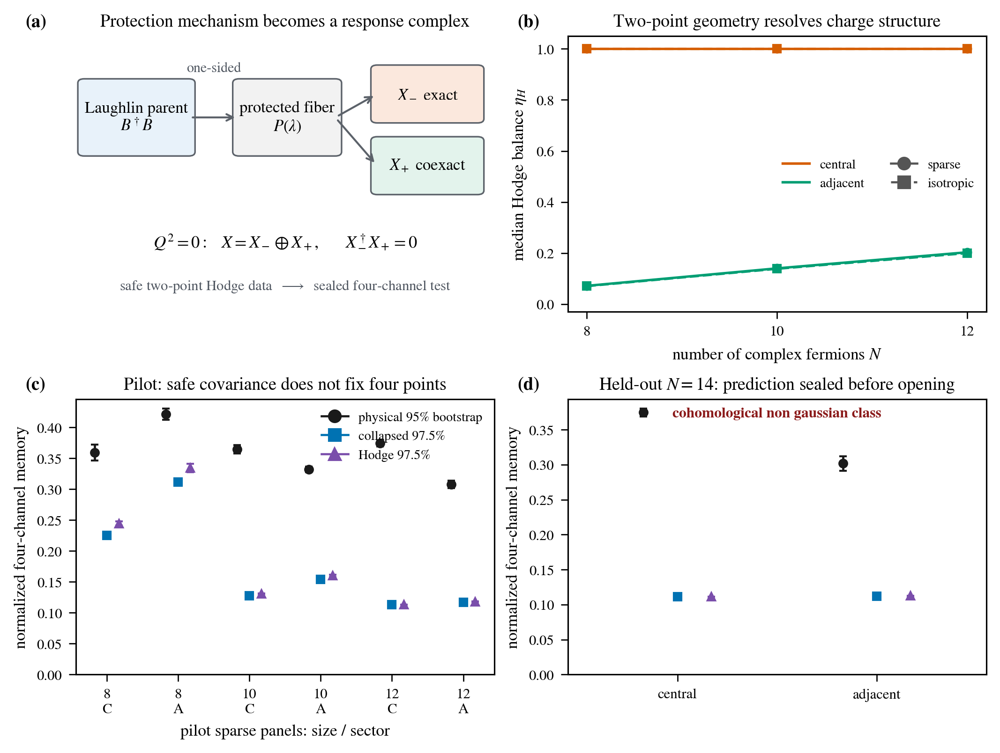
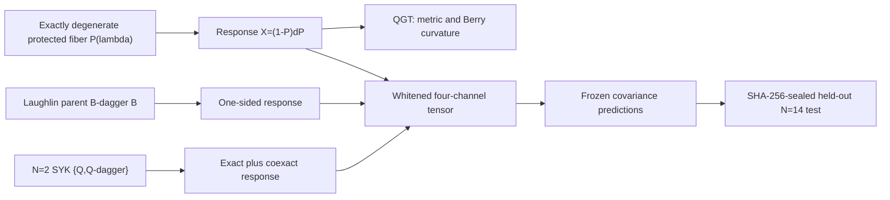

# Chaos of Quantum Geometry

> **Exact degeneracy removes spectral diagnostics, not state-space complexity.**



This project studies quantum chaos as a property of how an exactly degenerate protected manifold moves over coupling space. The response amplitudes

$$X_a=(1-P)\partial_aP$$

generate the non-Abelian quantum geometric tensor (\mathcal Q_{ab}=X_a^\dagger X_b), hence both the quantum metric and Berry curvature. They also retain higher correlations invisible to curvature eigenvalues alone.

The starting point is Chen, Colin-Ellerin, Mamroud, and Papadodimas, [“Chaos of Berry curvature for BPS microstates”](https://arxiv.org/abs/2604.23287). The present release adds an independently protected many-body mechanism and an outcome-blind higher-moment test.

## Scientific Architecture



## What Is New

| Question | Delivered result |
|---|---|
| Is the phenomenon tied to the Kapit–Mueller/Laughlin parent? | No. Generic cubic (\mathcal N=2) SYK supplies a charge-resolved cohomological BPS manifold with a different protection mechanism. |
| What replaces a one-sided parent response? | The exact identity (X=X_-\oplus X_+), with (X_-^\dagger X_+=0), resolves the response into exact and coexact Hodge branches. |
| How is “Geometric ETH” made falsifiable? | Two covariance-only Gaussian predictions are frozen before the held-out four-channel outcome is opened. |
| What is the statistical unit? | The complete disorder realization; no tangent entry or tensor component is treated as an independent sample. |
| What prevents post-outcome tuning? | Safe covariates, numerical predictions, source identities, and the held-out state machine are hash sealed. |

For an eight-channel tangent panel, the gauge-invariant diagnostic is

$$\mathcal T_{abcd}=\frac1D\operatorname{Tr}(\widehat X_a^\dagger\widehat X_b\widehat X_c^\dagger\widehat X_d).$$

The collapsed null matches registered marginal covariance data without a branch label. The Hodge null samples exact and coexact branches independently and combines their orthogonal direct sum. Both are fixed by safe two-point information.

## Pilot Evidence

The sequential (N=8,10,12) pilot contains central/adjacent sectors and sparse/isotropic tangent panels. All 12 size-sector-panel groups reject both registered separable covariance nulls. For the preregistered sparse panel, the physical-to-Hodge-null median ratio evolves as follows:

| Sector | (N=8) | (N=10) | (N=12) |
|---|---:|---:|---:|
| Central | 1.467 | 2.790 | 3.328 |
| Adjacent | 1.261 | 2.081 | 2.613 |

These are strong finite-size deviations. They are not an asymptotic scaling theorem.

## Sealed Held-Out Result

The independent prediction seal passed before explicit outcome opening. The primary $N=14$ sparse pair gives:

| Sector | Physical median (95% bootstrap) | Collapsed null (97.5% prediction) | Hodge null (97.5% prediction) |
|---|---:|---:|---:|
| Adjacent | 0.301529 [0.291527, 0.312061] | [0.111789, 0.111852] | [0.112344, 0.112513] |
| Central | 0.374993 [0.368980, 0.380473] | [0.111338, 0.111353] | [0.111333, 0.111348] |

Both registered nulls miss both primary sectors. The frozen selector returns `cohomological_non_gaussian_class`: two-point Hodge data do not close the observed four-channel response within the registered separable covariance family. The prediction SHA-256 is `fc300dc7e4bdc1be157919e458ac868d3468533cce31108f23c9fba4f7e9f102`; the inference SHA-256 is `177643e07fc6cf210362fc1077070bd1f0ba316b6805042a626de3f96c55a627`.

## Exact Controls

- A decomposable three-form reproduces the analytic curvature atoms (0,\pm\alpha^{-2}) with their predicted multiplicities.
- A one-sided synthetic response reproduces the accepted Laughlin Gaussian null.
- The Hodge formula agrees with a direct Hamiltonian resolvent derivative and a centered finite difference of the protected projector.
- Exact scalable covariance diagonalization agrees with the dense reference within (2\times10^{-12}) in the regression regime.

## Reproduce and Audit

From `01_task_folder/task_05/script`:

```bash
PYTHONPATH=. pytest -q $(rg --files tests | rg 'v7\.py$')
bash run_susy_hodge_delivery_v7.sh
python verify_susy_hodge_delivery_v7.py
python verify_susy_hodge_manuscript_v7.py
```

The delivery script is fail-closed: it will not activate the paper macros unless the pilot, sealed (N=14) prediction, explicit unseal, frozen inference, controls, figures, and manuscript audits all pass.

## Start Here

| Deliverable | Purpose |
|---|---|
| [Letter source](overleaf_sync/cohomological_geometric_eth/main.tex) | Compact scientific argument and primary result |
| [Supplement source](overleaf_sync/cohomological_geometric_eth/supplement.tex) | Derivation, controls, state machine, artifact contract, and limitations |
| [Compiled Letter](01_task_folder/task_05/script/output/response_complex_memory_v7.pdf) | Four-page audited REVTeX paper; SHA-256 `9fe357a5bfce5e6efd60a3c8bf0a1b73a4eac4ee15f9bb8844f51d2f7e1252ee` |
| [Compiled Supplemental Material](01_task_folder/task_05/script/output/response_complex_memory_supplement_v7.pdf) | Four-page audited methods and exact-statistics package; SHA-256 `e43a5a2f62494bb7595f790de5643d6244d782402478f36fdcc7c511176b79c5` |
| [Result report](01_task_folder/task_05/script/output/susy_hodge_geometric_eth_report_v7.md) | Machine-generated verdict and numerical intervals |
| [Figure manifest](01_task_folder/task_05/script/output/figure_susy_hodge_geometric_eth_v7.json) | Input/output hashes for the main evidence figure |
| [Scientific ceiling memo](docs/2026-08-01-scientific-ceiling-strategy.md) | Novelty boundary, journal ceiling, and next-theorem roadmap |
| [Legacy Laughlin article](01_task_folder/task_05/script/output/spectral_silence_and_geometric_chaos_v3.pdf) | One-sided topological benchmark and fixed-Chern holonomy results |

## Claim Boundary and Research Horizon

The independent model/operator-class gate is now crossed: cohomological (\mathcal N=2) SYK is not a repackaged FQH parent Hamiltonian. The asymptotic gate remains open. The current release establishes only the tested finite-size sequence and only relative to the frozen separable covariance nulls.

The next high-ceiling steps are a controlled large-(N) response-tensor law and a spatially local nilpotent-supercharge model with a stable protected rank, open gap, and nontrivially moving harmonic projector.

The code is released under the [GNU General Public License v3.0](LICENSE). Citation metadata are provided in [CITATION.cff](CITATION.cff).
