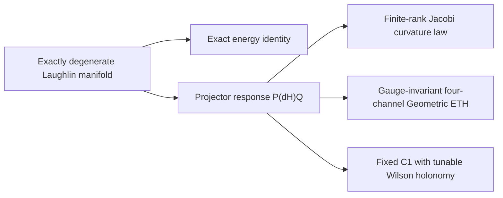

# Chaos of Quantum Geometry

> **Exact degeneracy turns quantum geometry into the signal.**


An exactly degenerate quantum manifold carries a flat internal energy spectrum. This project shows that its state-space geometry remains richly informative: non-Abelian Berry curvature, the quantum metric, response-channel cumulants, Chern numbers, and Wilson holonomy resolve a hierarchy of correlations hidden from energy spacings.

The project begins with Chen, Colin-Ellerin, Mamroud, and Papadodimas, [“Chaos of Berry curvature for BPS microstates”](https://arxiv.org/abs/2604.23287), and builds a complementary condensed-matter realization in an exactly degenerate bosonic Laughlin manifold.

## Featured Advance

The task-05 release, [*Spectral Silence and Geometric Chaos in an Exactly Degenerate Topological Manifold*](01_task_folder/task_05/script/output/spectral_silence_and_geometric_chaos_v3.pdf), establishes three geometric scales inside one protected manifold:

| Scale | New capability | Result |
|---|---|---|
| Exact spectrum | Separate degeneracy from state-space complexity | \(K_{E,\mathrm{raw}}=D\), \(K_{E,c}=0\) exactly |
| Local geometry | Compare curvature directly with a finite-rank analytic law | Jacobi-like level repulsion and a registered curvature ramp |
| Higher/global geometry | Resolve operator memory and topological transport | A persistent four-channel cumulant and fixed-Chern, deformable Wilson holonomy |



## What Is New

| Foundation | Advance delivered here |
|---|---|
| Berry curvature as a BPS chaos probe | A local, frustration-free fractional-topological parent with an exact, gapped zero-mode manifold |
| Random-matrix comparison | A parameter-free finite-\(D\) complex-Jacobi kernel, connected form factor, and exact boundary-atom plateau theorem |
| Curvature eigenvalue statistics | A covariance-whitened, gauge-invariant four-channel matrix-element test on the genuine \(N=3,4,5\) sequence |
| Integrated Chern data | A closed-torus construction that preserves the complete spectrum and \(C_1\) while continuously tuning relative Wilson holonomy |
| Numerical evidence | A hash-complete release contract connecting source, figures, compact artifacts, external production arrays, and the final PDF |

These advances become possible by combining exact parent-Hamiltonian kernels with metric-normalized signature compression. The resulting algorithm turns a large projector-response problem into a finite-rank Jacobi process, while gauge-invariant trace tensors and discrete Wilson transport capture structure beyond eigenvalue statistics.

## Reproduce

The review path checks analytic identities, task isolation, release hashes, registered result branches, and 38 focused tests:

```bash
cd 01_task_folder/task_05/script
python -m pip install -r requirements.txt
bash run_quick_verify_v1.sh
```

The task-level [release guide](01_task_folder/task_05/README.md) documents the article build, full numerical recomputation, artifact classes, exact commands, and growth roadmap. Machine-readable provenance lives in the [release manifest](01_task_folder/task_05/script/output/release_manifest_v1.json).

## Start Here

| Deliverable | Purpose |
|---|---|
| [Technical report](docs/2026-07-30-task05-technical-report.md) | Innovation, algorithm, equations, evidence, and research outlook |
| [17-page PDF](01_task_folder/task_05/script/output/spectral_silence_and_geometric_chaos_v3.pdf) | Complete analytic and numerical article |
| [Task release guide](01_task_folder/task_05/README.md) | Reproduction tiers and figure-by-figure map |
| [Release notes](docs/2026-07-30-task05-release-notes.md) | Reviewer-facing summary |
| [Quantum Harness challenge](docs/2026-07-30-quantum-geometry-harness-challenge-draft.md) | Public next-stage benchmark |
| [Main dashboard](00_main/main_dashboard.md) | Global task ledger and provenance log |

## Research Horizon

The current release establishes a finite-size geometric-chaos baseline with exact algebraic identities, high-statistics curvature results, a genuine many-body response sequence, and closed-surface topology. The next phase extends the sequence to \(N=6\), transfers the invariant test to a second exact-degeneracy mechanism, and derives the observed four-channel scaling from locality.

The code is released under the [GNU General Public License v3.0](LICENSE). Citation metadata are provided in [CITATION.cff](CITATION.cff).
