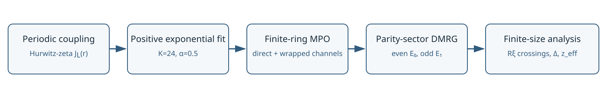
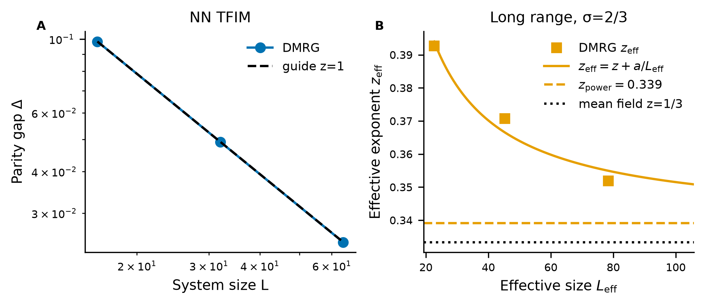
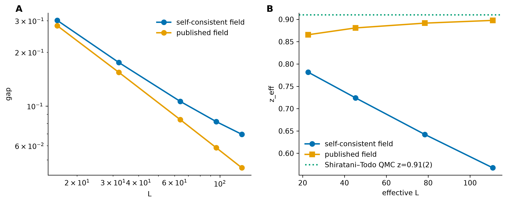
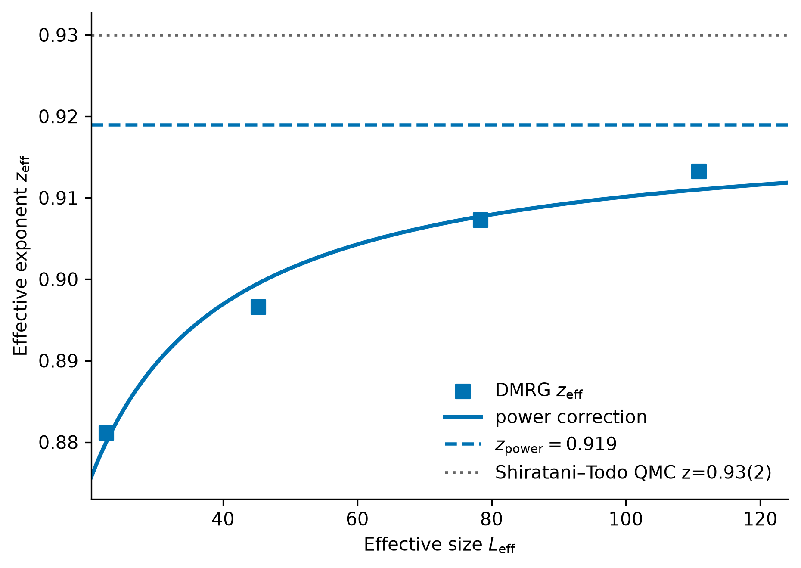

# Feasibility Validation of Exploring Universality-Class Crossover in the Long-Range Transverse-Field Ising Model Using DMRG

## Abstract

We assess the feasibility of using matrix-product-state density-matrix
renormalization group (DMRG) calculations to study the debated
universality-class crossover of the one-dimensional long-range
transverse-field Ising model. Periodic finite-ring interactions are defined
by a Hurwitz-zeta image sum and represented by a custom matrix-product
operator (MPO) obtained from a positive, tail-stabilized sum of exponentials.
The implementation is validated against the nearest-neighbor critical point,
the mean-field boundary at σ=2/3, and exact diagonalization on small
long-range rings. An exploratory σ=1.50–2.00 crossing scan establishes a
smooth finite-size critical-field trend. At σ=7/4, gap scaling at the
published critical field gives power- and logarithmic-correction estimates
z=0.903 and 0.959; at σ=1.8 the corresponding values are z=0.919 and 0.975.
These agree qualitatively with the Shiratani–Todo quantum Monte Carlo results
while exposing strong finite-size sensitivity to the critical-field
estimate. MPO and MPS uncertainties are orders of magnitude smaller than
this finite-size effect. All calculations were performed on a 32 GB personal
computer. The complete σ=1.8, L=16–128 gap campaign required 1.76 h of
summed DMRG wall time, demonstrating that substantially larger DMRG studies
are computationally plausible.

## 1. Model and method

### 1.1 Hamiltonian and finite-ring convention

We study a ferromagnetic transverse-field Ising chain,

$$
H=-\sum_{i<j}J_{L}(j-i,\sigma)Z_iZ_j-\Gamma\sum_iX_i .
$$

where X and Z are Pauli operators. The finite periodic ring is defined by the
pinned image-sum coupling

$$
J_L(r;\sigma)
=\sum_{n\in\mathbb{Z}}|r+nL|^{-1-\sigma}
=L^{-1-\sigma}
\left[
\zeta\!\left(1+\sigma,\frac{r}{L}\right)
+\zeta\!\left(1+\sigma,1-\frac{r}{L}\right)
\right].
$$

This convention preserves $J_L(r)=J_L(L-r)$ and differs from an open-chain
power law. The nearest-neighbor validation limit uses
$H_{\mathrm{NN}}=-\sum_iZ_iZ_{i+1}-\Gamma\sum_iX_i$ on a periodic ring.

### 1.2 Periodized exponential MPO

The infinite-line kernel is approximated as

$$
r^{-1-\sigma}\approx\sum_{k=1}^{K}c_k\lambda_k^r,
\qquad c_k\geq0,\qquad 0<\lambda_k<1.
$$

The decay rates are fitted by deterministic bounded variable projection,
while the nonnegative coefficients are obtained by least squares. A
correlation-length constraint,
$-\log(\lambda_k)\geq\alpha/r_{\mathrm{fit}}$, prevents near-unit decay
modes from being amplified by periodization. Each exponential is periodized
analytically,

$$
\widetilde{J}_L(r)
=\sum_{k=1}^{K}
c_k\frac{\lambda_k^r+\lambda_k^{L-r}}{1-\lambda_k^L},
$$

before entering the MPO. Direct channels encode $\lambda_k^{j-i}$, and
wrapped channels encode $\lambda_k^{L-j+i}$, so the MPS retains open virtual
boundaries while the Hamiltonian represents a periodic physical ring. The
unpruned MPO bond dimension is
$\chi_{\mathrm{MPO}}=2K+2=50$ for the production choice $K=24$. Exactly
zero channels are pruned after validation; no approximate MPO compression
is used. $K=32$ is reserved for systematic checks.

### 1.3 Parity-sector DMRG and finite-size estimator

Calculations use TeNPy with a rotated local basis:
$X_{\mathrm{phys}}\to\mathrm{Sigmaz}$ and
$Z_{\mathrm{phys}}\to\mathrm{Sigmax}$. This makes the global spin-flip
parity explicit. The ground state is optimized in the even sector and the
first excitation in the odd sector. Their energy difference defines the
parity gap,

$$
\Delta(L,\Gamma)=E_{\mathrm{odd}}(L,\Gamma)-E_{\mathrm{even}}(L,\Gamma).
$$

Critical fields are estimated from crossings of $R_\xi=\xi/L$, where $\xi$ is the
second-moment correlation length obtained from the full physical
$\mathrm{Sigmax}$–$\mathrm{Sigmax}$ correlation function. The dynamical
exponent follows from $\Delta(L,\Gamma_c)\sim L^{-z}$. For each size pair we
compute the gap-based pairwise
effective dynamical exponent

$$
z_{\mathrm{eff}}(L_1,L_2)
=-\frac{\log\!\left[\Delta(L_2)/\Delta(L_1)\right]}
{\log(L_2/L_1)},
$$

and associate it with the logarithmic midpoint
$L_{\mathrm{eff}}=\sqrt{L_1L_2}$. Finite-size drift is examined with

$$
z_{\mathrm{eff}}
=z_{\mathrm{power}}+\frac{a}{L_{\mathrm{eff}}},
\qquad
z_{\mathrm{eff}}
=z_{\log}+\frac{a}{\log L_{\mathrm{eff}}}.
$$

These correction forms follow the spirit of the
[Shiratani–Todo](https://arxiv.org/abs/2305.14121) finite-size analysis, but
the underlying estimators differ: DMRG obtains z from excitation gaps,
whereas their quantum Monte Carlo (QMC) calculation uses a tuned
imaginary-time aspect ratio and quotient-style estimates.

**Figure 1.** Computational workflow. The exact periodic coupling anchors the
tail-stabilized exponential fit, which is periodized analytically before MPO
construction. Dense small-system tests isolate Hamiltonian-representation
error, and parity-sector DMRG then supplies correlation-length crossings and
excitation gaps.

| Item | Setting |
|---|---|
| Framework | TeNPy, Python 3.11, MPS/DMRG |
| Boundary convention | Finite periodic ring with pinned Hurwitz-zeta image-sum couplings |
| Production fit | K=24, α=0.5, r_fit=2048 |
| MPO handling | Exact-zero pruning; no approximate compression |
| Operator convention | X_phys→Sigmaz, Z_phys→Sigmax |
| Symmetry sectors | Even ground state; odd first excitation |
| Bond dimensions | χ=64 exploration; χ=128 final gaps; χ=256 targeted checks |
| Phase 8 acceptance targets | Relative variance ≤10⁻¹⁰; discarded weight ≤10⁻⁷ |
| Maximum reported size | L=128 |
| Execution platform | Local 32 GB personal computer; no cluster or supercomputer |
| Memory use | Normally below 16 GB; recorded per-cell values ≤1.3 GiB at χ=128 and 2.66 GiB at χ=256 |
| Runtime envelope | Every individual DMRG campaign <8 h; complete σ=1.8, L=16–128 gap campaign 6,325 s = 1.76 h |

**Table 1.** Core numerical conventions and resource envelope. Detailed
checkpoint provenance, sweep histories, and code hashes are retained in the
technical archive.

## 2. Numerical validation

### 2.1 Nearest-neighbor and mean-field limits

The nearest-neighbor chain tests the Hamiltonian, parity sectors,
correlation-length crossing, and gap-scaling pipeline without long-range MPO
fitting. Crossings at Γ_x(16,32)=0.997160 and
Γ_x(32,64)=0.999281 approach the exact Γ_c=1. At Γ=1 the three-size gap
estimate is z=1.000544, with pairwise values 1.000870 and 1.000219. This is
a pipeline validation, not a high-precision thermodynamic extrapolation.

At the mean-field boundary σ=2/3, we use the external published field
Γ_c=3.673 and test only the prediction z=σ/2=1/3. The raw four-size gap
regression gives z=0.375314. The pairwise exponents drift downward with
size, and the power-correction sensitivity gives z_power=0.339081, close to
1/3. Two larger-size states retain convergence warnings, so this benchmark
is interpreted qualitatively.

**Figure 2.** Validation of the scaling pipeline. **A**, nearest-neighbor
parity gaps at Γ=1 follow the z=1 guide. **B**, σ=2/3 gap-based pairwise
effective exponents versus L_eff, together with the power-correction curve
and the mean-field prediction z=1/3.

| Benchmark | Critical field and role | Sizes | Gap-based pairwise z_eff | Direct z | 1/L_eff sensitivity | 1/log(L_eff) sensitivity | Expected |
|---|---|---|---|---:|---:|---:|---:|
| Nearest-neighbor TFIM | Γ_x(16,32)=0.997160; Γ_x(32,64)=0.999281 | 16, 32, 64 | 1.000870; 1.000219 | 1.000544 | — | — | 1 |
| Long range, σ=2/3 | Γ_c=3.673, external benchmark | 16, 32, 64, 96 | 0.392741; 0.370806; 0.351941 | 0.375314 | 0.339081 | 0.253069 | 1/3 |

**Table 2.** Limiting-case benchmarks. The σ=2/3 correction-coordinate
values use only three pairwise exponents and are finite-size sensitivity
estimates rather than statistical extrapolations.

### 2.2 Hamiltonian and algorithm validation

The periodic coupling implementation was checked against direct image sums,
positivity, and ring symmetry. For σ=1.75, K=24, and small rings L=8,10,12,
the largest coupling reconstruction error was 5.78×10⁻⁷. The full
three-layer comparison used:

1. exact Hurwitz-zeta pairwise Hamiltonian and dense exact diagonalization;
2. dense exact diagonalization of the compact MPO;
3. parity-sector DMRG using the same compact MPO.

Across Γ=1.2,1.56,2.0, the compact-MPO gap differed from the exact-pair gap
by at most 3.63×10⁻⁷ relatively. DMRG reproduced the compact-MPO gaps to
approximately 2.1×10⁻¹³ relatively, and translation-averaged correlations
agreed to comparable precision. The nearest-neighbor and long-range rotated
basis conventions were also checked against dense L=8,10,12 fixtures. These
tests separate Hamiltonian compression from MPS optimization error before
finite-size scaling.

## 3. Long-range critical scaling

Before the selected gap calculations, a fixed-grid exploratory scan at
σ=1.50,1.60,1.70,1.75,1.80,1.90,2.00 mapped the L=32,64 R_ξ crossing from
Γ_x=1.769270 at σ=1.50 to Γ_x=1.428411 at σ=2.00. Selective χ=128 checks
changed R_ξ by less than 4×10⁻⁶ and preserved every tested crossing bracket.
At σ=2.00, Γ_x(32,64)=1.428411 differs by 0.54% from the published
Γ_c=1.4208(2). Because the broad-grid resolution is 0.025, this is a
finite-size benchmark rather than a precision critical-field reproduction.

### 3.1 σ=7/4

The finite-size R_ξ crossings produce a self-consistent two-crossing
sensitivity field Γ_c=1.5738504887. Gaps evaluated at this field show strong
drift: the gap-based pairwise effective exponents decrease from 0.781606 for
L=16→32 to 0.567470 for L=96→128. The corresponding direct, power-correction,
and logarithmic-correction estimates are 0.709349, 0.558818, and 0.200196.
This branch demonstrates that the two available crossings do not yet control
the thermodynamic critical field.

An independent sensitivity branch evaluates every size at the external
Shiratani–Todo benchmark Γ_c=1.5609. The pairwise exponents then increase
smoothly from 0.865522 to 0.897640. The direct gap regression gives
z=0.880154, while the finite-size corrections give
z_power=0.903245 and z_log=0.959263. These are consistent with the published
QMC values 0.91(2) and 0.98(3), within the limitations of the smaller
L≤128 range. The published field is an external benchmark, not a value
selected to obtain preferred exponents.

**Figure 3.** Critical-field sensitivity at σ=7/4. **A**, parity gaps at the
self-consistent crossing field and at the external Γ_c=1.5609 benchmark.
**B**, the corresponding gap-based pairwise effective exponents. The
difference between branches is much larger than the measured MPO or MPS
uncertainty, identifying finite-size critical-field drift as the dominant
systematic.

### 3.2 σ=1.8

At σ=1.8 we evaluate L=16,32,64,96,128 at the external benchmark
Γ_c=1.5288 without a new field search. The pairwise effective exponents
0.881153, 0.896600, 0.907271, and 0.913216 show a smooth approach toward
z≈1. The direct regression gives z=0.895885. Power- and
logarithmic-correction sensitivities give z_power=0.918948 and
z_log=0.974931, compared with the Shiratani–Todo QMC values 0.93(2) and
1.00(3). Nine of ten sector states pass the nominal convergence gates; the
L=128 even state retains a small variance warning
(1.11×10⁻¹⁰ versus the 1×10⁻¹⁰ target).

**Figure 4.** Gap-based pairwise effective dynamical exponents at σ=1.8,
plotted at L_eff=√(L1L2). The solid curve is
z_eff=z_power+a/L_eff, the dashed line is its asymptote
z_power=0.918948, and the dotted line marks the Shiratani–Todo QMC result
0.93(2). The DMRG and QMC estimators differ, so the comparison validates the
finite-size trend rather than constituting a precision reproduction.

| σ | Critical field and role | Sizes | Direct z | z from 1/L_eff | z from 1/log(L_eff) | Shiratani–Todo power/log |
|---:|---|---|---:|---:|---:|---:|
| 7/4 | Γ=1.5738504887, self-consistent two-crossing sensitivity | 16, 32, 64, 96, 128 | 0.709349 | 0.558818 | 0.200196 | — |
| 7/4 | Γ=1.5609, external benchmark | 16, 32, 64, 96, 128 | 0.880154 | 0.903245 | 0.959263 | 0.91(2) / 0.98(3) |
| 1.8 | Γ=1.5288, external benchmark | 16, 32, 64, 96, 128 | 0.895885 | 0.918948 | 0.974931 | 0.93(2) / 1.00(3) |

**Table 3.** Long-range dynamical-exponent results. DMRG values use the
gap-based estimator defined in Section 1.3. Published fields are external
validation inputs, and the Shiratani–Todo columns provide an analogous
finite-size-correction comparison rather than an identical-estimator
reproduction.

### 3.3 Numerical uncertainty

MPO and MPS uncertainties were quantified independently at σ=1.75. Changing
K=24→32 shifts the L=32,64 crossing by 4.89×10⁻⁷ and changes the L=64 gap
by at most 5.57×10⁻⁶ relatively. At the largest refined size, L=128,
increasing χ=128→256 changes the gap by only 4.53×10⁻⁷ absolutely. These
effects are negligible compared with the critical-field sensitivity in
Section 3.1.

| Source | Controlled comparison | Largest recorded effect | Interpretation |
|---|---|---:|---|
| MPO representation | K=24→32 at L=32,64 | \|ΔR_ξ\|=1.14×10⁻⁶; relative gap shift=5.57×10⁻⁶ | Small Hamiltonian-compression bias at validated points |
| MPS truncation | χ=128→256 at the largest validated size, L=128 | maximum absolute gap shift=4.53×10⁻⁷ | Maximum recorded MPS shift; negligible relative to finite-size and field sensitivity |
| Critical-field sensitivity | σ=7/4 self-consistent versus published field | z_power changes 0.559→0.903 | Dominant systematic in the available size range |

**Table 4.** Numerical uncertainty budget. Hamiltonian approximation, MPS
optimization, and critical-field sensitivity are kept separate rather than
combined into a single statistical uncertainty.

### 3.4 Computational feasibility

All calculations were executed locally on a personal computer with 32 GB of
memory; no cluster or supercomputer was used. Memory use was normally below
16 GB. Recorded campaign provenance is more conservative still: χ=128 cells
used a 1.3 GiB peak-memory bound, and the measured χ=256 peak was 2.66 GiB.
Every individual DMRG campaign completed within eight hours. The longest
consolidated dynamical-scaling calculation—the ten even/odd states for σ=1.8
and L=16,32,64,96,128—required 6,325 s, or 1.76 h of summed DMRG wall time.
The seven-σ broad pass comprised 210 independently checkpointed even-sector
cells and completed in 84.3 min using four local workers.

The Shiratani–Todo QMC study reached L=362 using large-scale computational
resources, whereas this DMRG feasibility study reached L=128 on a personal
computer. The observed cost leaves substantial headroom for extending DMRG
on high-performance hardware. Whether DMRG can exceed L=362 at comparable
accuracy remains to be tested because DMRG and QMC have different
computational scaling and target different exponent estimators.

## 4. Limitations

- The maximum size is L=128; no thermodynamic-limit precision claim is made.
- Critical-field and finite-size correction sensitivity remain the dominant
  uncertainties.
- The susceptibility exponent γ/ν was not calculated within the submission
  timeline; available time was prioritized for MPO validation and gap-based
  dynamical scaling.

## 5. Conclusion

This work validates a complete DMRG route for the periodic long-range
transverse-field Ising model: exact Hurwitz-zeta finite-ring interactions,
tail-stabilized exponential fitting, a compact direct-and-wrapped MPO,
parity-resolved excitation gaps, and independently measured MPO and MPS
uncertainties. The nearest-neighbor and σ=2/3 limits reproduce their expected
z behavior, while the σ=7/4 and σ=1.8 published-field calculations yield
finite-size correction estimates consistent with Shiratani–Todo.

The principal limitation is finite-size critical-field drift, not MPO
compression or MPS truncation. Reaching L=128 and extracting the full σ=1.8
gap sequence in 1.76 h on a 32 GB personal computer establishes the
feasibility of a larger DMRG crossover study. High-performance resources can
therefore be directed toward increasing L and refining σ near the proposed
7/4–2 crossover interval rather than toward repairing the numerical
representation.

## Data availability

All reviewer-facing figures and tables are embedded above. Machine-readable
results, checkpoint provenance, convergence diagnostics, and methodological
decision records are indexed in
[`report_AI/artifact_index.md`](../report_AI/artifact_index.md).
