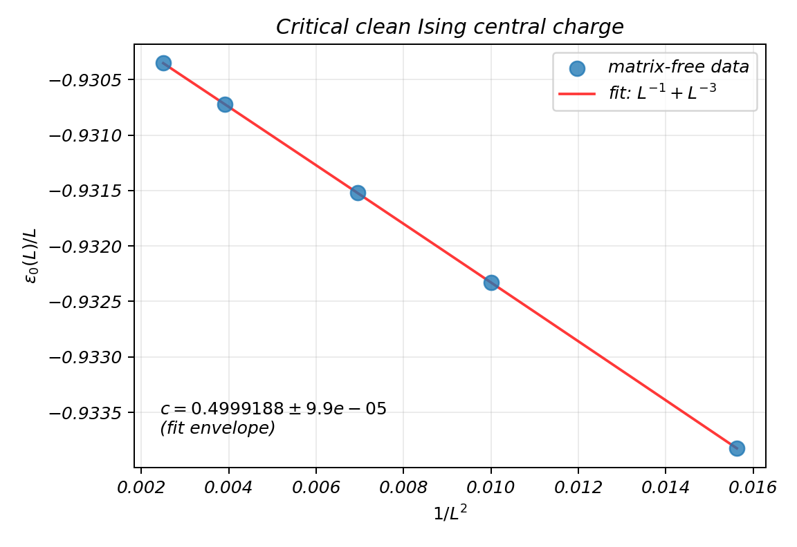
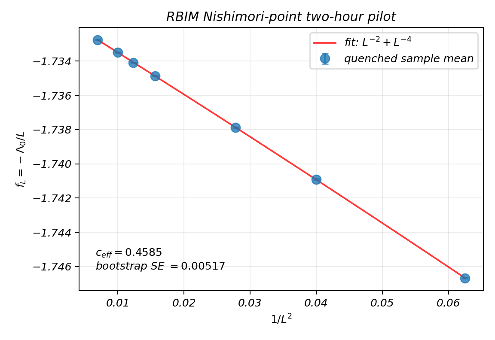

# Effective central charge in open quantum matter

| | |
|---|---|
| **Team** | jhzhu |
| **Member** | Jinhong Zhu |
| **Challenge** | [#122 — Criticality in open quantum matter](https://github.com/QuantumBFS/quantum.harness/issues/122) |
| **Track** | [MPS](../../README.md) |

## Executive summary

This project asks whether the free energy generated by a monitored quantum
circuit has the same universal finite-size structure as a two-dimensional
critical statistical model. The numerical strategy was developed in four
stages:

1. validate the transfer-matrix normalization and Lyapunov gaps on the clean
   critical Ising model;
2. test quenched averaging on the random-bond Ising model (RBIM) at the
   Nishimori point;
3. implement exact-state-vector Haar-circuit trajectories with Born sampling;
4. replace the exponentially large state vector by a finite-bond-dimension MPS
   and extrapolate first in bond dimension and then in system size.

The clean Ising calculation reproduces $c=1/2$. The finite-statistics RBIM run
gives a central charge near 0.46, with visible finite-size systematics. The
exact Haar-circuit calculation validates the end-to-end workflow but is too
noisy to support a central-charge claim. The dual-unitary MPS pilot gives
$c_{\mathrm{eff}}\approx0.22$; a larger paired-sample, high-$\chi$ calculation
is running to reduce its statistical and truncation errors.

## Results at a glance

| Stage | Numerical scope | Headline estimate | Interpretation |
|---|---|---|---|
| Clean Ising | $L=8,10,12,16,20$ | $c=0.4999188$; fit-envelope half-width $9.94\times10^{-5}$ | Validation |
| RBIM Nishimori | $L=4,5,6,8,9,10,12$ | $c=0.45846$; trajectory-bootstrap SE $0.00517$ | Completed preliminary finite-statistics run |
| Haar circuit | 192 trajectories, $p=0.168$ | $c_{\mathrm{eff}}=1.559$; bootstrap SE $0.955$ | Inconclusive workflow pilot |
| Dual-unitary MPS | 350 trajectories, $p=0.14$, $\chi\le128$ | $c_{\mathrm{eff}}=0.21996$; bootstrap SE $0.04335$ | MPS pilot; high-statistics run pending |

These uncertainties are not interchangeable. The clean-Ising number uses a
fit envelope, the RBIM and circuit errors come from trajectory or disorder
bootstrap, and the MPS calculation additionally has a bond-dimension
selection systematic.

## Observable and numerical strategy

For a critical transfer problem on a periodic cylinder, the free-energy
density is fitted to

$$
f(L)=f_\infty-\frac{\pi\alpha c_{\mathrm{eff}}}{6L^2}
     +O(L^{-4}),
$$

where $\alpha$ converts one numerical transfer step into the isotropic
space-time convention. The clean Ising and dual-unitary calculations use
$\alpha=1$; the Haar-circuit pilot uses the independently supplied
$\alpha=0.81$.

The meaning of $f(L)$ changes with the representation, but the finite-size fit
is shared:

- **Clean Ising:** matrix-free application of the row-to-row transfer matrix;
  leading eigenvalues also give
  $x_a(L)=L(\ell_1-\ell_a)/(2\pi)$.
- **RBIM:** products of independently disordered transfer matrices, with QR
  normalization and a quenched average of the leading growth rate.
- **Haar circuit:** exact `complex128` state vectors, matrix-free two-site Haar
  gates, and Born-sampled projective measurements. The accumulated negative
  log Born probability is the trajectory free energy.
- **Dual-unitary MPS:** the same trajectory observable evaluated with
  canonical MPS updates, SVD truncation, and periodic gates implemented by a
  SWAP network. For each $L$, $f(L,\chi)$ is extrapolated to
  $f(L,\infty)$ before fitting $c_{\mathrm{eff}}$.

## Numerical evidence

### Clean Ising validation

The matrix-free leading eigenvalue agrees with the exact critical Ising
transfer problem. Fits with $L^{-1}+L^{-3}$ corrections, a dropped-$L=8$
window, and an additional $L^{-5}$ term give the reported envelope

$$
c=0.4999188\pm9.94\times10^{-5},
$$

where the quoted width is a deterministic fit-stability envelope, not a
statistical error bar. The Lyapunov gaps recover the expected low-lying Ising
scaling structure at $1/8$, $1$, $9/8$, $2$, and higher descendants.



The corresponding spectrum comparison is available as a
[figure](../../../../results/clean_ising_transfer/lyapunov_scaling_dimensions.png)
and a [machine-readable table](../../../../results/clean_ising_transfer/lyapunov_scaling_dimensions.csv).

### Random-bond Ising model at the Nishimori point

At $p_c=0.1092212$, the completed local run used $10^5$ retained transfer rows
per disorder sample and 816 samples distributed over
$L=4,5,6,8,9,10,12$. The primary $L^{-2}+L^{-4}$ fit gives

$$
c=0.45846,
$$

with trajectory-bootstrap SE $0.00517$. Varying the fit window and correction
term produces the much wider range $0.45788$ to $0.50120$, so the bootstrap
error alone understates the total finite-size uncertainty. The earlier
$L=8,10,12,16,20$ pilot failed visibly because its disorder errors were too
large to resolve the $L^{-2}$ signal; it is retained as a useful negative
control rather than combined with the smaller-size run.



The [fit JSON](../../../../results/random_bond_ising_nishimori_two_hour/central_charge_fit.json)
and [width summary](../../../../results/random_bond_ising_nishimori_two_hour/width_summary.csv)
contain the numerical values used here.

### Haar-circuit exact-state-vector pilot

The exact-state-vector checkpoint used periodic systems
$L=8,10,12,14,16,18$, with 16 random product and 16 global-Haar initial states
per size. The equal-family estimator was measured after $4L$ thermalization
half-layers and over $24L$ recorded half-layers.

The resulting $c_{\mathrm{eff}}=1.559$ has bootstrap SE $0.955$ and a 95%
bootstrap interval $[-0.314,3.432]$. This does **not** reproduce the expected
order-$0.25$ value: the individual free-energy errors are comparable to the
entire finite-size signal. What the checkpoint establishes is that trajectory
generation, Born sampling, resumable storage, aggregation, fitting, and block
bootstrap work together. See the
[detailed Haar checkpoint](../../../../docs/reports/2026-07-30-haar-mipt-checkpoint.md).

### Dual-unitary MPS pilot

The MPS pilot used $L=8,10,12,14,16$, seven bond dimensions up to
$\chi=128$, and ten independent trajectories per $(L,\chi)$. Bond dimensions
were retained when their discarded-weight rate fell below $10^{-5}$; the
remaining values were combined into $f(L,\infty)$ before the size fit.

The leading $L^{-2}$ fit gives

$$
c_{\mathrm{eff}}=0.21996,
$$

with bootstrap SE $0.04335$, 95% bootstrap interval $[0.13385,0.30559]$, and
a discarded-weight-threshold range $0.19199$ to $0.22595$. Adding an $L^{-4}$
term moves the estimate to 0.468 with an uncertainty of order 0.25, so that fit
is an instability diagnostic rather than a preferred result.

The production extension uses 400 samples per $(L,\chi)$, reaches
$\chi=256$, and pairs the random trajectory across bond dimensions. Its 5600
trajectories are packed into 400 resumable Slurm tasks with at most 100 active
CPU cores. The run is deliberately labelled **in progress** until every
manifest is present and the same analysis is repeated.

## Reproduction

Install the dependencies for the relevant calculation:

```bash
python -m pip install -r scripts/requirements-haar-mipt.txt
python -m pip install -r scripts/requirements-dual-unitary-mps.txt
```

Reproduce the clean-Ising analysis and tracked figures:

```bash
python scripts/clean_ising_analysis.py \
  --sizes 8 10 12 16 20 \
  --count 12 \
  --output-dir results/clean_ising_transfer
```

Reproduce the completed RBIM parameter set:

```bash
python scripts/random_bond_ising_production.py \
  --sizes 4 5 6 8 9 10 12 \
  --sample-counts 192 160 128 96 96 80 64 \
  --p 0.1092212 \
  --burn-in 1000 \
  --retained-rows 100000 \
  --block-length 1000 \
  --workers 8 \
  --output-dir results/random_bond_ising_nishimori_two_hour
```

Generate the high-statistics dual-unitary run specification and analyse a
completed result directory:

```bash
python scripts/dual_unitary_mps_slurm_cell.py \
  --write-spec results/dual-unitary-mps-highstat/run_spec.json \
  --run-id dual-unitary-mps-highstat

python scripts/dual_unitary_mps_analysis.py \
  --run-dir results/dual-unitary-mps-highstat \
  --alpha 1 \
  --discard-rate-threshold 1e-5
```

The portable Slurm wrapper is
[`scripts/harness_array_sbatch.sh`](../../../../scripts/harness_array_sbatch.sh).
Cluster hostnames, accounts, and credentials are intentionally not part of the
repository.

## Limitations and running work

- The Haar MIPT point and anisotropy are taken from the literature rather than
  re-estimated in this project.
- Exact-state-vector Haar data are statistically insufficient for a useful
  central-charge estimate.
- The preliminary RBIM bootstrap error does not include the full fit-window
  systematic.
- The dual-unitary MPS pilot is limited by ten samples per $(L,\chi)$ and by
  the stability of the two-step $\chi\to\infty$, $L\to\infty$ extrapolation.
- No Lyapunov spectrum has yet been extracted for the random circuit. The clean
  Ising spectrum is a benchmark for that later calculation, not evidence that
  the circuit has the same operator content.
- The high-statistics MPS calculation is not quoted as a result until its
  remote artifacts are complete, copied back, and analysed.

## Repository map

- [Clean-Ising transfer and analysis](../../../../scripts/clean_ising_analysis.py)
- [RBIM transfer](../../../../scripts/random_bond_ising_transfer.py),
  [production driver](../../../../scripts/random_bond_ising_production.py), and
  [analysis](../../../../scripts/random_bond_ising_analysis.py)
- [Haar trajectory kernel](../../../../scripts/haar_mipt_transfer.py),
  [resumable Slurm cell](../../../../scripts/haar_mipt_slurm_cell.py), and
  [Slurm analysis](../../../../scripts/haar_mipt_slurm_analysis.py)
- [Dual-unitary MPS kernel](../../../../scripts/dual_unitary_mps.py),
  [resumable cell/batch driver](../../../../scripts/dual_unitary_mps_slurm_cell.py),
  and [two-step analysis](../../../../scripts/dual_unitary_mps_analysis.py)
- [Haar Slurm parameter manifests](../../../../design/haar-mipt-slurm/)
- [README design rationale](../../../../docs/design/2026-07-30-mps-solution-readme-design.md)
