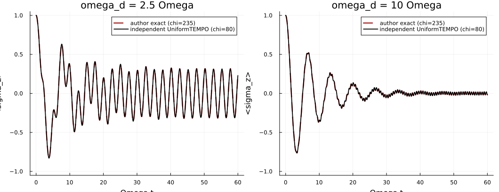
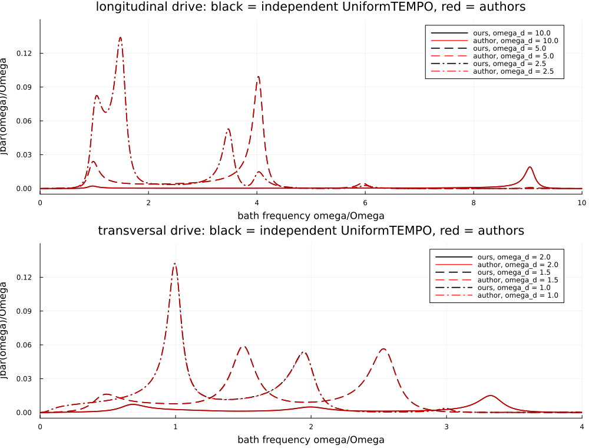
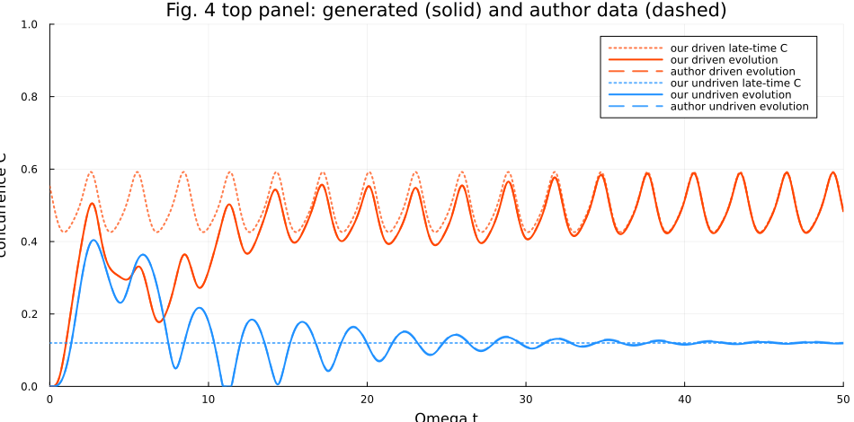
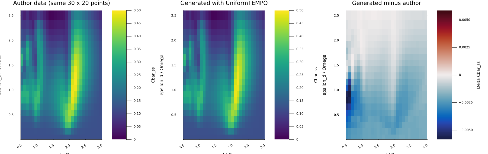
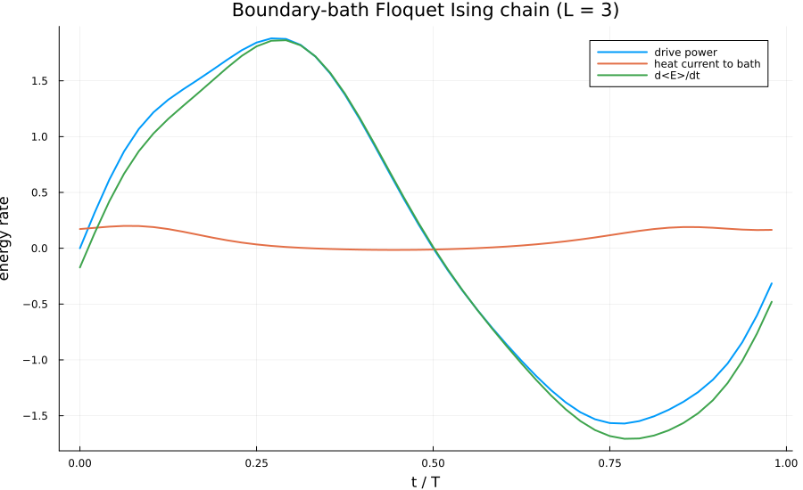
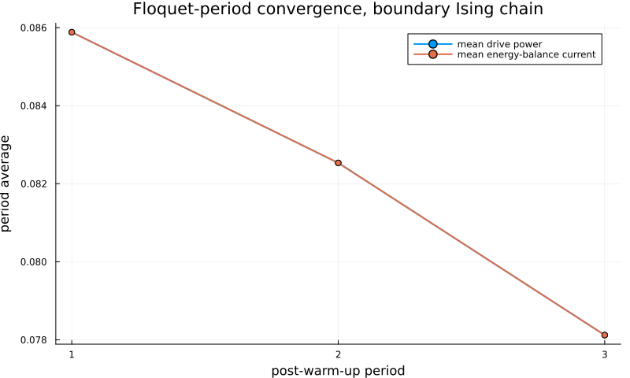

# UniTEMPO partial reproduction

This directory records an independent partial reproduction of Mickiewicz, Link, and Strunz, *PRL* **136**, 200201 (2026), using the external `UniformTEMPO.jl` package. It complements, rather than replaces, the FloIM implementation elsewhere in this PR.

## Scope and result

The scripts regenerate the deposited-data comparisons for Figures 2, 3, and 4, and run a driven boundary-bath Ising-chain heat-current pilot. The tracked validation records preserve the small numerical summaries; full CSV traces, plots, HTML reports, and the source-data archive remain ignored in `tracks/mps/results/`.

| Target | Result |
| --- | --- |
| Fig. 2 dynamics | RMSE 2.53e-4 (slow) and 1.51e-4 (fast) |
| Fig. 3 heat-current spectra | RMSE 1.10e-5 to 3.33e-4 across sampled curves |
| Fig. 4 concurrence | RMSE 1.22e-3 (driven), 1.68e-3 (undriven) |
| Fig. 4 lower map | RMSE 1.75e-3; Pearson r = 0.999954 |
| L=3 heat-current pilot | mean current = 0.0858600; mean dE/dt = -2.08e-17 |

The deposited-curve comparisons reproduce the sampled dynamics, spectra, concurrence traces, and lower-panel heat-current map closely. The boundary-bath pilot also closes the period-averaged energy balance: the injected drive power equals the heat current into the bath within the finite-difference derivative error. This is a partial reproduction: the fixed-point shortcut remains unresolved and is not used for the reported agreement.

## Figures

### Deposited-data comparisons









### Boundary-bath Ising-chain pilot





## Run

Install `UniformTEMPO`, `OrdinaryDiffEq`, and `Plots` in a Julia project, then run scripts from the repository root. For example:

```bash
julia --project=.external/fig2-unitempo-env \
  tracks/mps/solutions/reproduction/unitempo_partial/scripts/unitempo_boundary_ising_floquet_heat.jl \
  tracks/mps/results/local-boundary-ising 3
```

`benchmark_boundary_ising_floquet_heat.jl` adds the alpha=0 limit check and samples three post-warm-up periods. The fixed-point shortcut is deliberately not included as validation: its observed RMSE was 0.506, indicating that the shortcut needs further work.

## Contents

- `scripts/`: independently runnable Figure 2-4 and boundary-current calculations.
- `validation/20260730-fig2-fig4/`: deposited-curve comparison metrics and figures.
- `validation/20260730-boundary-ising-floquet-heat-L3/`: energy-balance, periodicity, and plot evidence.
