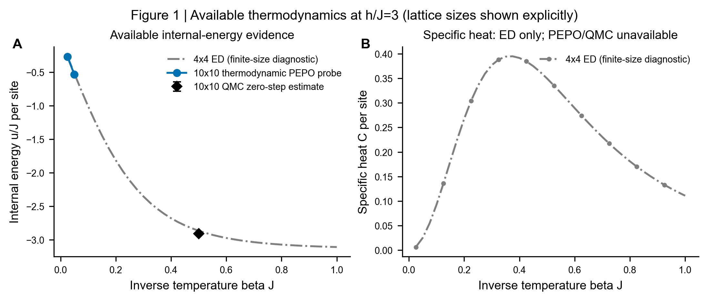
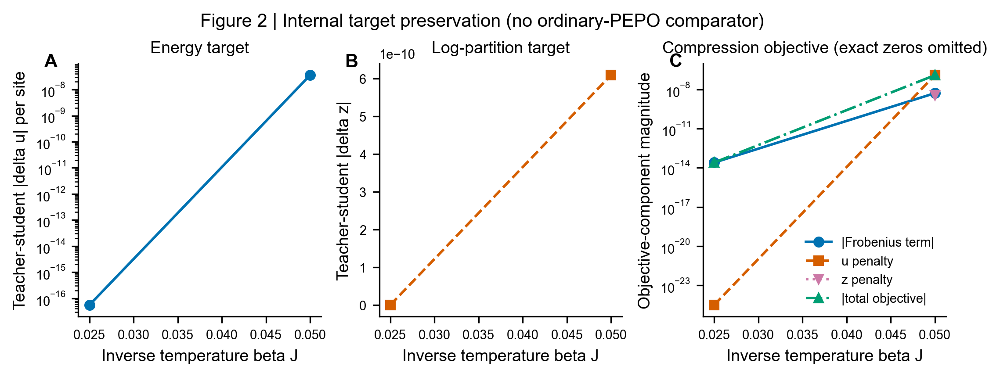
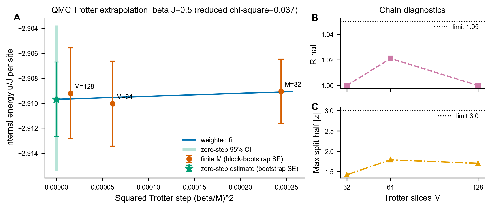
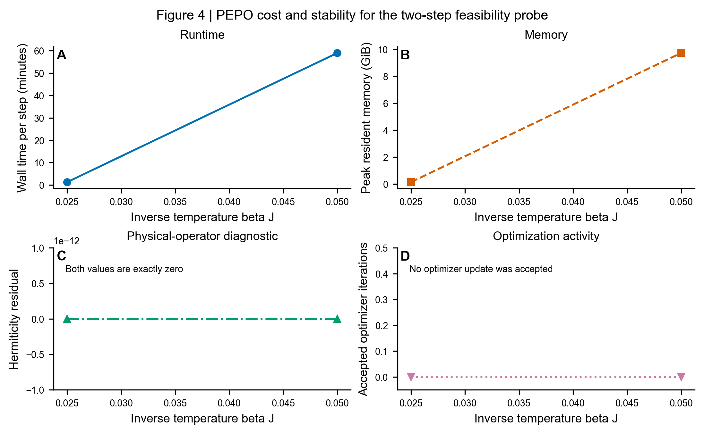

# Challenge #147 技术报告：面向热力学的二维有限温 PEPO

> **结论先行：**我们实现了一条可恢复、可审计的 10×10 有限温 PEPO
> 原型链，并提出在固定张量容量下直接保护热力学目标的压缩目标。PEPO、
> 4×4 ED 与独立 10×10 QMC 的证据链已经跑通；完整 β 区间、ordinary PEPO
> 对照和键维收敛 benchmark 尚未完成。

[▶ 直接预览完整 HTML 报告](https://htmlpreview.github.io/?https://github.com/Avi7ii/quantum.harness/blob/challenge/peps-2d-finite-temperature/tracks/peps/results/issue147-four-figure-deadline/report.html) ·
[HTML 源文件 / 离线下载](report.html) ·
[报告结构化源数据](report.json) ·
[Challenge #147](https://github.com/QuantumBFS/quantum.harness/issues/147)

## 评委一分钟摘要

| 项目 | 已验证结果 | 边界 |
|---|---|---|
| 物理系统 | 10×10 开边界二维横场 Ising，J=1、h/J=3 | PEPO 仅 β=0.025、0.05 |
| PEPO 原型 | D=4、χ=16、Δβ=0.025；两个检查点可恢复且 Hermiticity 残差为 0 | 两步均有 0 个接受的优化更新 |
| QMC 锚点 | βJ=0.5：u∞/J=−2.90970±0.00299 | block-bootstrap 标准误 |
| QMC 诊断 | max R̂=1.021<1.05；max split-half ∣z∣=1.791<3；reduced χ²=0.0369<4 | 单个 β 锚点，不是完整曲线 |
| ED 锚点 | 4×4 全谱 65536 个态 | 仅作有限尺寸诊断 |
| 自动化检查 | 7 个聚焦测试通过 | 不替代缺失的生产 benchmark |

项目的创新点不是“已经证明新 PEPO 更准”，而是把固定容量 PEPO
理解为一个**信息分配问题**：压缩时不只最小化张量元素误差，还显式保护
配分函数、内能和 Hermiticity。这个假设可证伪，下一阶段只需完成同配置
ordinary PEPO 对照和 D/χ/Δβ 扫描，即可直接判断它是否带来更好的
精度–成本前沿。

## 四张证据图

### 1. 当前可用的热力学证据



4×4 ED 给出完整有限尺寸曲线；10×10 PEPO 与 QMC 目前没有共同的完整 β
曲线，因此图中不进行插值，也不把不同尺寸数据伪装成一致性验证。
[数据](available-thermodynamics.csv) · [矢量图](figure-1-available-thermodynamics.pdf)

### 2. 热力学目标保持诊断



该图检查 teacher–student 压缩内部的目标保持情况。它证明诊断链可运行，
但由于两个保留检查点均未接受优化更新，不能据此声称优于 ordinary PEPO。
[数据](target-preservation.csv) · [矢量图](figure-2-target-preservation.pdf)

### 3. 独立 QMC 收敛锚点



βJ=0.5 的 10×10 QMC 通过链间、前后半段与 Trotter 外推诊断，给出
u∞/J=−2.9096956368，bootstrap SE=0.0029852342，95% CI 为
[−2.9154129418, −2.9037688614]。
[数据](qmc-convergence.csv) · [矢量图](figure-3-qmc-convergence.pdf)

### 4. PEPO 成本与稳定性



两个增量检查点均可由配置和张量哈希追溯，且 Hermiticity 残差为 0；
同时，0 个接受的优化更新被明确标为关键风险，而不是“收敛成功”。
[数据](resources.csv) · [矢量图](figure-4-cost-and-stability.pdf)

## 可验证性与复现

- PEPO 配置 SHA 前缀：`13635e5a…b8ce`。
- 两个 PEPO 张量 SHA 前缀：`8bc5b982…e71d4`、`eee97271…39de`。
- 4×4 ED 热力学数据 SHA 前缀：`913af33c…e8b2`。
- 图表只使用已经完成并通过验收的数据；没有插值或合成点。

从仓库根目录重新渲染报告：

```powershell
python -X utf8 skills/report/render_report.py tracks/peps/results/issue147-four-figure-deadline
```

图表证据装配入口：

```powershell
$env:PYTHONPATH='tracks/peps/solutions/avi7ii'
python -m qh147.deadline_figures --pepo tracks/peps/results/issue147-pepo-lazy-nojit-capped-two-step-probe --qmc tracks/peps/results/issue147-qmc-reproducible-production --ed tracks/peps/results/issue147-ed/assembled --output tracks/peps/results/issue147-four-figure-deadline
```

实现入口：[证据提取](../../solutions/avi7ii/qh147/current_evidence.py) ·
[四图装配](../../solutions/avi7ii/qh147/deadline_figures.py) ·
[方案与运行说明](../../solutions/avi7ii/README.md)

## 尚未完成，但已经定义清楚的下一步

1. 在相同 D、χ、Δβ 和优化预算下运行 ordinary PEPO，形成公平消融。
2. 覆盖 challenge 要求的 βJ∈[0.1,10]，输出自由能、内能和比热。
3. 完成 D、χ、Δβ 收敛扫描及精度–成本 Pareto 比较。

因此，本报告证明的是一个**可复现且值得继续验证的研究原型**，而不是对
Challenge #147 最终数值指标已经全部完成的声明。
