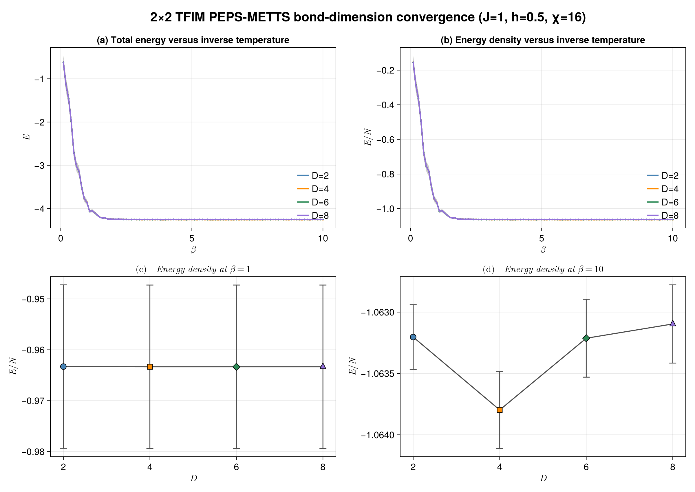
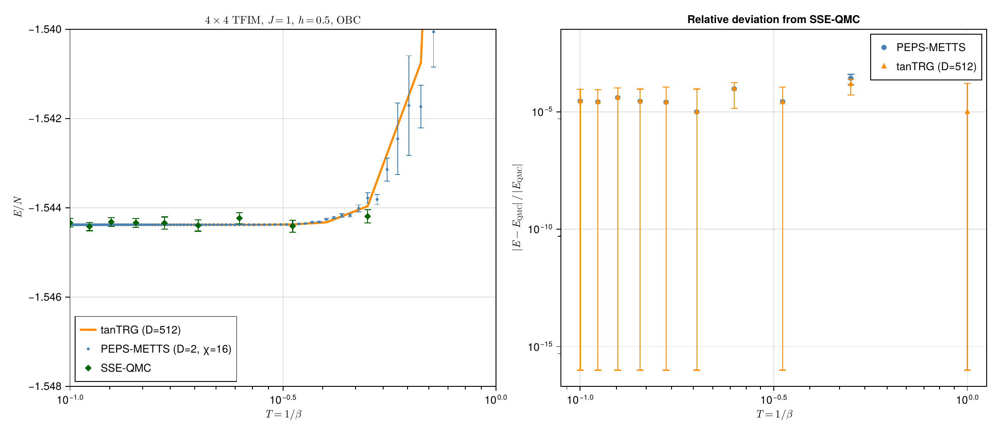
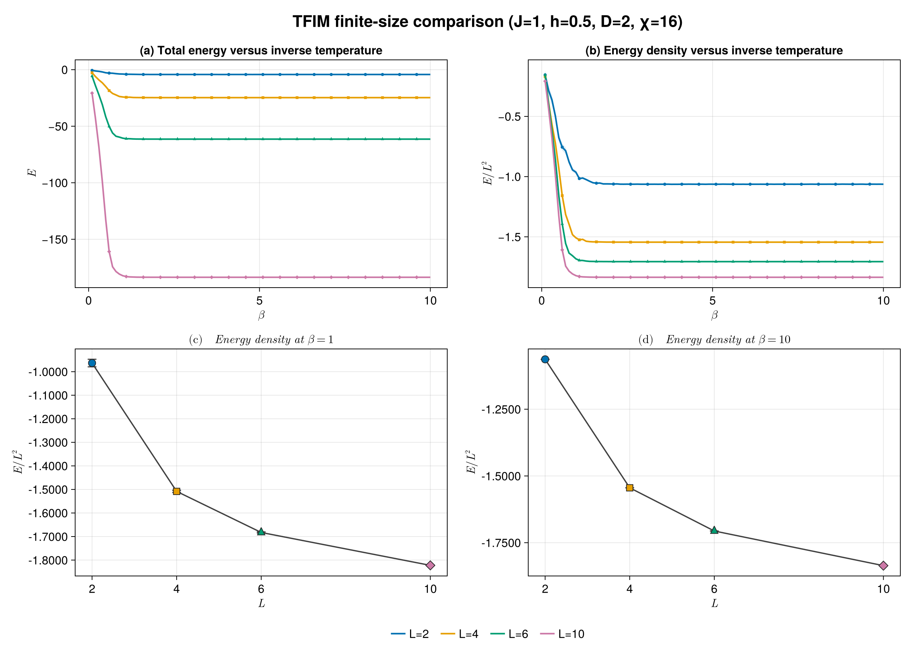
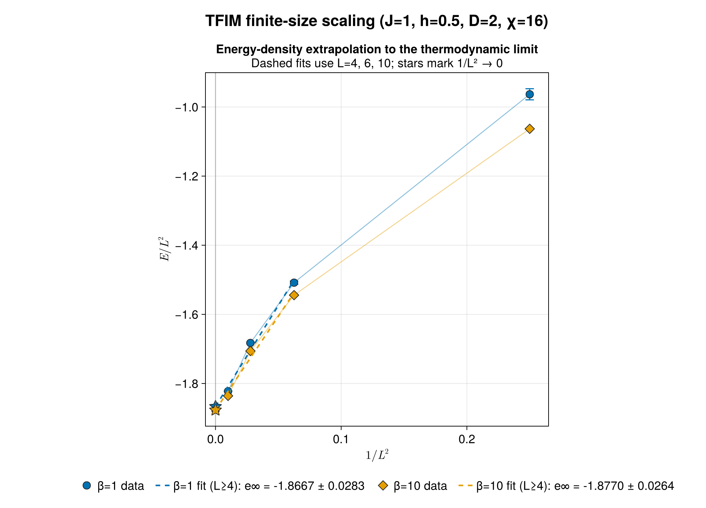

# 有限 PEPS-METTS：二维横场 Ising 模型计算结果

本文档汇总 `2×2`、`4×4`、`6×6` 和 `10×10` 开边界方格上的有限温计算结果。模型采用

```math
H=-J\sum_{\langle i,j\rangle}Z_iZ_j-h\sum_iX_i,
```

其中 `J=1`、`h=0.5`。两组计算均使用有限 PEPS、simple update、boundary-MPS 和 METTS，公共参数如下：

| 参数 | 数值 |
| --- | ---: |
| PEPS 虚拟维数 `D` | 基准计算取 2；`2×2` 另扫描 `D=2,4,6,8` |
| boundary-MPS 截断维数 `χ` | 16 |
| 虚时间步长 `τ` | 0.05 |
| β 扫描范围 | `0.1:0.1:10.0` |
| 每个 β 的 Markov 链长度 | 110 |
| 热化步 | 1–10 |
| 测量步 | 11–110，共 100 个样本 |
| collapse 基底 | 奇数步 `Z`，偶数步 `X` |
| thinning | 1 |

下面的表格列出用户指定的整数逆温度 `β=1,2,…,10`。完整的 100 个 β 点保存在对应 CSV 文件中。

## 2×2 结果

完整数据：[beta_scan_L2_J1_h0p5_D2_chi16.csv](beta_scan_L2_J1_h0p5_D2_chi16.csv)。由于系统只有 4 个自旋，本表同时给出完整 Hilbert 空间严格对角化得到的有限温能量。定义

```math
\Delta E=E_{\mathrm{METTS}}-E_{\mathrm{ED}}.
```

| β | METTS 总能量 `E` | ED 总能量 | `ΔE` | METTS 每格点能量 |
| ---: | ---: | ---: | ---: | ---: |
| 1 | -3.853214536 ± 6.42e-02 | -3.872417506 | +1.920e-02 | -0.963303634 |
| 2 | -4.243253937 ± 2.79e-03 | -4.242620258 | -6.337e-04 | -1.060813484 |
| 3 | -4.252667795 ± 1.15e-03 | -4.254306502 | +1.639e-03 | -1.063166949 |
| 4 | -4.254206905 ± 1.08e-03 | -4.255050923 | +8.440e-04 | -1.063551726 |
| 5 | -4.251770332 ± 1.09e-03 | -4.255382616 | +3.612e-03 | -1.062942583 |
| 6 | -4.254934199 ± 9.81e-04 | -4.255695398 | +7.612e-04 | -1.063733550 |
| 7 | -4.252548057 ± 1.07e-03 | -4.256006173 | +3.458e-03 | -1.063137014 |
| 8 | -4.252824405 ± 1.06e-03 | -4.256315548 | +3.491e-03 | -1.063206101 |
| 9 | -4.251935121 ± 1.08e-03 | -4.256623376 | +4.688e-03 | -1.062983780 |
| 10 | -4.252813929 ± 1.05e-03 | -4.256929479 | +4.116e-03 | -1.063203482 |

`2×2` 中 β 较大时约 `10⁻³–10⁻²` 的 METTS–ED 偏差已经大于部分统计误差，说明有限 `D` 和有限 Trotter 步长带来的系统误差不可忽略；增加样本数本身不能消除这类误差。

### `D` 收敛性：`D=2,4,6,8`

固定 `2×2`、`J=1`、`h=0.5`、boundary-MPS `χ=16` 和虚时间步长 `τ=0.05`，扫描

```math
D=2,4,6,8.
```

每个 `D` 都计算 `β=0.1:0.1:10.0` 共 100 个逆温度点。每个 β 使用长度为 110 的 Markov 链，第 1–10 步热化，第 11–110 步作为 100 个测量样本，`thinning=1`。新增完整数据：

- [beta_scan_L2_J1_h0p5_D4_chi16.csv](beta_scan_L2_J1_h0p5_D4_chi16.csv)
- [beta_scan_L2_J1_h0p5_D6_chi16.csv](beta_scan_L2_J1_h0p5_D6_chi16.csv)
- [beta_scan_L2_J1_h0p5_D8_chi16.csv](beta_scan_L2_J1_h0p5_D8_chi16.csv)

下表列出整数逆温度处的总能量，`±` 后为统计标准误差。由于 `2×2` 系统有 4 个格点，对应能量密度为 `E/4`。

| β | `D=2` 总能量 | `D=4` 总能量 | `D=6` 总能量 | `D=8` 总能量 | ED 总能量 |
| ---: | ---: | ---: | ---: | ---: | ---: |
| 1 | -3.853215 ± 6.42e-02 | -3.853369 ± 6.42e-02 | -3.853369 ± 6.42e-02 | -3.853369 ± 6.42e-02 | -3.872417506 |
| 2 | -4.243254 ± 2.79e-03 | -4.242989 ± 2.97e-03 | -4.242681 ± 2.97e-03 | -4.242660 ± 2.97e-03 | -4.242620258 |
| 3 | -4.252668 ± 1.15e-03 | -4.253869 ± 1.26e-03 | -4.253006 ± 1.27e-03 | -4.252905 ± 1.27e-03 | -4.254306502 |
| 4 | -4.254207 ± 1.08e-03 | -4.256285 ± 1.28e-03 | -4.254825 ± 1.27e-03 | -4.254628 ± 1.28e-03 | -4.255050923 |
| 5 | -4.251770 ± 1.09e-03 | -4.254098 ± 1.26e-03 | -4.252155 ± 1.30e-03 | -4.251842 ± 1.29e-03 | -4.255382616 |
| 6 | -4.254934 ± 9.81e-04 | -4.257639 ± 1.20e-03 | -4.255302 ± 1.18e-03 | -4.254917 ± 1.18e-03 | -4.255695398 |
| 7 | -4.252548 ± 1.07e-03 | -4.255907 ± 1.25e-03 | -4.253829 ± 1.24e-03 | -4.253377 ± 1.25e-03 | -4.256006173 |
| 8 | -4.252824 ± 1.06e-03 | -4.255188 ± 1.26e-03 | -4.253306 ± 1.26e-03 | -4.252483 ± 1.27e-03 | -4.256315548 |
| 9 | -4.251935 ± 1.08e-03 | -4.254482 ± 1.26e-03 | -4.252558 ± 1.28e-03 | -4.252821 ± 1.26e-03 | -4.256623376 |
| 10 | -4.252814 ± 1.05e-03 | -4.255190 ± 1.26e-03 | -4.252852 ± 1.27e-03 | -4.252387 ± 1.27e-03 | -4.256929479 |

两个代表性温度处的能量密度为：

| `D` | `β=1` 的 `E/N` | `β=10` 的 `E/N` |
| ---: | ---: | ---: |
| 2 | -0.963303634 | -1.063203482 |
| 4 | -0.963342250 | -1.063797616 |
| 6 | -0.963342250 | -1.063213124 |
| 8 | -0.963342251 | -1.063096709 |
| ED | -0.968104377 | -1.064232370 |

在 `β=1` 时，四组 `D` 的差异远小于约 `1.6×10⁻²` 的每格点统计误差，因此当前样本数下看不到显著的 `D` 依赖。在 `β=10` 时统计误差约为 `3×10⁻⁴`，结果对 `D` 的依赖清晰可见，但并不单调；本轮数据中 `D=4` 最接近 ED。由于 `χ=16` 固定不变，增大 `D` 会增加 boundary-MPS 收缩的压力，所以这里不能把非单调性简单解释为 PEPS 随 `D` 增大而变差。严格判断 `D` 收敛性需要同步增大 `χ`，并进一步扫描 `τ` 和独立 Markov 链。

`D=6` 扫描在固定 `χ=16` 时曾出现量级约 `3×10⁻⁷` 的负条件权重，这是 boundary-MPS 截断产生的数值误差。后续 `D=6,8` 扫描统一采用绝对/相对容差 `1×10⁻⁵`，将容差范围内的微小负权重截断为零；超过该容差的负权重仍会报错。因此 `D=6,8` 的结果应结合固定 `χ=16` 的限制理解。

四联图同时展示总能量和能量密度随 β 的变化，以及 `β=1,10` 时能量密度随 `D` 的变化：



矢量图版本：[energy_D_convergence_L2_J1_h0p5_chi16.pdf](energy_D_convergence_L2_J1_h0p5_chi16.pdf)。

## 4×4 结果

完整数据：[beta_scan_L4_J1_h0p5_D2_chi16.csv](beta_scan_L4_J1_h0p5_D2_chi16.csv)。

| β | METTS 总能量 `E` | METTS 每格点能量 `E/16` | `τ_int(E)` |
| ---: | ---: | ---: | ---: |
| 1 | -24.132636638 ± 7.39e-02 | -1.508289790 ± 4.62e-03 | 1.000 |
| 2 | -24.700495213 ± 1.86e-03 | -1.543780951 ± 1.16e-04 | 1.009 |
| 3 | -24.709923919 ± 2.78e-05 | -1.544370245 ± 1.74e-06 | 1.000 |
| 4 | -24.710083900 ± 3.44e-07 | -1.544380244 ± 2.15e-08 | 1.000 |
| 5 | -24.710085746 ± 1.17e-08 | -1.544380359 ± 7.34e-10 | 1.000 |
| 6 | -24.710085792 ± 1.75e-10 | -1.544380362 ± 1.09e-11 | 1.035 |
| 7 | -24.710085793 ± 1.24e-11 | -1.544380362 ± 7.76e-13 | 1.249 |
| 8 | -24.710085793 ± 1.27e-12 | -1.544380362 ± 7.91e-14 | 1.000 |
| 9 | -24.710085793 ± 2.35e-13 | -1.544380362 ± 1.47e-14 | 1.000 |
| 10 | -24.710085793 ± 3.18e-14 | -1.544380362 ± 1.99e-15 | 1.000 |

### `χ` 收敛性：`χ=16,32,64`

固定 `D=2`，并保持 Markov 链、随机种子和其他参数完全相同。新增完整数据：

- [beta_scan_L4_J1_h0p5_D2_chi32.csv](beta_scan_L4_J1_h0p5_D2_chi32.csv)
- [beta_scan_L4_J1_h0p5_D2_chi64.csv](beta_scan_L4_J1_h0p5_D2_chi64.csv)

| β | `χ=16` 总能量 | `χ=32` 总能量 | `χ=64` 总能量 |
| ---: | ---: | ---: | ---: |
| 1 | -24.132636638 ± 7.39e-02 | -24.132642835 ± 7.39e-02 | -24.132642668 ± 7.39e-02 |
| 2 | -24.700495213 ± 1.86e-03 | -24.700495211 ± 1.86e-03 | -24.700495195 ± 1.86e-03 |
| 3 | -24.709923919 ± 2.78e-05 | -24.709923919 ± 2.78e-05 | -24.709923919 ± 2.78e-05 |
| 4 | -24.710083900 ± 3.44e-07 | -24.710083900 ± 3.44e-07 | -24.710083900 ± 3.44e-07 |
| 5 | -24.710085746 ± 1.17e-08 | -24.710085746 ± 1.17e-08 | -24.710085746 ± 1.17e-08 |
| 6 | -24.710085792 ± 1.75e-10 | -24.710085792 ± 1.75e-10 | -24.710085792 ± 1.75e-10 |
| 7 | -24.710085793 ± 1.24e-11 | -24.710085793 ± 1.24e-11 | -24.710085793 ± 1.24e-11 |
| 8 | -24.710085793 ± 1.27e-12 | -24.710085793 ± 1.27e-12 | -24.710085793 ± 1.27e-12 |
| 9 | -24.710085793 ± 2.35e-13 | -24.710085793 ± 2.35e-13 | -24.710085793 ± 2.35e-13 |
| 10 | -24.710085793 ± 3.18e-14 | -24.710085793 ± 3.18e-14 | -24.710085793 ± 3.18e-14 |

在 β=1 时，`χ=32` 与 `χ=64` 的总能量只相差约 `1.7×10⁻⁷`；β≥2 时差异更小。对当前 `4×4, D=2` 计算，boundary-MPS 的能量已经在 `χ=32` 基本收敛，主要精度限制不再来自 `χ`。

`4×4` 系统包含 16 个自旋，Hilbert 空间维数为 `2^16=65,536`。本机内存为 16 GiB，而单个 Float64 稠密 Hamiltonian 已需要约 32 GiB，因此这里没有把近似方法误标为严格 ED，也没有列出 `4×4` ED 列。

### 与 tanTRG 和 SSE-QMC 的交叉比较

新增图将同一 `4×4`、OBC、`J=1`、`h=0.5` 问题下的三组结果放在一起比较：



矢量图版本：[compare_4x4_tfim.pdf](4*4/compare_4x4_tfim.pdf)。

绘图脚本为 [compare_4x4_tfim.jl](4*4/compare_4x4_tfim.jl)，原始 tanTRG 数据为 [OL4x4_J1.0_D512.jld2](4*4/OL4x4_J1.0_D512.jld2)，SSE 汇总数据为 [tfim-sse-xu-peps-metts-aggregate-2026-07-28.csv](4*4/notes/assets/qmc-xu-peps-metts-2026-07-28/tfim-sse-xu-peps-metts-aggregate-2026-07-28.csv)。

| 方法 | 数据与参数 | 结果形式 |
| --- | --- | --- |
| PEPS-METTS | `D=2`、boundary-MPS `χ=16`、每个 β 100 个样本 | 有限系统总能量除以 `N=16`，误差条为统计标准误差 |
| tanTRG | `D=512`（`OL4x4_J1.0_D512.jld2`） | 34 个 β 点的确定性总能量除以 16，并线性插值到 SSE 的 β 网格 |
| SSE-QMC | 20 个独立副本、每副本 20,000 热化和 262,144 次测量 | 10 个整数 β 点，误差条为副本合并 MCSE |

右图使用

```math
r=\frac{|E-E_{\rm SSE}|}{|E_{\rm SSE}|}
```

并在 SSE 网格 `β=1,2,…,10` 上比较。逐点结果如下；`z` 是把方法与 SSE 误差合并后的标准化偏差，tanTRG 的统计误差取零：

| β | `T=1/β` | SSE `E/N` ± SE | PEPS-METTS `E/N` ± SE | METTS−SSE | `r_METTS` | `z_METTS` | tanTRG `E/N` | `r_tanTRG` | `z_tanTRG` |
| ---: | ---: | ---: | ---: | ---: | ---: | ---: | ---: | ---: | ---: |
| 1 | 1.000 | -1.502856302 ± 2.24e-4 | -1.508289790 ± 4.62e-3 | -5.433e-3 | 3.62e-3 | -1.17 | -1.502870835 | 9.67e-6 | -0.06 |
| 2 | 0.500 | -1.544193012 ± 1.48e-4 | -1.543780951 ± 1.16e-4 | +4.120e-4 | 2.67e-4 | +2.19 | -1.543964448 | 1.48e-4 | +1.54 |
| 3 | 0.333 | -1.544412049 ± 1.33e-4 | -1.544370245 ± 1.74e-6 | +4.180e-5 | 2.71e-5 | +0.31 | -1.544373246 | 2.51e-5 | +0.29 |
| 4 | 0.250 | -1.544233629 ± 1.25e-4 | -1.544380244 ± 2.15e-8 | -1.466e-4 | 9.49e-5 | -1.17 | -1.544380239 | 9.49e-5 | -1.17 |
| 5 | 0.200 | -1.544395599 ± 1.28e-4 | -1.544380359 ± 7.34e-10 | +1.524e-5 | 9.87e-6 | +0.12 | -1.544380370 | 9.86e-6 | +0.12 |
| 6 | 0.167 | -1.544341014 ± 1.36e-4 | -1.544380362 ± 1.09e-11 | -3.935e-5 | 2.55e-5 | -0.29 | -1.544380372 | 2.55e-5 | -0.29 |
| 7 | 0.143 | -1.544337400 ± 9.97e-5 | -1.544380362 ± 7.76e-13 | -4.296e-5 | 2.78e-5 | -0.43 | -1.544380372 | 2.78e-5 | -0.43 |
| 8 | 0.125 | -1.544318530 ± 9.97e-5 | -1.544380362 ± 7.91e-14 | -6.183e-5 | 4.00e-5 | -0.62 | -1.544380372 | 4.01e-5 | -0.62 |
| 9 | 0.111 | -1.544420897 ± 9.41e-5 | -1.544380362 ± 1.47e-14 | +4.053e-5 | 2.63e-5 | +0.43 | -1.544380372 | 2.62e-5 | +0.43 |
| 10 | 0.100 | -1.544336550 ± 9.61e-5 | -1.544380362 ± 1.99e-15 | -4.381e-5 | 2.84e-5 | -0.46 | -1.544380372 | 2.84e-5 | -0.46 |

主要观察如下：

1. **三种方法的温度趋势一致。** 从 `β=2` 开始，能量密度迅速进入低温平台，tanTRG 和 PEPS-METTS 均趋于约 `-1.54438`；SSE-QMC 的点在该平台附近随机散布，散布尺度由约 `10^-4` 的 MCSE 决定。
2. **METTS 与 SSE 在当前统计分辨率内相容。** 十个 β 点的 `|z_METTS|` 最大为 `2.19`（β=2），其余均不超过 `1.17`，因此没有点超过 `3σ`。β=1 的总能量差为 `-8.69e-2`，但 METTS 统计误差约 `7.39e-2`，故仍只有 `1.17σ`；这并不意味着 β=1 的系统误差很小，只说明当前样本数的统计分辨率较粗。
3. **tanTRG 与 SSE 的一致性同样很好。** `r_tanTRG` 在 `β=1` 仅为 `9.67×10^-6`，`β≥3` 为 `1×10^-5–1×10^-4`；最大标准化偏差为 β=2 的 `1.54σ`。低温区 tanTRG 与 METTS 的曲线几乎重合，说明这里的主要差别不是两种收缩方法之间的可见偏差，而是 SSE 统计噪声和张量近似的共同系统误差。
4. **右图的误差条不能解读为方法误差。** 误差条按 `sqrt(SE_method^2+SE_SSE^2)/|E_SSE|` 绘制；高 β 时 METTS 的样本几乎相同，所以其 SE 降至 `10^-10–10^-15`，但 SSE 的 `~10^-4` 相对误差仍是主导。它们只表示统计误差，不包含有限 `D`、有限 `χ`、Trotter 步长或 simple-update 误差。
5. **左图是低温放大图而非全温区图。** 其坐标范围为 `T∈[0.1,1]`（对数轴）和 `E/N∈[-1.548,-1.540]`，因此 `β=1` 的高温能量约 `-1.50` 落在图框之外；判断 β=1 应以右图和上表为准，而不能把左图的可见范围当作完整温度扫描。

综上，在这组 `4×4` 基准上，PEPS-METTS、tanTRG 和 SSE-QMC 给出一致的热力学趋势；在现有 SSE 精度下，PEPS-METTS 没有显示出超过 `3σ` 的统计不一致。要区分 `D=2` PEPS 的系统误差与 SSE 噪声，下一步应提高 SSE 统计精度，并同步扫描 PEPS 的 `D`、`χ` 和 `τ`，而不是继续把高 β 极小的 METTS 样本标准误差当作总误差。

## 6×6 结果

完整数据：[beta_scan_L6_J1_h0p5_D2_chi16.csv](beta_scan_L6_J1_h0p5_D2_chi16.csv)。本次计算使用 `J=1`、`h=0.5`、`D=2`、boundary-MPS `χ=16` 和 `τ=0.05`。每个 β 的 Markov 链严格包含 110 步，第 1–10 步作为热化，第 11–110 步的 100 个样本用于测量，`thinning=1`。

| β | METTS 总能量 `E` | METTS 每格点能量 `E/36` | `τ_int(E)` | `N_eff(E)` |
| ---: | ---: | ---: | ---: | ---: |
| 1 | -60.577198319 ± 8.88e-02 | -1.682699953 ± 2.47e-03 | 1.596 | 62.65 |
| 2 | -61.412128641 ± 1.41e-03 | -1.705892462 ± 3.92e-05 | 1.000 | 100.00 |
| 3 | -61.419649271 ± 3.46e-05 | -1.706101369 ± 9.61e-07 | 1.006 | 99.45 |
| 4 | -61.419794953 ± 3.20e-07 | -1.706105415 ± 8.89e-09 | 1.000 | 100.00 |
| 5 | -61.419796372 ± 6.13e-09 | -1.706105455 ± 1.70e-10 | 1.000 | 100.00 |
| 6 | -61.419796398 ± 2.97e-10 | -1.706105456 ± 8.25e-12 | 1.000 | 100.00 |
| 7 | -61.419796399 ± 1.63e-11 | -1.706105456 ± 4.53e-13 | 1.000 | 100.00 |
| 8 | -61.419796399 ± 1.29e-12 | -1.706105456 ± 3.57e-14 | 1.546 | 64.68 |
| 9 | -61.419796399 ± 1.93e-13 | -1.706105456 ± 5.36e-15 | 1.004 | 99.63 |
| 10 | -61.419796399 ± 2.75e-14 | -1.706105456 ± 7.62e-16 | 1.071 | 93.37 |

能量密度从 `β=1` 的 `-1.682699953` 下降到 `β=2` 的 `-1.705892462`，随后快速进入低温平台。`β=2→3` 的每格点能量变化约为 `-2.09×10⁻⁴`，`β=3→4` 进一步缩小到约 `-4.05×10⁻⁶`；从 `β≈5` 起，在当前输出精度下稳定于 `E/N≈-1.706105456`。这与后文有限尺寸比较中观察到的趋势一致：系统尺寸增大时开边界占比下降，低温能量密度继续向无限系统结果靠近。

能量自相关时间总体接近 1。`β=1` 的 `τ_int≈1.596`，对应有效样本数约 62.7，是整数 β 点中统计波动最明显的温度；`β=8` 也出现 `τ_int≈1.546`，但该处样本能量已经几乎完全落在低温平台，因此绝对统计误差仍非常小。其余整数 β 点的有效样本数约为 93–100。

`6×6` boundary-MPS 收缩比 `4×4` 更容易遇到病态矩阵和极小条件权重。本轮扫描将边界压缩改用更稳健的 QR 型 SVD，并在条件概率归一化时把绝对值不超过 `10⁻¹⁴`、或处于相对容差范围内的负权重视为浮点和截断噪声并截断为零；显著负权重仍会报错。扫描完成后 CSV 含表头共 101 行，覆盖 `β=0.1:0.1:10.0` 的全部 100 个点，相关回归测试全部通过。

需要再次强调，高 β 区域 `10⁻¹⁰–10⁻¹⁴` 量级的标准误差只反映这 100 个 METTS 样本之间的统计波动，并不包含有限 `D`、有限 `χ`、Trotter 离散和 simple-update 近似带来的系统误差，不能解释为总能量已经达到同等精度。

## 10×10 结果

完整数据：[beta_scan_L10_J1_h0p5_D2_chi16.csv](beta_scan_L10_J1_h0p5_D2_chi16.csv)。本次计算使用 `J=1`、`h=0.5`、`D=2`、boundary-MPS `χ=16` 和 `τ=0.05`。每个 β 的 Markov 链包含 110 步，第 1–10 步热化，第 11–110 步的 100 个样本用于测量，`thinning=1`。不同 β 使用种子 `20260728+i`，其中 `i` 是 β 在 `0.1:0.1:10.0` 网格中的序号。

| β | METTS 总能量 `E` | METTS 每格点能量 `E/100` | `τ_int(E)` | `N_eff(E)` |
| ---: | ---: | ---: | ---: | ---: |
| 1 | -182.241194083 ± 1.20e-01 | -1.822411941 ± 1.20e-03 | 1.096 | 91.20 |
| 2 | -183.581705404 ± 2.12e-03 | -1.835817054 ± 2.12e-05 | 1.000 | 100.00 |
| 3 | -183.590085894 ± 2.68e-05 | -1.835900859 ± 2.68e-07 | 1.000 | 100.00 |
| 4 | -183.590197217 ± 1.18e-06 | -1.835901972 ± 1.18e-08 | 1.015 | 98.54 |
| 5 | -183.590200233 ± 1.46e-08 | -1.835902002 ± 1.46e-10 | 1.000 | 100.00 |
| 6 | -183.590200292 ± 1.34e-10 | -1.835902003 ± 1.34e-12 | 1.000 | 100.00 |
| 7 | -183.590200293 ± 1.17e-11 | -1.835902003 ± 1.17e-13 | 1.000 | 100.00 |
| 8 | -183.590200293 ± 1.12e-12 | -1.835902003 ± 1.12e-14 | 1.277 | 78.28 |
| 9 | -183.590200293 ± 1.82e-13 | -1.835902003 ± 1.82e-15 | 1.536 | 65.09 |
| 10 | -183.590200293 ± 3.46e-14 | -1.835902003 ± 3.46e-16 | 1.000 | 100.00 |

能量密度从 `β=1` 的 `-1.822411941` 降至 `β=2` 的 `-1.835817054`，变化约为 `-1.34×10⁻²`；`β=2→3` 的变化已缩小到 `-8.38×10⁻⁵`，`β=3→4` 进一步缩小到 `-1.11×10⁻⁶`。从 `β≈5` 起，按表中九位小数已稳定在低温平台 `E/N≈-1.835902003`。这说明在本组参数下，主要温度依赖集中在 `β<3`，而不是说明张量网络的系统误差已经消失。

整数 β 点的能量自相关时间均在 `1.000–1.536` 之间，对应有效样本数约 `65–100`；其中 `β=9` 的 `τ_int≈1.536` 最大。若检查全部 100 个 β 点，最大值为 `τ_int≈2.806`（`β=7.4`，`N_eff≈35.6`），因此 Markov 链存在局部相关增强，但未出现有效样本数降至个位数的情况。全扫描最大的每格点统计标准误差出现在 `β=0.5`，约为 `1.35×10⁻²`；进入低温平台后，样本间能量差异快速减小，统计误差也随之变得极小。

CSV 含表头共 101 行，覆盖 `β=0.1:0.1:10.0` 的全部 100 个点。高 β 区域最低达到 `10⁻¹⁶` 量级的每格点标准误差只描述当前 METTS 样本之间的离散程度，不能作为算法总误差。对 `10×10` 结果的可靠性判断仍需考虑 `D=2`、`χ=16`、`τ=0.05`、simple update 和开边界有限尺寸效应；后两节分别通过尺寸外推和无限 iPEPO 对比进一步分析这些影响。

## 有限尺寸变化与热力学极限外推

固定 `J=1`、`h=0.5`、`D=2`、boundary-MPS `χ=16` 和 `τ=0.05`，比较四个开边界系统尺寸

```math
L=2,4,6,10.
```

每个尺寸均扫描 `β=0.1:0.1:10.0`；每个 β 使用长度为 110 的 Markov 链，第 1–10 步热化，第 11–110 步作为 100 个测量样本。完整数据为：

- [beta_scan_L2_J1_h0p5_D2_chi16.csv](beta_scan_L2_J1_h0p5_D2_chi16.csv)
- [beta_scan_L4_J1_h0p5_D2_chi16.csv](beta_scan_L4_J1_h0p5_D2_chi16.csv)
- [beta_scan_L6_J1_h0p5_D2_chi16.csv](beta_scan_L6_J1_h0p5_D2_chi16.csv)
- [beta_scan_L10_J1_h0p5_D2_chi16.csv](beta_scan_L10_J1_h0p5_D2_chi16.csv)

总能量的绝对值随面积 `L²` 增长，而能量密度随尺寸增大逐步下降。两个代表性逆温度处的结果为：

| `L` | `1/L²` | `β=1` 的 `E/L²` | `β=10` 的 `E/L²` |
| ---: | ---: | ---: | ---: |
| 2 | 0.250000 | -0.963303634 ± 1.61e-02 | -1.063203482 ± 2.64e-04 |
| 4 | 0.062500 | -1.508289790 ± 4.62e-03 | -1.544380362 ± 1.99e-15 |
| 6 | 0.027778 | -1.682699953 ± 2.47e-03 | -1.706105456 ± 7.62e-16 |
| 10 | 0.010000 | -1.822411941 ± 1.20e-03 | -1.835902003 ± 3.46e-16 |

四联图展示四个尺寸的总能量和能量密度随 β 的变化，以及 `β=1,10` 时能量密度随 `L` 的变化：



矢量图版本：[energy_size_comparison_J1_h0p5_D2_chi16.pdf](energy_size_comparison_J1_h0p5_D2_chi16.pdf)。

按照指定的有限尺寸形式

```math
e(L)=e_\infty+\frac{a}{L^2},
```

使用较大的三个尺寸 `L=4,6,10` 做等权线性拟合。`L=2` 仍显示在图中，但不参与拟合，因为最小尺寸通常不在渐近标度区。得到：

| β | `1/L² → 0` 的 `e∞` | 拟合截距标准误差 | `R²` |
| ---: | ---: | ---: | ---: |
| 1 | -1.866716092 | 2.83e-02 | 0.985541 |
| 10 | -1.876954943 | 2.64e-02 | 0.985412 |

对应的拟合图中，实线连接全部尺寸的数据点，虚线只表示 `L=4,6,10` 的拟合，星形点为 `1/L²→0` 的截距：



矢量图版本：[energy_density_thermodynamic_extrapolation.pdf](energy_density_thermodynamic_extrapolation.pdf)。

需要强调的是，这些系统采用开边界。二维 `L×L` 方格的边界格点数与 `L` 成正比，而体积与 `L²` 成正比，因此能量密度的主导边界修正通常是 `1/L`，不是 `1/L²`。用相同的 `L=4,6,10` 数据拟合

```math
e(L)=e_\infty+\frac{b}{L}
```

可得：

| β | `1/L → 0` 的 `e∞` | 拟合截距标准误差 | `R²` |
| ---: | ---: | ---: | ---: |
| 1 | -2.031784009 | 1.43e-04 | 0.99999986 |
| 10 | -2.030153042 | 3.24e-04 | 0.99999917 |

`1/L` 拟合的残差和截距标准误差都远小于 `1/L²` 拟合，并且 `β=10` 的外推值与后文无限 iPEPO 的低温能量 `-2.031285542` 很接近。因此，对当前开边界数据，`1/L²` 图适合直观展示用户指定的变量关系，但 `1/L` 外推更符合边界/体积标度，也更适合作为热力学极限估计。上述拟合误差只来自三个尺寸点的线性回归残差，不包含有限 `D`、有限 `χ`、Trotter 步长和 simple update 等系统误差。

## `10×10` PEPS+METTS 与 iPEPO 对比

本节比较有限 `10×10` PEPS+METTS 与无限系统 iPEPO 在二维横场 Ising 模型 `J=1, h=0.5` 下得到的能量结果。两组数据分别为：

- PEPS+METTS：[beta_scan_L10_J1_h0p5_D2_chi16.csv](beta_scan_L10_J1_h0p5_D2_chi16.csv)
- iPEPO：[tfim_J1_h05_beta_1_10_D8_chi16.csv](../PEPSKit_iPEPO+simple_update+CTMRG/results/tfim_J1_h05_beta_1_10_D8_chi16.csv)

### 参数异同

| 项目 | PEPS+METTS | iPEPO |
| --- | --- | --- |
| 系统 | 有限 `10×10` 方格 | 无限二维晶格 |
| 边界条件 | 开边界 | 平移不变无限系统 |
| 模型参数 | `J=1, h=0.5` | `J=1, h=0.5` |
| 虚拟维数 | `D=2` | `D=8` |
| 环境/收缩维数 | boundary-MPS `χ=16` | CTMRG `χ=16` |
| 虚时间步长 | `τ=0.05` | `delta_tau=0.05` |
| Trotter 阶数 | 未在 CSV 中单独记录 | `trotter_order=2` |
| β 范围 | `0.1:0.1:10.0` | `1:1:10` |
| 采样/确定性 | METTS Markov 链，每个 β 100 个测量样本 | iPEPO simple update 后 CTMRG 确定性收缩 |
| unit cell | 有限 `10×10` 张量网络 | `2×2` |
| 主要误差来源 | 有限 `D`、有限 `χ`、Trotter 误差、METTS 统计误差、开边界有限尺寸效应 | 有限 `D`、有限 `χ`、Trotter 误差、CTMRG 收敛误差、unit-cell 限制 |

由于两组数据的系统尺寸和边界条件不同，原始每格点能量不能直接作为算法误差逐项比较。尤其是 `10×10` 开边界方格只有

```math
2L(L-1)=180
```

条最近邻键，键数密度为 `180/100=1.8`；无限二维方格晶格的最近邻键数密度为 `2`。因此有限开边界系统相对于无限系统每格点少约 `0.2` 条键，这会自然带来约 `0.2` 量级的每格点能量差。

### 共同 β 点的能量比较

下表直接比较两组在 `β=1,2,...,10` 的每格点能量。PEPS+METTS 列使用 `energy_per_site`；iPEPO 的 `energy` 已是无限系统每格点能量。

| β | PEPS+METTS `E/N` | iPEPO `E/N` | 原始差值 |
| ---: | ---: | ---: | ---: |
| 1 | -1.822411941 | -2.028296030 | +0.205884089 |
| 2 | -1.835817054 | -2.031270215 | +0.195453161 |
| 3 | -1.835900859 | -2.031285542 | +0.195384683 |
| 4 | -1.835901972 | -2.031285542 | +0.195383570 |
| 5 | -1.835902002 | -2.031285542 | +0.195383540 |
| 6 | -1.835902003 | -2.031285542 | +0.195383539 |
| 7 | -1.835902003 | -2.031285542 | +0.195383539 |
| 8 | -1.835902003 | -2.031285542 | +0.195383539 |
| 9 | -1.835902003 | -2.031285542 | +0.195383539 |
| 10 | -1.835902003 | -2.031285542 | +0.195383539 |

直接比较时，低温区 `β≥3` 的原始差值稳定在约 `0.19538`。这个数值非常接近开边界 `10×10` 系统相对于无限晶格少键所预期的 `0.2` 量级修正。因此原始能量差主要反映有限尺寸和边界条件差异，而不是两种方法在相同物理设置下给出互相矛盾的结果。

如果粗略地把 PEPS+METTS 的开边界少键效应按每格点 `0.2` 的量级补偿，则低温 PEPS+METTS 能量约为

```math
-1.835902003 - 0.2 \simeq -2.035902003,
```

与 iPEPO 低温极限

```math
-2.031285542
```

相差约 `4.6×10⁻³`，相对差异约 `0.23%`。这个剩余差异可能来自有限 `D`、有限 `χ`、simple update 近似、Trotter 误差以及有限系统边界修正并非严格等于常数 `0.2`。

### 收敛和可靠性记录

PEPS+METTS 在 `β≥2` 后每格点能量已经非常接近低温平台，低温极限约为 `-1.835902003`。同时统计标准误差在大 β 区域下降到非常小，但这只反映 100 个 METTS 测量样本的统计波动，不包含有限 `D`、有限 `χ`、Trotter 步长和 simple update 带来的系统误差。

iPEPO 在 `β=1,2` 两点的 CSV 中记录 `ctmrg_converged=false`，但对应 `ctmrg_error` 已在 `10⁻⁹` 量级；从 `β=3` 起 `ctmrg_converged=true`，低温能量稳定为 `-2.031285542`。因此 iPEPO 的低温区结果比 `β=1,2` 更适合作为收敛参考。

综合来看，两组结果在趋势和低温极限上是相容的。若要把两种方法的算法误差做严格定量比较，需要进一步统一系统设置，例如使用周期边界或 bulk energy 估计的有限 PEPS+METTS、使用相同的虚拟维数 `D`、做 `χ` 和 `τ` 收敛扫描，并增加 METTS 独立样本数检查自相关。

## 误差解释

表中的 `±` 是 100 个测量样本经过自相关分析和 blocking 后得到的统计标准误差。它不包含以下系统误差：

1. 有限 PEPS 虚拟维数 `D`；
2. 有限 boundary-MPS 截断维数 `χ`；
3. Trotter 离散步长 `τ=0.05`；
4. simple update 对环境的近似。

特别是 `4×4` 的高 β 结果中，样本能量几乎收敛到同一数值，因此统计误差会非常小；这并不表示总误差也达到了 `10⁻¹⁴`。判断实际精度还需要进行 `D`、`χ` 和 `τ` 收敛性扫描。

## 复现程序

- `2×2` 扫描及 ED 对照：[run_beta_scan_L2.jl](run_beta_scan_L2.jl)
- `2×2` 的 `D=4,6,8` 扫描：[run_beta_scan_L2_D.jl](run_beta_scan_L2_D.jl)
- `2×2` 的 `D` 收敛图：[plot_D_convergence_L2.jl](plot_D_convergence_L2.jl)
- `4×4` 扫描：[run_beta_scan_L4.jl](run_beta_scan_L4.jl)
- `4×4` 的 `χ=32,64` 扫描：[run_beta_scan_L4_chi.jl](run_beta_scan_L4_chi.jl)
- `6×6` 扫描：[run_beta_scan_L6.jl](run_beta_scan_L6.jl)
- `10×10` 扫描：[run_beta_scan_L10.jl](run_beta_scan_L10.jl)
- 四尺寸比较图：[plot_size_convergence.jl](plot_size_convergence.jl)
- `1/L²` 热力学极限外推图：[plot_thermodynamic_extrapolation.jl](plot_thermodynamic_extrapolation.jl)

运行命令：

```bash
julia --project=PEPS_TensorKit-main --threads=4 PEPS_TensorKit-main/FinitePEPS_METTS_Ising/run_beta_scan_L2.jl
julia --project=PEPS_TensorKit-main --threads=4 PEPS_TensorKit-main/FinitePEPS_METTS_Ising/run_beta_scan_L2_D.jl 4 6 8
julia --project=PEPS_TensorKit-main PEPS_TensorKit-main/FinitePEPS_METTS_Ising/plot_D_convergence_L2.jl
julia --project=PEPS_TensorKit-main --threads=4 PEPS_TensorKit-main/FinitePEPS_METTS_Ising/run_beta_scan_L4.jl
julia --project=PEPS_TensorKit-main --threads=4 PEPS_TensorKit-main/FinitePEPS_METTS_Ising/run_beta_scan_L4_chi.jl 32 64
julia --project=PEPS_TensorKit-main --threads=4 PEPS_TensorKit-main/FinitePEPS_METTS_Ising/run_beta_scan_L6.jl
julia --project=PEPS_TensorKit-main --threads=4 PEPS_TensorKit-main/FinitePEPS_METTS_Ising/run_beta_scan_L10.jl
julia --project=PEPS_TensorKit-main PEPS_TensorKit-main/FinitePEPS_METTS_Ising/plot_size_convergence.jl
julia --project=PEPS_TensorKit-main PEPS_TensorKit-main/FinitePEPS_METTS_Ising/plot_thermodynamic_extrapolation.jl
```
