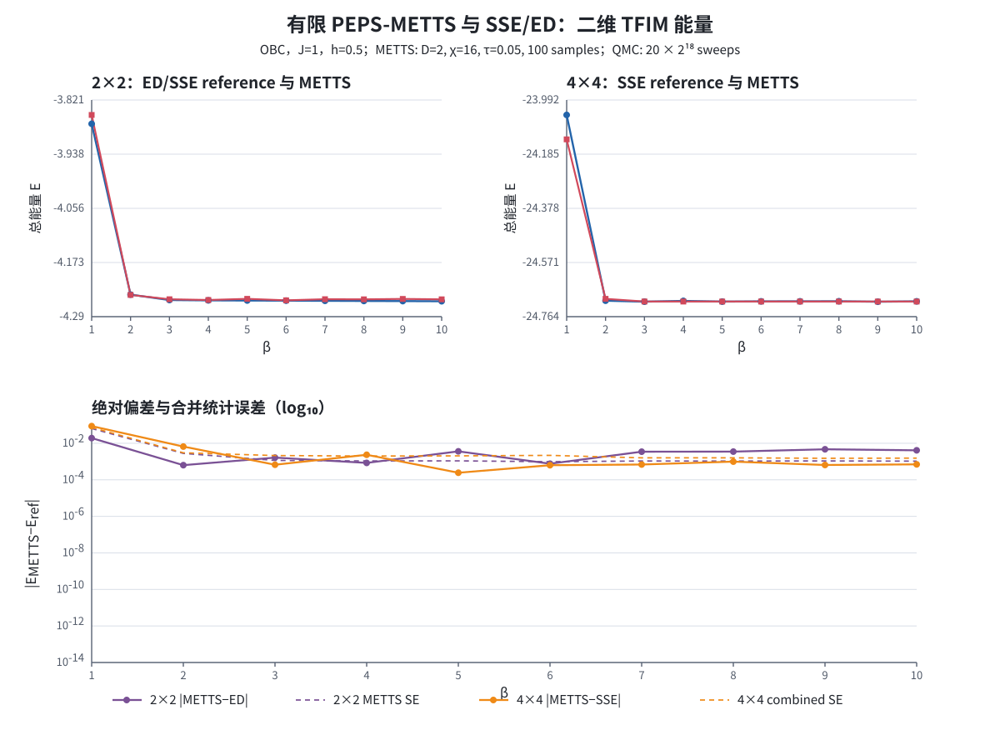

# 有限 PEPS-METTS 的 ED/SSE-QMC 详细检查

日期：2026-07-28（Asia/Shanghai）

证据阶段：`PRELEARNING_BASELINE`

检查对象：许传书在 ITP GitLab 提交的
[`PEPS+METTS/PEPS+METTS_RESULTS.md`](../PEPS+METTS/PEPS+METTS_RESULTS.md)

## 1. 执行摘要

本报告回答三个相互独立的问题：

1. 许传书的表格与我们使用的是不是同一个 Hamiltonian、边界和归一化？
2. 本地 SSE-QMC 是否先通过了可证伪的小系统精确检查？
3. 在参数完全匹配后，有限 PEPS-METTS 能量与 ED/QMC 相差多少？

检查结果：

| 检查项 | 结果 | 含义 |
|---|:---:|---|
| Hamiltonian、Pauli 约定、OBC、总能量归一化 | PASS | 两边比较的是同一个有限系统 |
| 许传书表中的 \(2\times2\) ED 数值 | PASS | 与独立 dense ED 在表格精度内一致 |
| SSE-QMC 对 \(2\times2\) dense ED | PASS | 10 个温度点全部在 \(3\) 个最终 QMC 标准误差内 |
| QMC 跨副本误差校准与 cutoff | PASS | 20 个主网格点全部通过 |
| 初始 QMC 相对 MCSE 门槛 | 18/20 PASS | \(2\times2,\beta=1,2\) 两点只因预注册精度不足而失败 |
| 单独预注册的精度扩展 | PASS | 两点在不放宽门槛的情况下通过 |
| \(2\times2\) METTS 对 ED 的统计相容性 | 部分失败 | \(\beta=5,7,8,9,10\) 超过所报 METTS 统计误差的 \(3\sigma\) |
| \(4\times4\) METTS 对 SSE 的统计相容性 | 当前精度内相容 | 最大标准化偏差为 \(\beta=2\) 的 \(2.19\sigma\) |
| 高 \(\beta\) 的 \(10^{-10}\)–\(10^{-14}\) 总精度 | 未得到支持 | 这些只是 METTS 样本统计误差，不包含张量系统误差 |

最重要的结论是：

> \(2\times2\) ED 已经直接显示若干低温点存在有限 \(D/\chi/\tau\) 或
> simple-update 系统误差；\(4\times4\) 能量与 QMC 在当前约
> \(10^{-3}\) 的总能量分辨率内相容，但不能据此声称机器精度。



## 2. 许传书计算了什么

表格采用二维开放边界横场 Ising 模型

\[
H=-J\sum_{\langle i,j\rangle}Z_iZ_j-h\sum_iX_i,
\qquad J=1,\quad h=0.5,
\]

其中 \(Z,X\) 是本征值为 \(\pm1\) 的 Pauli 矩阵。

计算方法和参数：

| 项目 | 数值 |
|---|---:|
| 晶格 | \(2\times2\)、\(4\times4\)，OBC |
| 方法 | finite PEPS + simple update + boundary-MPS + METTS |
| PEPS 虚拟维数 | \(D=2\) |
| boundary-MPS 截断维数 | \(\chi=16\) |
| Trotter 步长 | \(\tau=0.05\) |
| 文档声称的完整温度网格 | \(\beta=0.1:0.1:10\) |
| 本报告可见并检查的温度点 | 整数 \(\beta=1,\ldots,10\) |
| 热化 | 10 个 METTS 步 |
| 测量 | 100 个 METTS 样本 |
| collapse | 奇数步 \(Z\) 基、偶数步 \(X\) 基 |
| 输出 | 总能量 \(E\) 及所报统计标准误差 |

`2×2` 表同时给出 dense ED；`4×4` 表没有 ED 或 QMC。

来源固定为：

- GitLab commit：
  `f5f002e271600975e939bf9415e5b8d0559d512f`；
- 结果文件 SHA-256：
  `0a21bd9620ea326eb5164ce94873c879e07f1eb71aa5773be4ac8857f6afbc53`。

该 commit 没有包含结果文档引用的原始 METTS CSV、运行脚本或
`FinitePEPSMETTS.jl` 等实现文件。因此本报告检查的是文档中的舍入后表格，
不是对 PEPS-METTS 程序的独立复跑。

## 3. QMC 计算了什么

QMC 使用同一个 Hamiltonian、同一个 OBC、同一个 \(J,h,\beta\) 和相同的
总能量定义。

方法是 TFIM 专用 fixed-length SSE：

- Sandvik 型 diagonal insertion/removal；
- TFIM all-cluster quantum update；
- \(hNI\) 常数计数解析消去后的 constant-deflated 能量估计量；
- 每个独立副本使用自己的确定性随机种子；
- 每个副本用 jackknife bin 估计链内 MCSE；
- 多副本最终误差取链内合并误差与副本间误差的较大者。

主网格的每个尺寸和温度点使用：

| 参数 | 数值 |
|---|---:|
| 独立副本 | 20 |
| 每副本热化 | 20,000 sweeps |
| 每副本测量 | \(2^{18}=262,144\) sweeps |
| jackknife bin | 4,096 sweeps |
| configuration validation | 每 65,536 测量 sweeps |
| 初始主网格总副本数 | \(2\times10\times20=400\) |

端点 pilot 在 \(4\times4\) 上测得能量 influence series 的
\(\tau_{\mathrm{int}}\)：

- \(\beta=1\)：约 \(0.5\) sweeps；
- \(\beta=10\)：约 \(1.234\) sweeps。

因此 4,096-sweep bin 远长于 pilot 中观察到的自相关尺度。Pilot 不进入正式均值。

## 4. 比较设计

三个比较不能混为一谈：

| 系统 | 比较 | 用途 |
|---|---|---|
| \(2\times2\) | QMC 对 dense ED | 验证 QMC 实现、误差条和模型约定 |
| \(2\times2\) | METTS 对 dense ED | 直接测量张量计算与精确热力学的差异 |
| \(4\times4\) | METTS 对 SSE-QMC | 没有可用 ED 时，以 QMC 作数值参考 |

定义

\[
\Delta E=E_{\mathrm{METTS}}-E_{\mathrm{reference}}.
\]

在 \(2\times2\) 中 reference 是 ED，ED 没有 MC 统计误差；标准化偏差是

\[
z_{\mathrm{stat}}=\frac{\Delta E}{\mathrm{SE}_{\mathrm{METTS}}}.
\]

在 \(4\times4\) 中 reference 是 SSE，使用

\[
z_{\mathrm{stat}}
=
\frac{E_{\mathrm{METTS}}-E_{\mathrm{SSE}}}
{\sqrt{\mathrm{SE}_{\mathrm{METTS}}^2+\mathrm{SE}_{\mathrm{SSE}}^2}}.
\]

这里的 \(z_{\mathrm{stat}}\) 只检查两边所报统计误差是否相容。它没有把有限
\(D\)、有限 \(\chi\)、Trotter 或 simple-update 偏差变成误差条。

## 5. \(2\times2\)：METTS 对 dense ED

独立 dense ED 与许传书表中打印的 ED 数值在显示精度内一致。

| \(\beta\) | ED 总能量 | METTS 总能量 | METTS 所报 SE | METTS−ED | \(z_{\mathrm{stat}}\) |
|---:|---:|---:|---:|---:|---:|
| 1 | -3.872417506 | -3.853214536 | 0.064200 | +0.019202970 | +0.30 |
| 2 | -4.242620258 | -4.243253937 | 0.002790 | -0.000633679 | -0.23 |
| 3 | -4.254306502 | -4.252667795 | 0.001150 | +0.001638707 | +1.42 |
| 4 | -4.255050923 | -4.254206905 | 0.001080 | +0.000844018 | +0.78 |
| 5 | -4.255382616 | -4.251770332 | 0.001090 | +0.003612284 | +3.31 |
| 6 | -4.255695398 | -4.254934199 | 0.000981 | +0.000761199 | +0.78 |
| 7 | -4.256006173 | -4.252548057 | 0.001070 | +0.003458116 | +3.23 |
| 8 | -4.256315548 | -4.252824405 | 0.001060 | +0.003491143 | +3.29 |
| 9 | -4.256623376 | -4.251935121 | 0.001080 | +0.004688255 | +4.34 |
| 10 | -4.256929479 | -4.252813929 | 0.001050 | +0.004115550 | +3.92 |

解释：

- \(\beta=5,7,8,9,10\) 的偏差超过三个所报 METTS 统计标准误差；
- 偏差约为总能量 \(3.5\times10^{-3}\) 到 \(4.7\times10^{-3}\)；
- 继续增加 METTS 样本只能缩小统计误差，不能自动消除这些系统偏差；
- 下一步应做 \(D,\tau,\chi\) 收敛，而不是把 100 个样本的 SE 当作总误差。

## 6. \(4\times4\)：METTS 对 SSE-QMC

| \(\beta\) | SSE 总能量 | QMC SE | METTS 总能量 | METTS 所报 SE | METTS−SSE | 合并 \(z_{\mathrm{stat}}\) |
|---:|---:|---:|---:|---:|---:|---:|
| 1 | -24.04570084 | 0.00357814 | -24.13263664 | 0.073900 | -0.08693580 | -1.18 |
| 2 | -24.70708818 | 0.00236863 | -24.70049521 | 0.001860 | +0.00659297 | +2.19 |
| 3 | -24.71059278 | 0.00212842 | -24.70992392 | \(2.78\times10^{-5}\) | +0.00066886 | +0.31 |
| 4 | -24.70773807 | 0.00199866 | -24.71008390 | \(3.44\times10^{-7}\) | -0.00234583 | -1.17 |
| 5 | -24.71032959 | 0.00204627 | -24.71008575 | \(1.17\times10^{-8}\) | +0.00024384 | +0.12 |
| 6 | -24.70945622 | 0.00217375 | -24.71008579 | \(1.75\times10^{-10}\) | -0.00062957 | -0.29 |
| 7 | -24.70939841 | 0.00159544 | -24.71008579 | \(1.24\times10^{-11}\) | -0.00068739 | -0.43 |
| 8 | -24.70909648 | 0.00159534 | -24.71008579 | \(1.27\times10^{-12}\) | -0.00098931 | -0.62 |
| 9 | -24.71073435 | 0.00150569 | -24.71008579 | \(2.35\times10^{-13}\) | +0.00064855 | +0.43 |
| 10 | -24.70938480 | 0.00153832 | -24.71008579 | \(3.18\times10^{-14}\) | -0.00070099 | -0.46 |

在当前合并统计精度下：

- 10 个点都没有超过 \(3\sigma\)；
- 最大标准化偏差是 \(\beta=2\) 的 \(2.19\sigma\)；
- \(\beta\ge3\) 时，比较分辨率主要由 QMC 的
  \(1.5\times10^{-3}\)–\(2.2\times10^{-3}\) 总能量误差限制；
- 因而可以说“在当前约 \(10^{-3}\) 分辨率内与 QMC 相容”，不能说
  “METTS 总误差达到 \(10^{-10}\)–\(10^{-14}\)”。

高 \(\beta\) 时 METTS 样本可能几乎给出同一能量，因此样本方差会降到机器数值
尺度；这只说明该链的样本能量不再波动，不代表有限 \(D/\chi/\tau\) 偏差消失。

## 7. QMC 精度门和扩展记录

预注册的主网格要求每个点：

1. 相对 QMC MCSE 不超过 \(2\times10^{-4}\)；
2. 跨副本 calibration ratio 在 \([0.5,2.0]\)；
3. 没有测量期 cutoff touch 或 configuration failure；
4. 对 \(2\times2\)，QMC 与 dense ED 相差不超过三个最终 QMC SE。

主网格结果：

- 20/20 点通过 calibration；
- 20/20 点通过 cutoff；
- 10/10 个 \(2\times2\) 点通过 ED；
- 18/20 点通过相对 MCSE；
- 失败点仅为 \(2\times2,\beta=1,2\)。

没有事后放宽门槛。随后预注册独立扩展：

- 只重跑触发的两个点；
- 20 个新副本；
- 每副本 \(2^{21}=2,097,152\) 次测量；
- 不与初始样本池合并；
- 不允许继续可选加长。

| \(\beta\) | ED | 扩展 QMC | 最终 SE | 相对 SE | QMC−ED / SE | 结果 |
|---:|---:|---:|---:|---:|---:|:---:|
| 1 | -3.872417506 | -3.872854829 | 0.000558095 | 0.01441% | -0.784 | PASS |
| 2 | -4.242620258 | -4.242646348 | 0.000276417 | 0.00652% | -0.094 | PASS |

初始失败仍保留在初始 CSV 中，没有被覆盖或改写。

## 8. 复现账本

### 8.1 软件与机器

- Julia：1.11.6；
- CPU：Intel Core i5-14600KF；
- Julia threads：20；
- 初始主网格 wall time：404.835 s；
- 精度扩展 wall time：42.839 s；
- retained package tests：PASS。

### 8.2 QMC 源码指纹

QMC 本地方法仓库当时的 HEAD：

`56bf956f7ea68a88524986c958826f9e2afe63be`

该仓库处于 dirty 的 `PRELEARNING_BASELINE` 阶段，因此核心文件同时记录
SHA-256：

| 文件 | SHA-256 |
|---|---|
| `src/exact.jl` | `3a185bf0afe1043e16fb0fb1344b52cd1b38c364a343a5419a9cc6f28203c659` |
| `src/sse.jl` | `d16242dfc1500074e1dc825c417dccff98dd65e3cba631c46aebb8adae431bb3` |
| `src/analysis.jl` | `36555c3506452adc8357178d3e6c1f2c76d4605718b27ad342090b3954894580` |
| 初始 driver | `0563953335b14b6d46a192cc3d98bf8e30bacb76122b97cb5204afe807e7a5bf` |
| 扩展 driver | `5feaae322dd2dc836e9ef394e7fbf9d795af5e674619f0f0ae70b704cfae8431` |

### 8.3 命令

从本地 `QuantumMC-Methods/` 根目录运行：

```bash
JULIA_PKG_OFFLINE=true \
JULIA_DEPOT_PATH=/tmp/hq-julia-depot:/home/frank_ubuntu/.julia \
julia --threads=20 --project=code/prelearning/julia \
  code/prelearning/julia/scripts/benchmark_xu_peps_metts.jl

JULIA_PKG_OFFLINE=true \
JULIA_DEPOT_PATH=/tmp/hq-julia-depot:/home/frank_ubuntu/.julia \
julia --threads=20 --project=code/prelearning/julia \
  code/prelearning/julia/scripts/extend_xu_peps_metts_precision.jl

JULIA_PKG_OFFLINE=true \
JULIA_DEPOT_PATH=/tmp/hq-julia-depot:/home/frank_ubuntu/.julia \
julia --project=code/prelearning/julia \
  code/prelearning/julia/scripts/plot_xu_peps_metts_benchmark.jl

JULIA_PKG_OFFLINE=true \
JULIA_DEPOT_PATH=/tmp/hq-julia-depot:/home/frank_ubuntu/.julia \
julia --project=code/prelearning/julia -e 'using Pkg; Pkg.test()'
```

### 8.4 本分支保留的数据

- [初始 20 点聚合表](assets/qmc-xu-peps-metts-2026-07-28/tfim-sse-xu-peps-metts-aggregate-2026-07-28.csv)
- [初始 400 个副本原始表](assets/qmc-xu-peps-metts-2026-07-28/tfim-sse-xu-peps-metts-replicas-2026-07-28.csv)
- [精度扩展聚合表](assets/qmc-xu-peps-metts-2026-07-28/tfim-sse-xu-peps-metts-precision-extension-aggregate-2026-07-28.csv)
- [精度扩展 40 个副本原始表](assets/qmc-xu-peps-metts-2026-07-28/tfim-sse-xu-peps-metts-precision-extension-replicas-2026-07-28.csv)
- [比较图](assets/qmc-xu-peps-metts-2026-07-28/tfim-sse-xu-peps-metts-2026-07-28.svg)
- [全部数据与图的 SHA-256 清单](assets/qmc-xu-peps-metts-2026-07-28/SHA256SUMS)

## 9. 结论边界与下一步

已经确认：

1. \(2\times2\) 的模型约定、ED 和 QMC 一致；
2. \(2\times2\) 的若干低温 METTS 点存在超过所报统计误差的偏差；
3. \(4\times4\) 的 METTS 能量在当前 QMC 分辨率内相容；
4. 高 \(\beta\) 的极小 METTS 样本 SE 不能解释为总误差。

尚未确认：

1. 许传书原始 METTS CSV 的 blocking、自相关和 error-bar 实现；
2. \(D,\chi,\tau\) 分别造成多大系统偏差；
3. \(4\times4\) 的独立 sparse/symmetry ED；
4. challenge 要求的 \(10\times10\)、\(h=2.5,3.0,3.5\) 和
   \(\beta\le1\) 网格；
5. 自由能和比热。

建议许传书下一轮优先提供原始样本和可运行代码，并在
\(\beta=5,8,10\) 做 \(D\)、\(\tau\)、\(\chi\) 收敛。QMC 若需要把
\(4\times4\) 的比较分辨率从 \(10^{-3}\) 推到更低，应单独预注册更长运行，
而不是用当前误差条支持机器精度结论。
