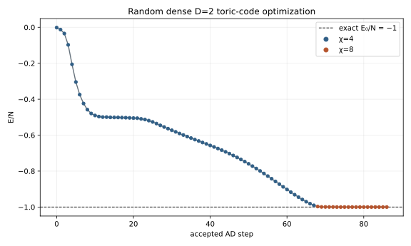

# M2 Report: Random-Start Toric-Code Ground State

## 1. Result

M2's current objective was achieved from a **random dense tensor**, not from the
exact tensor. Starting from a random `D=2` iPEPS, automatic-differentiation
optimization reached

`E_cell = -7.999999995072`, `E/N = -0.999999999384`

with maximum site-resolved star and plaquette errors of `5.95e-10` and
`6.38e-10`, respectively. These are well inside the declared `1e-6` tolerance.

The exact tensor was evaluated separately only to test the implementation. It
was not used to initialize or guide the successful random-start trajectory.

## 2. Setup

The calculation used

`H = -sum_s A_s - sum_p B_p`

with `J_e = J_m = 1`, `h_x = h_z = 0`, and eight edge spins per `(2,2)`
composite-site cell. The state was a dense complex `D=2` iPEPS with one tensor
shared by all four positions in the cell. No exact-state warm start or virtual
Z2 constraint was used.

The targets were:

| Quantity | Target |
|---|---:|
| `E_cell` | `-8` |
| `E/N` | `-1` |
| Every `<A_s>` | `1` |
| Every `<B_p>` | `1` |
| Required error | `<= 1e-6` |

## 3. Tied-Gradient Projection

Although the numerical cell has four tensor positions, this calculation
constrains them to contain the same tensor:

`A_11 = A_12 = A_21 = A_22 = A`.

PEPSKit differentiates the energy with respect to all four positions and
returns four gradients `g_rc`. The tied-gradient projection replaces them by
their average,

`g_bar = (1/4) sum_rc g_rc`,

and copies `g_bar` to all four positions before taking the descent step.
Averaging instead of summing changes only the scale; the optimizer normalizes
the direction.

This projection has two consequences:

- Every update stays inside the translation-uniform tied-tensor subspace.
- A defect localized on one plaquette of the `(2,2)` cell cannot form by
  allowing one tensor to evolve differently from the other three.

The projection does not insert the exact ground state. It restricts the
optimization to the intended one-tensor ansatz while still optimizing that
tensor from random values.

## 4. Why the Earlier AD Route Failed and This Route Succeeded

The earlier results did not show that automatic differentiation itself was
wrong. Finite-difference tests found that the AD gradient had the correct
direction and magnitude. The failures occurred after the gradient was
computed.

| Route | Failure mechanism |
|---|---|
| OptimKit L-BFGS | Its accumulated search direction became inconsistent with the verified gradient, so the Wolfe line search rejected every trial. |
| Independent-tensor gradient descent | Four tensors could evolve independently and the state entered a one-plaquette-defect minimum near `E_cell = -6.99`. The direction needed to repair that plaquette was nearly orthogonal to the energy gradient. |
| Initial tied-tensor descent at small `chi` | The tensor improved, but `chi=4` and `chi=6` CTMRG environments became unreliable near the ground state. |
| Final tied-tensor route | Sharing one tensor removed the nonuniform defect degree of freedom; normalized gradient descent avoided L-BFGS history; `chi=8` resolved the near-ground environment; warm-started CTMRG kept line-search trials on a continuous environment branch. |

The successful result therefore came from changing the **parameterization,
optimizer, and environment handling**, not from changing the AD derivative
formula. The detailed simple-update investigation is recorded separately in
`M2_SU_FINDINGS.md`.

## 5. Random-Start Convergence

The random trajectory contained 86 accepted updates. It used `chi=4` for the
broad descent and `chi=8` near the target. The acceptance threshold was first
crossed at step 83, and the state improved through step 86.

The optimizer then found no further acceptable Armijo step. This occurred
after the energy and all stabilizers already satisfied the M2 tolerance, so it
marks numerical termination near the minimum rather than failure to reach the
target.

## 6. Final Measurements and the Two Energy Values

Both rows below evaluate the **same random-start step-86 tensor**. They differ
only in how the `chi=8` CTMRG environment was initialized.

| Evaluation | CTMRG initialization | `E_cell` | `E/N` | Max star error | Max plaquette error | Residual |
|---|---|---:|---:|---:|---:|---:|
| Primary accepted result | Warm-started from step 85 | `-7.999999995072` | `-0.999999999384` | `5.95e-10` | `6.38e-10` | `2.82e-9` |
| Repeat contraction | Fresh random environment | `-8.000000001560` | `-1.000000000195` | `3.08e-10` | `8.30e-11` | `7.42e-9` |

The two energies differ by `6.49e-9`. A finite-`chi`, truncated CTMRG
contraction is not a rigorous variational evaluator, so its numerical estimate
can lie slightly below the exact lower bound. Here the undershoot is
`1.56e-9`, comparable to the reported CTMRG residual and far below the `1e-6`
acceptance tolerance.

For clarity, this report uses the warm-started, physically sided value
`-7.999999995072` as the primary result. The lower repeat value is retained
only as an estimate of contraction-level numerical sensitivity.

## 7. Exact-State Benchmark

The exact tensor was run independently as a code benchmark:

| Quantity | Benchmark result |
|---|---:|
| `E_cell` | `-8` |
| Projected gradient norm | `4.526e-16` |
| Maximum stabilizer error | `1.665e-15` |

Its essentially zero gradient verifies that the optimizer does not move a
known ground-state tensor. These numbers are not part of the random-start
result in Sections 5-6.

## 8. Implementation and Verification

The retained implementation is:

- `scripts/ad_tied_core.jl`: tied state, gradient projection, and normalized
  descent direction.
- `scripts/ad_tied_gd.jl`: fixed-point AD, Armijo backtracking, CTMRG warm
  starts, physical-bound guards, checkpoint continuation, and observable
  output.
- `tests/tied_ad_core_tests.jl`: 38/38 tests passing.

The implementation also rejects unphysical trial observables, treats a
non-convergent CTMRG trial as a reason to reduce the step size, and recognizes
target attainment even when the requested step budget is not exhausted.

The obsolete `sbatch_symm_gd.sh` and `sbatch_tied_gd.sh` launchers were
removed. Shared cluster configuration was not changed during cleanup.

## 9. Artifacts

- Final random-start checkpoint:
  `tracks/peps/results/20260730-m2-chi8-warm-continue-77-to100/random-continue_step086.jld2`
- Accepted-step measurements:
  `tracks/peps/results/20260730-m2-chi8-warm-continue-77-to100/random-continue_energy.csv`
- Site-resolved stabilizers:
  `tracks/peps/results/20260730-m2-chi8-warm-continue-77-to100/random-continue_stabilizer_trace.csv`
- Repeat contraction:
  `tracks/peps/results/20260730-m2-chi8-warm-continue-77-to100/random-continue_stabilizers.csv`
- Combined trajectory plot: `figures/m2_energy_convergence.svg`
- Run log:
  `tracks/peps/results/20260730-m2-chi8-warm-continue-77-to100/run.log`

## 10. M2 Status

**M2's current goal is complete:** optimization from a random dense `D=2`
tensor reached the zero-field toric-code ground-state energy and every
site-resolved stabilizer within `1e-6`.

M2 does not require a virtual-Z2 production state, `chi=20` contraction,
transfer-spectrum calculation, or VUMPS sector cross-check. The
symmetry-preserving production state belongs to future M3; transfer-spectrum
and VUMPS sector validation belong to future M5. Neither milestone has started.
A fresh end-to-end rerun with the final warm-start implementation was not
required for M2 acceptance.
