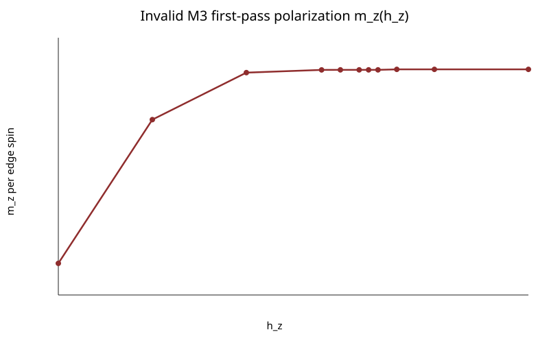

# M3 Status Report: Uncompleted Finite-Field Continuation

> **Milestone status: M3 is uncompleted.** This report records attempted numerical
> work, failure evidence, and repaired infrastructure. It does not establish an
> accepted finite-field ground-state path or complete M3.

## Current Problems and Repairs

Problems that remain:

- No accepted variational ground state has been obtained across the finite-field
  path, especially near `h_z≈0.33`.
- The `m_z` curve did not expose the expected transition and is not an accepted
  phase diagnostic for this calculation.
- CTMRG remains branch- and seed-sensitive at `chi=4` and `chi=6`; some fresh
  environments fail to converge even when other seeds converge.
- Finite-`chi` contractions produce site-resolved stabilizer estimates outside the
  exact Pauli-operator bound, including `max|<B_p>|=1.000171798` in the repaired
  `h_z=0.10` point.
- The dense tied `D=2` tensor has no exact virtual-Z2 production constraint and is
  not accepted for later anyon-sector work.
- Because the repaired single-point audit failed, the repair chain, smoke scan, and
  full grid were deliberately not run.

Repairs completed in this session:

- Made the AD gradient, baseline energy, Armijo trials, and accepted environment use
  one continued warm CTMRG branch.
- Reduced the bounded normalized Armijo step from `0.3` to `0.05`.
- Separated fresh deterministic-seed contractions into a post-point audit rather
  than mixing them into the optimization objective.
- Added site-resolved operator-bound, inter-seed agreement, plaquette-sector,
  optimizer-status, and terminal-gradient gates.
- Added staged `point -> chain -> smoke -> full` execution with checkpoint/`chi`/grid
  provenance and immediate stopping on failed gates.
- Preserved the old `m_z` curve only as explicitly invalid failure evidence.

These repairs make failures safer and more reproducible; they do **not** finish M3.

## 1. Outcome

The bounded M3 feasibility run completed its smoke test and 11-point field grid,
but it did **not** produce a defensible transition estimate. The accepted primary
diagnostic, field polarization `m_z`, rises from zero to about `0.061` by
`h_z = 0.28` and then becomes nearly flat because the AD line search fails at
most points near and above the expected transition.

The mechanically largest secant slope is on `[0.00, 0.10]`. This is initial-state
relaxation, not evidence for the e-charge-condensation transition. The numerical
transition location is therefore **unresolved** in this first pass; the curve is
not consistent evidence for the external `h_z,c approximately 0.3285` benchmark.

## 2. Primary Diagnostic

The single phase diagnostic is

    m_z = (1/N) sum_i <Z_i>,

the field polarization per edge spin. It is the local response conjugate to
`h_z`, satisfies `m_z = -d(E/N)/d h_z`, and is already represented by the local
field term in the retained Hamiltonian. A finite-difference susceptibility was
not plotted because the deliberately loose optimization would amplify its noise;
an open-string condensate was left for the later anyon-transfer work.

The only main M3 phase curve is:



## 3. Setup and Numerical Budget

- Hamiltonian: `H = -sum_s A_s - sum_p B_p - h_z sum_i Z_i`, with `J_s = J_p = 1`
  and `h_x = 0`.
- Geometry: infinite square lattice, existing `(2,2)` composite cell, eight edge
  spins, one dense complex `D=2` tensor tied across all four composite sites.
- Initial state: accepted M2 step-86 checkpoint at `h_z = 0`.
- Continuation: each accepted tensor and freshly converged final environment were
  passed directly to the next field; no random tensor restart occurred.
- Full grid: `0.00, 0.10, 0.20, 0.28, 0.30, 0.32, 0.33, 0.34, 0.36, 0.40, 0.50`.
- Final attempted settings: `chi = 6`, CTMRG tolerance `1e-6`, CTMRG ceiling 80,
  fixed-point-gradient tolerance `1e-5`, at most four accepted AD steps per field,
  and at most 12 Armijo trials per step.
- Fresh CTMRG used the bounded deterministic seed sequence `424242, 1, 2`; the
  first converged fresh environment supplied every reported observable.
- No critical fit, `D` increase, `chi > 6`, or automatic precision escalation was
  performed.

`chi = 4` was attempted first. It was rejected as qualitatively unstable after a
fresh contraction at `h_z = 0.28` gave `E/N = -0.9363` and
`max|<B_p>-1| = 0.0587`, strongly disagreeing with the warm optimization branch.
The allowed `chi = 6` fallback showed the same branch problem until fresh-energy
checks were incorporated into Armijo backtracking.

## 4. Continuation and AD Result

The smoke path `0.00, 0.10, 0.33, 0.50` passed its minimal mechanics gate: each
positive field accepted at least one AD update, state/environment continuation was
sequential, observables were finite, and the plaquette warning threshold of `0.05`
was not crossed.

The full path was only partially optimized. It used the accepted tensor from each
row as the next row's initial state, but accepted no update at five positive-field
points and stopped with `armijo_failed` rather than searching indefinitely.

| `h_z` | `E/N` | `m_z` | mean `<B_p>` | max `|<B_p>-1|` | AD steps | status |
|---:|---:|---:|---:|---:|---:|---|
| 0.00 | -1.000000 | 0.000000 | 1.000000 | 0.000000 | 0 | M2 anchor |
| 0.10 | -1.020745 | 0.045437 | 1.012659 | 0.012659 | 4 | budget |
| 0.20 | -1.042645 | 0.060299 | 1.023302 | 0.023302 | 4 | budget |
| 0.28 | -1.048517 | 0.061155 | 1.023910 | 0.023910 | 4 | budget |
| 0.30 | -1.049759 | 0.061170 | 1.023920 | 0.023920 | 1 | Armijo failed |
| 0.32 | -1.050982 | 0.061170 | 1.023920 | 0.023920 | 0 | Armijo failed |
| 0.33 | -1.051594 | 0.061170 | 1.023920 | 0.023920 | 0 | Armijo failed |
| 0.34 | -1.052206 | 0.061170 | 1.023920 | 0.023920 | 0 | Armijo failed |
| 0.36 | -1.053586 | 0.061326 | 1.024000 | 0.024000 | 1 | Armijo failed |
| 0.40 | -1.056039 | 0.061326 | 1.024000 | 0.024000 | 0 | Armijo failed |
| 0.50 | -1.062171 | 0.061326 | 1.024000 | 0.024000 | 0 | Armijo failed |

All reported CTMRG residuals are below the loose `1e-6` target, ranging from
`1.57e-8` to `4.35e-7`. A small residual did not prevent finite-chi observable
bias or optimizer stalling.

## 5. Plaquette-Sector Validation

`<B_p>` remained numerically close to one in the retained `chi = 6` grid:

    max over fields |<B_p> - 1| = 0.024000

This is only a qualified pass. The values overshoot one, which is impossible for
a Pauli-product expectation value and therefore signals contraction/optimization
bias. The exact commuting-sector check is not satisfied at production quality,
even though no retained point shows a large loss of plaquette polarization.

## 6. Transition Assessment

- Mechanical largest-slope interval from `m_z`: `[0.00, 0.10]`.
- Physical interpretation: rejected as initial relaxation and optimizer bias.
- Defensible M3 estimate: **none; transition unresolved on this curve**.
- Comparison with `h_z,c approximately 0.3285`: the run neither confirms nor
  estimates that value; `m_z` is flat across `0.32-0.34` because no AD update was
  accepted there.

## 7. Branch-Consistent Repair Attempt

After review, the optimizer was repaired so the fixed-point gradient, baseline
energy, Armijo trial energies, and accepted environment all use one continued warm
CTMRG branch. Fresh contractions were removed from the line search and converted
into an independent three-seed post-point audit. The normalized initial step was
reduced from `0.3` to `0.05`.

At `h_z=0.10`, four bounded updates then descended smoothly:

| Step | warm `E_cell` | gradient norm | `alpha` |
|---:|---:|---:|---:|
| 1 | -8.0086534343 | 0.1968 | 0.05 |
| 2 | -8.0149877711 | 0.1500 | 0.05 |
| 3 | -8.0191140347 | 0.1043 | 0.05 |
| 4 | -8.0218357071 | 0.0645 | 0.05 |

The branch-consistency problem is therefore repaired at this point: energy descends
and the gradient norm decreases without warm/fresh objective mixing. The approved
physical audit nevertheless fails after step 4: two converged fresh seeds give
`max|<B_p>| = 1.000171798`, above the declared `1+1e-6` bound. They agree in energy
and observables to machine precision, while seed 2 fails CTMRG convergence.

Per the staged repair protocol, the short chain, representative smoke, and full grid
were not started. Relaxing the operator-bound tolerance, increasing `chi`, or moving
to the virtual-Z2-symmetric ansatz requires a new ratified design decision.

## 8. Artifacts and Reproduction

- Driver: `scripts/m3_hz_continuation.jl`
- Focused tests: `tests/m3_hz_tests.jl`
- Invalid first-pass plot retained as failure evidence:
  `figures/m3_mz_vs_hz_invalid.svg`
- Final smoke artifacts:
  `tracks/peps/results/20260730-m3-hz-smoke-chi6-fresh-armijo/`
- Final coarse-grid artifacts:
  `tracks/peps/results/20260730-m3-hz-coarse-chi6-fresh-armijo/`
- Discarded diagnostic attempts are retained under the earlier
  `20260730-m3-hz-*` result directories.
- Branch-consistent repair-point artifacts:
  `tracks/peps/results/20260730-m3-repair-point-chi6/`

Rerun from the repository root:

```bash
julia --project=julia-env \
  tracks/peps/solutions/anyon-correlator/scripts/m3_hz_continuation.jl point \
  tracks/peps/results/20260730-m2-chi8-warm-continue-77-to100/random-continue_step086.jld2 \
  tracks/peps/results/20260730-m3-repair-point-chi6-rerun 6
```

## 9. Verification

- `tests/m3_hz_tests.jl`: 132/132 focused M3 and repair checks passed.
- `tests/runtests.jl`: 94/94 retained M1/M2 and tied-AD checks passed.
- `git diff --check`: passed with no output.
- Independent read-only code review found no critical issues. Its false-success
  findings were addressed with site-resolved operator-bound gates, mandatory smoke
  execution before a full scan, and explicit `D=2` checkpoint validation. The
  warm-gradient/fresh-energy mismatch was subsequently repaired and isolated from
  the fresh multi-seed audit.
- The repair-point audit CSVs were refreshed with all site-resolved star and
  plaquette values. The point summary CSV and JLD2 checkpoints predate the later
  `final_gradnorm` schema addition; this does not change their recorded numerical
  values or the failed audit verdict.

## 10. Limitations and Status

- Dense `D=2` tied-tensor parameterization; no virtual-Z2 production constraint.
- Very small `chi`, loose CTMRG tolerance, and at most four accepted AD steps.
- Multiple CTMRG fixed-point branches required bounded fresh-seed retries.
- Five positive-field points accepted no AD update; all optimized points exhausted the
  budget or ended in line-search failure.
- The original coarse-grid evidence used a branch-mixed line search and remains
  invalid. The repaired same-branch optimizer passed its descent checks but failed
  the independent physical audit at the first finite-field point.
- Stabilizer expectations exceeded the exact operator bound by up to `0.0390` for
  stars and `0.0240` for plaquettes.
- No finite-`D`/finite-`chi` convergence study and no independent method check.

The attempted first pass and repair point are documented, but **M3 remains
uncompleted**. M3 production acceptance is not met, and M4 transition analysis must
not consume the retained curve as physical evidence.

## Deferred Next-Session Direction

A separate future session may calculate finite-field ground states at small nonzero
`h_x` and `h_z` and compare them with available series-expansion values. That work may
also reconsider the transition diagnostic because `m_z` was not effective here. No
such calculation, source audit, implementation, or numerical run belongs to this
session.

## Series-Validation Pilot (second session, 2026-07-30)

The deferred direction was executed as a ratified protocol: continue the accepted M2
step-86 tensor to small `h_z` (h_x = 0) and compare with the series expansion
(arXiv:0807.0487 Eq. 8, converted from the paper's J = 1/2 by e_ours(h) = 2 e_paper(h/2)):

    e_series(h_z) = -1 - h_z^2/4 - 15 h_z^4/64 - 147 h_z^6/256 - 18003 h_z^8/8192

per edge spin (`e(0.05) = -1.0006264739`, `e(0.10) = -1.0025240337`). Driver:
`scripts/m3_series_validation.jl`; tests: `tests/m3_series_tests.jl` (69/69). Tensor-only continuation; no optimizer state across fields; every
frozen tensor audited with warm + fresh deterministic (seed 424242) + two fresh
random (seeds 1, 2) CTMRG initializations at the same chi/tolerance, plus a chi=16
stability check. Acceptance requires a stationary optimizer (budget exhaustion is not
convergence), all contractions converged, inter-initialization E/N spread <= 1e-6,
observable spread <= 1e-5, and chi-increase |dE/N| <= 1e-6.

Results (chi = 8, ctm_tol = 1e-8, artifacts
`tracks/peps/results/20260730-m3-series-pilot-chi8*/`):

- **h_z = 0 anchor: ACCEPTED.** E/N = -1.0000000002, delta vs series -1.95e-10,
  4/4 initializations consistent (spread 8.1e-10), chi 8->16 stable (8.1e-10).
  fresh_det reproduces the M2 repeat contraction (-8.000000001560) exactly.
- **h_z = 0.05 and 0.10: NOT ACCEPTED (contraction-ambiguous).** The warm CTMRG
  branch drifted to a trivial factorizing fixed point during optimization, claiming
  E/N -> -1 - h_z with unphysical <A_s>, <B_p> > 1, while fresh contractions of the
  same frozen tensors agree among themselves (~1e-13) at -0.9558197 and -0.9224684
  per spin. Inter-branch spreads: 9.4e-2 and 1.8e-1 per spin -> `energy_disagreement`.

**Diagnosed causes** (per-step re-contraction of every h_z=0.05 checkpoint,
`inspection/series_branch_divergence.jl` -> `branch_divergence_0p05.csv`):

- **Problem A — warm-branch artifact descent.** At alpha0 = 0.05, steps 1-2 are
  branch-consistent and variational; from step 3 the warm branch claims descent
  toward the algebraic floor -8-8*h_z while the fresh-contracted (true) energy rises
  monotonically to -7.65/cell. Large normalized steps let the continuously tracked
  environment fall into a trivial CTMRG basin; the fixed-point-AD gradient through
  that branch then points downhill on the artifact surface. Branch-consistent
  optimization makes the objective self-consistent but cannot detect the branch
  itself going non-variational; only independent contractions can. The same
  mechanism plausibly explains the chi = 4/6 first-pass and repair-point failures.
- **Problem B — warm-trial fragility at small steps.** With alpha0 = 0.005 and
  fresh-verified acceptance (amendment A1), accepted steps were branch-consistent
  (~1e-7), but the warm-carried trial environment failed to converge for alpha >=
  0.005, collapsing Armijo to alpha ~ 1e-4 (~7e-6 per step vs the required 5e-3):
  guaranteed budget exhaustion. Fresh from-scratch contractions of the same trial
  tensors converge robustly.
- **Underlying hypothesis.** The dense D=2 tied ansatz has no virtual-Z2
  constraint; in the deformed-tensor region its transfer matrix is near-defective,
  so CTMRG has multiple basins and even fresh seeds sometimes fail (residual ~0.4).

**Amendments (ratified):** A1 — alpha0 = 0.005 with fresh-verified step acceptance
(implemented, run, Problem B found). A2 — every Armijo trial is a from-scratch
deterministic (seed 424242) contraction with an independent fresh random-seed
(seed 1) veto per accepted step; the frozen-tensor multi-initialization + chi=16
audit is unchanged (**implemented and unit-tested; not executed by the deadline**).
h_z = 0.10 remains deferred until h_z = 0.05 passes (`SERIES_PILOT_GRID =
[0.0, 0.05]`). Launch commands are recorded in `CHALLENGE_SUMMARY.md` §6.

M3 remains **uncompleted**; the series pilot produced no accepted finite-field
energy. See `CHALLENGE_SUMMARY.md` for the full challenge record.
