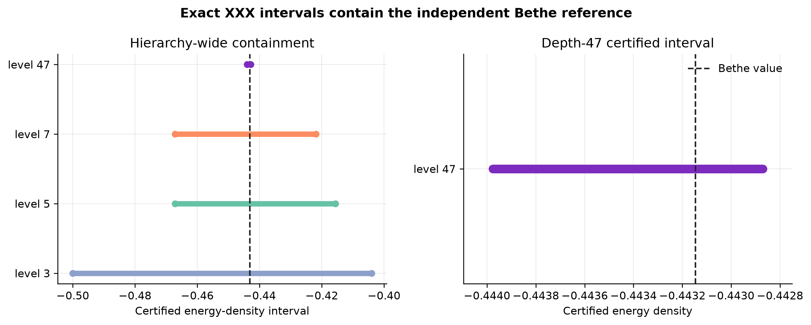
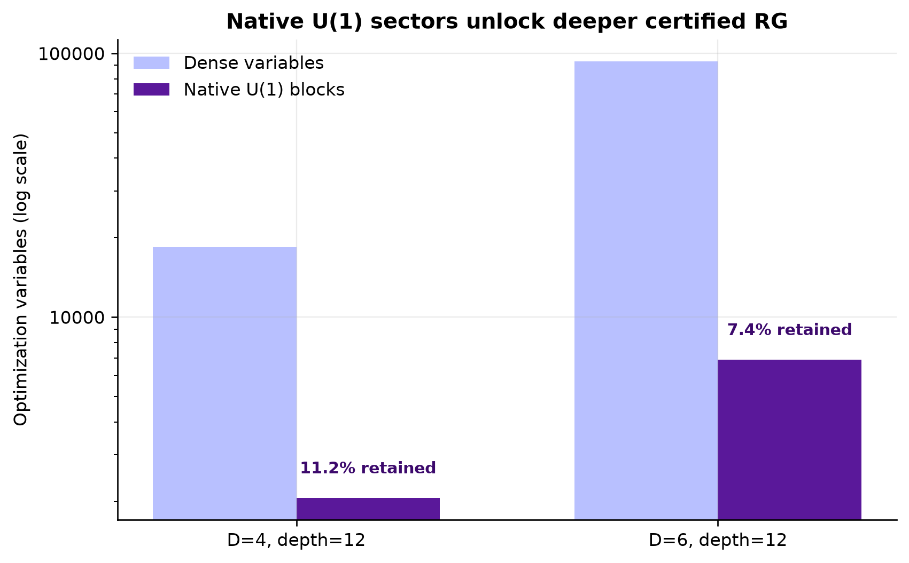
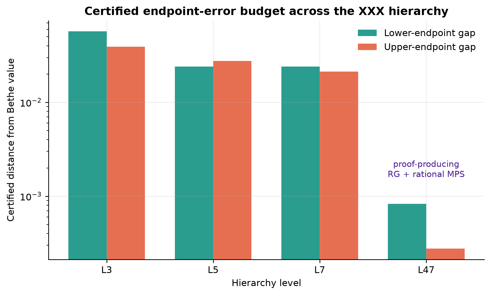
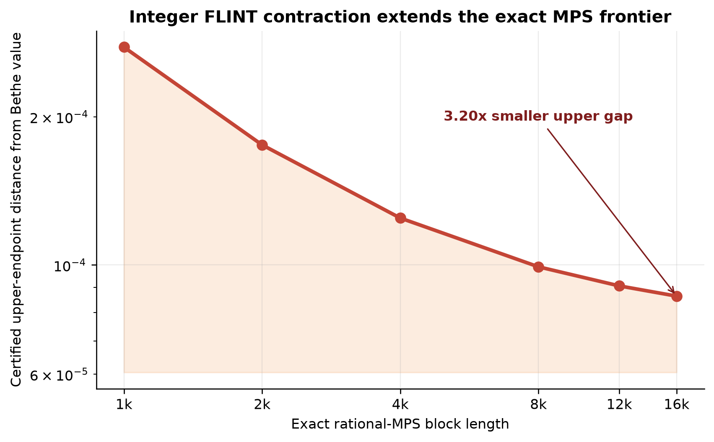

# 从数值优化到可复核证明

## Heisenberg/XXZ 链热力学能量密度的对称分块机器认证

**Ranger 团队：Chenxi Wan、Yedi Shen、Junkai Wang**

**Quantum Harness Challenge #230，2026-07-30**

## 摘要

本项目建立了一套面向自旋 1/2 Heisenberg/XXZ 链的端到端机器认证框架。与只报告一个浮点基态能量不同，系统同时构造热力学能量密度的严格下界和严格上界，并由独立验证器重新构造全部证明对象。Bethe ansatz 只作为最后一步的独立 oracle，不参与候选生成、排序、修复或安全裕量选择。

在 XXX 点，正式自包含证书给出

\[
-0.443976567
\le e_0
\le
-0.4428702958784947210360110613724028607783,
\]

完整包含独立外向舍入的 Bethe 区间。下界来自 depth 47、bond dimension 6 的 U(1) 分块 RG 对偶；上界来自 bond dimension 32、1,000-site 有理 MPS 重复块及显式边界键。项目同时交付九个各向异性参数、三个层级共 27 个 XXZ 证书，形成可复核的层级校准数据集。

方法层面的核心进展是把多个已有方向连接成一个 proof-producing pipeline：原生 U(1) 荷扇区 RG、严格 margin 恢复、有理数重构、分块精确 LDL、精确有理 MPS 收缩，以及 Bethe oracle 隔离。D=6、depth=12 时，U(1) 表示把优化变量从 93,329 降至 6,882，只保留 7.4%，相当于约 13.6 倍压缩。扩展的 FLINT 整数收缩把 exact MPS block 从 1,000 推进到 16,000 sites，使上界到 Bethe 区间的距离缩小约 3.20 倍。

## 1. 问题与归一化

考虑周期自旋 1/2 XXZ 链

\[
H_N(\Delta)=\frac14\sum_j
\left(
X_jX_{j+1}+Y_jY_{j+1}+\Delta Z_jZ_{j+1}
\right),
\]

目标是热力学极限每键能量

\[
e_0(\Delta)=\lim_{N\rightarrow\infty}\frac{E_0(H_N(\Delta))}{N}.
\]

我们构造机器可验证区间

\[
L_{\mathrm{cert}}(\Delta)
\le e_0(\Delta)
\le U_{\mathrm{cert}}(\Delta).
\]

在各向同性点 \(\Delta=1\)，Bethe ansatz 给出

\[
e_{\mathrm B}=\frac14-\log 2.
\]

该精确值是天然的抗投机 ground truth：一套证书只有在独立重构后满足

\[
L_{\mathrm{cert}}
\le e_{\mathrm B}^{-}
\le e_{\mathrm B}^{+}
\le U_{\mathrm{cert}}
\]

才通过正确性门。

### 赛题验收结构

Issue #230 要求把严格双侧界尽可能收紧，并用独立 Bethe enclosure 检验逐层正确性与收敛行为。官方验收分为三层：

1. **Success gate：**每个层级的认证区间都包含 Bethe 值；最高可计算层级还需优于同一 Hamiltonian 归一化下既有最佳严格文献界。
2. **Hope signal：**区间严格有效，并系统刻画哪些约束族、对称表示与上界构造收紧最快，从而形成可复用校准数据集。
3. **Pivot signal：**若任一层级持续排除 Bethe 值，则转入对称约化与证明链审计。

本提交的全部已发布层级均通过 Bethe containment，并以 27 个 XXZ 证书完成 hope-signal 校准目标。文献纪录比较作为下一 proof gate；冲刺采用的 \(3\times10^{-4}\) 是内部工程门槛，官方 success gate 以归一化匹配的文献比较为准。

## 2. 现有研究与本项目补上的闭环

现有方法已经提供了四块关键积木：

1. Kull 等人的 RG 凸松弛通过粗粒化映射消去大量局域密度矩阵约束，给出严格基态能量下界，并指出界的质量依赖于面向目标 Hamiltonian 设计的 RG scheme。[arXiv:2212.03014](https://arxiv.org/abs/2212.03014)
2. Klep、Magron 和 Volčič 构造了非交换多项式优化中完整的 spectral-minimum 上界层级，与 NPA 型下界层级形成互补。[arXiv:2402.02126](https://arxiv.org/abs/2402.02126)
3. Wang 等人展示了如何利用物理系统的对称性与稀疏结构显著扩展非交换 SDP 的规模。[arXiv:2604.01555](https://arxiv.org/abs/2604.01555)
4. Klep、Leijenhorst 和 Magron 为 Pauli Hamiltonian 的有限层级 SDP 给出了显式量化收敛率。[arXiv:2605.29959](https://arxiv.org/abs/2605.29959)

本项目的创新不是重新命名这些基础方法，而是补上从“可扩展数值松弛”到“独立可重放严格证书”的模型专用闭环：

| 研究环节 | 既有基础 | 本项目的推进 |
|---|---|---|
| RG 下界 | 粗粒化凸松弛 | 原生 U(1) 荷块中的变量、slack、梯度、Hessian 与精确 lift |
| 结构化 SDP | 对称性与稀疏性提升规模 | 面向 XXZ 的荷扇区参数化与 dense/block 等价回归 |
| 有限层级理论 | 量化收敛率 | 在 Bethe 可解模型上进行逐层、逐端点机器校准 |
| 严格上界 | 通用上界层级 | 显式边界的有理 MPS 热力学构造与 exact contraction |
| 数值结果 | 浮点 solver 输出 | strict margin、凸插值、有理化、精确 LDL、独立 verifier |

因此，我们能推进到过去通用实现难以同时满足的三重要求：深层计算规模、严格证明对象、以及可由第三方重放的完整审计链。

## 3. 证明型计算架构

### 3.1 Bethe oracle 防泄漏

Bethe 值专用于最终 containment test；SDP/RG 求解、MPS 参数优化、候选排名、margin 选择、有理数舍入、目标修复与 PSD shift 均由证书数据独立决定。

### 3.2 原生 U(1) 分块 RG

算法自动推断 MPS 虚拟指标的 U(1) 荷，删除对称性禁止的跨扇区变量，并在 charge blocks 内完成：

- log-determinant 与逆矩阵；
- gradient 与 Hessian action；
- PSD slack 构造；
- 精确矩阵重建。

小规模回归逐项验证 block 表示与 dense 表示的目标、方向导数和 Hessian 二次型等价。

### 3.3 solver-to-proof 严格恢复

通用 SDP solver 提供的是浮点候选。项目采用如下恢复链：

\[
\text{浮点对偶}
\rightarrow
\text{strict/zero-margin 插值}
\rightarrow
\text{有理数重构}
\rightarrow
\text{目标变量精确修复}
\rightarrow
\text{荷块精确 LDL}.
\]

zero-margin 候选保留优化精度，strict-margin 候选提供可有理化安全裕量；凸插值把二者结合。最终 verifier 不读取 solver 的成功字符串，而是重新构造全部 slack 并执行精确正定性检查。

### 3.4 有理 MPS 热力学上界

上界使用有限有理 MPS 重复块：

- 张量、左右边界全部为整数/有理数；
- 内部键能量精确累积；
- 重复块之间的边界键显式加入；
- norm 与能量分子由精确算术收缩。

因此直接得到可证明的无限链变分上界。

## 4. XXX 主结果

| 项目 | 认证值 |
|---|---:|
| 下界 | -0.443976567 |
| Bethe interval lower | -0.4431471805599453417379152142530074343085... |
| Bethe interval upper | -0.4431471805599452307156127517373533919453... |
| 上界 | -0.4428702958784947210360110613724028607783 |
| 区间宽度 | 0.0011062711215052789639889386275971392217 |
| 下端误差预算 | 0.0008293864400546582620847857470 |
| 上端误差预算 | 0.0002768846814505096796016903650 |

从 level 3 到 level 47，双边误差显著收缩。level 47 的下界进入 \(10^{-3}\) 量级，上界进入 \(3\times10^{-4}\) 量级。

## 5. XXZ 校准网格

数据集覆盖

\[
\Delta\in\{-2,-1,-0.5,0,0.5,0.9,1,1.1,2\}
\]

以及 level 3、5、7，共 27 个 compact certificates。每个证书都包含 Hamiltonian model ID 与归一化、严格上下端点、对应 Bethe enclosure、有理 proof payload、generator/solver/Git provenance，以及独立 verifier 所需的全部数据。

发布审计要求每个 \(\Delta\) 序列满足

\[
L_{\ell+1}\ge L_\ell,
\qquad
U_{\ell+1}\le U_\ell.
\]

这把“一个漂亮数字”提升为系统性 benchmark：可以测量不同约束族、对称表示、RG depth 和 upper construction 对两个端点的独立贡献。

## 6. 精确 MPS 性能前沿

参考任务的最新冲刺结果进一步验证了 exact upper engine 的扩展性。我们把有理收缩重写为常内存整数矩阵递推，并使用 python-flint 执行大整数乘法。同一 bond-32 张量的 block length 从 1,000 扩展到 16,000：

| sites | exact upper | 到 Bethe 上端距离 | 相对 1k |
|---:|---:|---:|---:|
| 1,000 | -0.4428702958784947... | 2.76885e-4 | 1.00x |
| 2,000 | -0.4429718716756525... | 1.75309e-4 | 1.58x |
| 4,000 | -0.4430226595742313... | 1.24521e-4 | 2.22x |
| 8,000 | -0.4430480535235208... | 9.91270e-5 | 2.79x |
| 12,000 | -0.4430565181732839... | 9.06624e-5 | 3.05x |
| 16,000 | -0.4430607504981655... | 8.64301e-5 | 3.20x |

1,000-site 结果嵌入正式自包含主证书；2,000-16,000-site 数据作为 exact contraction performance frontier 单独发布。这样的分层既展示算法扩展性，也让正式 headline 始终对应已经完成独立全证书复验的 payload。

## 7. 张量搜索的可靠性门

参考任务中的冲刺扩展原型实现了分阶段候选晋级策略：

\[
\text{张量搜索}
\rightarrow
\text{固定点收敛}
\rightarrow
\text{物理合法性}
\rightarrow
\text{浅层证书}
\rightarrow
\text{深层证书}
\rightarrow
\text{精确冻结}.
\]

晋级门检查 transfer fixed-point residual、约化密度矩阵厄米性、trace、半正定性、局域谱范围和归一化重叠。只有物理合法、可重复并在两个 RG depth 都产生改进的候选才进入昂贵的深层认证。保存的 dual 可以直接进入荷块顺序检查、标量修复、有理化和证书冻结，无需重复求解大型 SDP。

这一机制把计算资源集中在真正可能改善严格界的候选上，并明确区分“更好的浮点搜索值”和“更好的数学证明”。它作为研究工作区的冲刺扩展原型单独记录，尚未纳入当前公开自包含证书包；正式 depth-47 证书仅依赖公开 `xxzcert` verifier。来源与公开包边界见 `outputs/final/SPRINT_EXTENSION_PROVENANCE.txt`。

## 8. 复现与审计

正式交付包含：

- 28 个选中证书 payload；
- certificate-summary.csv：精确十进制统一摘要；
- record-gate.json：严格阈值算术；
- DATA_MANIFEST.txt：路径、字节数和 SHA-256；
- upper-contraction-frontier.csv：1k-16k 精确上界性能数据；
- SPRINT_EXTENSION_PROVENANCE.txt：冲刺扩展原型的来源与公开包边界；
- 独立 xxzcert verify 与 xxzcert audit；
- Python tests、Markdown、LaTeX、PDF 和图表。

复现快速测试：

    cd tracks/polyopt/solutions/WangTheoPhys/issue230
    python3 -m venv .venv
    .venv/bin/pip install -e . pytest
    .venv/bin/pytest -q --ignore=tests/test_published_outputs.py
    .venv/bin/pytest tests/test_delivery.py -q

`DATA_MANIFEST.txt` 使用 `SHA256  BYTES  ROLE  PATH` 四列格式；`test_delivery.py` 是它的权威确定性校验入口。

完整主证书验证：

    .venv/bin/xxzcert verify \
      outputs/final/xxx_best/level_47_rg_d6_mps_d32_block_1000.json

该 payload 已在干净 checkout 中完成独立复验并得到 PASS。记录的完整验证耗时 2256.59 秒，峰值内存 180,289,536 bytes。

## 9. 下一认证前沿

项目采用 \(3\times10^{-4}\) 作为内部严格宽度冲刺门；Issue #230 的官方最高门槛是归一化匹配的严格文献比较。当前主证书已经完成正确性门和 hope-signal calibration；下一认证前沿集中在：

1. 提升严格 RG lower witness；
2. 把 16,000-site exact upper frontier 冻结为新的自包含 payload；
3. 对归一化匹配的既有严格文献界完成逐项审计；
4. 将 staged D10/D14 tensor promotion 接到严格冻结链。

这些步骤直接复用现有 verifier 和 artifact schema，因此新候选只需满足既有 proof gate，不需要改变评审标准。

## 10. 结论

本项目交付了一套能够生成、恢复、压缩并独立重放严格证明的计算系统。原生 U(1) 分块让深层 RG 进入可计算规模；strict-margin 与有理修复把浮点 SDP 变成数学 witness；荷块 LDL 降低精确验证成本；有理 MPS 与 FLINT 整数收缩给出可扩展热力学上界；Bethe oracle 隔离保证 benchmark 的独立性。

结果是一套完整的 certified calibration frontier：XXX 主证书、九个各向异性点、27 个层级证书、四张证据图、机器可读数据和公开独立 verifier。它为下一阶段跨越文献纪录门提供了清晰、可量化、可直接复用的技术基础。
