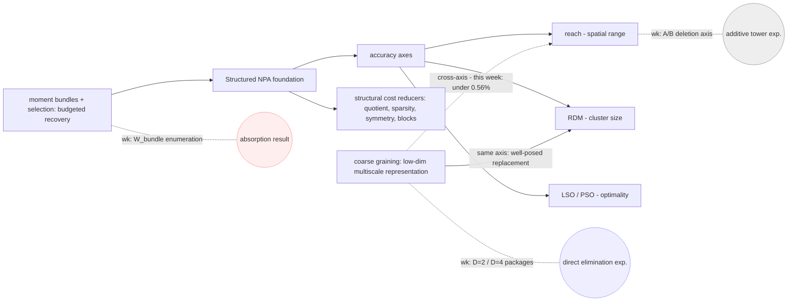

# Campaign Report — Coarse-Grained NPA for Spin-½ Ground States (Challenge #49)

Team **its-a-trap** (Yan-Bai Zhang) · Harnessing Quantum 2026 · 2026-07-30.
A standalone narrative synthesis. Every number traces to a
frozen CSV or a named record; claims cite the ledger
(`audit/claims_ledger.md`, C1–C21). Figures F2/F3 are generated from the
CSVs by `figs/make_figs.py`.

---

## Overview — the story of the campaign

The NPA hierarchy is a **lower-bound** method: it approaches the
ground-state energy from below, by relaxing the set of physical moment
data to a semidefinite-representable superset. Its main value is that it
complements conventional variational and tensor-network optimization
methods, which approach the same quantity from above. The two directions
are naturally complementary:

$$E_{\mathrm{SDP}}^{\mathrm{lower}} \;\le\; E_0 \;\le\; E_{\mathrm{variational}}^{\mathrm{upper}}.$$

This project works exclusively on the lower-bound side of that
inequality. DMRG variational upper bounds, high-precision Bethe
references, exact diagonalization, and the Majumdar–Ghosh point enter
only as external yardsticks against which the lower bounds are measured
— they are not deliverables of the campaign. The complementarity is one
of its central motivations.

There is no free lunch. In its uncompressed form the hierarchy suffers a
rapid — often exponential — growth in the number and size of moment
constraints as the system size, the spatial reach, or the hierarchy level
increases. The challenge is therefore not simply to add more constraints,
but to identify a useful **combination** of tools that produces the best
trade-off between accuracy and computational cost. This campaign is a
search for that numerical sweet spot: combining different accuracy
mechanisms, structural reductions, and multiscale compression methods to
obtain stronger and more efficient lower bounds for one- and
two-dimensional quantum spin systems.

## §0 Headline

**Scoreboard in one line:** The 1e-5 accuracy threshold was met at N=100
(+9.931e-06 vs the high-precision Bethe reference, reach-extended); the
N=200 target-scale calculation remained a quantified frontier; Target 2
in-band through
J2 ≤ 0.6; Target 3 conceded on measured scaling; Target 4 delivered two
10×10 rows (one in-band, one at 1.5e-2) — plus a method campaign that
ended somewhere more interesting than its starting hypothesis.

**Finding 1 — where the real cost of coarse constraints lives.** Coarse
constraint families can make an SDP smaller on paper and slower in
practice. A controlled comparison identified the coarse-map **D-package**
— the PSD block dimension together with its dω-scaled link equations —
as a dominant measured contributor to realized interior-point cost:
swapping only the map package D=2 → D=4 at fixed size, basis, level
count and link family moved realized cost from 0.87×/0.90× to
2.37×/6.80× (wall/memory) of the comparator, while the structural size
stayed below it throughout. Consequence: scalar-count cost budgets are
unreliable when block-dimension distributions differ. (C20)

**Finding 2 — when elimination finally became cheaper in practice.**
Direct elimination — deleted fine variables provably never created —
reached, at N=20, the campaign's first configuration cheaper in every
measured cost metric: structural size 0.383×, wall time 0.75×, peak
memory 0.51× of the fine-rich comparator. (Series kept separate: the
structural ratio is a six-size series N=10–30 with 26/30 build-only; the
realized wall/RSS improvement is measured on the solved sizes, with the
trend claim restricted to N=14 → 20.) At every tested size the
improvement of the numerical lower bound stayed inside the comparison
tolerance — one-sided bounds, never a measured recovery. The
direct-elimination prototype succeeded as a compression scheme, but not
yet as an accuracy-recovery scheme. (C19)

**The campaign's one-line lesson:** align the deletion with the
compression; control the block-dimension distribution; add corrections
only outside the absorbed closure.

---

## §1 The problem

Challenge #49 asks for numerical SDP **lower** bounds on ground-state
energies of spin-½ Heisenberg systems, layering coarse-graining onto the
structured NPA hierarchy of arXiv:2604.01555 (QMBCertify). Four targets:
1D Heisenberg to 200 spins at 1e-5; 1D J1–J2 to 100 spins at 1e-3; 2D
Heisenberg to 16×16 at 1e-3; 2D J1–J2 at 10×10 at 1e-2 (with the
intermediate-phase controversy of arXiv:2602.21468v4 nearby).

Yardstick infrastructure (built for measurement, not as deliverables):
a high-precision Bethe
reference battery with a 5-part validation gate (ED cross-check ≤ 1e-10
at N = 8–14); dense ED oracles; DMRG **variational upper bounds** at
N=100 for the J1–J2 chain; the Majumdar–Ghosh point as the one exact
anchor. Terminology is fixed by `LAW.md` and used verbatim throughout:

| output | term |
|---|---|
| SDP results | numerical SDP lower bounds |
| DMRG results | variational upper bounds |
| Bethe values | high-precision Bethe references |
| J2 = 0.5, −0.375/site (and 4×4 torus ED) | the only values called **exact** |

("Exact diagonalization" is admissible as a METHOD name; "exact" as a
VALUE descriptor remains reserved as above — the terminology grep is
applied with that distinction.)

---

## §2 The method map

The method landscape, organized:

- **Structured NPA** — the foundation.
- **Reach, RDM, LSO, PSO** — distinct mechanisms for improving accuracy.
- **Quotient reduction, sparsity, symmetry, block diagonalization** —
  mechanisms for reducing structural cost.
- **Coarse graining** — replace expensive fine-scale information with a
  low-dimensional multiscale representation.
- **Moment bundles and moment selection** — recover targeted accuracy
  under a limited computational budget.

**Summary table (the main conceptual map):**

| Tool or method | Category | Main idea | Role in this campaign | Reference |
|---|---|---|---|---|
| Structured NPA | foundation | moment-matrix relaxation of the ground-state problem, structured for spin chains | every bound in this report (QMBCertify, pinned be63c27) | Wang et al., arXiv:2604.01555; NPA hierarchy, arXiv:0903.4368 |
| Reach expansion | accuracy | widen the spatial range of two-site basis words (r) | THE lever that met T1 (r 5→9 at N=100: +9.931e-06); the deletion axis of the replacement experiments | arXiv:2604.01555 |
| RDM positivity | accuracy | impose positivity of k-site reduced density matrices | CONFIG-A accuracy stack; near-saturates small N with r=5 | arXiv:2604.01555; cf. arXiv:2212.03014 |
| Linear state optimality (LSO) | accuracy | linear optimality constraints on the state | measured δ ≈ 2e-8 at N=14 — below the 1e-8 tolerance floor | arXiv:2604.01555 |
| PSD state optimality (PSO) | accuracy | PSD optimality constraints; memory-intensive | sets the ~110 GB memory floor at N=100 (pso×reach); pso=0 per Remark 6.1 in 2D | arXiv:2604.01555; cf. arXiv:2311.18707 (first-order optimality) |
| Quotient-algebra reduction | structural | canonicalize words by translation/mirror/S₃/sign symmetry | built into every arm (reduce!); also the mechanism behind bundle absorption (C21) | arXiv:2604.01555 |
| Term sparsity | structural | keep only interacting monomial blocks | inherited from the structured implementation | arXiv:2604.01555 |
| Symmetry reduction | structural | exploit model symmetry to shrink blocks | S₃/translation quotient throughout | arXiv:2604.01555 |
| Block diagonalization | structural | split the moment matrix into small PSD blocks | the fifth-axis finding: block DIMENSION, not scalar count, drives realized cost (C13, C20) | arXiv:2604.01555 |
| Functional RG / coarse-grained hierarchy | multiscale compression | compress fine windows through an isometric RG map; constrain compressed blocks | dual-parity finite-depth specialization built and gate-verified; recovery unresolved on the reach axis (C14); D-package cost result (C20) | Kull, Schuch, Dive, Navascués, PRX 14, 021008 (2024); cf. arXiv:2412.07837 |
| Moment bundles | budgeted recovery | small declared Γ-blocks over targeted operators | +55 scalars ≈ 0.08%; word-space contribution absorbed by the quotient closure at all tested N (C21) | this work; cf. arXiv:2607.14755 |
| Budget-aware moment selection | budgeted recovery | choose bundles by measured marginal tightness per cost | blind pre-registered selection S* (C8); future: closure-growth objective | arXiv:2607.14755; this work |

**The axes.** The accuracy mechanisms live on distinguishable axes —
spatial range (reach), cluster size (RDM), optimality (LSO/PSO). Coarse
graining compresses along the cluster/level axis. As a tested design
heuristic — not a theorem — **deletion follows the compression's axis**:
a coarse hierarchy compresses cluster-level information by construction,
so the fine variables chosen for deletion must be of that kind — never
the reverse. What the week measured is the geometry of the mismatch, not
a failure of compression. This
retroactively explains the week's nulls: same-axis grafts are redundant
(the rejected lossless arm — its content was already implied by what it
was grafted onto), and cross-axis grafts recover almost nothing (a
cluster-axis tower against a reach-axis deletion: < 0.4% at N=14,
ledger C14).

**The fifth axis (measured this week).** Structural size ≠ realized
solver cost. The operative variable is the coarse-map **D-package** —
block dimension together with its dω-scaled link rows. Evidence: the
additive D=4 tower reached structural ratio 0.848 at N=20 while costing
~9× realized wall (C13); the direct D=2 layer reached structural 0.697
at realized parity, its largest block being 66 against the tower's 128
(C16, C20).

Supplementary sketch (secondary to the table above):

> **Long-term architecture.** A structured retained Core (small reach,
> full quotient/symmetry reductions) + a genuinely compressed coarse
> representation (axis-aligned with what was deleted, block dimension
> budgeted) + budget-selected moment bundles anchored where the deleted
> content actually lives.

---

## §3 Scoreboard

| target | required | delivered | lever | numbers | remains |
|---|---|---|---|---|---|
| T1 1D Heisenberg ≤ 200 @1e-5 | gap ≤ 1e-5 | **threshold met at N=100; N=200 = quantified frontier** | reach axis (r 5→9) | +9.931e-06 (v100e8); ladder N=50–140 at +1.638e-05…+2.476e-05 | 1e-5 unmet for N ≥ 120; N=200 = quantified frontier |
| T2 J1–J2 ≤ 100 @1e-3 | bracket ≤ 1e-3 | in-band J2 ≤ 0.6 | stock chassis, pso=0 (Remark 6.1) | +3.469e-05 / +5.006e-04 / −4.3e-09 (MG exact) / +7.616e-04; then +4.210e-03 / +6.561e-03 | frustrated side at 4–7e-3 |
| T3 2D Heisenberg 16×16 @1e-3 | bound at 16×16 | measured concession | — | L=4 −0.7024963 valid vs exact torus ED −0.7017802; L=6/8 scale rows (basis 20854→30928) | 16×16 conceded on hardware grounds |
| T4 2D J1–J2 10×10 @1e-2 | bound at 10×10 | two rows | stock 2D chassis + upstream patch | j02 −0.6007562490 (≈3.3e-3, in-band); j05 −0.5116536004 (≈1.5e-2, outside) | j05 out of band |

**T1.** The reproduction ladder (CONFIG A, r=5) sits at 1.6–2.5e-05 for
N = 50–140; the single reach-extended cell at N=100 crosses the target.
N=200 is documented as a frontier in one-sided language only: CONFIG A
construction exceeded 11.7 h without starting a solve; the 64-core
V_{S*}(200) build exceeded 6 h at 182 GB without completing; the
128-core probe exceeded its 6 h template limit at MaxRSS 174 GB still in
construction. The matched pair (job 23009660, 24 h wall) is RUNNING as
of writing (~9.6 h); its release is governed by the mechanical rule — a
post-deadline result goes to PR discussion, never into these tables.

**T2.** Brackets are formed against our own DMRG variational upper
bounds; the MG point lands at −4.3e-09 against the exact −0.375. The
frustrated side is reported signed and out-of-band, honestly.

**T3.** The upstream `lattice="square"` bug (undefined `resort` in
QMBCertify at the pin and at HEAD) was found and patched externally
(`hpc/2d/resort_patch.jl`; issue to the authors). The concession is
measured, not asserted: basis rows grow 20854 → 30928 from L=6 to L=8
against a wall/RSS budget crossed well before 16×16.

**T4.** On the controversy: our J2=0.5 row **brackets published
variational energies and excludes none** — the lower bound makes no
phase claim.

---

## Mechanism comparison — accuracy and cost (frozen rows only)

**Accuracy grid** — executed arms on the SAME chassis; cells are signed
per-site gaps vs the high-precision Bethe reference (gap = E_ref − E_LB,
smaller = tighter). "≈B ⊘" = indistinguishable from the truncated
baseline: unresolved (Δ ≈ noise; ε_cmp ≈ 2e-8…3e-7 per pair); the η
upper bounds are listed below the grid. The final column is the resolved
margin A − B. (No Core/+RDM/+LSO ladder appears here — that ablation was
never run; cross-chassis marginals are in the side table.)

| N | B truncated | C6 additive (D=4, n=6) | C direct (D=2, 1 level) | A fine-rich (r=N/2) | resolved margin A−B |
|---|---:|---:|---:|---:|---:|
| 10 | +4.971e-06 | — | ≈B ⊘ | −8.6e-10 † | +4.972e-06 |
| 12 | +3.887e-05 | — | ≈B ⊘ | +8.169e-06 | +3.070e-05 |
| 14 | +6.773e-05 | ≈B ⊘ | ≈B ⊘ | +2.094e-05 | +4.679e-05 |
| 20 | +2.145e-04 | ≈B ⊘ | ≈B ⊘ | +5.786e-05 | +1.566e-04 |

† A@10 sits 8.6e-10 past the reference — inside the 5e-7 solver
tolerance; the relaxation saturates at this size.
η upper bounds for the ⊘ cells (one-sided; the bound scales as ε_cmp/d
and tracks the denominator, not the method): C6: < 0.557% (N=14),
< 0.139% (N=20); C: < 0.525% (10), < 0.072% (12), < 0.096% (14),
< 0.219% (20).

**Cost grid** — normalized to the same fine-rich comparator A:

| N | R_struct C/A | R_wall C/A | R_RSS C/A |
|---|---:|---:|---:|
| 10 | 0.697 | 0.97 | 1.03 |
| 12 | 0.611 | 1.01 | 0.99 |
| 14 | 0.542 | 0.87 | 0.90 |
| 20 | 0.383 | 0.75 | 0.51 |
| 26 | 0.345 (build-only) | — | — |
| 30 | 0.336 (build-only) | — | — |

(The D-package contrast at N=14 — C4 vs C: wall 2.37× / RSS 6.80× vs A
at structural 0.830 — is a separate controlled comparison, ledger C20.)

**Cross-chassis side table** — single-knob marginals measured once on the
CONFIG-A family (never merged into the grids):

| knob | Δ per site | chassis / date | note |
|---|---:|---|---|
| rdm (10 → false) | +2.2268e-06 | N=14, local i9, 2026-07-28 | contrast cell step2_B terminated SLOW_PROGRESS |
| pso (3 → 0) | +2.1451e-08 | N=14, local i9, 2026-07-28 | at the 1e-8 tolerance floor |
| lso (on → off) | −1.9446e-08 | N=14, local i9, 2026-07-28 | sign unresolvable at tolerance |

Sources: direct/solve_results.csv, results/replacement_solve.csv,
freeze/MASTER.csv (gate/step2/step3 rows), hpc/refs/bethe_ref.json.

**What the comparison suggests.**

1. **Mechanisms that clearly improve accuracy:** reach (the dominant
   lever at every size: e.g. +4.7e-5 per site at N=14) and the RDM
   family on top of it (closing most of the remainder at small N —
   the N=14 [a] row sits 4e-7 from the reference).
2. **Mechanisms that reduce structural model size:** quotient/symmetry/
   block structure (always on), and genuine fine-variable elimination —
   structural ratio down to 0.383 at N=20 and 0.336 at N=30 (build-only).
3. **Theoretical structural savings that have not yet translated into
   lower realized solver cost:** the additive D=4 tower (structural
   0.848 at N=20 against ~9× realized wall) — the D-package/block-
   dimension effect (C20). The direct D=2 registry is the counterpoint:
   structural saving WITH realized parity-to-savings.
4. **Mechanisms whose accuracy contribution remains unresolved:** the
   coarse tower and the direct coarse layer on the reach axis (bounds
   ≤ 0.56% of the resolved gap, every size), and the moment-bundle
   channel — untested for two recorded reasons (resource frontier;
   structural absorption).
5. **Most promising combinations for future development:** small-reach
   retained Core + cluster-axis-aligned compression with a budgeted
   block-dimension distribution + W_D-anchored corrections — plus the
   reach-extended stock chassis wherever it simply fits.

Two boundary rules govern every cell above: (i) recovery statements are
one-sided, ε_cmp-limited bounds — the bound sequence is not a trend;
(ii) W_bundle = 0 excludes new coefficient-space variables, not new
constraints — the tightening power of the bundle LMI is not settled by
that enumeration.

**The emerging architecture — the main lesson of the campaign:**

**structured retained Core + genuinely compressed coarse representation
+ budget-selected moment corrections**

The next step is not simply to increase the hierarchy level, but to
align the deleted fine-scale information with the coarse representation,
control the PSD block-dimension distribution, and add correction bundles
only in directions not already absorbed by the retained quotient
closure.

---

## §4 How measurement moved us across the map

Organized by premise falsification, not chronology.

**1. The reproduction gap → H_reach → confirmed.** Our CONFIG A cell at
N=100 gave +2.364e-05 against the Bethe reference, where the paper's own
Table 3 value corresponds to +8.2e-06 (the paper's N=100 value
−0.4432378 recomputed against our high-precision Bethe reference; the
paper's own quoted figure is 8.3e-6 against its reference). The hypothesis that the deficit
was **basis undercoverage in spatial range** — not solver, not
tolerances, not the other knobs (their measured deltas: ~1e-8, at the
tolerance floor) — predicted that raising reach alone would close it.
It did: r 5→9 at N=100 gives +9.931e-06, meeting the bar. (C11)

**2. The two walls.** The memory mechanism CLOSED: the footprint floor
is set by pso × reach (the pso family at N=100 pins ~110 GB, and
rdm 10→8 saves ≲3 GB — HISTORY.md queue records); this reads directly
onto the paper's 1 TB footnote and Remark 6.1's pso=0 advice. The time
frontier stayed OPEN, with three one-sided points (§3-T1) — stated as
"exceeded X without completing", never as cost estimates.

**3. The additive era.** A finite-depth dual-parity specialization of
the functional hierarchy proposed in Sec. III-D-2 — **which its authors
state they leave for future work** — was built (depth n=6; not a full
implementation of Eq. 42) and gate-chain verified: lossless oracle 2.78e-10,
flow compatibility 1.1e-16, ED substitution on every block and link,
mutation red-tests. Then came two nulls, and the sentence that orders
them: **the first null taught the mechanism; the mechanism predicted the
second null and its N-trend; both hit** (recovery < ~0.56% at N=14,
< ~0.14% at N=20 — one-sided, ε_cmp-limited). The Q&A guard, verbatim:
this is NOT a refutation of the scheme — a specific specialization was
tested; depth, optimized coarse-grainers (§IV-B), and the standalone
Eq. 42 formulation remain untested; the deeper-tower attempt passed
validity (1792 link rows ≤ 1.7e-15) and crossed the 18 GiB resource
frontier. (C14)

**4. The measurement that killed the additive route.** The first
implementation added coarse-grained constraints to an existing NPA model
rather than replacing its expensive fine-scale components. Structural
counts showed that this additive design could not produce a net
reduction: removing the RDM/LSO-coupled chassis contribution saved
approximately 4,500 PSD scalar entries, whereas the depth-6 tower
introduced approximately 49,500 — the addition costs roughly ten times
what the deletion saves. The moment-bundle pool added only 55 entries
and was negligible in comparison. Memory measurements localized the
bottleneck to the solver rather than the model builder: construction
stayed below ~1.4 GB while usage rose to 16.9 GB during the
interior-point solve — the first pointer to Finding 1. This result
motivated the change in architecture: coarse graining should not sit on
top of a model that still carries all expensive fine-scale variables; it
should replace them — a retained fine core plus compressed coarse
variables, rather than the full fine model plus additional coarse
constraints. (C13)

**4.5 From structural savings to practical savings.** Our first
replacement experiment removed some long-range fine-scale moments and
added a depth-6 coarse-grained tower in their place. Structurally, this
looked promising: relative to the fine-rich reference, the SDP-size
ratio decreased from 1.447 at N=14 to 0.848, 0.610 and 0.530 at
N=20/26/30 — the coarse formulation became structurally smaller than the
fine-rich one between N=14 and N=20. The actual solver cost told a
different story: at the sizes where full solves completed, the coarse
model still required roughly 9–10.7 times more wall time. This was an
important negative result: reducing the formal number of SDP entries did
not automatically reduce the cost of an interior-point solve. The
experiment thereby separated two notions that had been treated as
interchangeable — structural model size and realized solver cost. A
coarse-grained SDP can be smaller on paper and still be harder to solve
if its PSD blocks or coupling structure are unfavorable. (C13)

**4.6 Direct elimination made compression effective.** We then changed
the architecture: instead of constructing the fine-scale variables and
adding coarse constraints on top, the new implementation never created
the discarded fine variables at all. Automated checks verified that the
deleted operator words were absent from the final basis, that the coarse
map satisfied its isometry and flow identities, and that deliberate
mutations caused the validity tests to fail. This direct-elimination
design produced practical savings: at N=10 it reduced structural size by
30.3% while solving at approximately the cost of the fine-rich
reference, and at N=20 it became the first tested configuration cheaper
in every measured cost metric — structural size 0.383×, wall time
0.75×, peak memory 0.51×. Coarse-grained replacement can reduce real
computational cost, provided it genuinely removes fine-scale variables
rather than merely supplementing them. (C19)

The accuracy result was less positive: at every tested size the
improvement of the numerical lower bound remained below the comparison
tolerance. The prototype succeeded as a compression method but did not
yet demonstrate resolved recovery of the removed spectral information.
A controlled comparison also clarified why the earlier tower had been
expensive: keeping size, retained basis, level count and link family
fixed and changing only the coarse-map package from D=2 to D=4, the D=2
version solved near the cost of the reference while the D=4 version
required 2.37× the wall time and 6.80× the peak memory — identifying
the coarse-map dimension package, block size together with its link
equations, as a major contributor to interior-point cost. A separate
comparison between the one-level architecture and the depth-6 tower
showed a different pattern: extra hierarchy levels affected wall time
more strongly than memory. These are two controlled qualitative
contrasts, not an exact multiplicative decomposition; the numbers live
in Appendix A. (C20)

**4.7 Why the moment-correction question remains open.** Moment bundles
were intended to restore selected pieces of information lost during
compression; in this campaign their accuracy contribution could not be
isolated, for two different reasons. On the additive chassis the bundle
constraints passed the exact-diagonalization feasibility tests and the
mutation checks, but the corresponding solves exceeded the local 18 GiB
memory limit — mathematically admitted, resource-limited. On the
direct-elimination chassis a different issue appeared: the proposed
bundle words were already contained in the quotient and product closure
of the retained Core, so the bundle introduced no new coefficient-space
variables (W_bundle = ∅); a complete enumeration over four bundle
families and four system sizes confirmed the structural absorption.
This does not prove the bundle PSD constraints are useless — W_bundle =
0 excludes new coefficient-space variables, not new constraints; the
tightening power of the bundle LMI is not settled by this enumeration.
The practical design lesson is narrower: when the purpose of a
correction bundle is to restore deleted coefficient-space information,
it must be built from operator directions not already contained in the
retained closure. Future correction families should be anchored directly
in the deleted subspace W_D rather than chosen by geometric notions such
as long separation; the enumeration harness built this week is the
pre-check for that criterion — an existing tool, not a proposal. (C21)

**Predictions tested before measurement.** Several expectations were
written down before the corresponding data were obtained; the timestamps
and commit records are in Appendix A.

| Prediction | Outcome | Lesson |
|---|---|---|
| The coarse tower would initially be more expensive, but its structural ratio would improve with N | Confirmed: the ratio crossed below one between N=14 and N=20 | Fixed coarse overhead can be amortized structurally as the fine basis grows |
| A depth-6 tower would recover little of the information removed along the reach axis | Confirmed within numerical resolution | The tested coarse representation was poorly matched to the deleted information, or insufficiently deep |
| The coarse-map dimension package would strongly affect realized solver cost | Confirmed in direction: D=4 caused a large wall-time and memory increase relative to D=2 | PSD block geometry matters more than scalar counts alone |
| The half-system bundles would introduce new word-space directions at larger N | Rejected: all tested bundles were already absorbed by the retained closure | Correction bundles must be designed after quotient-closure analysis |

**Assumptions overturned during the campaign.**

- The N=200 limit was expected to be primarily a memory wall; the
  observed frontier was instead dominated by construction time before
  the solve began.
- The coarse-model memory spike was initially attributed to model
  construction; build-only probes showed it occurred during the
  interior-point solve.
- Construction cost appeared nearly independent of N on small systems;
  this ceased to hold at the target scale.
- Structural savings were assumed to imply lower wall time and memory;
  the additive tower rejected this, and it was achieved only after
  direct elimination (an implicit assumption — no written before-record,
  hence listed here rather than under Predictions).
- Increasing reach was initially associated with the wrong baseline
  chassis; the independent reach improvement itself remained valid.

These corrections changed the center of the project: the stock
Structured-NPA calculations established the numerical target frontier,
while the method campaign shifted toward understanding how
coarse-grained representations must be designed to reduce both formal
model size and actual solver cost.

---

## §5 What the campaign produced

The campaign produced more than a collection of numerical runs: a
working research stack for structured-NPA lower bounds, coarse-grained
replacement, validation, and reproducibility.

**Numerical methods.** The main structured-NPA path runs through a
single model builder supporting the baseline hierarchy, moment bundles,
coarse towers, semantic hashing, and the direct-elimination variants;
separate modules generate the coarse maps, store the validated D=2/D=4
tensors, and construct the PSD blocks and compatibility links. The
direct-elimination branch adds the machinery to partition the fine
basis, remove selected operator directions before model construction,
and replace them with coarse variables — the implementation that
produced the first configuration cheaper than the fine-rich comparator
in structural size, wall time and peak memory.
*Location: in PR — `rg_selection/src/*`, `rg_selection/direct/*`,
`cg_hybrid/*`; the solver seam is a sha-pinned textual fork of
QMBCertify (pin be63c27) with one untyped hook.*

**Validation and reference infrastructure.** Every new constraint family
carries explicit validity checks: exact-diagonalization substitution,
map-isometry and flow identities, deliberate-mutation red tests, and
semantic hashes ensuring two nominally identical runs use the same
mathematical model. Also produced: a high-precision Bethe reference
solver with a five-part validation battery; DMRG variational reference
calculations for the J1–J2 chain; an external patch for the upstream
`lattice="square"` `resort` bug; gate harnesses covering the additive,
replacement, and direct-elimination branches.
*Location: in PR — `bethe_ref.jl`, `dmrg_ref_j1j2.jl`,
`hpc/2d/resort_patch.jl`, gate drivers under `rg_selection/`.*

**Data, audit, and reproducibility.** All accepted numerical results
live in machine-readable CSV families: the central frozen table
(`freeze/MASTER.csv`, 74 rows) plus the training, holdout, replacement,
direct-elimination, gate, and bundle-enumeration families. The audit
directory records claims C1–C21, source and configuration provenance,
gate outcomes, and the campaign commit history. A two-part reproduction
kit is included: `reproduce_local.sh` (stages within the local 18 GiB
budget) and `reproduce_hpc.sh` (SCNet-class calculations), with
`REPRODUCE.md` carrying the environment manifest and per-table commands.
*Location: in PR — `freeze/`, `rg_selection/results/`,
`rg_selection/direct/`, `audit/` (including read-only audit copies of
the diagnostic extract and campaign inventory, whose originals live
outside the repo), `REPRODUCE.md` + the two scripts.*

---

## §6 The research program that follows

The measurements point to a more specific program than "increase the
hierarchy depth".

**1. Replace information along the same axis on which it was removed.**
The next replacement experiment should remove an expensive cluster-scale
family (such as a large-RDM constraint family) and replace it with a
coarse hierarchy representing the same type of cluster information. The
key question is not whether a deeper tower is always better, but whether
recovery becomes numerically resolved once the tower reaches sufficient
depth — the pre-registration is joint: test depths M ≥ 10 against a
cluster-axis deletion, under the same build-only and validity gates used
in this campaign.

**2. Budget PSD blocks, not only scalar constraints.** Two SDPs with
similar scalar counts can behave very differently if one concentrates
its entries in larger PSD blocks or denser link structures. Future
resource budgets should account for the full distribution of PSD block
dimensions, the number and density of compatibility equations, and the
expected KKT/Schur-complement structure — not merely the total
scalarized size. This is the practical lesson of the D=2 vs D=4
comparison.

**3. Develop a solver matched to the chain structure.** The measured
cost of the coarse-map package and hierarchy links suggests a
first-order or chain-structured KKT method may be better matched to the
model. No such solver was benchmarked in this campaign — a motivated
future direction, not an achieved result.

**4. Build correction bundles from the information that was actually
deleted.** The original pool was chosen largely by geometric distance;
closure analysis showed those operators were already contained in the
retained quotient/product closure and added no new coefficient-space
directions. Future correction bundles should be anchored in the deleted
subspace W_D — conditional on the objective being coefficient-space
enlargement; the N=10 registry enumerates 55 candidate classes, and the
enumeration harness built this week is the pre-check for the
W_bundle \ W_Core ≠ ∅ criterion (an existing tool, not a proposal). The
selection criterion should measure marginal bound improvement per unit
of additional closure and solver cost, rather than geometric range.

**5. Preserve symmetry through the coarse map.** A useful coarse-grainer
should not destroy the symmetry reductions that make structured NPA
tractable: the next map family should be equivariant (Kull App. C), so
charge/translation/reflection/spin sectors survive compression and
coarse graining reinforces block diagonalization instead of competing
with it.

On the related literature: moment contributions are non-uniform and
non-additive; arXiv:2607.14755 shows directly on the 1D Heisenberg chain
(N=9, 10) that the local basis is compressible but not globally optimal;
this motivates budget-aware selection over local cones as a future
direction; this work implements none of PT/RBM/BO and computes no
marginal synergy. Separately, the upstream issue for the
`lattice="square"` `resort` bug will be filed with the patch attached.

**Long-term architecture.** The emerging target is a compact retained
structured-NPA core + a genuinely compressed coarse representation +
targeted moment corrections — the retained Core supplies inexpensive,
reliable constraints; the coarse representation replaces expensive
high-level information; the correction layer restores only the most
important information lost in compression. The main lesson is not "use
a deeper hierarchy": it is to divide the information more intelligently
between what is retained, what is compressed, and what is selectively
restored.

---

## §7 Where to find the evidence

The PR deliverable is `FINAL_REPORT.md`; this document is a synthesis
and adds no claims. The main numerical results are collected in the
frozen CSV tables and summarized in the campaign figures; the claims
ledger links each scientific statement to its source rows and
validation records.

| Resource | Contents |
|---|---|
| `freeze/MASTER.csv` | frozen target-scale and reference results |
| `rg_selection/results/` | training, holdout, tower, replacement, and validation rows |
| `rg_selection/direct/` | direct-elimination build, solve, gate, and bundle-enumeration results |
| `audit/claims_ledger.md` | claims C1–C21 and their evidence |
| `REPRODUCE.md` | reproduction instructions and environment requirements |
| `reproduce_local.sh` | local-budget reproduction stages |
| `reproduce_hpc.sh` | SCNet-class reproduction stages |
| `figs/make_figs.py` | regenerates the campaign figures |
| Appendix A | provenance, timestamps, glossary, contrast numbers |

A small number of implementation issues are recorded separately as the
design post-mortem: a top-level Julia soft-scope defect occurred in
three gate harnesses — each occurrence failed closed, so no invalid
result was admitted, but the repeated pattern should be removed
structurally rather than patched again; one N=12 direct-elimination
solve preceded its ED gate, which was rerun afterward and passed with
residual 1.4e-16. These are implementation and process notes, not
scientific findings.

## Figures

**F1 — Method landscape** (mermaid, §2): how the tools fit together —
structured NPA as the foundation; reach, RDM, LSO, PSO as accuracy
mechanisms; quotient reduction, sparsity, symmetry, block
diagonalization as structural reductions; coarse graining as multiscale
replacement; moment bundles as targeted correction.

**F2 — Structural size versus realized solver cost**
(`figs/F2_rcost.svg`): three notions of cost — structural SDP size over
N=10–30, measured wall time, measured peak memory — with build-only
points hollow. The figure shows why structural savings and realized
savings must be reported separately.

**F3 — Target-1 accuracy frontier** (`figs/F3_t1_frontier.svg`): the
reference gap versus system size for the 1D Heisenberg chain, the
reach-extended r=9 point marked against the 1e-5 threshold — where the
target was met, and where the target-scale frontier remains open.

## Appendix A — Provenance and implementation notes

(Implementation and process records backing the narrative; commits,
timestamps, gate names and the naming-collision note live HERE, not in
the main text.)

**A.1 The bets table with full provenance** — see §4; reproduced here
with the provenance column of record:

| pre-registration | provenance | outcome |
|---|---|---|
| R_cost > 1 at N=14 is the expected intercept; the trend is the result | chat-issued 13:2x (before the 13:33 builds); earliest committed quotation results/SUMMARY.md @ 06e335f (14:44) | HIT — structural crossover between N=14 and 20 |
| η_CG ≈ 0 with the bound tightening with N | chat-issued 14:5x, CONCURRENT with the bound computation (honest marking); committed in SUMMARY.md @ 5079129 | HIT at two points, consistent-with |
| D-package drives realized cost by order of magnitude | chat-issued ~16:2x (before the 17:2x C4 solve); committed quotation direct/EXTENSION_SUMMARY.md @ 9ff49fd | HIT in direction; D=2 at parity — better than predicted |
| W_bundle(B_half) nonempty by N=14–20; edge bundles empty | chat-issued ~16:2x (before wbundle, 17:05); committed @ 9ff49fd | MISS / HIT — produced C21 |
| F0 kill-switch for the additive hybrid (ΔCG unresolved at both D ⇒ zero scale cells, no claim) | committed record: M2 verdict 5e89867 + Wednesday snapshot | FIRED AS DESIGNED |
| state-picture F-line gate sequence F0–F2 | parked at 0bf8663 | never fired — F1 never ran. NOTE: an earlier draft merged this row with the previous one under a single "F0" — a naming collision caught by the record-over-directive discipline |

**A.2 The C20 contrast numbers** (moved from §4.6): package contrast
C4 vs C at N=14 — wall 2.37×, RSS 6.80× (of A); architecture contrast
C6-tower vs one-level registry — residual ≈ 4.5× wall, ≈ 1.7× RSS.
Qualitative reading only; not an exact multiplicative decomposition.

**A.3 Commit/timestamp records**: registration 8b95732 (07-27) →
reproduction protocol aacfde8 → seam fork 07f920c → tower 3ad0977 →
selection freeze a948a9b → Route A closure b112e2b → A200 record
91af879 → Thursday delivery e8c93ae/67df8ac → four-hour lock 06e335f →
reconciliation 5079129 → direct MVP 29e2205/b664e86 → restructure
2e64247 → N-extension 9ff49fd → synthesis af1d587/f44583e. Full list:
audit/commit_list.txt.

**A.4 Glossary — humanized phrase → internal name**

| humanized phrase | internal name / gate |
|---|---|
| "automated checks verified deleted words absent" | allowlist assertions (G1: post-extension tsupp ≡ W_R; seam_newwords = 0) |
| "validity tests" | ED substitution (V1/G3/Ged) + mutation red-tests (V3/V4/R3/G4/degate) |
| "map certificate" | per-parity isometry + dual-parity flow identity (compat_residual) |
| "the coarse-map D-package" | block dimension 2dω with dω-scaled hermbasis link rows (mk_registry) |
| "structurally absorbed" | W_bundle = 0 under the translation-quotient closure (wbundle_table.csv) |
| "resource frontier" | OOM_18G_CAP / TIMEOUT rows retained with status (no-retry law) |
| "the mechanical rule" | post-freeze release/reporting law (late rows → revision or PR discussion) |
