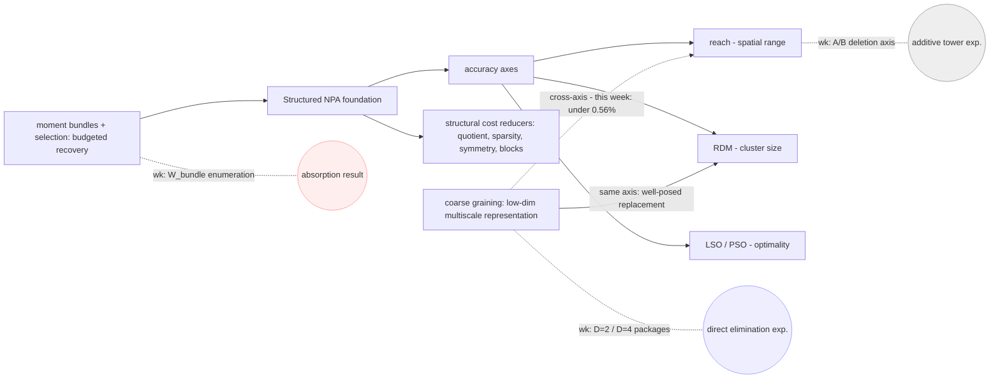

# Campaign Report — Coarse-Grained NPA for Spin-½ Ground States (Challenge #49)

Team **its-a-trap** (Yan-Bai Zhang) · Harnessing Quantum 2026 · 2026-07-30.
A standalone narrative synthesis for human readers — mentors, judges, a
physicist not on the project. It does not replace `FINAL_REPORT.md`
(the PR deliverable) and modifies nothing there. Every number traces to a
frozen CSV or a named record; claims cite the ledger
(`audit/claims_ledger.md`, C1–C21). Figures F2/F3 are generated from the
CSVs by `figs/make_figs.py`.

---

## §0 Headline

**Scoreboard in one line:** The 1e-5 accuracy threshold was met at N=100
(+9.931e-06 vs the high-precision Bethe reference, reach-extended); the
N=200 target-scale calculation remained a quantified frontier; Target 2
in-band through
J2 ≤ 0.6; Target 3 conceded on measured scaling; Target 4 delivered two
10×10 rows (one in-band, one at 1.5e-2) — plus a method campaign that
ended somewhere more interesting than its starting hypothesis.

**Finding 1 (C20).** A controlled comparison identified the coarse-map
**D-package** (PSD block dimension together with its dω-scaled link
rows) as a dominant measured contributor to realized interior-point
cost: swapping only the map package
D=2 → D=4 at fixed N, basis, level count and link family moved realized
cost from 0.87×/0.90× to 2.37×/6.80× (wall/RSS) of the comparator, while
structural size stayed below it throughout.

**Finding 2 (C19).** Direct elimination — deleted fine variables provably
never created — reached, at N=20, the campaign's first configuration
cheaper on **both** axes: structural 0.383, wall 0.75, RSS 0.51 of the
fine-rich comparator. (Series kept separate: the structural ratio is a
six-size series N=10–30 with 26/30 build-only; the realized wall/RSS
improvement is measured on the solved sizes, with the trend claim
restricted to N=14 → 20.) Spectral recovery from the eliminated region stayed
**unresolved at every tested size** (central values ≤ 0.02% of the
resolved gap; one-sided bounds are ε_cmp-limited and are not a trend).

---

## §1 The problem

Challenge #49 asks for numerical SDP **lower** bounds on ground-state
energies of spin-½ Heisenberg systems, layering coarse-graining onto the
structured NPA hierarchy of arXiv:2604.01555 (QMBCertify). Four targets:
1D Heisenberg to 200 spins at 1e-5; 1D J1–J2 to 100 spins at 1e-3; 2D
Heisenberg to 16×16 at 1e-3; 2D J1–J2 at 10×10 at 1e-2 (with the
intermediate-phase controversy of arXiv:2602.21468v4 nearby).

Reference infrastructure built for the campaign: a high-precision Bethe
reference battery with a 5-part validation gate (ED cross-check ≤ 1e-10
at N = 8–14); dense ED oracles; DMRG **variational upper bounds** at
N=100 for the J1–J2 chain; the Majumdar–Ghosh point as the one exact
anchor. Terminology is fixed by `LAW.md` and used verbatim throughout:

| output | term |
|---|---|
| SDP results | numerical SDP lower bounds |
| DMRG results | variational upper bounds |
| Bethe values | high-precision Bethe references |
| J2 = 0.5, −0.375/site (and 4×4 torus ED) | the only values called **exact** |

("Exact diagonalization" is admissible as a METHOD name; "exact" as a
VALUE descriptor remains reserved as above — the terminology grep is
applied with that distinction.)

---

## §2 The method map

**Taxonomy.** Structured NPA = foundation; reach, RDM, LSO, PSO =
accuracy mechanisms; quotient reduction, sparsity, symmetry, block
diagonalization = structural cost reducers; coarse graining = replace
expensive fine-scale information with a low-dimensional multiscale
representation; moment bundles + selection = budget-limited targeted
recovery.

**The axes.** The accuracy mechanisms live on distinguishable axes —
spatial range (reach), cluster size (RDM), optimality (LSO/PSO). Coarse
graining compresses along the cluster/level axis. As a tested design
heuristic — not a theorem — a replacement is well-posed when deletion
and compression are **axis-aligned**. This
retroactively explains the week's nulls: same-axis grafts are redundant
(the rejected lossless arm — its content was already implied by what it
was grafted onto), and cross-axis grafts recover almost nothing (a
cluster-axis tower against a reach-axis deletion: < 0.4% at N=14,
ledger C14).

**The fifth axis (measured this week).** Structural size ≠ realized
solver cost. The operative variable is the coarse-map **D-package** —
block dimension together with its dω-scaled link rows. Evidence: the
additive D=4 tower reached structural ratio 0.848 at N=20 while costing
~9× realized wall (C13); the direct D=2 layer reached structural 0.697
at realized parity, its largest block being 66 against the tower's 128
(C16, C20).

> **Long-term architecture.** A structured retained Core (small reach,
> full quotient/symmetry reductions) + a genuinely compressed coarse
> representation (axis-aligned with what was deleted, block dimension
> budgeted) + budget-selected moment bundles anchored where the deleted
> content actually lives.

---

## §3 Scoreboard

| target | required | delivered | lever | numbers | remains |
|---|---|---|---|---|---|
| T1 1D Heisenberg ≤ 200 @1e-5 | gap ≤ 1e-5 | **threshold met at N=100; N=200 = quantified frontier** | reach axis (r 5→9) | +9.931e-06 (v100e8); ladder N=50–140 at +1.638e-05…+2.476e-05 | 1e-5 unmet for N ≥ 120; N=200 = quantified frontier |
| T2 J1–J2 ≤ 100 @1e-3 | bracket ≤ 1e-3 | in-band J2 ≤ 0.6 | stock chassis, pso=0 (Remark 6.1) | +3.469e-05 / +5.006e-04 / −4.3e-09 (MG exact) / +7.616e-04; then +4.210e-03 / +6.561e-03 | frustrated side at 4–7e-3 |
| T3 2D Heisenberg 16×16 @1e-3 | bound at 16×16 | measured concession | — | L=4 −0.7024963 valid vs exact torus ED −0.7017802; L=6/8 scale rows (basis 20854→30928) | 16×16 conceded on hardware grounds |
| T4 2D J1–J2 10×10 @1e-2 | bound at 10×10 | two rows | stock 2D chassis + upstream patch | j02 −0.6007562490 (≈3.3e-3, in-band); j05 −0.5116536004 (≈1.5e-2, outside) | j05 out of band |

**T1.** The reproduction ladder (CONFIG A, r=5) sits at 1.6–2.5e-05 for
N = 50–140; the single reach-extended cell at N=100 crosses the target.
N=200 is documented as a frontier in one-sided language only: CONFIG A
construction exceeded 11.7 h without starting a solve; the 64-core
V_{S*}(200) build exceeded 6 h at 182 GB without completing; the
128-core probe exceeded its 6 h template limit at MaxRSS 174 GB still in
construction. The matched pair (job 23009660, 24 h wall) is RUNNING as
of writing (~9.6 h); its release is governed by the mechanical rule — a
post-deadline result goes to PR discussion, never into these tables.

**T2.** Brackets are formed against our own DMRG variational upper
bounds; the MG point lands at −4.3e-09 against the exact −0.375. The
frustrated side is reported signed and out-of-band, honestly.

**T3.** The upstream `lattice="square"` bug (undefined `resort` in
QMBCertify at the pin and at HEAD) was found and patched externally
(`hpc/2d/resort_patch.jl`; issue to the authors). The concession is
measured, not asserted: basis rows grow 20854 → 30928 from L=6 to L=8
against a wall/RSS budget crossed well before 16×16.

**T4.** On the controversy: our J2=0.5 row **brackets published
variational energies and excludes none** — the lower bound makes no
phase claim.

---

## §4 How measurement moved us across the map

Organized by premise falsification, not chronology.

**1. The reproduction gap → H_reach → confirmed.** Our CONFIG A cell at
N=100 gave +2.364e-05 against the Bethe reference, where the paper's own
Table 3 value corresponds to +8.2e-06 (the paper's N=100 value
−0.4432378 recomputed against our high-precision Bethe reference; the
paper's own quoted figure is 8.3e-6 against its reference). The hypothesis that the deficit
was **basis undercoverage in spatial range** — not solver, not
tolerances, not the other knobs (their measured deltas: ~1e-8, at the
tolerance floor) — predicted that raising reach alone would close it.
It did: r 5→9 at N=100 gives +9.931e-06, meeting the bar (C1, C11).

**2. The two walls.** The memory mechanism CLOSED: the footprint floor
is set by pso × reach (the pso family at N=100 pins ~110 GB, and
rdm 10→8 saves ≲3 GB — HISTORY.md queue records); this reads directly
onto the paper's 1 TB footnote and Remark 6.1's pso=0 advice. The time
frontier stayed OPEN, with three one-sided points (§3-T1) — stated as
"exceeded X without completing", never as cost estimates.

**3. The additive era.** A finite-depth dual-parity specialization of
the functional hierarchy proposed in Sec. III-D-2 — **which its authors
state they leave for future work** — was built (depth n=6; not a full
implementation of Eq. 42) and gate-chain verified: lossless oracle 2.78e-10,
flow compatibility 1.1e-16, ED substitution on every block and link,
mutation red-tests. Then came two nulls, and the sentence that orders
them: **the first null taught the mechanism; the mechanism predicted the
second null and its N-trend; both hit** (recovery < ~0.56% at N=14,
< ~0.14% at N=20 — one-sided, ε_cmp-limited). The Q&A guard, verbatim:
this is NOT a refutation of the scheme — a specific specialization was
tested; depth, optimized coarse-grainers (§IV-B), and the standalone
Eq. 42 formulation remain untested; the deeper-tower attempt passed
validity (1792 link rows ≤ 1.7e-15) and crossed the 18 GiB resource
frontier (C14, C15).

**4. C13: the graft cannot net-reduce.** Counting on the stripped
chassis (read-only build probes): deleting the rdm family saves ~4.5k
PSD scalars, while the depth-6 tower costs ~49.5k, N-independently; the
full bundle pool adds 55 (0.08% of the model). And the observed 16.9 GB
sat mid-**solve**, not mid-build (all builds ≤ 1.4 GB). An additive
graft that costs 10× what deletion saves cannot net-reduce — hence the
elimination thesis: **x_fine → x_retained ⊕ x_coarse** (diagnostic
extract §1; C13).

**5. Operational replacement on the reach axis.** The four-hour
experiment: structural ratio 1.447 → 0.848 → 0.610 → 0.530 over
N = 14/20/26/30 — a **structural crossover** between N=14 and 20 —
while realized cost stayed at 9–10.7× wall. That decoupling is the
fifth axis of §2 (C13, C19-context).

**6. Direct elimination.** Architecture green: deleted words
machine-proven never created (post-extension basis ≡ frozen hashed
allowlist; seam admits nothing); map certificate isometry 5.1e-16, flow
identity 0.0; mutation red. Result: **30.3% structural reduction at
realized parity** (N=10), then the N-extension curve to the N=20
double-axis point (0.383 / 0.75 / 0.51). C20 substantially narrows C13's mechanism
via two controlled contrasts: the package contrast (D=2 → D=4 at fixed
everything else) responds ≈ 2.4× wall / 6.8× RSS, and the architecture
contrast (one-level registry vs the depth-6 tower) accounts for the
residual ≈ 4.5× wall / 1.7× RSS — **the package contrast shows a
memory-dominant response, the architecture contrast a time-dominant
one** (C16, C19, C20).

**7. The correction channel — untested twice, for two different
reasons.** On the additive chassis the pool arms were **ED-admitted
first** (gate green, mutation red at +0.563), then hit the 18 GiB
frontier — admitted, resource-limited. On the direct chassis the
declared bundle was **structurally absorbed by the retained closure**
(W_bundle = ∅ exactly; D ≡ C to 1e-11) — no independent test. The
closure-intersection criterion followed, and C21's enumeration closed
it: 4 bundles × 4 sizes, all W_bundle = 0. W_D anchoring is the
recommended construction, **conditional on enlarging the coefficient
space**. Verbatim boundary: W_bundle = 0 excludes new coefficient-space
variables, not new constraints; the tightening power of the bundle LMI
is not settled by this enumeration.

**Bets before cards.** (Provenance discipline: several pre-registrations
were issued in the arbiter's execution directives (chat) before the data;
where so, the earliest committed quotation is cited and the chat
precedence is stated honestly — the table's force is a verifiable
"before".)

| pre-registration (written before the data) | provenance | outcome |
|---|---|---|
| R_cost > 1 at N=14 is the expected intercept; the trend is the result | chat-issued 13:2x, before the 13:33 builds; earliest committed quotation: results/SUMMARY.md @ 06e335f (14:44) | HIT — crossover between N=14 and 20 (1.447 → 0.848) |
| η_CG ≈ 0 with the bound tightening with N (window geometry) | chat-issued 14:5x concurrently with the bound computation; committed in SUMMARY.md @ 5079129 | HIT at 2 points (0.557% → 0.139%), consistent-with |
| D-package drives realized cost by order of magnitude | chat-issued ~16:2x (tier plan T5), before the 17:2x C4 solve; committed quotation: direct/EXTENSION_SUMMARY.md @ 9ff49fd | HIT in direction (2.37×/6.80×); D=2 landed at parity — better than predicted |
| W_bundle(B_half) nonempty by N=14–20; edge bundles empty | chat-issued ~16:2x (tier plan T2), before wbundle ran 17:05; committed: EXTENSION_SUMMARY.md @ 9ff49fd | MISS / HIT — the falsification that produced C21 |
| F0 kill-switch for the additive hybrid (ΔCG unresolved at both D ⇒ zero scale cells, no claim) | committed record: M2 verdict 5e89867 + Wednesday snapshot of record | **FIRED AS DESIGNED** |
| state-picture F-line gate sequence F0–F2 | parked at 0bf8663 | never fired — F1 never ran; parked INCOMPLETE/non-gating. (Kept split from the row above: the earlier draft merged the two under one "F0" — a naming collision; the record-over-directive discipline caught it.) |

Self-falsified premises of the campaign (each killed by its own
measurement): the **r-scan chassis attribution** — "the reach scan ran on
rdm=false" — falsified, it ran rdm=8; the fix (reach) worked while the
hypothesis about the chassis was wrong — the cleanest specimen of the
class · knob-attribution of the Table-3 deficit (killed by ~1e-8 deltas)
· the ≥500 GB N=200 memory-wall projection (runs were time-limited at
174–182 GB) · "construction cost is N-independent" (an N ≤ 50 artifact;
11.7 h at N=200) · the seam-growth attribution for the 17 GB (killed by
≤1.4 GB builds) · W_bundle non-collapse (C21).

One decision marks the middle of the week: on Wednesday the method
became the center of the campaign, and the stock lane's report role was
deliberately reduced to wall evidence and H_reach confirmation.

---

## §5 What exists

Modules (in PR unless noted): `cg_hybrid/gsb_cg.jl` — sha-pinned textual
fork with one untyped seam hook · `rg_selection/src/*` — single builder,
Γ₂ bundles, tower spec, V1–V4 battery, semantic hashes ·
`cg_hybrid/tower_gen.jl` + `vumps_tensor.jl` + persisted D=2/D=4 maps
with gate logs · `rg_selection/direct/*` — partition, coarse registry,
G0–G5 gates, arms, N-extension · gate harnesses (G0–G4b, R-gates, degate,
gateN/dgate) · Bethe reference solver + 5-part battery · DMRG reference
runner · the upstream `resort` patch (`hpc/2d/resort_patch.jl`) · audit
package (`audit/`: claims ledger C1–C21, provenance, gates.json, 46+
commit list) · CSV families: `freeze/MASTER.csv` (74 rows),
`rg_selection/results/*` (training/gates/vcheck/holdout/replacement),
`rg_selection/direct/*` (build/solve/gates/wbundle) · figures + generator
(`figs/`). Outside the repo: the arbiter diagnostic extract and the
campaign inventory (`~/diag_extract.md`, `~/campaign_inventory.md`).
`REPRODUCE.md` does **not** exist yet; a minimal version (environment
manifest + per-table command index pointing at RESULTS.md §protocol)
rides the pair-harvest revision or PR discussion — the one open
packaging obligation from the Thursday master.

---

## §6 The program (forward; every item gated)

- **Axis-aligned replacement**: delete the rdm family and replace along
  the SAME (cluster) axis with a depth-M tower; pre-registered
  question: test whether recovery becomes resolved at M ≥ 10. Gate: build-only cost
  scan first; the depth admission law as used for C10.
- **Block-dimension-weighted cost budgets**: scalar count is an
  unreliable proxy when block-dimension distributions differ (C13/C20);
  every future budget weighs blocks super-linearly.
- **First-order / chain-KKT solver** as load-bearing, not fallback — the
  need is now quantified at two sizes by C20's contrasts; NO first-order
  solver was benchmarked in this campaign.
- **W_D-anchored correction registry**: the 55 enumerated classes at
  N=10 give the anchoring set — conditional on the objective being to
  enlarge the coefficient space (C21 boundary).
- **Selection objective**: marginal tightness per unit closure growth,
  replacing geometric-distance pool design.
- **Equivariant coarse-grainer** (Kull App. C) for sectorization, so
  compression preserves the symmetry reductions instead of fighting them.
- arXiv:2607.14755, one paragraph, exactly four clauses: moment
  contributions are non-uniform and non-additive; it shows directly on
  the 1D Heisenberg chain (N=9, 10) that the local basis is compressible
  but not globally optimal; this motivates budget-aware selection over
  local cones as a future direction; this work implements none of
  PT/RBM/BO and computes no marginal synergy.
- **Upstream issue filing** for the `lattice="square"` `resort` bug,
  with the patch attached.

---

## §7 Pointers

`audit/claims_ledger.md` (C1–C21; this document adds no claims) ·
CSV families as listed in §5 · the method taxonomy lives in §2 of this
document (no separate METHOD_TAXONOMY.md exists) · design post-mortem
items of record: the gate-harness **top-level soft-scope defect recurred
three times** (degate, direct G4, gateN) — each instance failed CLOSED;
a fail-OPEN variant is the live risk and the pattern needs a structural
fix; the N=12 C-solve's ED gate is **retroactive** (passed post hoc,
residual 1.4e-16).

## Figures

- **F1** — the method map (mermaid, §2).
- **F2** — `figs/F2_rcost.svg`: R_cost(N); structural series N=10–30
  (hollow = build-only), realized wall/RSS on solved sizes only.
- **F3** — `figs/F3_t1_frontier.svg`: the (N, gap) frontier for T1 with
  the r=9 point marked against the 1e-5 line.
