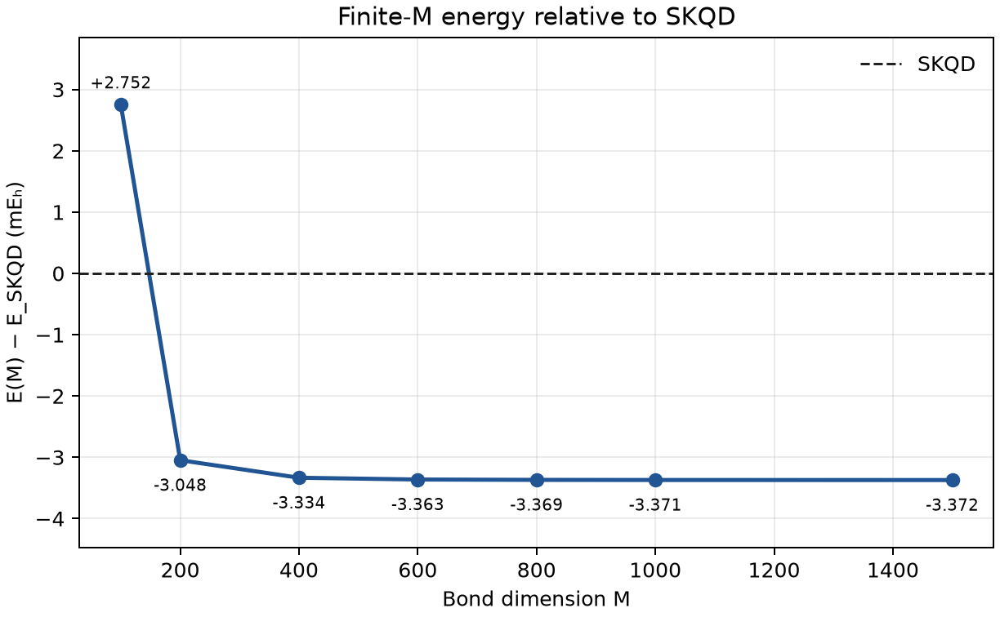

# Anderson GA-DMRG M=1500 result bundle

This compact bundle preserves the final local finite-M comparison without
committing the 65 MB block2 MPS checkpoint or the source FCIDUMP.

## Headline

- Input SHA-256:
  `9c8ceb3faa39ccb9cf2c15632cdc748e449cf26197ee1e8251092a6bb49ce4b6`
- Sector: 32 spatial orbitals, 32 electrons, `MS2=0`, SU(2) spin 0
- Ordering: saved 64-start GA permutation
- Bond dimensions: 100, 200, 400, 600, 800, 1000, 1500
- Saved-MPS expectation at M=1500:
  `−62.260053669390740 E_h`
- Difference from SKQD:
  `−3.371840993698 mE_h`
- M=1500 stage: 888.421 s, 7838.953 MB RSS, discarded weight
  `9.552999036796187e-09`

The independently reloaded checkpoint reproduced the headline within
`7.105427357601002e-15 E_h`, with norm `0.9999999999999981`.
The fixed eight-sweep schedule did not meet the strict `1e-9 E_h` sweep
stopping criterion; the final sweep changed by about `8.93e-8 E_h`.

## Files

- `result.json` — complete finite-M stage table and headline
- `checkpoint-verification.json` — independent checkpoint reload
- `skqd-comparison.csv` — all local energies relative to SKQD
- `sweeps.csv` — sweep-level energies and discarded weights
- `skqd-comparison.png` — direct finite-M comparison with SKQD
- `convergence.png` — energy and truncation trends

