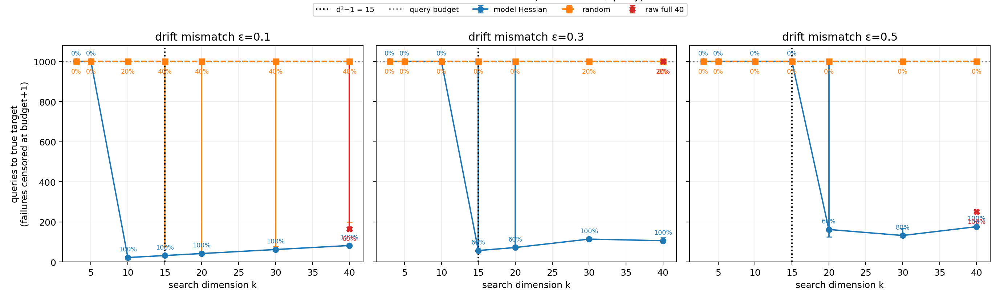
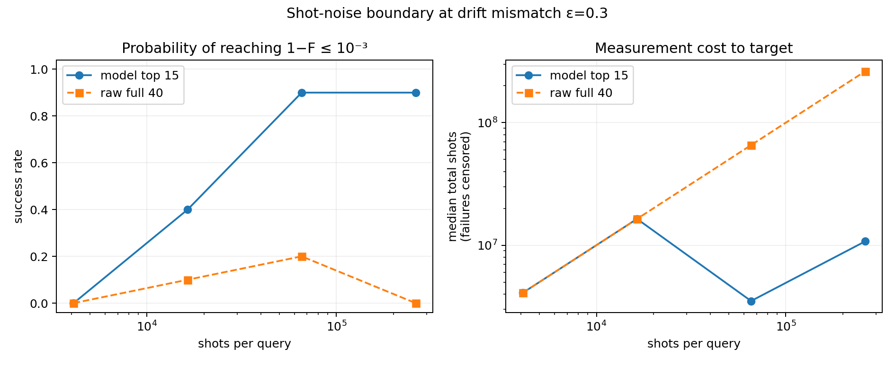
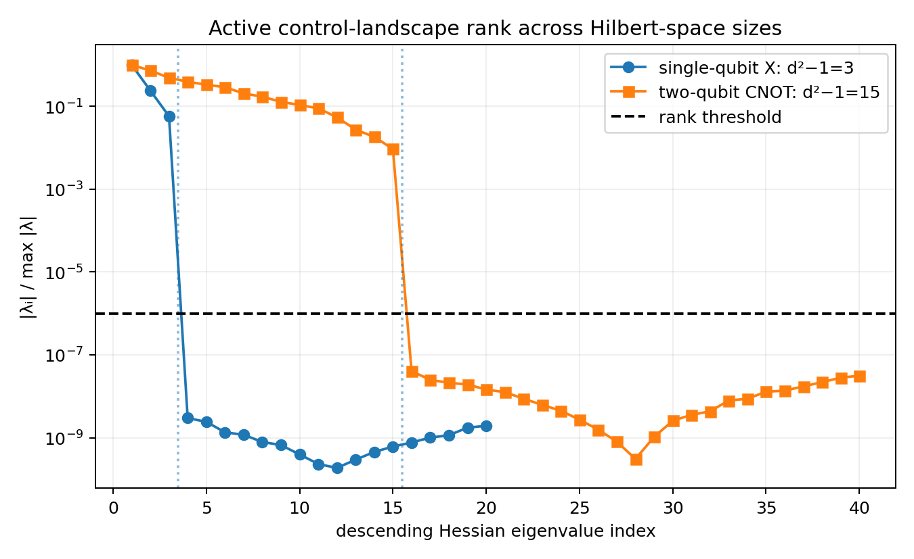

# Sim-to-Real Quantum Gate Calibration

## Team

| | |
|---|---|
| **Team name** | Fermichen99 |
| **Members** | [@Fermichen99](https://github.com/Fermichen99) |
| **Challenge** | [#113 — Sim-to-Real for Quantum Gates](https://github.com/QuantumBFS/quantum.harness/issues/113) |
| **Track** | Quantum control · differentiable programming |

This is a reproducible, query-counted implementation of the challenge's
three-stage pipeline:

1. optimize a Fourier pulse in a differentiable model;
2. extract its active Hessian directions, either explicitly or with
   Hessian-vector products (HVPs) and a Krylov eigensolver;
3. warm-start a strictly query-only, finite-shot device and calibrate it with
   derivative-free optimization.

The model and device are separate objects. Closed-loop optimizers receive only
one reported scalar infidelity per query. The simulator's exact fidelity is
retained only for offline scoring and is never exposed to the optimizer.

## Main result



For a two-qubit CNOT (`d=4`, 40 Fourier parameters), 65,536 shots/query and
five seeds:

| Drift gap | Model subspace | Success | Median queries to `1−F ≤ 10⁻³` | Raw 40-dimensional baseline |
|---:|---:|---:|---:|---:|
| `ε=0.1` | `k=15` | 5/5 | 32 | 3/5; median 165 |
| `ε=0.3` | `k=15` | 3/5 | 57, with failures censored | 1/5 |
| `ε=0.3` | `k=30` | 5/5 | 114 | 1/5 |
| `ε=0.5` | `k=15` | 0/5 | failure | 5/5; median 251 |
| `ε=0.5` | `k=30` | 4/5 | 132 | 5/5; median 251 |
| `ε=0.5` | `k=40`, Hessian ordered | 5/5 | 176 | 5/5; median 251 |

The useful conclusion is not merely “15 directions work.” The experiment
locates a boundary:

- with a small gap, `d²−1=15` is both sufficient and about five times cheaper
  than raw full-space calibration;
- with a moderate gap, carrying extra model directions restores reliability;
- with a large gap, the fixed top-15 subspace fails even though a privileged
  noiseless optimizer proves that it remains geometrically capable of reaching
  the gate. The practical failure is noise and conditioning, not simple
  reachability.

Random subspaces are a real baseline, not a placeholder. At `ε=0.3`, all five
random trials failed for `k≤20`, while the Hessian-informed runs succeeded in
3/5 trials for both `k=15` and `k=20`.

## Noise and invariant checks



At `ε=0.3`, the top-15 success rate rose from 0/10 at 4,096 shots/query, to
4/10 at 16,384, and 9/10 at both 65,536 and 262,144. The raw 40-parameter
search reached at most 2/10 in the same sweep. More shots are not free: the
reported artifacts include both query counts and total measurement shots.



The active-rank prediction was checked on two systems:

| Gate | `d` | Pulse parameters | Predicted `d²−1` | Hessian rank | Endpoint-Jacobian rank |
|---|---:|---:|---:|---:|---:|
| single-qubit X | 2 | 20 | 3 | 3 | 3 |
| two-qubit CNOT | 4 | 40 | 15 | 15 | 15 |

The explicit two-qubit Hessian subspace and the HVP/Krylov subspace agree to
numerical precision.

## Reproduce

From the repository root:

```bash
make install jax EXTRA=cpu
uv pip install --python .venv/bin/python \
  -r tracks/qcs/solutions/Fermichen99/requirements.txt

.venv/bin/python tracks/qcs/solutions/Fermichen99/run_calibration.py
.venv/bin/python tracks/qcs/solutions/Fermichen99/run_reachability.py
.venv/bin/python tracks/qcs/solutions/Fermichen99/run_dimension_sweep.py
.venv/bin/python tracks/qcs/solutions/Fermichen99/run_noise_sweep.py
.venv/bin/python tracks/qcs/solutions/Fermichen99/run_invariant_check.py

.venv/bin/python -m unittest discover \
  -s tracks/qcs/solutions/Fermichen99/tests -q
```

The scripts write full per-run data under `tracks/qcs/results/`, which is
intentionally gitignored. Compact summaries and figures from the reference run
are committed in [`artifacts/`](artifacts/).

The reference CPU run used Python 3.13.5, JAX 0.7.1, NumPy 2.2.5, SciPy 1.15.3,
and Matplotlib 3.10.3. The complete calibration, reachability, dimension,
noise, and invariant metadata are in the committed `*_run.json` files.

## Source map

| File | Purpose |
|---|---|
| `sim_to_real.py` | dynamics, unitary integrators, model construction, mismatch, strict black-box device |
| `landscapes.py` | Hessian, HVP/Krylov extraction, endpoint Jacobian, subspace diagnostics |
| `optimizers.py` | differentiable diagnostics, COBYQA and SPSA query-only baselines |
| `run_calibration.py` | notebook reproduction and numerical calibration |
| `run_reachability.py` | privileged mismatch/reachability screen |
| `run_black_box.py` | focused simple-baseline comparison |
| `run_dimension_sweep.py` | headline dimension/gap experiment with seeds and error bars |
| `run_noise_sweep.py` | shot-budget experiment |
| `run_invariant_check.py` | `d²−1` check for `d=2` and `d=4` |
| `REPORT.md` | methods, results, interpretation, and limitations |

## Scope and honest failure

This submission uses a software black box with drift mismatch
`H₀,true = H₀ + εV`; it does not claim a real-hardware run. The finite-shot
oracle samples the trace fidelity as a binomial probability, which is a useful
controlled noise model but not a complete randomized-benchmarking protocol.

The top-15 reduction fails at `ε=0.5` under finite shots. Widening to 30
directions recovers most trials, while the full search recovers all of them at
roughly twice the median query count. That failure is part of the result rather
than being hidden by optimizer tuning.
