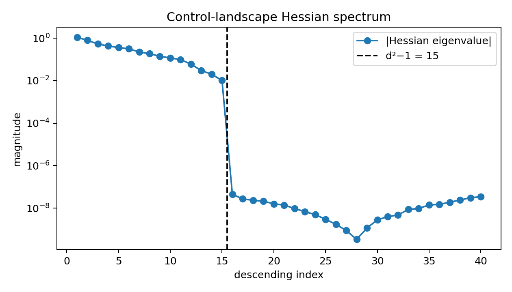
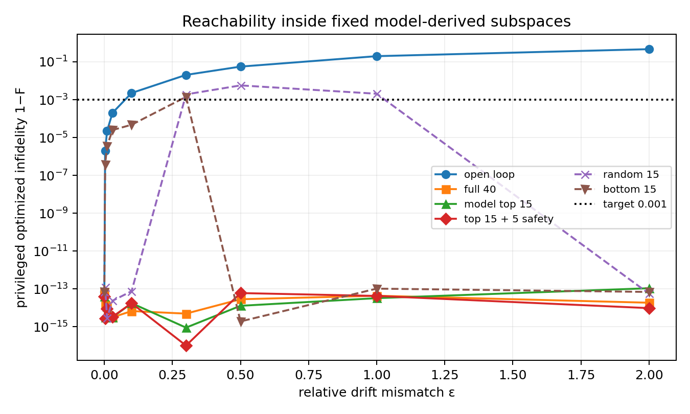
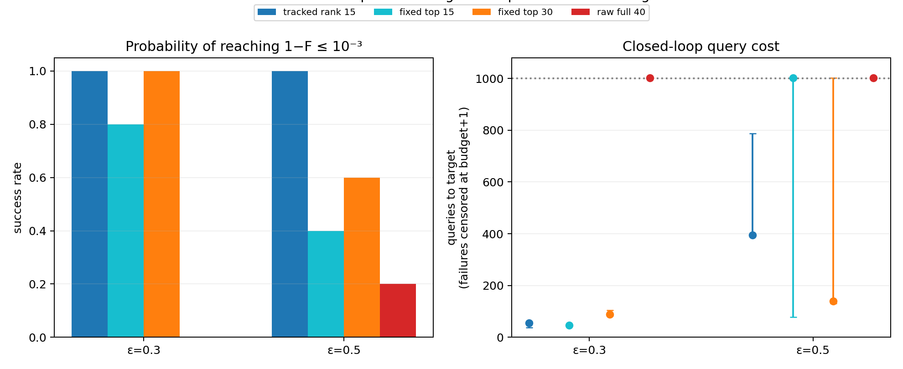
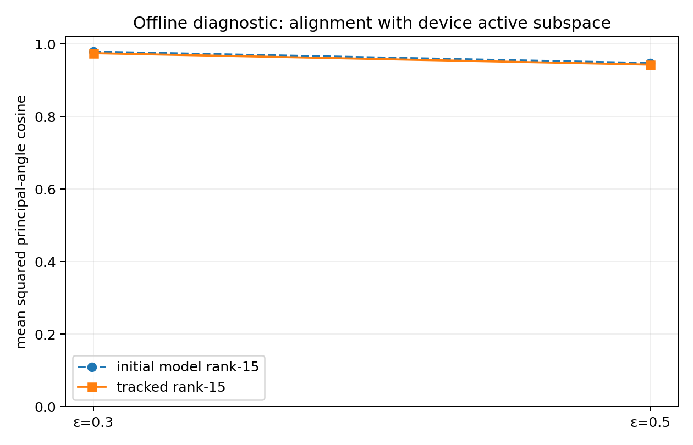

# Report: when model Hessian directions transfer to a noisy device

## Question

Can the `d²−1` active directions of a model-optimal quantum-control landscape
reduce the number of expensive device experiments, and where does that
advantage fail as model mismatch and shot noise grow?

The study starts from the challenge notebook's two-qubit CNOT problem: four
random Hermitian controls, a random drift Hamiltonian, ten sine coefficients
per control, total time `T=1`, and 40 real pulse parameters. The objective is
the phase-insensitive trace infidelity

```text
L(θ) = 1 − |Tr(U(θ)† U_target)| / d.
```

The success threshold is `L ≤ 10⁻³`.

## Protocol

### Differentiable model

The model uses the notebook's seed 42 Hamiltonians and Fourier pulse. Evolution
uses a midpoint product of matrix exponentials:

```text
Uₙ₊₁ = exp(−i H(tₙ₊½; θ) Δt) Uₙ.
```

Every step is unitary up to matrix-exponential roundoff. The implementation
also retains the notebook's adaptive `odeint` backend as an independent
cross-check.

The model optimum is found with JAX gradients and BFGS. Landscape directions
are extracted in two ways:

- an explicit 40×40 Hessian for validation;
- forward-over-reverse HVPs exposed as a SciPy `LinearOperator`, followed by
  the symmetric Krylov solver `eigsh`.

The endpoint Jacobian is expressed in an orthonormal generalized Gell-Mann
basis after removing global phase. It independently measures the reachable
local `su(d)` tangent space.

### Simulated true device

The device differs only through a controlled drift perturbation:

```text
H₀,true = H₀ + εV,
Tr(V) = 0,
V = V†,
‖V‖F = ‖H₀‖F.
```

The same `V` (seed 113) is used across the `ε` sweep so that increasing `ε`
changes magnitude rather than direction.

`BlackBoxDevice.query(θ)` is the only closed-loop interface. One query:

1. evaluates the private true-device fidelity;
2. optionally draws `successes ~ Binomial(shots, F)`;
3. returns only `1 − successes/shots`;
4. increments both query and shot counters.

Exact fidelity is logged only as latent simulation truth for scoring. No
closed-loop optimizer receives a gradient, Hamiltonian, exact fidelity, or
unreported device state.

### Comparisons

The primary finite-shot experiment uses COBYQA, 65,536 shots/query, a
1,000-query cap, and five seeds. It compares:

- the leading `k` model Hessian eigenvectors for
  `k ∈ {3,5,10,15,20,30,40}`;
- independently seeded random `k`-dimensional subspaces;
- the raw 40 pulse coordinates.

Failures are right-censored at 1,001 queries in the median/IQR plot. Success is
defined by the latent true fidelity for honest offline scoring. A noisy
single-query threshold crossing is not used for early termination.

## Numerical calibration

The structure-preserving model reached `L = 6.74×10⁻¹⁴`; the notebook-style
ODE optimization reached `2.93×10⁻⁹`. At the structure-preserving optimum:

| Diagnostic | Value |
|---|---:|
| `‖U†U−I‖F` | `8.67×10⁻¹⁵` |
| 256-step loss | `6.73×10⁻¹⁴` |
| 512-step loss | `9.24×10⁻⁹` |
| high-accuracy ODE loss | `1.67×10⁻⁸` |
| phase-aligned 256→512 unitary difference | `2.72×10⁻⁴` |
| phase-aligned 512→ODE unitary difference | `9.05×10⁻⁵` |
| `|λ₁₅|/|λ₁₆|` | `2.30×10⁵` |
| Hessian/endpoint-Jacobian mean subspace overlap | `0.9999999999998` |
| explicit-Hessian/HVP-Krylov mean overlap | `≈1` |

Thus the integrator error is many orders below the `10⁻³` target, and the
15-direction spectral split is not a discretization artifact.



## Result 1: geometry alone does not cause the observed failure

The privileged screen optimizes the simulated true loss with exact gradients.
It is diagnostic only; it is not counted as a black-box result.

Open-loop transfer stops meeting the target between `ε=0.03`
(`L=2.01×10⁻⁴`) and `ε=0.1` (`L=2.25×10⁻³`). Meanwhile, the true top-15
subspace rotates strongly:

| `ε` | Open-loop `L` | Mean model/true top-15 overlap | Largest principal angle |
|---:|---:|---:|---:|
| 0.03 | `2.01×10⁻⁴` | 0.9994 | 4.17° |
| 0.1 | `2.25×10⁻³` | 0.9934 | 14.52° |
| 0.3 | `2.04×10⁻²` | 0.9132 | 78.73° |
| 0.5 | `5.60×10⁻²` | 0.8803 | 85.91° |
| 2.0 | `4.68×10⁻¹` | 0.6409 | 85.57° |

Despite that rotation, exact-gradient optimization inside the original model
top-15 subspace reached numerical-zero loss for every tested `ε≤2`. Therefore
the finite-shot failure at large `ε` is not captured by a binary
“subspace can/cannot reach the target” story. The model subspace becomes badly
conditioned and hard to identify from noisy scalar evaluations before it
becomes strictly incapable.



## Result 2: the dimension sweet spot moves with the gap


At `ε=0.1`, `k=10` already reaches the operational `10⁻³` threshold in all
trials, but `k=15` is the first dimension that resolves all local `su(4)`
directions. It succeeds in 32 queries for every seed. The raw full search
succeeds in 3/5 trials with a median of 165 queries, a factor of about 5.2 in
query count and total shots.

At `ε=0.3`, top-15 succeeds in 3/5 trials. A five-direction safety margin does
not change that success rate in this sample, but `k=30` restores 5/5 success
with median 114 queries. Raw full search succeeds in only 1/5 trials.

At `ε=0.5`, top-15 fails in all trials. The model-ordered success rates are
3/5 at `k=20`, 4/5 at `k=30`, and 5/5 at `k=40`; raw full search is 5/5.
Among the reliable full-span variants, Hessian ordering reaches the target in
median 176 queries versus 251 for raw coordinates.

This supports a practical rule: start near `d²−1`, but widen when repeated
finite-shot runs plateau above target. The model eigenvalue order remains
useful even after the strict low-dimensional reduction has failed.

## Result 3: shot noise defines a second boundary

At fixed `ε=0.3`, ten trials per shot budget give:

| Shots/query | Top-15 success | Raw-40 success | Top-15 median queries among successes |
|---:|---:|---:|---:|
| 4,096 | 0/10 | 0/10 | — |
| 16,384 | 4/10 | 1/10 | 44 |
| 65,536 | 9/10 | 2/10 | 51 |
| 262,144 | 9/10 | 0/10 | 40 |

The raw optimizer's non-monotone success rate is an honest indication of
optimizer instability; these ten-seed samples do not justify claiming strict
monotonicity. The robust conclusion is that reducing the search to the model
top-15 directions dramatically improves finite-shot success throughout the
tested range.


## Result 4: `d²−1` is observed for two system sizes

The same seeded construction was run for a single-qubit X gate with 20 pulse
parameters and a two-qubit CNOT with 40:

| Gate | `d²−1` | Observed Hessian rank | Endpoint-Jacobian rank | Spectral gap after predicted rank |
|---|---:|---:|---:|---:|
| X | 3 | 3 | 3 | `1.94×10⁷` |
| CNOT | 15 | 15 | 15 | `2.30×10⁵` |


## Result 5: device feedback can recover the right 15 directions

The dimension sweep above is diagnostic: it identifies where fixed top-`k`
subspaces work, but permanent widening is not scalable. The final method
instead performs staged optimization on a rank-15 basis. After an unconfirmed
stage it introduces two temporary orthogonal scouts and estimates the
restricted Hessian

```text
        [ diag(λactive)     0.2 Cᵀ ]
Hlocal ≈ [                           ],
        [    0.2 C       diag(λscout)]
```

where each element of the `15×2` cross block `C` is obtained by a four-point
mixed finite difference. The factor 0.2 is a conservative shrinkage prior:
finite-shot sensitivity tests showed that replacing the model basis
aggressively degrades its already-good alignment. Diagonal second differences,
four center repeats, and all mixed differences make one update cost
`4 + 2(15+2) + 4·15·2 = 158` device queries. The leading 15 eigenvectors of
this 17-dimensional local matrix define the next basis; the deployed search
dimension therefore never exceeds 15.

The optimizer uses only noisy reported query values. Four repeated
measurements and a one-sided Wilson upper bound decide whether a stage has
reliably crossed `L≤10⁻³`. Exact fidelity and endpoint-Jacobian overlaps are
computed only afterward for offline scoring.

At 65,536 shots/query, five seeds, and a 1,000-query cap:

| `ε` | Tracked rank 15 | Fixed top 15 | Fixed top 30 | Raw 40 |
|---:|---:|---:|---:|---:|
| 0.3 | **5/5**, median 55 | 4/5, median 46 censored | 5/5, median 89 | 0/5 |
| 0.5 | **5/5**, median 394 | 2/5 | 3/5, median 140 censored | 1/5 |

At `ε=0.5`, every tracked run succeeded, including two that required both
rank-preserving updates. The median final offline subspace overlap was 0.944,
close to the initial 0.948; this is expected because each update explores only
two new directions and is deliberately conservative. The large reliability
gain despite a small global-overlap change shows that correcting a few
optimization-relevant directions matters more than replacing the whole basis.





## Interpretation

Four distinct thresholds matter:

1. **Open-loop threshold:** the model pulse itself stops meeting the true
   target near `ε≈0.1`.
2. **Efficient-calibration threshold:** top-15 remains useful at `ε=0.3` but
   requires more shots or a safety margin for reliable success.
3. **Fixed-reduction threshold:** by `ε=0.5`, top-15 fails under the declared
   finite-shot protocol.
4. **Tracking threshold:** at the same `ε=0.5`, conservative device-side
   rotation restores 5/5 success without increasing the deployed rank.

The privileged result shows that threshold 3 is algorithmic/statistical before
it is geometric. The tracked experiment then supplies a constructive response:
use `d²−1` as a rank constraint, not as a frozen set of model eigenvectors.
Principal-angle rotation remains a useful offline diagnostic, but is not
required by the device-side algorithm.

## Limitations and next experiment

- The black box is simulated, not superconducting hardware.
- Binomial sampling of trace fidelity is a controlled noise proxy, not a full
  randomized-benchmarking or process-tomography likelihood.
- Only one Hamiltonian seed and one perturbation direction are used in the
  headline gap scan; optimizer/noise seeds provide the plotted error bars.
- COBYQA is deliberately a simple baseline. Its raw full-space behavior is
  unstable under noise, so the numbers should not be generalized to every
  derivative-free optimizer.
- The two-scout update can only correct the missing directions it samples; the
  current five-seed result is evidence for the mechanism, not a sample-complexity
  theorem.
- Cross-curvature estimation costs `O(kr)` queries per update for rank `k` and
  `r` scouts. Testing structured scouts and simultaneous estimators is the next
  route to lower constants at larger `d`.

## Reproducibility

Every long script prints progress with flushing and writes machine-readable
JSON/CSV plus figures. The committed compact artifacts contain the exact
reference-run settings, environment, aggregate statistics, and rerun commands.
Raw per-query and per-trial results are generated under the gitignored
`tracks/qcs/results/` directory.
