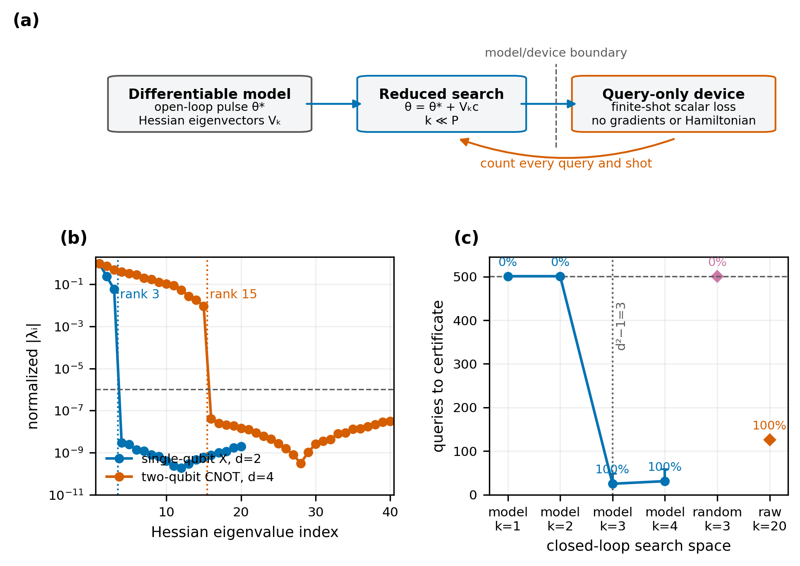
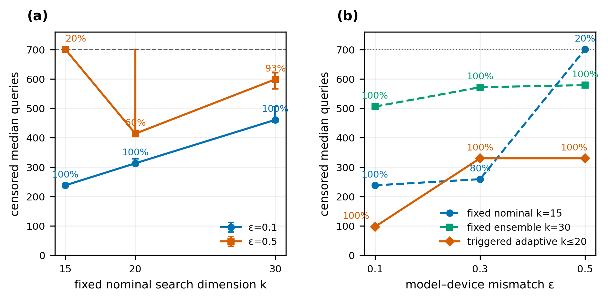

# Query-efficient sim-to-real calibration of quantum gates

Final report for
[Quantum Harness challenge #113](https://github.com/QuantumBFS/quantum.harness/issues/113).

## Abstract

Closed-loop quantum-gate calibration can correct an imperfect device model,
but each derivative-free objective evaluation consumes physical experiments
and measurement shots. Challenge #113 proposes using the model Hessian at an
open-loop optimum to restrict this search to the `d²−1` pulse directions that
carry local gate curvature. We test this statement for a single-qubit X gate
and a two-qubit CNOT with a strict model/device boundary and finite-shot scalar
feedback. The observed model-Hessian ranks are 3 and 15, respectively, as
predicted. For the single-qubit gate at drift mismatch `ε=0.3`, the informed
three-dimensional search certifies all 15 trials in a median of 25 queries,
compared with 126 queries in the full 20-dimensional space; a random
three-dimensional space certifies none. For the CNOT, however, a fixed
15-dimensional nominal basis loses reliability as mismatch grows. A
device-certificate-triggered `15→20` relinearization protocol certifies all 45
held-out trials at `ε=0.1, 0.3, 0.5`, with median query counts 97, 330, and 330.
Thus `d²−1` is the local physical dimension, but the orientation of those
directions in pulse space is model dependent and must be checked or updated.

## I. Problem and definitions

For pulse parameters `θ`, the controlled dynamics are

```text
H(t; θ) = H₀ + ∑ₐ uₐ(t; θ) Hₐ .
```

The target unitary is `Utarget`, the propagated unitary is `U(θ)`, and the
phase-insensitive objective is

```text
F(θ) = |Tr(Utarget† U(θ))|/d,       L(θ) = 1 − F(θ).
```

Near an optimum,

```text
Utarget† U(θ) = exp(iA).
```

Only the traceless part of the Hermitian generator `A` affects `F`; its real
dimension is `d²−1`. Consequently, in the controllable and locally
over-resourced regime, the loss Hessian has at most `d²−1` non-flat
directions, independent of the number `P` of pulse parameters.

This dimension statement is not an orientation statement. The useful
directions are vectors in the `P`-dimensional pulse space. When the device
Hamiltonian differs from the model, the true local subspace can rotate away
from the model-Hessian eigenvectors.

We represent drift mismatch by

```text
H₀,true = H₀ + ε ΔH,       ‖ΔH‖F = ‖H₀‖F .
```

Here `ε` measures Hamiltonian mismatch, not measurement noise. Every device
query separately contains finite-shot noise.

## II. Methods

### A. Three-stage pipeline

1. Optimize an open-loop pulse `θ*` using exact model gradients.
2. Compute the model Hessian or endpoint Jacobian at `θ*` and construct an
   orthonormal pulse-space basis `Vₖ`.
3. Query the device only through the reduced coordinates
   `θ = θ* + Vₖc`, using a derivative-free optimizer.

The simulated device returns only a scalar fidelity estimate from 65,536
shots. The online loop cannot access the held-out Hamiltonian, its Jacobian,
the mismatch value, gradients, or exact fidelity. Exact fidelity is retained
only for offline auditing.

### B. Search spaces

- **Fixed nominal:** the top `k` eigenvectors of the Hessian at the nominal
  model optimum.
- **Fixed ensemble:** one basis computed before device optimization by
  stacking block-normalized endpoint Jacobians from the nominal model and 15
  declared perturbation models, then taking right singular vectors.
- **Triggered adaptive:** begin with the nominal `k=15` basis. If its
  finite-shot certificate fails, evaluate the declared model ensemble at the
  device-selected current pulse, recompute a `k=20` basis, and continue.

For each mismatch value, testing uses five unseen drift seeds and three
independent shot-noise seeds, producing 15 held-out trials. Training and test
drift seeds are disjoint.

### C. Derivative-free optimization

The **five-point coordinate scan** evaluates each reduced coordinate at
offsets

```text
{−h, −h/2, 0, h/2, h},       h = 0.3.
```

A one-dimensional quadratic is fitted. If it is convex and its vertex lies
inside the interval, that vertex is queried as an additional candidate; the
best measured point is retained. This controlled-cost scan is used throughout
the single-qubit test and as the first nominal `k=15` stage of the adaptive
CNOT loop.

**COBYQA** is used for the fixed-space CNOT comparison and the adaptive
recovery stages. It builds a multivariate local quadratic model of the scalar
device loss within a trust region and therefore requires no device gradient.
Unlike independent coordinate scans, it can represent coupled motion among
the reduced coordinates.

### D. Certification and query statistics

A single noisy observation below the target is not counted as success. The
chosen pulse is measured seven more times and is certified only if the Wilson
upper bound on infidelity, implemented with `z=1.96`, is at most `10⁻³`.
This is conservative relative to a nominal one-sided 95% bound.

Every black-box call is counted. Failed trials are right-censored at one above
the declared budget: 501 in the single-qubit experiment and 701 in the CNOT
experiment. Plots show medians and interquartile ranges over 15 trials.
Percentages are certified success rates.

## III. Results

### A. Intrinsic dimension and query saving



**Figure 1.** (a) The differentiable model supplies a warm-start pulse and a
reduced basis, while only finite-shot scalar loss crosses the device boundary.
(b) At model optima, the normalized Hessian spectrum has numerical rank 3 for
the single-qubit X gate (`d=2`, `P=20`) and rank 15 for the CNOT (`d=4`,
`P=40`), using a relative threshold of `10⁻⁶`. These equal `d²−1`.
(c) At `ε=0.3`, the single-qubit nominal spaces with `k<3` fail in every trial.
The informed `k=3` space succeeds in 15/15 trials with median 25 queries, while
a random `k=3` space succeeds in 0/15. The raw `P=20` search succeeds in 15/15
but needs median 126 queries. Error bars are interquartile ranges; 501 marks
right-censored failures.

| Search at `ε=0.3` | Dimension | Certified success | Median queries |
|---|---:|---:|---:|
| Nominal Hessian | 1 | 0/15 | 501, censored |
| Nominal Hessian | 2 | 0/15 | 501, censored |
| Nominal Hessian | 3 | 15/15 | 25 |
| Random | 3 | 0/15 | 501, censored |
| Raw parameters | 20 | 15/15 | 126 |

This result answers the issue's invariant question across two system sizes and
demonstrates the requested query saving in a regime where the model directions
transfer.

### B. Failure under mismatch and adaptive recovery



**Figure 2.** (a) In the CNOT benchmark, a fixed nominal space displays a
clear cost/reliability trade-off. At `ε=0.1`, `k=15` already gives 15/15
success with median 238 queries, whereas `k=20` and 30 cost 313 and 461
queries. At `ε=0.5`, fixed nominal `k=15` falls to 3/15 success; `k=20`
reaches 9/15 and `k=30` reaches 14/15, with censored median costs 414 and 599.
(b) Fixed nominal `k=15` is economical only when transfer remains good. Fixed
ensemble `k=30` is robust but expensive. The triggered `k=15→20` protocol
certifies all 45 held-out trials with median queries 97, 330, and 330 at
`ε=0.1`, 0.3, and 0.5. Error bars are interquartile ranges; 701 marks
right-censored failures.

| Strategy | `ε=0.1` | `ε=0.3` | `ε=0.5` |
|---|---:|---:|---:|
| Fixed nominal `k=15` | 100%; 238 | 80%; 259 | 20%; 701 censored |
| Fixed ensemble `k=30` | 100%; 506 | 100%; 572 | 100%; 579 |
| Triggered adaptive `k≤20` | 100%; 97 | 100%; 330 | 100%; 330 |

The failure of fixed `k=15` does not contradict the local `d²−1` rank. It
shows that the nominal model's 15-dimensional pulse-space orientation no
longer spans the useful device correction. Increasing a fixed space recovers
reachability but spends additional queries. In this declared benchmark,
device-triggered relinearization restores reliability without searching all
40 pulse parameters.

## IV. Answer to challenge #113

The results support four conclusions.

1. The local curved dimension follows `d²−1` for the tested single- and
   two-qubit gates.
2. When the model basis is correctly oriented, it can reduce black-box query
   cost substantially: 25 versus 126 median queries in the headline
   single-qubit comparison.
3. A fixed top-`d²−1` basis is not universally robust. Drift mismatch rotates
   the useful pulse-space directions, causing a sharp loss of success.
4. The practical response is conditional adaptation, not unconditional
   expansion: attempt the smallest physically motivated space, test it with a
   device-only statistical certificate, and update the model-side local basis
   only after failure.

The central distinction is therefore:

```text
intrinsic physical dimension  ≠  model-dependent pulse-space orientation.
```

The evidence is limited to simulated drift-Hamiltonian mismatch, two gate
sizes, and the declared finite-shot protocol. It does not claim real-hardware
performance or universal robustness to every device error.

## V. Reproducibility

The version-controlled final bundle is [`final_report`](final_report/). It
contains the standalone HTML report, the structured report source, the two
figures, the plotted numerical summaries, and consolidated run metadata. The
same canonical run is also rendered under
`tracks/qcs/results/sim-to-real-challenge-report-final/`, as required by the
challenge-report workflow.

Minimal code path:

- `sim_to_real.py`: dynamics, drift mismatch, and query-only device;
- `landscapes.py`: Hessian and endpoint-Jacobian subspaces;
- `optimizers.py`: coordinate scans, COBYQA interface, and certification;
- `run_invariant_check.py`: ranks for `d=2` and `d=4`;
- `run_single_qubit_closed_loop.py`: Figure 1 closed loop;
- `run_robust_closed_loop.py`: Figure 2 fixed-space baselines;
- `run_adaptive_hybrid_closed_loop.py`: Figure 2 adaptive protocol;
- `render_paper_figures.py`: consolidated figure renderer.

Render the report with:

```bash
python3 skills/report/render_report.py \
  tracks/qcs/results/sim-to-real-challenge-report-final
```

## References

1. Z. Shen, M. Hsieh, and H. Rabitz, *J. Chem. Phys.* **124**, 204106
   (2006).
2. J. Roslund and H. Rabitz, *Phys. Rev. Lett.* **112**, 143001 (2014).
3. D. J. Egger and F. K. Wilhelm, *Phys. Rev. Lett.* **112**, 240503
   (2014).
4. N. Khaneja *et al.*, *J. Magn. Reson.* **172**, 296–305 (2005).
5. R. S. Judson and H. Rabitz, *Phys. Rev. Lett.* **68**, 1500 (1992).
