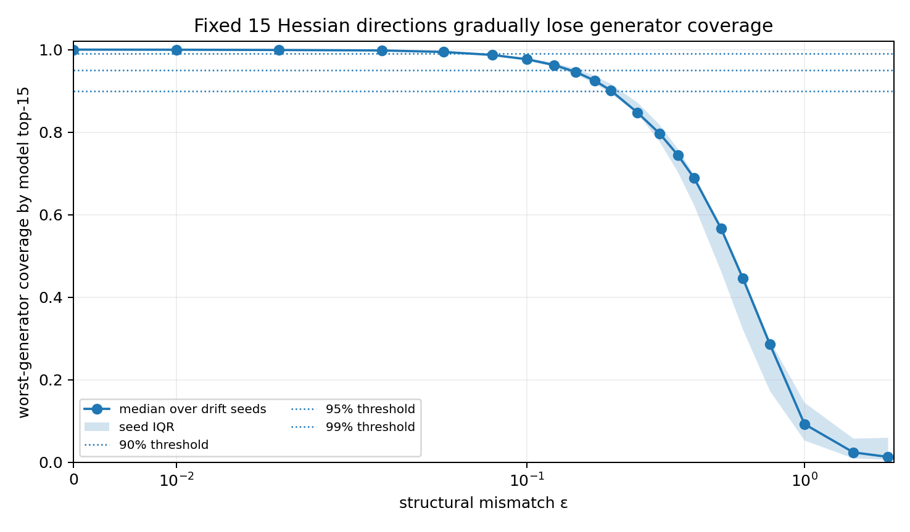
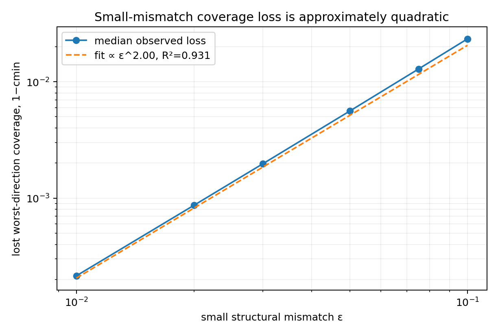
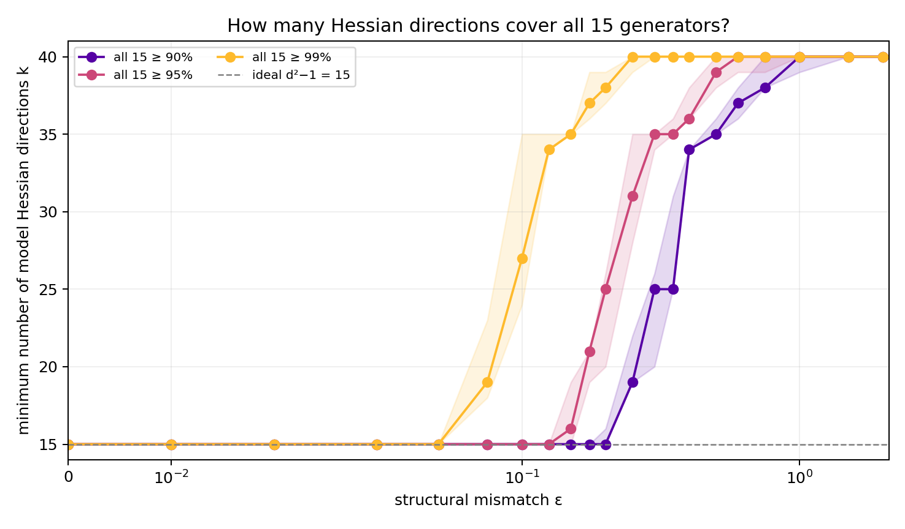
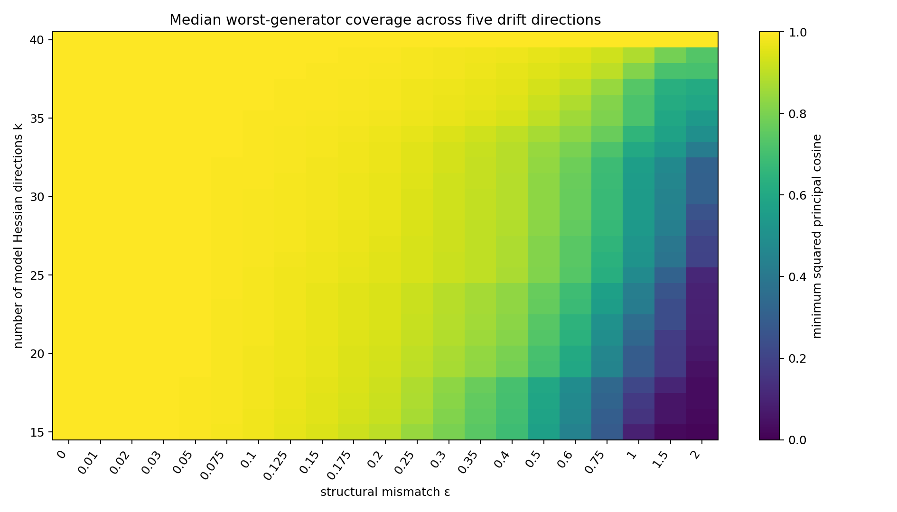

# Generator coverage under model–device mismatch

## Question

A two-qubit gate has `d²−1=15` independent phase-free generators, while the
pulse in challenge #113 has 40 Fourier parameters. At zero model–device
mismatch, the first 15 model-Hessian directions span the same parameter
subspace as the 15 endpoint-generator directions.

The question is:

> After the true generator subspace rotates, how many leading model-Hessian
> parameter directions are required to cover all 15 true generators?

This report studies structural mismatch
`H₀,true = H₀ + εV`. Here `ε` is not finite-shot measurement noise. Exact
simulated Jacobians are used to isolate the geometry before considering how to
estimate it on hardware.

## Step 1 — Confirm the baseline dimension

At the calibrated model optimum:

| Gate | `d` | Pulse parameters | `d²−1` | Hessian rank | Jacobian rank |
|---|---:|---:|---:|---:|---:|
| single-qubit X | 2 | 20 | 3 | 3 | 3 |
| two-qubit CNOT | 4 | 40 | 15 | 15 | 15 |

For the CNOT at `ε=0`, the Hessian and endpoint-Jacobian rank-15 parameter
subspaces agree to numerical precision. Thus `k=15` is both necessary by
dimension and sufficient in the matched model.

## Step 2 — Define generator coverage

Let:

- `Jtrue(ε)` be the `15×40` true endpoint Jacobian at the model-optimal pulse;
- `Rtrue(ε)` be its 15-dimensional right-singular parameter subspace;
- `Vk` contain the first `k` model-Hessian eigenvectors.

The coverage spectrum is

```text
cᵢ(k, ε) = σᵢ²(Rtrueᵀ Vk),   i=1,…,15.
```

`cᵢ=1` means complete coverage and `cᵢ=0` means a missing direction. The
worst-generator certificate is

```text
cmin(k, ε) = minᵢ cᵢ(k, ε).
```

For threshold `τ`, define

```text
kτ(ε) = smallest k such that cmin(k, ε) ≥ τ.
```

The main table uses `τ=95%`; 90% and 99% are also reported.

An exact-rank test is not sufficient here. After a generic perturbation, the
restricted `k=15` Jacobian can still have algebraic rank 15 because an
arbitrarily small nonzero projection counts as independent. The thresholded
principal-cosine certificate measures robust coverage rather than mere
nonzero rank.

## Step 3 — Hold `k=15` fixed

The formal scan uses 21 values of `ε` and five independently seeded drift
directions.

| `ε` | median worst-generator coverage with top 15 |
|---:|---:|
| 0.00 | 1.000 |
| 0.05 | 0.994 |
| 0.10 | 0.977 |
| 0.15 | 0.946 |
| 0.20 | 0.901 |
| 0.30 | 0.797 |
| 0.50 | 0.567 |
| 0.75 | 0.286 |
| 1.00 | 0.092 |



In the small-mismatch region,

```text
1 − cmin(k=15) ≈ 2.06 ε².
```

The fitted exponent is `2.000` with log-space `R²=0.931`. This agrees with
subspace perturbation: the angle changes at first order in `ε`, while lost
coverage is a squared sine and therefore starts at order `ε²`.



## Step 4 — Increase `k` until all 15 generators are covered

Every integer `k=15,…,40` is evaluated, giving 2,730 coverage measurements.

| `ε` | median `k₉₀` | median `k₉₅` [seed range] | median `k₉₉` |
|---:|---:|---:|---:|
| 0.00 | 15 | 15 [15,15] | 15 |
| 0.05 | 15 | 15 [15,15] | 15 |
| 0.10 | 15 | 15 [15,15] | 27 |
| 0.15 | 15 | 16 [15,19] | 35 |
| 0.20 | 15 | 25 [15,36] | 38 |
| 0.25 | 19 | 31 [26,39] | 40 |
| 0.30 | 25 | 35 [34,39] | 40 |
| 0.40 | 34 | 36 [35,40] | 40 |
| 0.50 | 35 | 39 [36,40] | 40 |
| 0.75 | 38 | 40 [39,40] | 40 |
| 1.00 | 40 | 40 [40,40] | 40 |





At the 95% threshold the empirical pattern is:

1. `ε≤0.10`: `k≈15`;
2. `0.15≤ε≤0.50`: rapid transition from `k≈16` to `k≈39`;
3. `ε≥0.75`: almost the full 40-dimensional parameter space is needed.

The threshold changes the exact crossing points, but not this pattern.

## Step 5 — Robustness checks

- Five independent drift directions are included.
- For every `ε` and drift seed, `cmin` is monotone non-decreasing with `k`.
- At `k=40`, all 105 `ε×seed` cases recover full coverage numerically.
- The complete seed-113 `k₉₅(ε)` curve is identical at 128, 256, and 512
  propagation steps.

Selected resolution check:

| `ε` | `k₉₅` at 128 steps | 256 steps | 512 steps |
|---:|---:|---:|---:|
| 0.10 | 15 | 15 | 15 |
| 0.20 | 20 | 20 | 20 |
| 0.30 | 34 | 34 | 34 |
| 0.50 | 36 | 36 | 36 |
| 0.75 | 39 | 39 | 39 |
| 1.00 | 40 | 40 | 40 |

## Conclusion

The number of physical generators remains 15. What changes with structural
mismatch is the number of *model-ranked Hessian parameter directions* needed
to cover those generators.

Small mismatch preserves the model top-15 space, with coverage loss growing
approximately as `ε²`. Moderate mismatch produces a rapid, seed-dependent
increase in required `k`. Strong mismatch makes the Hessian ordering
insufficient for substantial dimensional reduction.

This report deliberately stops here. It does not yet design a fixed-rank
optimizer or claim that the true generator subspace can be estimated under
finite-shot noise at the same cost.

## Reproduce

```bash
python3 tracks/qcs/solutions/Fermichen99/run_generator_coverage.py
```

The full 2,730-row table, threshold summaries, fit, figures, and metadata are
committed under `artifacts/generator_coverage_*`.
