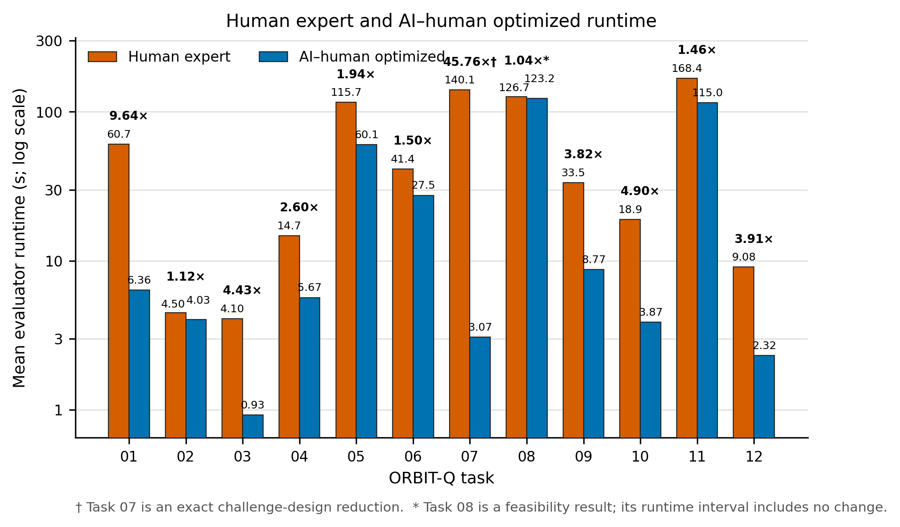

## Team

| | |
|---|---|
| **Team name** | OrbitBreakers |
| **Members** | Qingyun Qian, Muchu Chen, Huaiming Yu |
| **Repository** | [hmyuuu/OrbitBreakersBench](https://github.com/hmyuuu/OrbitBreakersBench) |

## Challenge

| Row | |
|---|---|
| **Challenge** | Improve the runtime of expert TensorCircuit-NG solutions while preserving ORBIT-Q semantics and verifier correctness (#78), and expand ORBIT-Q with difficult, automatically verifiable tasks that expose genuine quantum-programming bottlenecks (#79). |
| **Catalog issue** | Addresses #78 and Addresses #79 — both challenges were released by Shi-Xin Zhang, IOP-CAS. |
| **Track** | `qcs`, from the **Quantum Circuit Simulation** method specified by both catalog issues. |

## Submission report

The complete benchmark, expert co-optimization, ablation, and benchmark-design
findings are collected in the [OrbitBreakers final report](REPORT.md).

