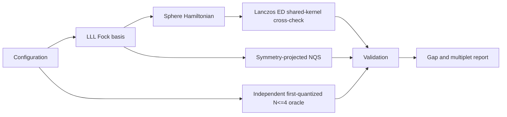
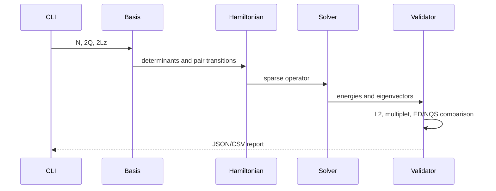

# Chiral Graviton NQS - Development Document

## 1. Objective

Solve Quantum Harness Challenge #15 for spin-polarized electrons in the lowest Landau level (LLL) on the Haldane sphere at filling `nu = 1/3`.

Primary observable:

`Delta_N = E_N(L=2) - E_N(L=0)` in units of `e^2/(epsilon l_B)`.

Flux and geometry:

- electron count: `N`
- monopole flux: `2Q = 3(N-1)`
- LLL orbital angular momentum: `l = Q`
- number of orbitals: `2Q+1`
- sphere radius: `R = sqrt(Q) l_B`
- interaction: chord-distance Coulomb, with an optional constant background that cancels in the gap

The project is not a literal reproduction of the paper's torus/disk spectral plots. The paper is the physics reference; this implementation follows the sphere/NQS acceptance criteria in Challenge #15.

## 2. Success criteria

1. Exact diagonalization resolves the lowest `L=0` and `L=2` energies. Production ED shares the Hamiltonian kernel with NQS; a separate first-quantized implementation provides an independent `N=3,4` oracle.
2. The model `V1` Hamiltonian has the Laughlin state as a zero-energy `L=0` ground state.
3. The Coulomb Hamiltonian is Hermitian and rotationally invariant.
4. The variational state is fermionic and belongs to a definite SO(3) irrep.
5. The excited state has `<L^2> = L(L+1) = 6`.
6. The five `M=-2,...,2` components are degenerate within statistical uncertainty.
7. At ED-accessible sizes, the variational gap agrees with ED within the stated uncertainty and a 1% relative target.
8. Results, seeds, configurations, and raw tables are reproducible from documented commands.

## 3. Architecture



### 3.1 Physics core

The one-particle basis contains monopole orbitals `|Q,m>` with `m=-Q,...,Q`. Fermionic many-body states are bit strings with exactly `N` occupied orbitals, so exchange antisymmetry is exact by construction.

The rotationally invariant two-body interaction is assembled in pair-angular-momentum channels. For two particles of angular momentum `Q`, pair angular momentum is `J`, relative angular momentum is `r = 2Q-J`, and only odd `r` occurs for spin-polarized fermions.

The pair-projector form is

`H = sum_{i<j} sum_J V_J P_J(i,j)`.

Clebsch-Gordan coefficients transform pair states between the orbital and total-pair-angular-momentum bases. This construction makes total `L` a good quantum number up to floating-point error.

### 3.2 ED cross-check

The ED path uses fixed `(N, 2Lz)` sectors and sparse Lanczos diagonalization. States are labeled by applying `L^2` or by highest-weight constraints. The initial supported range is `N=4..8`; larger sizes are optional and depend on memory.

Reference checks:

- basis dimension equals the combinatorial enumeration result;
- `||H-H^dagger||` is below tolerance;
- `[H,L^2]` is below tolerance;
- the `V1` ground energy is zero within tolerance;
- applying `L_-` to a highest-weight `L=2,M=2` vector constructs five equal-energy states.

### 3.3 Variational/NQS path

The conservative implementation works entirely in the LLL occupation basis:

- the Fock basis enforces fermionic antisymmetry;
- a shared neural amplitude model supplies configuration amplitudes;
- angular-momentum projection or a highest-weight null-space map restricts each output to numerical `L=0` or `L=2`, with a checked residual;
- the two heads share parameters so common correlation-energy errors cancel in the gap.

The implemented ansatz is a shared one-hidden-layer MLP with separate scalar
heads. It is optimized by L-BFGS against the state-averaged `L=0`/`L=2` energy.
For validation, exact independent samples are drawn from the enumerated
`|psi|^2` distribution and used to report posterior energy-estimator standard
errors. They do not quantify ansatz, optimizer/restart, or extrapolation error.

For `N=8,9`, the target highest-weight projector is applied numerically without a dense null-space basis:
`P=I-L_+^dagger(L_+L_+^dagger)^(-1)L_+`. Sparse conjugate gradients provide a
direct highest-weight residual certificate. This removes the dense projection
bottleneck but retains full fixed-`M` enumeration and a sparse Hamiltonian.

### 3.4 Chirality

`L=2` certifies spin magnitude, not handedness. The implemented parent-channel
operators follow Liou et al.: `O_+` maps pair `m=1` to `m=3`, while its adjoint
`O_-` maps `m=3` to `m=1`. Their rank-two commutators and adjoint relation are
tested. The `V1` Laughlin state has a numerically zero dark channel; Coulomb
results report both integrated and lowest-`L=2` pole weights. This is not the
full metric derivative of the finite-sphere Coulomb Hamiltonian. The proxy can
be evaluated from either ED states or trained projected NQS states; the source
is explicit in each JSON artifact.

## 4. Data flow



## 5. Implemented package layout

```text
Plasma-Team/
  pyproject.toml
  src/chiral_graviton/
    basis.py
    angular_momentum.py
    interactions.py
    hamiltonian.py
    ed.py
    independent_oracle.py
    nqs.py
    nqs_chirality.py
    observables.py
    chirality.py
    provenance.py
    scalable_nqs.py
    cli.py
  tests/
  scripts/
    bootstrap.ps1
    verify.ps1
    verify_review.ps1
    reproduce_small.py
    summarize_results.py
    run_acceptance.ps1
  configs/
  results/                 # generated and gitignored by repository policy
  DEV_DOCUMENT.md
  CHIRAL_GRAVITON_API.md
  CHIRAL_GRAVITON_STYLE.md
  REPORT.md
  requirements-lock.txt
```

## 6. Development nodes

| Node | Deliverable | Gate | Status |
|---|---|---|---|
| 0 | Environment and frozen conventions | imports and version report | complete |
| 1 | Fock basis and fermionic signs | exhaustive small-system tests | complete |
| 2 | CG algebra, `L_+`, `L_-`, `L^2` | SU(2) and generic rotation checks | complete |
| 3 | `V1` and Coulomb Hamiltonians | Hermiticity and rotational invariance | complete |
| 4 | ED energies by `L` | Laughlin zero mode and multiplet | complete, `N<=8` |
| 5 | projected shared NQS | ED agreement and sparse certificate | complete, `N<=9` |
| 6 | uncertainty and scaling | posterior-sampling SEM and fit sensitivity | partial, exploratory |
| 7 | chirality | ED/NQS bright-dark matrix elements and lowest pole | partial, parent channel |
| 8 | final report | one-command reproduction | complete |

## 7. Environment

Accepted runtime: CPython 3.12.12.

Required packages:

- NumPy: arrays and dense checks
- SciPy: sparse matrices and Lanczos
- SymPy: trusted Wigner/CG reference values used during construction/tests
- pytest: test runner

Accepted environment versions: NumPy 2.5.1, SciPy 1.18.0, SymPy 1.14.0,
pytest 9.1.1. SciPy supplies L-BFGS, so no PyTorch/JAX dependency is required.
`requirements-lock.txt` freezes the reviewed direct and transitive packages;
`scripts/bootstrap.ps1` creates/checks the local environment and runs tests.

No secrets or external services are required. Optional environment variables:

| Variable | Required | Meaning | Example |
|---|---:|---|---|
| `CG_RESULTS_DIR` | no | generated result directory | `tracks/qmc/results/chiral-graviton` |
| `CG_SEED` | no | deterministic default seed | `1729` |
| `CG_DEVICE` | no | compute device | `cpu` or `cuda` |
| `CG_DTYPE` | no | floating precision | `float64` |

## 8. Error policy

| Code | Meaning | Action |
|---|---|---|
| `CG001` | invalid flux/filling relation | stop and correct configuration |
| `CG002` | empty symmetry sector | stop and inspect `2Lz` parity |
| `CG003` | non-Hermitian Hamiltonian | reject iteration |
| `CG004` | SU(2) commutator failure | reject iteration |
| `CG005` | eigensolver/projection solver non-convergence | increase solver budget or reduce size |
| `CG006` | schema, consistency, or projected-irrep failure | reject artifact |
| `CG007` | optimizer non-convergence | reject checkpoint and return nonzero |
| `CG008` | NaN or infinity | do not serialize invalid JSON; return nonzero |
| `CG009` | scientific-quality threshold failure | retain failed diagnostics and return nonzero |

## 9. Performance expectations

The full Hilbert space grows as `binomial(2Q+1,N)`. Fixed-`Lz` sectors and sparse
matrix-vector products are mandatory. ED reaches `N=8`; the matrix-free
projected NQS reaches `N=9`. Its remaining bottlenecks are Hamiltonian assembly
and full-sector neural forward passes, not angular-momentum projection.

Every Monte Carlo report includes sample count, mean, standard error, variance,
and seed. The implemented sampler draws independent samples directly from the
enumerated distribution, so burn-in is zero, integrated autocorrelation is one,
and effective sample size equals raw sample count. The two sectors use separate
seeds and their estimator error is propagated in quadrature. This posterior
diagnostic is not a scalable VMC training loop and not a total uncertainty bar.

## 10. Safety and reproducibility checklist

- no credentials in configs or logs;
- no network call during a numerical run;
- no implicit unit conversion;
- fixed random seeds recorded in result metadata;
- generated results never overwrite source data silently;
- all scientific claims tied to a machine-readable table;
- no push, publication, or deployment without explicit approval.

## 11. Known risks

1. A first-quantized backflow network can accidentally leave the LLL. The occupation-basis path avoids this.
2. `M=+/-2` labels are not by themselves chirality labels. Chirality requires `O_+/-` response.
3. A constant neutralizing background changes total energies but cancels in a same-`N` gap; it must still be documented.
4. Independent `L=0` and `L=2` optimizations can create a noisy difference. Shared features/state averaging are preferred.
5. The paper did not publish raw data or code. `N=3,4` have an independent first-quantized oracle; larger ED comparisons share the production Hamiltonian kernel and are labeled accordingly.

## 12. Node log

- 2026-07-28: scope fixed to Challenge #15; paper and arXiv source inspected; no public numerical data found.
- 2026-07-28: local `.venv` found stale; environment rebuild made Node 0.
- 2026-07-28: autoresearch baseline metric established at 0.
- 2026-07-29: 35 physics and CLI tests pass; `V1`, Coulomb, SO(3), ED, NQS,
  direct sampling, result schema, and multiplet gates are covered.
- 2026-07-29: ED completed for `N=3..8`; NQS plus 100,000-sample estimates
  completed for `N=3..7`.
- 2026-07-29: `N=7` fivefold multiplet spread is `4.44e-15`, with
  generic-axis rotation error `9.43e-12`.
- 2026-07-29: `N=4..8` linear `1/N` fit gives
  `Delta_infinity=0.1274 +/- 0.0048` (regression error only).
- 2026-07-29: final artifacts written to
  `tracks/qmc/results/20260729-chiral-graviton-final/`; report completed.
- 2026-07-29: sparse highest-weight projection reached `N=9`, giving
  `Delta_9=0.1305092442` and a sampled error `6.64e-9`.
- 2026-07-29: the `N=7` NQS tower has fivefold spread `1.78e-15` and generic
  rotation error `8.16e-13`.
- 2026-07-29: parent-channel chirality at `N=7` has integrated bright/dark ratio
  `616`; the lowest `L=2` pole carries `77.4%` of the bright weight.
- 2026-07-29: `N=4..9` fit comparison gives primary `Delta_infinity=0.1289`
  with a `0.0134` small-size model envelope.
- 2026-07-30: review remediation added fail-closed CLI/result validation,
  dependency and run provenance, a locked bootstrap, and an 8/8 review gate.
- 2026-07-30: an independent first-quantized/determinant oracle checks `N=3,4`
  within `2e-5` without importing the production physics kernel.
- 2026-07-30: trained sparse NQS states now feed the parent-channel response at
  `N=7`; 67 tests pass. Scalable VMC, input equivariance, the full Coulomb
  metric derivative, and controlled thermodynamic extrapolation remain open.
