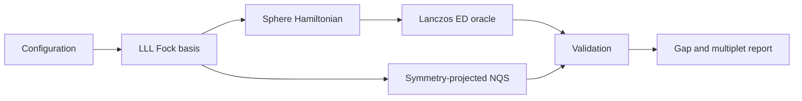
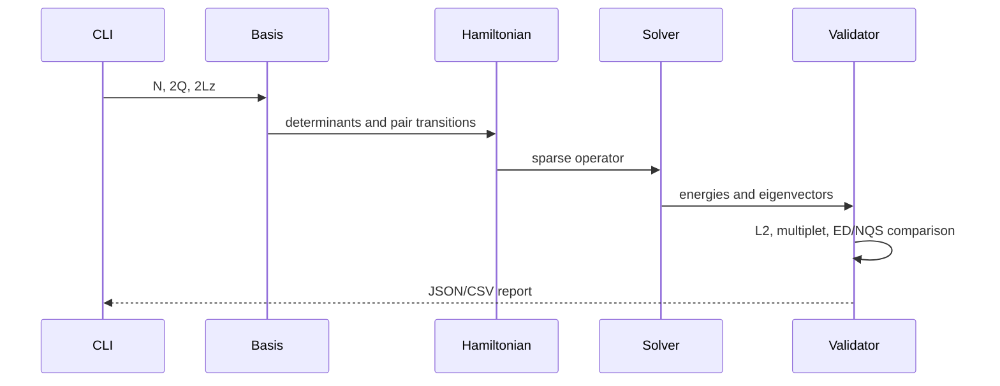

# Chiral Graviton NQS - Development Document

## 1. Objective

Solve Quantum Harness Challenge #15 for spin-polarized electrons in the lowest Landau level (LLL) on the Haldane sphere at filling `nu = 1/3`.

Primary observable:

`Delta_N = E_N(L=2) - E_N(L=0)` in units of `e^2/(epsilon l_B)`.

Flux and geometry:

- electron count: `N`
- monopole flux: `2Q = 3(N-1)`
- LLL orbital angular momentum: `l = Q`
- number of orbitals: `2Q+1`
- sphere radius: `R = sqrt(Q) l_B`
- interaction: chord-distance Coulomb, with an optional constant background that cancels in the gap

The project is not a literal reproduction of the paper's torus/disk spectral plots. The paper is the physics reference; this implementation follows the sphere/NQS acceptance criteria in Challenge #15.

## 2. Success criteria

1. An exact-diagonalization (ED) oracle resolves the lowest `L=0` and `L=2` energies for small `N`.
2. The model `V1` Hamiltonian has the Laughlin state as a zero-energy `L=0` ground state.
3. The Coulomb Hamiltonian is Hermitian and rotationally invariant.
4. The variational state is fermionic and belongs to a definite SO(3) irrep.
5. The excited state has `<L^2> = L(L+1) = 6`.
6. The five `M=-2,...,2` components are degenerate within statistical uncertainty.
7. At ED-accessible sizes, the variational gap agrees with ED within the stated uncertainty and a 1% relative target.
8. Results, seeds, configurations, raw tables, and plots are reproducible from documented commands.

## 3. Architecture



### 3.1 Physics core

The one-particle basis contains monopole orbitals `|Q,m>` with `m=-Q,...,Q`. Fermionic many-body states are bit strings with exactly `N` occupied orbitals, so exchange antisymmetry is exact by construction.

The rotationally invariant two-body interaction is assembled in pair-angular-momentum channels. For two particles of angular momentum `Q`, pair angular momentum is `J`, relative angular momentum is `r = 2Q-J`, and only odd `r` occurs for spin-polarized fermions.

The pair-projector form is

`H = sum_{i<j} sum_J V_J P_J(i,j)`.

Clebsch-Gordan coefficients transform pair states between the orbital and total-pair-angular-momentum bases. This construction makes total `L` a good quantum number up to floating-point error.

### 3.2 ED oracle

The ED path uses fixed `(N, 2Lz)` sectors and sparse Lanczos diagonalization. States are labeled by applying `L^2` or by highest-weight constraints. The initial supported range is `N=4..8`; larger sizes are optional and depend on memory.

Reference checks:

- basis dimension equals the combinatorial enumeration result;
- `||H-H^dagger||` is below tolerance;
- `[H,L^2]` is below tolerance;
- the `V1` ground energy is zero within tolerance;
- applying `L_-` to a highest-weight `L=2,M=2` vector constructs five equal-energy states.

### 3.3 Variational/NQS path

The conservative implementation works entirely in the LLL occupation basis:

- the Fock basis enforces fermionic antisymmetry;
- a shared neural amplitude model supplies configuration amplitudes;
- angular-momentum projection or a highest-weight null-space map restricts each head to exact `L=0` or `L=2`;
- the two heads share parameters so common correlation-energy errors cancel in the gap.

The first milestone may use an exactly projected linear neural ansatz. A deeper autoregressive or residual amplitude model is added only after it passes the ED gate.

### 3.4 Chirality

`L=2` certifies spin magnitude, not handedness. Chirality is tested separately using rank-two metric operators `O_+` and `O_-`, following Eq. (8) of Liou et al. The model Laughlin state must have a dark channel with zero numerical weight; for Coulomb the same channel may be nonzero but should be strongly suppressed.

## 4. Data flow



## 5. Planned package layout

```text
Plasma-Team/
  pyproject.toml
  src/chiral_graviton/
    basis.py
    angular_momentum.py
    interactions.py
    hamiltonian.py
    ed.py
    nqs.py
    observables.py
    cli.py
  tests/
  scripts/
    verify.ps1
    reproduce_small.py
  configs/
  results/                 # generated and gitignored by repository policy
  DEV_DOCUMENT.md
  CHIRAL_GRAVITON_API.md
  CHIRAL_GRAVITON_STYLE.md
```

## 6. Development nodes

| Node | Deliverable | Gate |
|---|---|---|
| 0 | Environment and frozen conventions | imports and version report |
| 1 | Fock basis and fermionic signs | exhaustive small-system tests |
| 2 | CG algebra, `L_+`, `L_-`, `L^2` | SU(2) commutators |
| 3 | `V1` and Coulomb Hamiltonians | Hermiticity and rotational invariance |
| 4 | ED energies by `L` | Laughlin zero mode and multiplet |
| 5 | projected shared NQS | ED agreement at small `N` |
| 6 | uncertainty and scaling | repeat seeds and blocking analysis |
| 7 | chirality | bright/dark matrix elements |
| 8 | final report | one-command reproduction |

## 7. Environment

Target runtime: CPython 3.12. Exact versions are locked in `pyproject.toml`/`uv.lock` once resolved.

Required packages:

- NumPy: arrays and dense checks
- SciPy: sparse matrices and Lanczos
- SymPy: trusted Wigner/CG reference values used during construction/tests
- PyTorch or JAX: NQS optimization, selected after environment probe
- pytest: test runner
- matplotlib: plots

No secrets or external services are required. Optional environment variables:

| Variable | Required | Meaning | Example |
|---|---:|---|---|
| `CG_RESULTS_DIR` | no | generated result directory | `tracks/qmc/results/chiral-graviton` |
| `CG_SEED` | no | deterministic default seed | `1729` |
| `CG_DEVICE` | no | compute device | `cpu` or `cuda` |
| `CG_DTYPE` | no | floating precision | `float64` |

## 8. Error policy

| Code | Meaning | Action |
|---|---|---|
| `CG001` | invalid flux/filling relation | stop and correct configuration |
| `CG002` | empty symmetry sector | stop and inspect `2Lz` parity |
| `CG003` | non-Hermitian Hamiltonian | reject iteration |
| `CG004` | SU(2) commutator failure | reject iteration |
| `CG005` | Lanczos non-convergence | increase Krylov budget or reduce size |
| `CG006` | NQS symmetry failure | reject checkpoint |
| `CG007` | insufficient effective samples | extend chain before reporting |
| `CG008` | ED/NQS mismatch | do not scale to larger `N` |

## 9. Performance expectations

The full Hilbert space grows as `binomial(2Q+1,N)`. Fixed-`Lz` sectors and sparse matrix-vector products are mandatory. The first reproducible target is `N<=8`; `N=9,10` are stretch ED sizes. NQS calculations may go larger only after the `N<=8` oracle gate passes.

Every Monte Carlo report includes sample count, burn-in, autocorrelation estimate, effective sample size, mean, standard error, and seed. Energy differences must propagate covariance when the two states share samples or parameters.

## 10. Safety and reproducibility checklist

- no credentials in configs or logs;
- no network call during a numerical run;
- no implicit unit conversion;
- fixed random seeds recorded in result metadata;
- generated results never overwrite source data silently;
- all scientific claims tied to a machine-readable table;
- no push, publication, or deployment without explicit approval.

## 11. Known risks

1. A first-quantized backflow network can accidentally leave the LLL. The occupation-basis path avoids this.
2. `M=+/-2` labels are not by themselves chirality labels. Chirality requires `O_+/-` response.
3. A constant neutralizing background changes total energies but cancels in a same-`N` gap; it must still be documented.
4. Independent `L=0` and `L=2` optimizations can create a noisy difference. Shared features/state averaging are preferred.
5. The paper did not publish raw data or code, so agreement is judged against its stated bounds and independently generated ED values.

## 12. Node log

- 2026-07-28: scope fixed to Challenge #15; paper and arXiv source inspected; no public numerical data found.
- 2026-07-28: local `.venv` found stale; environment rebuild made Node 0.
- 2026-07-28: autoresearch baseline metric established at 0.
