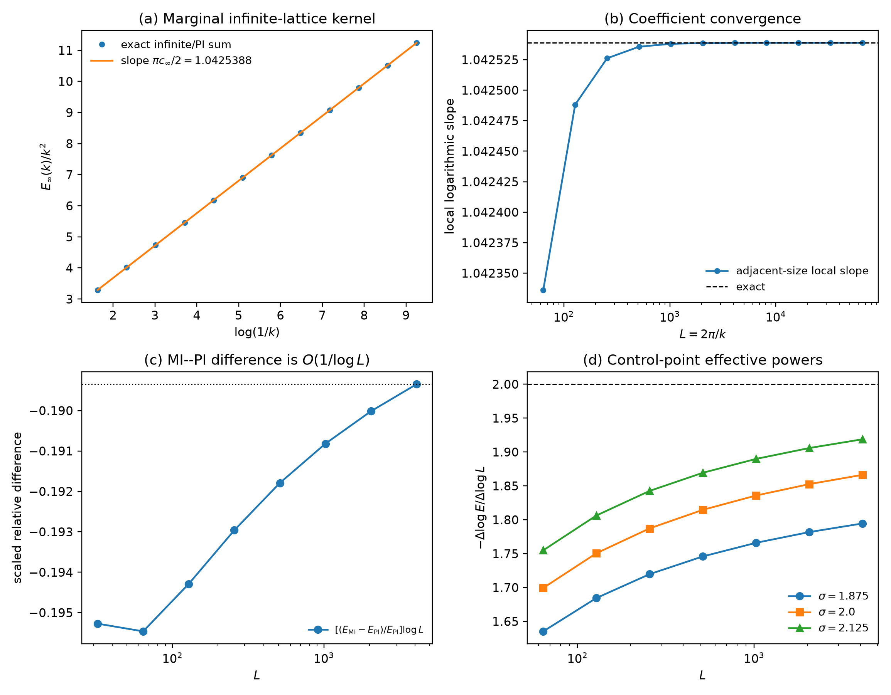
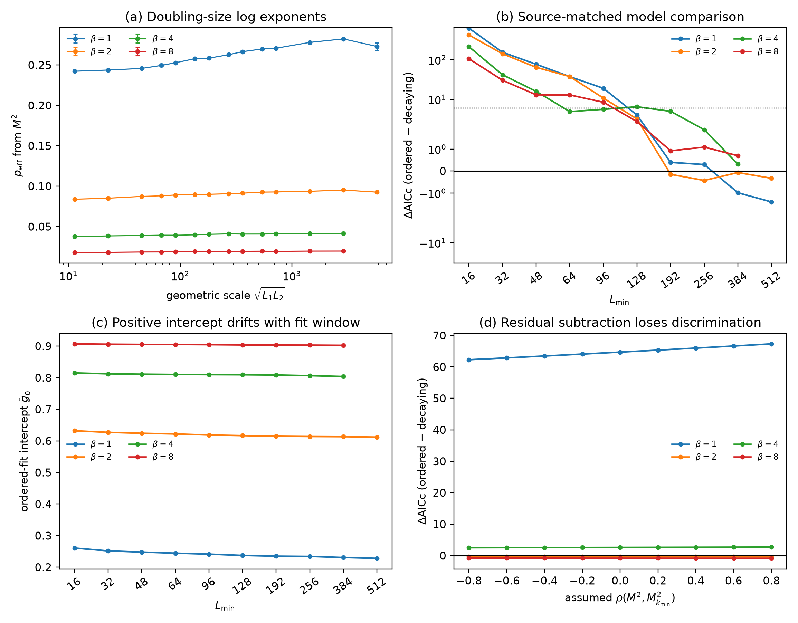

# Issue #158 — marginal long-range XY consistency audit

This is the WangTheoPhys proof/public-data submission for
[Issue #158](https://github.com/QuantumBFS/quantum.harness/issues/158).

## Verdict

**Compatible, after correcting the finite-size interpretation.**  For the
two-dimensional classical XY model with positive

$$
J(R)=c_\infty |R|^{-4},
$$

and for the normalized minimum-image torus sequence used in the numerical
work,

$$
\lim_{L\to\infty}\left\langle |M_L|^2\right\rangle=0
\qquad (T>0).
$$

The theorem therefore applies and excludes a positive thermodynamic
intercept.  The public summary data favor logarithmic decay over the
published ordered ansatz on reasonably populated fit windows, but do not by
themselves prove the exact asymptotic form

$$
g(r)\sim[\log r]^{-p(T)}.
$$

Synchronized bins or joint jackknife replicas are still needed for the final
covariance-aware numerical comparison.

## Main evidence

1. The discrete marginal kernel is

   $$
   E(k)
   =
   \frac{\pi c_\infty}{2}|k|^2\log\frac1{|k|}
   +O(|k|^2).
   $$

   The analytic coefficient is `1.0425387859782584`; the high-precision
   numerical slope is `1.0425387750974222`, a relative difference of
   approximately `1.04e-8`.

2. A direct classical Gibbs-integration-by-parts inequality excludes
   field-defined spontaneous magnetization.  The recurrent-walk theorem of
   [Ioffe, Shlosman and
   Velenik](https://arxiv.org/abs/math/0110127) independently makes every
   infinite-volume Gibbs state `SO(2)`-invariant.

3. A fixed-block Jensen bound followed by the mean ergodic theorem closes the
   bridge from all-Gibbs-state invariance to the diagonal zero-field torus
   observable `⟨|M_L|²⟩`.

4. The normalized minimum-image interaction converges in `ℓ¹` to the fixed
   infinite-lattice interaction as `O(L^-2)`.  At the lowest momentum this
   permits a relative `O(1/log L)` correction, large enough to contaminate an
   inverse-log intercept fit but not to change the thermodynamic model.

5. On the locked `L >= 64` window, the logarithmically decaying scalar model
   gives:

   | beta | fitted `p` | decay reduced chi-square | ordered reduced chi-square |
   |---:|---:|---:|---:|
   | 1 | 0.31641 | 2.987 | 80.62 |
   | 2 | 0.10219 | 1.203 | 77.51 |
   | 4 | 0.04418 | 0.808 | 40.91 |
   | 8 | 0.02054 | 0.435 | 33.82 |

   Source-matched shifted-log comparisons also favor decay at `Lmin=64`,
   while preferences weaken when only the largest few sizes remain.





## Theorem-to-model hypothesis table

| Item | Audited model | Consequence |
|---|---|---|
| Symmetry | Compact `SO(2)` acting on `S¹` spins | Continuous-symmetry theorem applies |
| Dimension | Square lattice in `d=2` | Marginal infrared integral is log-log divergent |
| Interaction | Positive, symmetric, asymptotically `R^-4` | Bruno absolute-coupling kernel equals the physical kernel |
| Summability | `Σ_R J(R) < infinity` | Infinite-volume Gibbs specification exists |
| Marginal second moment | `Σ_R J(R)R²` diverges logarithmically | `E(k) ~ k² log(1/k)` |
| Classical scope | Direct Gibbs integration by parts | No quantum-to-classical limit is required |
| Quantum scope | Bruno Theorem 2, with regular classical scaling | No independent quantum loophole found |
| Boundary convention | Normalized minimum image | Same local infinite-volume interaction |
| Normalization | `Σ_R J_L(R)=4`, `c_L-c_inf=O(L^-2)` | No new thermodynamic phase |
| Finite-size convention effect | Absolute `O(L^-2)` at `kmin` | Relative `O(1/log L)` correction |
| Limit order | First `L -> infinity` at fixed field, then `h -> 0+` | Spontaneous magnetization vanishes |
| Zero-field Monte Carlo observable | Block/Jensen/ergodic bridge | `⟨|M_L|²⟩ -> 0` |

## Files

- [`PROOF.md`](PROOF.md): theorem-to-lattice proof and the `M²` bridge;
- [`REPORT.md`](REPORT.md): numerical results and interpretation;
- [`ANALYSIS_PROTOCOL.md`](ANALYSIS_PROTOCOL.md): retrospectively locked
  analysis decisions;
- [`DATA_PROVENANCE.md`](DATA_PROVENANCE.md): pinned public input;
- [`scripts/`](scripts): kernel, scalar, joint-sensitivity, synthetic, and
  source-matched analyses;
- [`artifacts/`](artifacts): committed machine-readable results and figures;
- [`tests/`](tests): numerical-anchor and artifact consistency tests.

## Reproduce

Python 3.11 or later is recommended.

```bash
cd tracks/qmc/solutions/WangTheoPhys/issue158
python -m venv .venv
.venv/bin/pip install -e '.[test]'

.venv/bin/python scripts/fetch_public_data.py

.venv/bin/python scripts/extended_analysis.py data/data.dat \
  --out-dir reproduced/extended \
  --replicates 2000 \
  --seed 1582026

PYTHONPATH=scripts .venv/bin/python scripts/publication_matched.py \
  data/data.dat \
  --out-dir reproduced/matched

.venv/bin/python scripts/kernel_extended.py \
  --out-dir reproduced/kernel \
  --max-mi-power 12 \
  --max-infinite-power 16

.venv/bin/python scripts/make_extended_figures.py \
  --kernel-dir reproduced/kernel \
  --extended-dir reproduced/extended \
  --matched-dir reproduced/matched \
  --out-dir reproduced/figures

.venv/bin/pytest
```

The 2,000-replica synthetic analysis is the slowest step.  Use
`--replicates 20` only for a smoke test; it does not reproduce the reported
frequencies.

## Scope

This submission does not claim that the published Monte Carlo measurements
are incorrect.  It identifies the positive-intercept extrapolation as
incompatible with the thermodynamic theorem and shows that the public
summary data admit a substantially better logarithmic-decay description.

The exact interacting correlation law, covariance-aware joint likelihood,
and uncertainty in the residual-subtraction coefficient remain open pending
the requested synchronized bin-level data.
