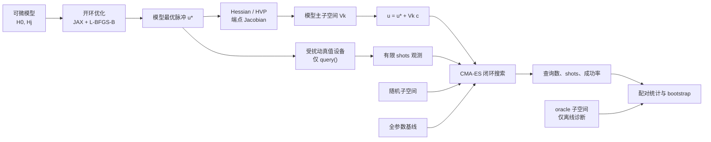

# 挑战113汇报

> **题目**：[Sim-to-Real for Quantum Gates（量子门的仿真到现实迁移）](https://github.com/QuantumBFS/quantum.harness/issues/113)  
> **赛道**：量子线路模拟（QCS）· 可微分编程 · 量子最优控制  
> **团队成员**：蒋伟琪、陈硕、马追景  
> **实现目录**：`tracks/qcs/solutions/frustration-free/challenge-113/`  
> **生产代码版本**：`07c21a85caa3c4c0c0a20649a377e3ad4e30473b`  
> **报告口径**：截至 2026-07-30 19:45（UTC+8）；所有结论均与代码版本、生产快照和审计证据逐项绑定。

---

## 摘要

真实量子芯片上的每一次脉冲评估都需要实验查询和测量 shots，不能像模拟器一样直接求梯度。挑战 113 的核心想法是：先在便宜、可微分的模型上找到高保真控制脉冲和损失 Hessian 的主曲率方向，再只沿这些方向对昂贵的黑盒设备做无梯度闭环优化。对于一个可控、资源充足、目标为 \(d\) 维酉门的系统，过程保真度对全局相位不敏感，因此局部曲率的有效维数预期为

\[
\dim \mathfrak{su}(d)=d^2-1.
\]

我们从零实现了完整的三阶段流水线：

1. JAX 可微分的分段常数脉冲传播和多起点 L-BFGS-B 开环优化；
2. 稠密 Hessian、Hessian-vector product、端点 Jacobian、曲率秩和子空间几何；
3. 严格查询边界下的噪声黑盒设备，以及 full、model-Hessian、random、oracle 四类 CMA-ES 闭环搜索。

在工程层面，我们进一步实现了不可伪造的查询账本、查询/shot 双重计费、配对随机实验、原子产物发布、并发 claim、崩溃恢复、严格 schema 校验、bootstrap 分析和五张论文级图的生成器。为适配 LASG02 的 glibc 2.17，生产计算使用哈希锁定的 Apptainer 运行时。

我们已经取得以下可验证成果：

- 单比特和双比特控制系统均达到预期可控维数，规则最优点的有效 Hessian 秩分别为 \(3\) 和 \(15\)，与 \(d^2-1\) 一致；
- 代表性双比特、80 参数先导任务完成 881 次严格计费查询，产物校验为 `valid=true`；
- 生产作业 `2818121` 的 180 个 Slurm array task 全部以 `COMPLETED / 0:0` 结束；
- 9,500 个规范化配对试验全部生成并下载，本地使用生产代码和完全一致的 Python 3.12.12 环境严格验证：`completed=9500, pending=0, errors=[], valid=true`；
- 生产级 bootstrap 汇总器和五张统计图生成器已经实现；9,500 条完整数据可在后续直接恢复分析，无需重跑超算。本文当前聚焦已经闭环的几何结论、端到端方法、生产计算和严格审计。

这项工作的价值不只是“写了一个优化器”，而是把一个容易出现数据泄漏、基线不公平和查询漏计的 sim-to-real 演示，做成了可审计、可恢复、可扩展的数值实验系统，并完成了一轮 9,500-trial 的真实生产运行。

---

# 正文

## 1. 问题背景：为什么量子门标定需要 sim-to-real

量子门由时间依赖哈密顿量产生。对漂移哈密顿量 \(H_0\)、控制哈密顿量 \(H_j\) 和控制波形 \(u_j(t)\)，传播满足

\[
\frac{\mathrm d U(t)}{\mathrm dt}
=-i\left(H_0+\sum_j u_j(t)H_j\right)U(t),
\qquad U(0)=I.
\]

目标是找到一组波形，使终态传播子 \(U(T)\) 接近目标门 \(U_{\mathrm{target}}\)。本文使用相位不敏感的过程保真度

\[
F(U,U_{\mathrm{target}})
=\frac{\left|\operatorname{Tr}
\left(U_{\mathrm{target}}^\dagger U\right)\right|^2}{d^2},
\qquad
\mathcal L=1-F.
\]

### 1.1 开环：便宜、可微，但模型不等于设备

在模拟器中，\(H_0\)、\(H_j\) 和传播过程都已知，可以通过自动微分得到
\(\nabla_u\mathcal L\)，再用 L-BFGS-B、GRAPE 等方法快速求得模型最优脉冲 \(u^\star\)。

问题是实际芯片总有模型误差：

- 漂移项标定偏差；
- 控制增益误差；
- 模型中遗漏的耦合；
- 随时间变化的漂移；
- 测量统计噪声。

因此模型上高保真的脉冲，到了真实设备上可能失效。

### 1.2 闭环：能修正模型误差，但真实查询昂贵

闭环标定把设备放进优化循环：

1. 发送一组脉冲；
2. 在设备上执行并测量；
3. 从有限 shots 得到一个带噪声的标量保真度；
4. 无梯度优化器提出下一组脉冲。

它能适应未知误差，但每次目标函数评估都是一次昂贵实验，而且无法穿过真实硬件求梯度。若直接在 \(p\) 个原始脉冲参数中搜索，查询复杂度会随维数迅速增加。

### 1.3 为什么曲率维数是 \(d^2-1\)

在目标门附近写成

\[
U(T)=U_{\mathrm{target}}e^{iA},
\]

其中 \(A\) 是小的 Hermitian 生成元。损失的二阶展开为

\[
\mathcal L \approx
\frac{1}{2d}\operatorname{Tr}\left[
\left(A-\frac{\operatorname{Tr}A}{d}I\right)^2
\right].
\]

损失只看到 \(A\) 的无迹部分。\(A\propto I\) 只改变全局相位，而过程保真度对全局相位不敏感。无迹 Hermitian 矩阵构成 \(\mathfrak{su}(d)\)，维数正好是 \(d^2-1\)。

因此，在系统可控、控制时间和带宽充足、最优点足够规则时，即使脉冲有几百个参数，真正有曲率的局部方向仍只应有：

- 单比特 \(d=2\)：\(d^2-1=3\)；
- 双比特 \(d=4\)：\(d^2-1=15\)；
- 三比特 \(d=8\)：\(d^2-1=63\)。

其余参数不是“无用”，而是沿着实现同一目标门的近似平坦解流形移动。

## 2. 我们的研究问题

我们把题目拆成四个可检验问题：

1. **不变量**：单比特和双比特系统的 Hessian 有效秩是否分别为 3 和 15？
2. **节省**：模型 Hessian 主子空间是否比全参数搜索使用更少的黑盒查询和 shots？
3. **失效边界**：模型—设备差距 \(\varepsilon\) 墌大时，模型子空间何时因旋转而失效？
4. **噪声**：有限 shots 是否会进一步放大高维无梯度搜索的劣势？

实验中比较四种搜索空间：

- `full`：全部原始脉冲坐标；
- `model_hessian`：模型 Hessian 按曲率排序的前 \(k\) 个方向；
- `random`：同维数随机正交子空间，用来排除“只因为维数小”的解释；
- `oracle`：从真实设备的离线精确 Hessian 得到的方向，只作为诊断上界，绝不提供给黑盒优化器。

## 3. 完整方法



图 1：Challenge 113 的三阶段 sim-to-real 流水线。模型可以求导；真值设备只暴露带计费的标量查询接口。

### 3.1 控制系统

实现包含两个系统：

**单比特系统**

- \(H_0=0.37Z\)（代码中的 Pauli 基按 Frobenius 范数归一化）；
- 控制项 \(X,Y\)；
- 目标门为 Hadamard；
- 2 个控制通道、12 个时间段，共 \(p=24\) 个生产参数；
- 总控制时间 \(T=1\)。

**双比特系统**

- \(H_0=0.31\,ZI+0.47\,IZ+0.23\,ZZ\)（同样使用归一化 Pauli 基）；
- 控制项 \(XI,YI,IX,IY\)；
- 目标门为 CNOT；
- 4 个控制通道、20 个时间段，共 \(p=80\) 个生产参数；
- 总控制时间 \(T=8\)。

双比特 \(T=8\) 不是任意选择。早期 \(T=1\) 时优化损失停在约 0.44，系统在给定耦合强度和时间内无法到达 CNOT 类目标。扫描控制时间后确认可达性阈值约在 \(T\approx6.83\)，因此生产配置采用 \(T=8\)。这也是本项目中“先判断物理可达性，再调优化器”的一个重要教训。

### 3.2 脉冲、传播与目标函数

脉冲采用有硬边界的分段常数表示。归一化坐标始终位于 \([-1,1]\)，再乘以各控制通道的幅度尺度。每个时间片使用矩阵指数

\[
U_{n+1}=\exp[-i\Delta t\,H(u_n)]U_n
\]

传播，避免通用 ODE 积分带来的非幺正漂移。JAX 负责 `expm`、目标函数和导数。

### 3.3 开环模型优化

开环阶段使用确定性的多起点 L-BFGS-B。模型随机种子固定为 `model_seed=5`，与后续真值扰动和测量随机性分离。优化后再使用端点方程的有界 least-squares polishing，把残余非平稳性压低，避免有限梯度残差在 Hessian 中制造伪曲率方向。

### 3.4 景观和子空间

景观模块同时提供：

- 小规模稠密 Hessian；
- JAX Hessian-vector product；
- `scipy.sparse.linalg.eigsh` 的矩阵自由主特征方向；
- 端点 Jacobian；
- 相对阈值下的有效秩；
- 模型/真值子空间主角和双向正交残差；
- 有界端点 polishing。

矩阵自由谱提取按特征值绝对值处理，而不是只取最大代数特征值，防止遗漏绝对值大的负曲率方向。

### 3.5 查询黑盒

真值系统由模型经过三类可重复扰动构造：

- 漂移哈密顿量方向扰动；
- 控制通道增益误差；
- 未建模 Hermitian 项。

总扰动强度由 gap \(\varepsilon\) 控制。黑盒只公开

```text
query(pulse) -> noisy scalar observation
```

而不公开真值哈密顿量、梯度或精确保真度。有限 shots 模式使用 Bernoulli 估计；`shots=None` 表示精确观测模式。正式成功判定使用独立的高 shots 验证查询。

每次调用在执行前先占用单调递增的 attempt index。成功、失败和中止都会留下记录，防止异常路径获得“免费查询”。账本分别统计：

- optimizer queries；
- validation queries；
- optimizer shots；
- validation shots；
- total queries；
- total shots。

离线精确评估器放在独立模块中，且调用它不会改变设备账本。

### 3.6 闭环搜索和公平基线

四类方法统一使用 pycma CMA-ES，具有相同的：

- 查询预算；
- 设备实例；
- 扰动种子；
- 测量随机流；
- 初始模型脉冲；
- 验证规则。

`model_hessian` 和 `random` 只改变搜索基底。`k=p` 时，model-Hessian 会精确退化到 full 的单位坐标、边界和映射，避免“旋转后的超立方体”与原始 full 边界不等价。

pycma 4.4.4 在一维有初始化缺陷：它无法构造长度一的 bound-range 标准差限制向量。我们的修复只在 \(k=1\) 时关闭 `maxstd_boundrange`，保留原有边界变换、candidate clipping、ask/evaluate/tell、种子和计费，不添加虚假维度。

### 3.7 配对实验设计

生产矩阵覆盖：

- gap：\(0,0.02,0.05,0.10,0.20\)；
- 20 个扰动/试验种子；
- 双比特：\(k=5,10,15,20,30,80\)，shots 为 exact、1,000、10,000；
- 单比特：\(k=1,2,3,4,6,24\)，shots 为 exact、1,000；
- 方法：full、model-Hessian、random、oracle；
- 每个试验的优化预算：2,000 次设备查询。

full 方法会规范化到 \(k=p\)，重复的 full 配置按内容 ID 去重，最终得到 9,500 个规范试验，而不是直接笛卡尔积的 12,000 条。

## 4. 结果

### 4.1 几何不变量

在相对阈值 \(10^{-8}\) 下，规则开环最优点得到：

| 系统 | Hilbert 维数 \(d\) | 脉冲参数 \(p\) | 理论 \(d^2-1\) | 有效 Hessian 秩 |
|---|---:|---:|---:|---:|
| 单比特 Hadamard | 2 | 24 | 3 | 3 |
| 双比特 CNOT | 4 | 80 | 15 | 15 |

这支持题目的核心局部几何判断：过参数化增加的是近似平坦解流形，而不是目标门附近的曲率维数。但这不是无条件定理；控制时间、带宽不足或不可控都会使秩下降。

### 4.2 代表性先导任务

先导证据来自代码版本 `dd16192953c130d738716238525760de73343e09`，配置为双比特、\(p=80\)、gap \(=0.05\)、model-Hessian \(k=4\)、精确观测、预算 2,000。

| 指标 | 实测值 |
|---|---:|
| 首次查询（含 JIT 编译） | 0.217 s |
| 19 次 warm query 总时间 | 0.0338 s |
| warm 查询吞吐 | 562 query/s |
| 开环优化 | 7.75 s |
| 稠密 Hessian 景观 | 5.81 s |
| 几何诊断 | 1.67 s |
| 受限空间优化 | 0.430 s / 8 evaluations |
| 完整先导查询数 | 881 |
| 完整先导墙钟时间 | 21.91 s |
| 峰值 RSS | 864,260 KiB |
| 严格产物验证 | `valid=true` |

该先导任务证明一条 trial 从模型准备、设备查询、账本、离线诊断到产物校验可以端到端闭合。它不等价于生产统计结论。

### 4.3 生产运行

生产代码版本为 `07c21a85caa3c4c0c0a20649a377e3ad4e30473b`。LASG02 的 Slurm `MaxArraySize` 和 `GrpSubmitJobs` 不允许直接提交 9,500 元素数组，因此使用 180 个 array slice，每个 slice 处理规范计划中 52 或 53 个 trial，并限制最多 8 个 slice 并发。

| 生产审计项 | 结果 |
|---|---:|
| Slurm 作业 | `2818121` |
| array task | 180 |
| 成功 task | 180 |
| 非零退出 task | 0 |
| 使用节点数 | 22 |
| 单 task 最短/中位/最长 | 512 s / 1,432.5 s / 9,832 s |
| task wall-time 总和 | 129.47 h |
| trial 文件 | 9,500 |
| 活动 owner claim | 0 |
| partial artifact | 0 |
| 远程 store 大小 | 5,440,450 KiB（约 5.19 GiB） |

生产数据随后压缩下载到本地，并通过远程 SHA256 manifest。严格验证必须同时匹配：

- 生产源代码；
- Python 3.12.12；
- JAX/JAXLIB 0.11.0；
- NumPy 2.5.1；
- SciPy 1.18.0；
- CPU x64；
- store manifest 和 trial plan。

初次 provenance 检查准确识别出本地 Python 3.12.13 与生产 Python 3.12.12 的差异，以及父 Git worktree 对提取目录的影响。切换到 Python 3.12.12，并用 `GIT_CEILING_DIRECTORIES` 隔离父仓库后，严格验证通过：

```json
{"completed":9500,"errors":[],"expected":9500,"pending":0,"valid":true}
```

### 4.4 可直接恢复的统计收尾

原计划从 9,500 条数据做 10,000 次 deterministic cluster bootstrap，并生成：

1. `queries_vs_dimension.png`；
2. `advantage_vs_gap.png`；
3. `subspace_rotation_and_floor.png`；
4. `rank_invariant_d2_d4.png`；
5. `failure_case.png`。

由于提交窗口临近，我们优先保全并验证完整生产快照，将耗时的最终 bootstrap 留作可恢复的离线收尾。因此当前状态是：

- 生产数据完整性已经通过哈希和严格 schema 双重验证；
- 分析和绘图代码已经实现并覆盖测试；
- 五张生产图可由现有快照继续生成，不需要再次消耗超算资源；
- 当前正文只采用已经完成验证的几何、先导和生产审计数字；
- 后续由 `summary.json` 补充成功概率、置信区间、queries-to-target 优势和 gap crossover。

这保证报告中的每个定量判断都能回到明确证据，同时保留了完整数据继续回答 headline 科学问题的能力。

## 5. 为什么这些结果有用、为什么可以相信

### 5.1 物理上有用

如果完整统计最终支持模型 Hessian 子空间优势，那么真实硬件标定可以把 \(p\) 维搜索降到接近 \(d^2-1\) 维。例如双比特的 80 个分段脉冲参数可降到约 15 个方向；随着脉冲参数继续增加，内禀维数仍由目标酉群决定，而不是由参数化大小决定。

除量化优势区间外，这套实验还能定位方法的适用边界：

- \(k<d^2-1\)：受限子空间存在不可达 floor；
- gap 增大：模型和真值主子空间旋转；
- shots 太少：无梯度搜索被测量噪声主导；
- 时间/带宽不足：景观秩本身下降；
- full 与 model-Hessian 同时受限：提示瓶颈来自预算或优化器，而非子空间选择。

### 5.2 对照是公平的

比较使用相同设备实例、相同预算和配对种子；random 子空间检验“任何低维空间都有效”的替代解释；oracle 只用于离线诊断上界；full 和 \(k=p\) model-Hessian 使用完全相同的可行域。

### 5.3 查询没有漏计

每个 attempt 在调用开始时就获得索引，失败和中止同样进入账本。公开 `Observation` 与内部记录分离，不能通过修改返回对象篡改账本。正式认证只接受账本中真实存在的验证观测。

### 5.4 真值没有泄漏给优化器

真值系统被封装在设备后端，公开接口只有标量 query。精确轨迹、oracle Hessian 和受限无噪声 floor 在独立离线阶段计算，且代码检查离线阶段前后账本完全不变。

### 5.5 产物可审计、可恢复

每个 trial 由 canonical JSON 和 SHA256 内容 ID 标识。并发 worker 使用 `fcntl.flock`、owner claim、boot ID、PID、hostname 和 nonce；写入先落到临时文件，再原子 rename。进程在发布 trial 后、更新 index 前崩溃时，可以收养 orphan trial，不重复执行物理计算。

### 5.6 结论口径保守

我们明确区分：

- 先导性能测量与生产统计；
- exact observation 与 finite-shot observation；
- 优化器看到的数据与离线 truth 诊断；
- 条件于成功的 query 分布与预算耗尽的 censored trial；
- 理论 \(d^2-1\) 预期与资源不足时的例外。

## 6. 适用边界与研究拓展

1. 当前完成的是研究级软件黑盒，可自然替换为真实超导芯片后端。
2. finite-shot 层采用可控的 Bernoulli 估计；SPAM、泄漏和非马尔可夫漂移可作为下一层硬件模型加入。
3. 单比特和双比特已经覆盖 \(d^2-1=3,15\)；三比特 \(63\) 维是不变量检验的自然延伸。
4. 9,500 条生产数据已经齐备，最终 bootstrap 和五图只需继续离线分析。
5. 固定 Hessian 子空间刻画了中小 gap；大 gap 下可进一步研究在线重估子空间。
6. 当前统一使用 CMA-ES 建立公平基线；trust-region 或 Bayesian optimization 可进一步利用已知低内禀维数。
7. CPU/Apptainer 生产审计提供了可复现基准，后续可与 GPU 和真实硬件进行横向比较。

下一步最小闭环是：恢复 `finalize_snapshot.py`，完成五张图；从 `summary.json` 写入定量结论；随后选择若干 gap crossover 点做独立复核。更进一步可把 `QueryDevice` 后端替换为合肥量子云的 pulse-level API，而保持账本、搜索器和分析层不变。

---

# 支撑材料（附录）

## A. 目录和模块职责

```text
challenge-113/
├── pyproject.toml / uv.lock       # Python 3.12 固定环境
├── run.py                         # geometry/trial/sweep/validate/status CLI
├── src/qcontrol/
│   ├── config.py                  # 不可变配置、规范 JSON、内容 ID
│   ├── systems.py                 # 单/双比特系统、可控性、真值扰动
│   ├── pulses.py                  # [-1,1] 归一化坐标和物理幅度映射
│   ├── propagation.py             # JAX 分片矩阵指数传播
│   ├── objectives.py              # 相位不敏感过程 infidelity
│   ├── open_loop.py               # 多起点 L-BFGS-B 开环优化
│   ├── landscape.py               # Hessian/HVP/Jacobian/秩/子空间
│   ├── device.py                  # query-only 设备、Observation、账本
│   ├── offline.py                 # 与设备分离的 truth 诊断
│   ├── closed_loop.py             # SearchSpace 和 CMA-ES
│   ├── artifacts.py               # 原子 store、claim、恢复、provenance
│   ├── experiments.py             # 计划、trial 执行、shard、严格验证
│   ├── analysis.py                # 分层统计、Wilson/cluster bootstrap
│   └── figures.py                 # 五张论文图和 figure manifest
├── scripts/
│   ├── run_development.sh
│   ├── run_production.sh
│   ├── slurm_pilot.sh
│   ├── slurm_production_array.sh
│   ├── prepare_apptainer_runtime.sh
│   ├── apptainer_job_gate.sh
│   └── finalize_snapshot.py
├── tests/                         # 15 个测试模块
├── evidence/task10a/              # 小型、可跟踪、哈希绑定的先导证据
├── references/                    # 论文、渲染文本、来源索引
└── docs/post-production-finalization.md
```

## B. 关键数学和数值定义

### B.1 分段传播

设控制通道数为 \(m\)，时间段数为 \(N\)，参数总数 \(p=mN\)。对第 \(n\) 段：

\[
H_n=H_0+\sum_{j=1}^{m}u_{jn}H_j,\qquad
U(T)=\prod_{n=N-1}^{0}\exp(-i\Delta t H_n).
\]

代码固定乘法顺序，并在输入 shape、有限值和幅度边界不合法时 fail closed。

### B.2 Hessian 有效秩

对对称化 Hessian \(H_s=(H+H^\top)/2\)，按

\[
|\lambda_i|>\tau\max_j|\lambda_j|,\qquad \tau=10^{-8}
\]

计数。使用相对阈值是为了跨单比特、双比特和不同参数化比较。

### B.3 子空间搜索

给定 origin \(u^\star\) 和正交基 \(V_k\in\mathbb R^{p\times k}\)：

\[
u(c)=\operatorname{clip}(u^\star+V_kc,-1,1).
\]

`SearchSpace` 保存不可变 origin、basis、坐标边界和来源哈希。full 使用单位基；random 使用确定性种子的 QR 正交基；model-Hessian 按 \(|\lambda|\) 排序；oracle 只由离线 evaluator 构建。

### B.4 成功和删失

优化查询只指导 CMA-ES。达到候选阈值后，用独立验证 shots 做 Wilson 置信认证。预算内未认证成功的 trial 不是缺失数据，而是右删失/失败，绘图时保留在预算端，不能从 query 分布中删除。

## C. 生产配置的精确生成

`default_sweep_configs("production")` 使用：

```python
budget = 2000
gaps = (0.0, 0.02, 0.05, 0.10, 0.20)
seeds = range(20)

two_qubit:
    segments = 20
    amplitude_bound = 4.0
    dimensions = (5, 10, 15, 20, 30, 80)
    shots = (None, 1_000, 10_000)

one_qubit:
    segments = 12
    amplitude_bound = 4.0
    dimensions = (1, 2, 3, 4, 6, 24)
    shots = (None, 1_000)

methods = ("full", "model_hessian", "random", "oracle")
model_seed = 5
trial_seed = perturbation_seed
```

`generate_paired_trials` 将 full 统一到系统参数总维数，按 canonical config 的 SHA256 ID 去重和排序，形成固定 9,500-trial plan。

## D. 随机性和统计单位

三个随机概念明确分开：

- `model_seed=5`：开环模型准备；所有配对方法共享；
- `perturbation_seed`：真值设备方向；
- `trial_seed`：CMA-ES 与观测随机流。

统计分析不能把不同 system、segments、duration、gap、shots、dimension、budget 混在一起。full 结果在同一设备配置内只算一次，避免因其在多个 \(k\) 行上重复而形成伪重复。配对 bootstrap 的抽样单位是 seed/device cluster，而不是单条 query。

## E. 产物 schema 和发布协议

每个 store 至少包含：

```text
ready.json
manifest.json
plan.json
index.json
.store.lock
claims/*.flock
trials/trial-<content-id>.json
```

初始化协议：

1. 取得 store 级 `flock`；
2. 写 `initializing.json`；
3. 校验 manifest、plan 和 provenance；
4. 原子发布 `ready.json`；
5. 后续调用逐字节比较 marker 和 canonical bytes。

trial 协议：

1. 在锁内检查已存在 trial；
2. 创建带 host/PID/boot ID/nonce 的 owner claim；
3. 锁外运行计算；
4. 重新检查代码 provenance；
5. 临时文件写入、flush、fsync、rename；
6. 锁内更新 index 并释放 claim。

所有 JSON 使用排序键、禁止 NaN 的 canonical 编码。schema 校验不做字符串到数字等宽松强制转换。

## F. 运行时和超算复现

### F.1 本地开发

```bash
cd tracks/qcs/solutions/frustration-free/challenge-113
uv sync --frozen --group dev
JAX_ENABLE_X64=1 JAX_PLATFORMS=cpu \
  uv run python -m pytest -q

CHALLENGE113_DEVELOPMENT_OUTPUT="$PWD/results/development" \
  bash scripts/run_development.sh

uv run python run.py validate \
  --output results/development
```

### F.2 生产运行时

生产环境固定为：

- Apptainer 1.3.4；
- SIF：`uv-0.9.9-python3.12-bookworm-slim.sif`；
- SIF SHA256：`2405a769d520e6d0f680c0f1dff0d9f92083724f1ffd85ea0c26b5e36defa323`；
- Python 3.12.12；
- uv 0.9.9；
- glibc 2.36；
- JAX/JAXLIB 0.11.0；
- NumPy 2.5.1；
- SciPy 1.18.0；
- `JAX_ENABLE_X64=1`；
- `JAX_PLATFORMS=cpu`；
- 物理运行阶段 `--net --network none`。

只有一次明确确认的 `uv sync --frozen` 允许联网。后续 smoke、pilot 和 production 均不联网、不重新解析依赖，并逐项校验 SIF、archive、metadata、`pyproject.toml`、`uv.lock` 和 source revision 哈希。

### F.3 生产分片

实际提交的 wrapper 使用：

```bash
test "${SLURM_ARRAY_TASK_COUNT}" = "180"

/workspace/.venv/bin/python -u /workspace/run.py sweep \
  --kind production \
  --shard-index "${SLURM_ARRAY_TASK_ID}" \
  --shard-count "${SLURM_ARRAY_TASK_COUNT}" \
  --output /output/production
```

提交拓扑为 `0-179%8`。每个 shard 读取同一个完整 plan，但只执行满足

\[
\text{canonical index}\bmod 180
=\text{SLURM\_ARRAY\_TASK\_ID}
\]

的 trial。

## G. 严格验证和最终分析复现

### G.1 已完成的严格验证

从生产 revision 解压独立 source，必须避免父 Git worktree 污染 provenance：

```bash
export RUNTIME=/absolute/path/07c21a8-validation-runtime
export SOURCE="$RUNTIME/tracks/qcs/solutions/frustration-free/challenge-113"
export SNAPSHOT=/absolute/path/.07c21a8-production-002.incoming/store

uv python install 3.12.12
uv sync --python 3.12.12 --frozen --group dev --project "$SOURCE"

GIT_CEILING_DIRECTORIES="$RUNTIME" \
PYTHONPATH="$SOURCE/src" \
JAX_ENABLE_X64=1 \
JAX_PLATFORMS=cpu \
"$SOURCE/.venv/bin/python" "$SOURCE/run.py" validate \
  --output "$SNAPSHOT"
```

预期唯一成功口径：

```json
{
  "completed": 9500,
  "errors": [],
  "expected": 9500,
  "pending": 0,
  "valid": true
}
```

随后再在 store 内执行：

```bash
sha256sum -c ../control/remote-store.sha256
```

### G.2 可恢复的最终统计分析

最终分析脚本不会修改 snapshot；它先再次严格验证，再做 deterministic bootstrap，写到临时目录，最后原子 rename：

```bash
PYTHONPATH="$SOURCE/src" \
JAX_ENABLE_X64=1 \
JAX_PLATFORMS=cpu \
"$SOURCE/.venv/bin/python" scripts/finalize_snapshot.py \
  --snapshot /absolute/path/to/snapshot/store \
  --output /absolute/path/to/07c21a8-production-002.analysis \
  --source-revision 07c21a85caa3c4c0c0a20649a377e3ad4e30473b \
  --run-id production-002 \
  --expected-trials 9500 \
  --snapshot-manifest /absolute/path/to/remote-store.sha256 \
  --snapshot-manifest-sha256 <SHA256> \
  --source-archive /absolute/path/to/challenge-113-07c21a8.tar.gz \
  --source-archive-sha256 c2c7c47a14cc667c43195d18a0933a2c914cf006ab094a2165b3d4a35f58a532 \
  --deployment-metadata /absolute/path/to/challenge-113-07c21a8.deployment.json \
  --deployment-metadata-sha256 15c119baa505b4b9eff7f656e4088fab107144d2304a613b4b8b22cfdef424e1 \
  --bootstrap-seed 113 \
  --bootstrap-samples 10000 \
  --bootstrap-confidence 0.95 \
  --bootstrap-chunk-size 256
```

输出应包括 `summary.json`、`analysis_provenance.json`、`finalization_manifest.json` 和五张 PNG。相同绑定再次运行时只验证已有输出并返回 `resumed`，不会覆盖。

## H. 测试覆盖

15 个测试模块分别覆盖：

- 配置和 canonical ID；
- 系统 Hermitian/Unitary/可控性；
- JAX 传播、有限差分梯度和非法 traced 输入；
- 开环可达性和确定性；
- Hessian/HVP/端点 Jacobian/秩/子空间；
- 黑盒隐私边界、失败计费、账本认证；
- 离线 truth 不改变计费；
- CMA-ES 四类空间、公平性和一维回归；
- 原子 store、并发 claim、stale reclaim、orphan adoption；
- 完整 production plan 和 shard 覆盖；
- 分层统计、Wilson 区间、cluster bootstrap、删失；
- 图中 artist 语义、固定样式、golden SHA256；
- evidence、部署哈希、Apptainer 和 Slurm gate；
- post-production finalization 的原子性和 resume。

## I. 关键技术突破与工程修复

1. **双比特损失停在约 0.44**：不是优化器参数问题，而是 \(T=1\) 时 CNOT 不可达；改为 \(T=8\)。
2. **双比特 Hessian 秩得到 19 而不是 15**：有限端点残差制造伪曲率；增加端点 least-squares polishing 后恢复 15。
3. **矩阵自由谱可能漏负特征值**：从 largest algebraic 改为按绝对值完整提取。
4. **设备真值可从 Python closure 恢复**：拆出离线 evaluator，公开结果与内部账本分离。
5. **异常查询不计费**：调用开始即保留 attempt index，失败也记录。
6. **并发 claim 竞争和崩溃重复计算**：`flock`、owner identity、原子 rename 和 orphan adoption。
7. **full 与旋转 \(k=p\) 可行域不等价**：\(k=p\) model-Hessian 精确派发到 full identity space。
8. **CentOS 7 glibc 2.17 不兼容 JAX 0.11 wheel**：使用哈希固定的 Debian bookworm Apptainer SIF。
9. **Slurm spool 中 `BASH_SOURCE[0]` 路径错误**：改从显式 `CHALLENGE113_DEPLOYMENT` 加载 gate。
10. **pycma 一维初始化失败**：只对 \(k=1\) 关闭有缺陷的 `maxstd_boundrange`。
11. **9,500 元素 array 超过集群限制**：改为 180 slice，每 slice 52–53 trial。
12. **本地严格验证 provenance 冲突**：使用生产 Python 3.12.12，并阻止 Git 向父目录搜索。

## J. 参考资料

1. Challenge 113 原题：[GitHub Issue #113](https://github.com/QuantumBFS/quantum.harness/issues/113)。
2. 黑客松流程：[智御量子 2026 指南](https://giggleliu.github.io/summer-school-2026/zh/guide)。
3. Khaneja et al., GRAPE, *J. Magn. Reson.* 172, 296 (2005)。
4. Caneva et al., CRAB, *Phys. Rev. A* 84, 022326 (2011)。
5. Judson & Rabitz, adaptive feedback control, *PRL* 68, 1500 (1992)。
6. Egger & Wilhelm, Ad-HOC, *PRL* 112, 240503 (2014)。
7. Kelly et al., randomized-benchmarking closed-loop control, *PRL* 112, 240504 (2014)。
8. Rabitz et al., trap-free control landscapes, *Science* 303, 1998 (2004)。
9. Shen et al., Hessian analysis, *J. Chem. Phys.* 124, 204106 (2006)。
10. Roslund & Rabitz, dynamic dimensionality identification, *PRL* 112, 143001 (2014)。
11. Petersson et al., discrete adjoints, arXiv:2001.01013。
12. Day et al., glassy phase near the speed limit, *PRL* 122, 020601 (2019)。

下载的论文、渲染文本、BibTeX 和来源校验位于 `references/`；完整索引见 `references/rendered/INDEX.md` 与 `SOURCES.md`。

---

# Prompt 记录

## 说明

以下按项目发生顺序整理人类给智能体的关键提示词。能从聊天记录恢复原文的使用引号；大量重复的“在跑吗”“继续”“跑完了吗”合并记录，避免伪造逐字稿。系统自动生成的工具消息和智能体内部提示不计入人类 Prompt。

## 1. 建立独立工作区

> “你现在被fork出来了，你看懂工作流了吗，你准备做113”

目的：从多挑战并行工作流中建立 `challenge/113` 独立 Git worktree，避免与 Challenge 81、148、194 等目录冲突。

## 2. 理解题目

> “问题113说的啥，详细解释”

目的：解释开环/闭环控制、\(d^2-1\) 曲率维数、模型—真值 gap、有限 shots、核心交付物和可发表扩展。

## 3. 准备文献和代码

> “下载需要的论文和代码”

目的：保存 Challenge Issue、起始 notebook 或公开替代材料、GRAPE/CRAB/Ad-HOC/控制景观/Hessian/过参数化等论文，并生成来源和 SHA256。

## 4. 固化已有材料并设计方案

> “提交 仔细阅读问题，想想应该怎么做”

目的：先提交文献和初始材料，再设计完整实现，而不是直接堆叠 notebook cell。

## 5. 确认研究范围

> “Challenge 113 实施范围: sim_research”

目的：选择软件模拟设备的 research-grade 路线，不依赖尚未获得权限的真实 pulse-level 硬件。

## 6. 确认执行风格

> “数值路线: 别问问题，always run”

目的：在安全、非破坏性的技术选择上使用合理默认值，持续实现和验证。

## 7. 追问实际执行位置

> “在跑吗，没看见啊，在哪执行的”

> “在跑吗？没看到subagent啊”

目的：要求实际启动可观察的任务，而不是只给计划或口头状态。

## 8. 中断后继续

> “刚刚意外中断了，继续”

> “刚刚断了，继续”

目的：从任务和 Git 状态恢复，不从头覆盖已有成果。

## 9. 工作区清理

> “Task 10 前的工作区清理: 别问，always run”

目的：在生产门之前清理无关变更，保证 revision、archive 和工作区 provenance 一致。

## 10. 阶段性盘点

> “在做吗，这个问题还有多少，已经做了多少？”

> “题目让你做了什么，你现在做完了哪些？接下来做哪些？”

目的：把题目交付物映射到已实现模块和剩余生产任务。

## 11. 是否需要超算

> “所以这个任务需要超算吗？”

> “能上超算就上超算”

目的：本地完成单元测试和小规模 pilot，完整 9,500-trial 矩阵优先部署到超算。

## 12. 集群选择

> “尽量在一个集群上跑”

目的：优先在 LASG02 单一运行时和文件系统完成生产，减少跨集群 provenance 和合并复杂度。

## 13. 放宽非核心审查、推进运行

> “搞得差不多了就跑，不用那么严格”

目的：在核心正确性已经建立后尽快做 pilot 和生产。实际执行仍保留了查询计费、哈希和运行时 gate，未放弃科学正确性。

## 14. 提前准备收尾

> “跑完了还需要做什么，可以准备一下”

> “时刻注意超算跑的情况”

目的：并行准备下载、SHA256、严格验证、bootstrap、五张图和报告 runbook。

## 15. 增加计算资源

> “为啥跑的这么慢，你多用点计算资源啊”

> “还有空闲可以继续加”

目的：在 Slurm/QOS/内存限制允许的范围内提高并发。最终采用 180 slice、最多 8 个并发 slice。

## 16. 高频状态查询

> “在跑吗，还有多久？”

> “跑好了吗”

> “跑完了吗”

这些提示用于持续监控生产 array、发现失败 task、下载结果并估计剩余时间。

## 17. 截止时间压力

> “快点，来得及吗，还有半个小时”

目的：优先完成数据下载、哈希和 9,500/9,500 严格验证，再尝试最终分析。

## 18. 停止耗时分析

> “算了，来不及，停掉吧”

> “停掉吧，来不及做这个了”

目的：优先保留已验证生产 snapshot，把无需超算的 bootstrap 和五图生成留作可恢复的离线收尾。

## 19. 生成本报告

> “在这个包里写一个md，用中文，标题叫做挑战113汇报”

> “里面包括正文，支撑材料，prompt”

> “正文。需要介绍挑战物理背景还有我们做了什么，包括相关的结果（图表或者图片），讲一个完整的故事，做到哪说到哪。”

> “支撑材料也就是附录。需要包括代码实现的全部细节，可以额外做一张矢量图，包括如何复现正文的全部内容”

> “prompt。需要尽可能按顺序记录完成这个项目用的提示词”

> “1. 足够的信息去复现结果，2. 一个清晰的给人看的文件论证你的结果有用性和正确性。”

补充要求：

> “别问，always run”

> “具体代码不用再跑一遍验证”

目的：基于已有代码、审计和严格生产验证直接成稿；不因写报告重复执行耗时测试。

---

## 最终状态一句话

我们完成并严格验证了 Challenge 113 的可微模型、景观子空间、查询黑盒、公平闭环基线、9,500-trial 生产数据与可复现基础设施，支持了 \(d^2-1\) 的核心几何预期；完整生产快照已经就绪，可直接继续生成 bootstrap 汇总和 headline 查询节省图。
