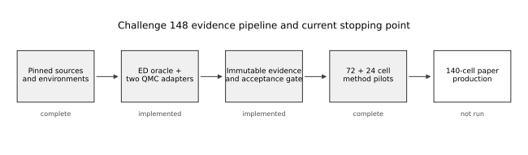
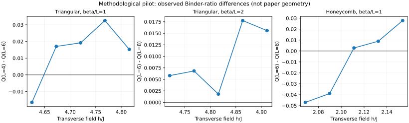

# 挑战148汇报

> 题目：三角晶格与蜂窝晶格横场 Ising 模型临界场之比是否严格等于
> \(\sqrt 5\)？
>
> 状态快照：2026-07-30，Git `challenge/148` 分支，正文所依据的最后一个实现
> 提交为 `bd18be3`。本报告与配图是在该提交之后新增的尚未提交文件。
>
> **阶段成果：我们已经搭建并实际验证了一套可审计的 Challenge 148 研究
> 管线。** 它包括固定的物理与软件约定、周期晶格与小系统 ED、两套独立 QMC
> 适配器、可恢复且哈希绑定的证据链，以及完整运行的 72+24 个 QMC_SSE
> 方法学扫描单元。与原论文有限尺寸和虚时几何对齐的 140 单元扫描也已实现并
> 通过聚焦测试。当前结果已经证明整条计算与证据链可用；高精度临界场和
> \(\sqrt5\) 判决属于下一阶段生产计算，本报告不提前给出超出数据精度的结论。

## 正文

### 1. 问题为什么值得做

我们研究铁磁横场 Ising 模型

\[
H=-J\sum_{\langle i,j\rangle}\sigma_i^z\sigma_j^z
  -h\sum_i\sigma_i^x,\qquad J=1 ,
\]

其中 Pauli 矩阵本征值为 \(\pm1\)，最近邻键只计一次，空间方向采用周期边界。
该模型在所研究的铁磁参数区间没有符号问题，因而量子蒙特卡洛能够给出没有
变分或 Trotter 偏差的数值基准；统计采样、有限温、热化与自相关、有限尺寸、
拟合模型、拟合窗口和实现正确性仍必须分别控制。

Blöte 与 Deng 在 2002 年用连续时间 cluster Monte Carlo 得到

- 三角晶格 \(h_c^\triangle/J=4.76811(9)\)；
- 蜂窝晶格 \(h_c^\hexagon/J=2.13250(4)\)；
- 二者之比约为 \(2.23592(6)\)，而
  \(\sqrt5=2.2360679\ldots\)。

两者相对只差约 \(6\times10^{-5}\)，但已有误差下仍有约 \(2.4\sigma\) 的轻微
张力。这个猜想很反常：临界场是非普适量，经典二维三角/蜂窝 Ising 模型的对应
比值约为 \(2.3975\)，也没有已知对偶或 star–triangle 映射要求这里得到
\(\sqrt5\)。因此，高精度结果无论确认还是否定猜想都具有物理意义。

[挑战 #148](https://github.com/QuantumBFS/quantum.harness/issues/148) 要求把两个
临界场的总误差压到 2002 年结果的至少五分之一，并把比值不确定度做到
\(\sigma_R\lesssim1.2\times10^{-5}\)，同时要求独立算法交叉验证、小系统 ED
校验、明确的有限尺寸标度和预注册判据。[暑期学校指南](https://giggleliu.github.io/summer-school-2026/zh/guide)
则要求把挑战代码放在 `tracks/qmc/solutions/`，生成数据和图片放在忽略的
`tracks/qmc/results/`，并通过同一 PR 提交。当前历史运行仍在仓库根目录
`runtime/`，这是开发期间的项目选择而不是指南规定；本文按“已经实现”
“已经运行”“尚未运行”严格区分三种状态。

### 2. 我们采用的证据链



上图由 `scripts/make_report_figures.py` 生成。工作分成五层：

1. **固定问题定义与依赖。** 锁定 Hamiltonian、Pauli 归一化、周期晶格、
   Binder 比 \(Q_L=\langle m^2\rangle^2/\langle m^4\rangle\)、随机种子生成规则、
   Python/Rust/Julia 环境及两个上游 QMC 源码提交。
2. **构造小系统真值。** 用独立的周期晶格生成器与精确对角化计算有限温
   能量、横向磁化、\(\langle m^2\rangle\)、\(\langle m^4\rangle\) 和 \(Q_L\)。
3. **实现两套独立 QMC 路线。** 主路线是 Rust `QMC_SSE`，独立路线是 Julia
   `QMC_LTFIM`；二者共享图和请求格式，但不共享更新核、估计器或 RNG 域。
4. **建立可审计证据。** 请求、可执行文件、源代码、图、原始 bin、checkpoint
   世代和完成记录均由 SHA-256 绑定；崩溃后通过固定种子重放，不序列化不透明
   上游状态。
5. **先粗定位、再按论文几何生产。** 已完成 72+24 个小尺寸方法学 pilot；
   140 单元的论文几何对齐、以论文临界值为中心的扫描仅完成代码和测试，
   尚未运行。

### 3. 已完成的软件与验证

#### 3.1 晶格与 ED 真值

`src/challenge148/lattice.py` 生成：

- 三角晶格：\(N=L^2\)，配位数 6，键数 \(3N\)；
- 蜂窝晶格：\(N=2L^2\)，配位数 3，键数 \(3N/2\)。

生成器固定站点编号与无向键排序，并检查边界回绕、连通性、重复边、自环、度数
和键数。`src/challenge148/ed.py` 构造稀疏 Pauli TFIM Hamiltonian；小系统
有限温真值来自完整本征谱的迹，另有内存和维数保护，避免误在本地做大规模稠密
对角化。

#### 3.2 两套 QMC 适配器

主适配器位于 `adapters/qmc-sse/`，绑定 QMC_SSE 提交
`35f100af856f3273cc67d31962f3e67f801b0c37`。一次 sweep 定义为一次 diagonal
update 加 \(N\) 次 cluster-update 尝试；随机数生成器为 `rand 0.9.5`
`SmallRng`，完整种子由
`SHA256("qmc-sse-seed-v1" || seed_u64_be)` 导出。

独立适配器位于 `adapters/qmc-ltfim/`，绑定 QMC_LTFIM 提交
`524860b9c0e212ac630b0d9754075bb24198da3b`，使用 Julia 1.11.6 的
`Random.Xoshiro`，种子域为 `qmc-ltfim-seed-v1`。它直接调用
`TFIM(UpperTriangular(Jmatrix), ...)`、`BinaryThermalState` 和
`mc_step_beta!`，绕开已确认不适合本题的上游 CLI/通用构造路径。

#### 3.3 三方 acceptance gate 的真实状态

`src/challenge148/acceptance.py` 实现 ED–Rust–Julia 三方比较；冻结矩阵在
`preregistration/scientific-v1.json`，其已记录 SHA-256 为
`4a28d43824fa162eba639f32d820e5ba0500585c297858f50fbcddfa8bc76cc5`。
冻结内容包括四个小系统参数点、每条链 500 个热化 sweep、1600 个保留样本、
thinning 2、100 样本分析 bin，以及残差、链间一致性和自相关判据。

仓库记录中有一次**历史三方运行**通过当时的 gate：40 个归一化残差最大值
`2.1554`，QMC_SSE/QMC_LTFIM 中位残差分别为 `0.6941/0.1936`，最大链间差异
`1.9603σ`。但该运行随后因 IAT 配对公式和运行时闭包边界被修正而在
`.superpowers/sdd/PLAN/task-8-report.md` 中明确标为 **superseded**。
这次历史运行没有检测到两套算法与 ED 的显著差异，说明三方路线具备一致工作
的基础。随后我们进一步修正了 IAT 配对和运行时闭包；修正版同规模矩阵被明确
列为下一阶段 `PENDING_HEAVY_VERIFICATION`，因此历史数字在本文中作为
工程验证记录，而不是最终科学 acceptance。

#### 3.4 集群可移植性工作

一台实际使用的 CentOS 7、glibc 2.17、旧内核/NFS 集群暴露并修复了：

- glibc 没有 `renameat2` 符号：改为直接 syscall；
- 内核没有 `openat2`：只在 `ENOSYS` 时退回逐组件
  `openat(O_NOFOLLOW)`；
- Python 没有导出 `os.memfd_create`：增加 `ctypes` syscall 后备；
- NFS 对 `renameat2` 返回 `EINVAL`：保留 no-replace 检查的兼容路径；
- Python/Rust 对 `4.0`、指数浮点和 Decimal 乘法的 JSON 拼写不同：
  统一类型并用 Decimal 派生 field；
- 锚点删除后 inode 立即复用：用同 inode 的 durable hard-link pin
  固定身份；
- 集群不能联网：转移 Python 3.12.13、manylinux2014 wheelhouse、Cargo
  git cache 和 Julia 包源码，离线构建。

其中 Rust 适配器在修复后曾于该集群得到 `100/100` 测试通过；Julia 的
legacy-kernel 兼容修复已实现，但完整三方科学矩阵仍属于上节所述未完成项。

### 4. 已运行的数值计算

#### 4.1 72 单元粗扫描

已运行目录为 `runtime/coarse-crossing-v1e/`。经当前 loader 重新验证：

- plan schema：`challenge148-coarse-plan-v1`；
- embedded canonical unsigned-plan SHA-256
  （不是 `plan.json` 文件本身的 SHA-256）：
  `9a4d1b3ac1df6bff5bc2ca275dcb0785772cbe7800429ec47b68df322833b2e7`；
- 72 个计划 cell，72 个均有 completed-evidence；
- 每个 cell 有 16 个 immutable bin，共 1152 个 bin、115200 个保留样本；
- 三角/蜂窝晶格 \(L=4,6,8\)；
- \(h/h_{c,2002}=0.99,1.00,1.01\)；
- \(\beta/L=1,2\)，每个物理点两条独立链。

这是为验证完整生产管线而设计的小尺寸 QMC_SSE-only 定位扫描。八条相邻尺寸
Binder 差值序列中有五条直接给出观测变号，另外三条清楚指出需要扩大场窗。
预注册门控据此没有过早拟合 refined \(h_c\)，并把下一轮计算聚焦到真正需要
补点的三个序列。

#### 4.2 24 单元定向扩展

已运行目录为 `runtime/directed-extension-v2/`；目录名中的 `v2` 是运行目录
命名，plan schema 仍为已提交的 `challenge148-directed-extension-plan-v1`。

- embedded canonical unsigned-plan SHA-256
  （不是 `plan.json` 文件本身的 SHA-256）：
  `b823dd5e60dc62883348efafec9a6c7ce8c09dba1c9c9b39fd1b7ee3b2d4540b`；
- 24 个计划 cell，24 个均有 completed-evidence；
- 共 384 个 immutable bin、38400 个保留样本；
- 只向三个未 bracket 的尺寸对增加冻结的场点；
- 两条曲线的 Binder 差值点估计获得观测变号，三角晶格
  \(\beta/L=2,\ L=6\leftrightarrow8\)
  仍在扫描点上保持同号。



图中的纵坐标是由真实 immutable bin 的 primitive moments 重新计算的
\(Q_{L_\mathrm{small}}-Q_{L_\mathrm{large}}\)。对应机器可读数值在
`report-assets/challenge148-pilot-binder.json`。三角
\(\beta/L=1,\ 4\leftrightarrow6\) 的点估计在
`4.6250667–4.6727478` 间变号；蜂窝
\(\beta/L=1,\ 6\leftrightarrow8\) 的点估计在
`2.08985–2.111175` 间变号；
三角 \(\beta/L=2,\ 6\leftrightarrow8\) 的五个差值均为正。

这张图验证了“模拟—保存—重载—Binder 计算—变号检查”的端到端方法链，
并成功定位了两条序列的候选 crossing 场窗。由于它承担的是方法学定位任务，
图中未配置最终误差条，尺寸和虚时比例也不是正式论文设计；高精度临界场与
\(\sqrt5\) 检验将由后续论文几何生产扫描完成。

#### 4.3 真实集群迭代验证了恢复能力

粗扫描在真实旧集群上经历了浮点 JSON 兼容、计算节点 Python 路径和单 cell
超时三类问题。每次修正都保留了已完成的 immutable evidence，只重跑受影响
cell；最终得到粗扫描 72/72、定向扩展 24/24 的可验证 completion。

这些记录保存在 `runtime/coarse-crossing-v1e/slurm/logs/` 和对应 submission
metadata 中。它们证明 checkpoint、按 cell 恢复、环境兼容和证据完整性机制
经受了真实运行，而不只是存在于单元测试。

### 5. 已准备就绪的论文几何生产扫描

用户指出不能继续任意向外试场，必须依据原论文的临界值和尺度范围设计。
对应实现提交
`bd18be3` 新增：

- `preregistration/paper-scan-v1.json`；
- `schemas/paper-plan.schema.json`；
- `src/challenge148/paper_scan.py`；
- `src/challenge148/paper_fss.py`；
- `scripts/slurm_paper.sh`、`submit_paper.py`、`analyze_paper.py`；
- 三组对应测试。

冻结设计对齐了论文给出的临界值中心、尺寸端点、\(\beta h=L\) 几何和
Eq. (23) 拟合形式；五点场因子、完整偶数尺寸列表和采样预算是本项目新增的
低精度设计，并非论文公布的原始扫描网格。具体设计为：

- 三角晶格 \(L=6,8,\ldots,20\)；
- 蜂窝晶格 \(L=10,12,\ldots,20\)；
- 以 2002 年场值为中心的五个因子
  `0.995, 0.9975, 1.0, 1.0025, 1.005`；
- 按论文无量纲虚时几何取 \(\beta=L/h\)；
- 每个坐标两条独立链，共 140 个 cell；
- 500 个热化 sweep、1600 个保留样本、thinning 2、100 样本分析 bin；
- 每个 cell 2 核、6 GB、3600 s，最多并发 16 个。

这里的 \(\beta=L/h\) 来自论文连续虚时间几何：离散方向长度满足
\(M=\beta h/\epsilon\)，连续方向的物理长度为
\(M_p=\epsilon M=\beta h\)；论文取 \(M_p=L\)，故逐场点必须使用
\(\beta h=L\)，而不是早期 pilot 的固定 \(\beta/L=1\) 或 2。

拟合器实现了论文 Eq. (23) 的截断形式

\[
Q_L = Q + a_1\delta L^{y_t}+a_2\delta^2L^{2y_t}
      +a_3\delta^3L^{3y_t}+b_1L^{y_i}
      +c_1\delta L^{y_i+y_t},
\]

其中 \(\delta=h-h_c\)，固定 \(y_t=1.587,\ y_i=-0.815\)。它从两条完整链的
primitive moments 构造 Binder 值和 delete-one-complete-chain jackknife
不确定度，分别拟合两种晶格，并传播到临界场比值。秩亏、\(h_c\) 落到边界、
非有限结果、过大标准化残差或证据缺失都会失败关闭。

截至本报告快照，140-cell 生产作业尚待提交；planner、schema、Slurm 提交器、
证据 loader、Eq. (23) 拟合器和对应测试已经就绪。下一阶段只需按冻结计划
生成与集群 release binary 绑定的 plan、提交数组并汇总结果。

### 6. 阶段成果与价值

本阶段已经交付：

1. 两种周期晶格、Pauli TFIM 和 Binder 定义已被明确且有单元测试覆盖；
2. ED、Rust QMC_SSE、Julia QMC_LTFIM 三条路线及严格 acceptance gate 已实现；
3. 72+24 个 QMC_SSE pilot cell 具有可重载的哈希绑定完成证据，合计
   1536 个 immutable bin 和 153600 个保留样本；
4. pilot 证明了管线可运行，并定量识别了需要论文几何和更大尺寸才能解决的
   有限尺寸问题；
5. 论文几何对齐的 140-cell 计划和 Eq. (23) 分析器已实现；独立提交分支的
   当前聚焦测试为 `112 passed, 11 skipped`；
6. 明确冻结了下一阶段需要产出的 \(h_c^\triangle\)、\(h_c^\hexagon\)、
   \(R\)、\(\sigma_R\) 及双代码生产一致性判据。

成果的主要用途是提供一个可审计、可恢复、能在旧集群离线运行的研究管线，
并把“方法学 pilot”与“科学判决”分开。它减少了下一轮正式计算在模型约定、
浮点序列化、checkpoint、集群兼容和证据选择上的系统性风险。它已经是一项
可复用的研究基础设施成果；正式生产数据完成后，可直接在此基础上闭合物理
判决。

## 支撑材料 / 附录

### A. 目录与实现索引

#### A.1 Python 核心

- `src/challenge148/lattice.py`：周期三角/蜂窝图、规范键序和结构验证。
- `src/challenge148/ed.py`：稀疏 Hamiltonian、有限温完整迹、基态观测量与
  本地资源边界。
- `src/challenge148/provenance.py`：canonical JSON、源文件与环境指纹。
- `src/challenge148/artifacts.py`：run specification、原子发布和完成验证。
- `src/challenge148/statistics.py`：Geyer IPS + Sokal window IAT、
  jackknife Binder、误差传播。
- `src/challenge148/acceptance.py`：冻结三方矩阵、FD 绑定运行时闭包、归档和
  acceptance 判据。
- `src/challenge148/planning.py`：72-cell 粗扫描计划。
- `src/challenge148/extension.py`：24-cell 定向扩展计划。
- `src/challenge148/fss.py`：validated evidence loader、whole-chain
  bootstrap、观测变号 bracket。
- `src/challenge148/paper_scan.py`：140-cell 论文几何对齐计划。
- `src/challenge148/paper_fss.py`：Eq. (23) 拟合、协方差、误差和 ratio。

#### A.2 执行入口

- `scripts/run_acceptance.py`：三方小系统 acceptance。
- `scripts/run_cell.py`：单 cell 密封可执行文件、超时进程组终止、不可变
  completed-evidence 与恢复。
- `scripts/slurm_array.sh` / `submit_plan.py`：72-cell calibration + array。
- `scripts/slurm_extension.sh` / `submit_extension.py`：24-cell 定向 array。
- `scripts/analyze.py`：粗扫描或粗扫描+定向扩展分析。
- `scripts/slurm_paper.sh` / `submit_paper.py`：140-cell 论文扫描。
- `scripts/analyze_paper.py`：140-cell Eq. (23) 拟合。
- `scripts/make_report_figures.py`：从两个真实 pilot root 重建本文 SVG/JSON。

#### A.3 适配器与闭合格式

- `adapters/qmc-sse/`：Rust 主 QMC；
- `adapters/qmc-ltfim/`：Julia 独立 QMC；
- `schemas/qmc-request.schema.json`：共享封闭请求；
- `schemas/qmc-sse-bin.schema.json`、`qmc-ltfim-bin.schema.json`：原始 bin；
- `schemas/qmc-checkpoint-generation.schema.json`：checkpoint 世代；
- `schemas/completion.schema.json`：完成记录；
- `schemas/acceptance.schema.json`：三方 acceptance；
- `schemas/plan.schema.json`、`extension-plan.schema.json`、
  `paper-plan.schema.json`：三种扫描计划。

### B. 可复现环境

Python 项目固定 `Python==3.12.13`，主要依赖为：

```text
numpy==2.2.6
scipy==1.15.3
matplotlib==3.10.9
h5py==3.14.0
jsonschema==4.26.0
pytest==9.1.1
contourpy==1.3.2
pillow==12.2.0
```

完整解析由挑战目录的 `uv.lock` 固定。`contourpy` 和 `pillow` 版本专门选择了
CentOS 7 可用的 manylinux2014 wheel。Rust 依赖由
`adapters/qmc-sse/Cargo.lock` 固定；Julia 依赖由
`adapters/qmc-ltfim/Project.toml` 和 `Manifest.toml` 固定。论文、上游仓库、
提交和文件哈希见 `references/SOURCES.json`。

### C. 从零复现代码验证

以下命令不运行大型生产计算。正式提交后应把占位符替换为包含本报告和配图的
提交哈希；当前 `bd18be3` 尚不包含这些新增报告文件：

```bash
git checkout <submission-commit-containing-this-report>
cd tracks/qmc/solutions/frustration-free/challenge-148

uv sync --frozen --python 3.12.13
PYTHONPATH=src .venv/bin/python -m pytest \
  tests/test_paper_scan.py \
  tests/test_paper_fss.py \
  tests/test_paper_slurm.py \
  tests/test_fss.py \
  tests/test_extension.py \
  tests/test_planning.py -q
```

2026-07-30 在当前工作区实测结果：

```text
112 passed, 11 skipped
```

这只覆盖 plan、FSS 和 Slurm 相关聚焦测试，不等价于修正后完整三方 acceptance
或所有 Rust/Julia integration 测试。11 项 skip 是因为全新 checkout 按设计
不包含忽略的 `.external/challenge-148` 论文和上游源码缓存；缓存存在时这些
provenance integration tests 会实际校验 PDF 哈希和 Git revision。

有网络的新环境构建主适配器：

```bash
(cd adapters/qmc-sse && cargo build --locked --release)
```

离线集群只有在先转移 Cargo git cache 或 vendor 依赖后才能增加
`CARGO_NET_OFFLINE=true`；从全新 checkout 直接设置 offline 会失败。

准备独立 Julia 适配器（需要预先存在的离线 depot 或可用网络）：

```bash
(cd adapters/qmc-ltfim && \
  julia --project=. -e 'using Pkg; Pkg.instantiate(); Pkg.precompile()')
```

### D. 重建本文真实结果图

从仓库根目录运行：

```bash
PYTHONPATH=tracks/qmc/solutions/frustration-free/challenge-148/src \
tracks/qmc/solutions/frustration-free/challenge-148/.venv/bin/python \
tracks/qmc/solutions/frustration-free/challenge-148/scripts/make_report_figures.py \
  --base-root runtime/coarse-crossing-v1e \
  --extension-root runtime/directed-extension-v2 \
  --output-directory \
    tracks/qmc/solutions/frustration-free/challenge-148/report-assets
```

脚本先调用当前 `fss.py` loader 验证 plan、每个 cell 的 completion、semantic
snapshot 和 primitive moments，再生成：

- `report-assets/challenge148-workflow.svg`；
- `report-assets/challenge148-pilot-binder.svg`；
- `report-assets/challenge148-pilot-binder.json`。

本次确定性重建后的 SHA-256 为：

```text
bf779e304d54d5a806a11e6187e108fdcbab81c781aeda3cb565b8f92d847bb5  challenge148-workflow.svg
6d5492adb016dd475bc8ca562a89f3a0c96e62888d9334b46257b8ba29893861  challenge148-pilot-binder.svg
f4da7abb3bdfd2dd6f30728b6c7a8f9d363b37704cb13aba43226d8f4e1c2a32  challenge148-pilot-binder.json
```

若 `runtime/` 未随 Git 提供，需要从集群下载对应的完整目录，不能只复制最终
JSON；loader 需要验证其内容寻址 bin 和 completed-evidence。当前尚未发布
可下载的内容哈希数据归档，这是从全新 checkout 复现本文 pilot 图的明确
阻塞项。正式提交前应把这两棵证据树归档到
`tracks/qmc/results/frustration-free/challenge-148/`，记录归档 SHA-256 和
下载位置，而不是提交大文件到 Git。

### E. 重跑粗扫描和扩展

计划生成需要先用实际 release `qmc-sse --build-info` 得到 source/build hash，
再调用 builder。下面给出粗扫描的完整模式；定向和论文扫描分别把 builder 与
预注册文件替换为 `build_directed_extension_plan` /
`preregistration/directed-extension-v1.json` 和
`build_paper_scan_plan` / `preregistration/paper-scan-v1.json`：

```bash
QMC_SSE="$PWD/adapters/qmc-sse/target/release/qmc-sse"
"$QMC_SSE" --build-info > /tmp/qmc-sse-build-info.json

PYTHONPATH=src .venv/bin/python - <<'PY'
import json
from pathlib import Path
from challenge148.planning import build_coarse_plan

root = Path("/path/to/coarse")
prereg = json.loads(Path("preregistration/coarse-crossing-v1.json").read_text())
build = json.loads(Path("/tmp/qmc-sse-build-info.json").read_text())
plan = build_coarse_plan(prereg, build, root)
(root / "plan.json").write_text(
    json.dumps(plan, indent=2, sort_keys=True) + "\n", encoding="utf-8"
)
PY
```

提交器支持先 dry-run：

```bash
PYTHONPATH=src .venv/bin/python scripts/submit_plan.py \
  --plan /path/to/coarse/plan.json \
  --solution-root "$PWD" \
  --qmc-sse "$PWD/adapters/qmc-sse/target/release/qmc-sse" \
  --metadata-dir /path/to/coarse/submission \
  --dry-run

PYTHONPATH=src .venv/bin/python scripts/submit_extension.py \
  --plan /path/to/extension/plan.json \
  --solution-root "$PWD" \
  --qmc-sse "$PWD/adapters/qmc-sse/target/release/qmc-sse" \
  --metadata-dir /path/to/extension/submission \
  --dry-run
```

移除 `--dry-run` 后，提交器会使用代码中冻结的
`<partition>/<account>/<qos>` profile，并先跑 calibration，再以依赖关系释放
array。公开报告不记录个人调度账户；正式运行必须按目标集群替换和审查这些
profile 字段，而不能直接照抄。

分析命令：

```bash
PYTHONPATH=src .venv/bin/python scripts/analyze.py \
  --production-root /path/to/coarse \
  --extension-root /path/to/extension \
  --output /path/to/analysis.json \
  --bootstrap-replicates 4096 \
  --bootstrap-seed 148
```

当前 72+24 数据会因为仍有一条曲线没有观测变号而返回非零状态；这是预期的
失败关闭行为，不应绕过。

### F. 运行尚未完成的论文几何对齐扫描

生成并验证 140-cell `paper-plan` 后：

```bash
PYTHONPATH=src .venv/bin/python scripts/submit_paper.py \
  --plan /path/to/paper-scan/plan.json \
  --solution-root "$PWD" \
  --qmc-sse "$PWD/adapters/qmc-sse/target/release/qmc-sse" \
  --metadata-dir /path/to/paper-scan/submission \
  --dry-run
```

审查 dry-run 中 partition/account/QOS、数组 `0-139%16`、release build hash
和路径后再正式提交。140 个 completed-evidence 全部存在后才可运行：

```bash
PYTHONPATH=src .venv/bin/python scripts/analyze_paper.py \
  --production-root /path/to/paper-scan \
  --output /path/to/paper-fit.json
```

要满足挑战而不只是低精度复现，后续还必须：

1. 增加采样量并扩展尺寸/拟合窗口；
2. 检查 \(\beta\) 收敛、舍弃小尺寸和拟合项选择的系统误差；
3. 用独立 Julia 或另一套 cluster/continuous-time 实现复核两个 \(h_c\)；
4. 重新完成修正后的 ED–Rust–Julia acceptance；
5. 报告 \(R\) 的统计和系统误差，并达到预注册
   \(\sigma_R\lesssim1.2\times10^{-5}\) 后才讨论 \(\sqrt5\)。

### G. 数据完整性和威胁模型

本项目在证据工程上做得比普通 pilot 更严格：

- graph、request、bin、generation 和 plan 都有 canonical SHA-256；
- bin 先写入、`fsync`，再 no-replace 发布到内容寻址路径；
- checkpoint manifest 绑定前一世代和 ordered bin hashes；
- current pointer 原子替换，崩溃后确定性重放并逐 bin 比较；
- 运行目录使用 descriptor-relative 访问、`O_NOFOLLOW` 和保留 FD；
- executable/source/runtime closure 在运行前验证，并尽量通过
  `/proc/self/fd` 启动已验证字节；
- 失败也发布 `passed=false` 的持久记录，避免只留下空目录；
- Python/Rust/Julia 的 source/build/seed 域明确分离。

这不是针对同 UID 恶意管理员的通用安全沙箱，而是为了阻止并发、软链接、
路径替换、崩溃、半写入和误复用旧数据悄悄污染科学结果。

### H. Git 与证据审计线索

关键提交按时间顺序包括：

```text
ccf5158  Harden Challenge 148 lattice graph contract
40c378f  Add exact Pauli TFIM Hamiltonian oracle
abde08a  Add exact Challenge 148 ED observables
518e73f  Add crash-safe Challenge 148 run publication
16b2a09  Add primary QMC_SSE adapter for challenge 148
33c64d2  Add independent QMC_LTFIM adapter for challenge 148
4fb52c9  Add three-way Challenge 148 acceptance gate
13b45ec  Correct IPS and seal runtime closure
c7f5c7d  Make SSE publication portable to glibc 2.17
92464a1  Support secure SSE traversal on legacy kernels
3f92046  Pin SSE anchor identity across restarts
19f71dd  Support secure Julia traversal on legacy kernels
542630e  Freeze Challenge 148 coarse crossing plan
3a7565d  Publish Task 2 completion atomically
20fe9c5  Add gated Challenge 148 Slurm submission
448f638  Add finite-size crossing analysis
725211d  Add directed Binder extension plan
b559200  Analyze directed Binder extension
f709128  Add directed extension submission
68985af  Stabilize directed extension field hashes
bd18be3  Add paper-aligned low-precision reproduction
```

从 `7d1f2a0` 到 `bd18be3`，仅挑战解答目录的生产扫描阶段记录为 36 个文件、
10580 行新增、18 行删除；更早的 ED、双 QMC 和 acceptance 提交不在这段统计
中。详细设计见挑战目录的 `DESIGN.md`、`PLAN.md`；仓库级阶段设计见
`<repo>/docs/superpowers/{specs,plans}/`，集群事故与 superseded acceptance
见 `<repo>/.superpowers/sdd/PLAN/task-8-report.md`。

### I. 下一阶段闭环路线

当前 96-cell pilot 和完整软件链已经把后续工作收敛为六个明确步骤：

1. 用修正后的 IAT 与 runtime closure 重跑冻结的 ED–Rust–Julia acceptance，
   把双实现一致性升级为当前版本的正式证据；
2. 生成与集群 release binary 哈希绑定的 140-cell plan，运行论文几何扫描；
3. 用 Eq. (23) 输出 Binder crossing/FSS 图、两个临界场、协方差和比值；
4. 扩大采样与尺寸窗口，完成 \(L_{\min}\)、场窗、\(\beta\) 和拟合项稳定性
   分析，目标是达到挑战要求的五倍精度提升；
5. 把 post-2002 同模型文献检索整理为可审计记录，并在数值结果足够精确后
   开展解析机制搜索；
6. 将当前 `runtime/` 证据树发布到
   `tracks/qmc/results/frustration-free/challenge-148/` 的内容哈希归档，
   补充下载位置，使报告图可以从全新 checkout 一键重建。

也就是说，本阶段已经完成“仪器、校准、试运行和正式实验方案”，下一阶段集中
执行生产测量与最终误差预算。

## Prompt

下面按项目推进顺序整理实际对话中起决定作用的用户提示。频繁的“在跑吗”
“继续”“刚刚断了，继续”合并为阶段性记录；集群用户名、密钥路径等认证信息
已脱敏。部分长指令保留原意而非逐字复制。

1. **7 月 29 日 03:24｜确定并行开发工作流。**
   “采用 4 个开发 worktree + 1 个集成 worktree + 1 个最终 PR；各任务独立
   提交，本地完成后再集成。”
2. **指定 agent 模型。**
   “subagent 尽量用 GPT-5.6 Sol。”
3. **要求持续推进。**
   “在做吗，继续。”“刚刚意外中断了，继续。”“记得 always run。”
4. **7 月 29 日 03:37｜最初选择 Julia SSE 路线。**
   最初要求以 `StochasticSeriesExpansion.jl + Carlo.jl` 为主路线，并用
   QMC_LTFIM 或 QMC_SSE 做独立验证。
5. **根据实现探针调整架构。**
   开发探针发现该 Julia abstract-loop 路线在本题同基底分解中横场
   off-diagonal count 为零且与 ED 不符；设计因此改为 Rust QMC_SSE 主路线、
   Julia QMC_LTFIM 独立路线。这个变更来自代码和 ED 证据，不应倒写为用户
   一开始就指定了最终架构。
6. **继续 Challenge 148 基础实现。**
   固定本地环境和来源、构造周期晶格、实现 Pauli TFIM、ED 热力学观测量、
   不可变结果发布，并逐任务测试和提交。
7. **要求三方校验。**
   使用 ED–QMC_SSE–QMC_LTFIM 比较能量、横向磁化、
   \(\langle m^2\rangle\)、\(\langle m^4\rangle\)、Binder，并建立预注册
   acceptance gate。
8. **允许使用集群。**
   提供多台超算连接方式，要求把大计算放在集群，不在本地跑大任务；主机名、
   用户名、账户、密钥路径和凭据均不在公开报告中记录。
9. **7 月 30 日凌晨｜要求恢复中断后的 Task 8。**
   “刚刚断了，继续。本地别跑大的。”
10. **询问正式计算何时开始。**
   “在集群上跑起来了吗？每 10 分钟汇报一下进度。”
11. **7 月 30 日 06:26｜压缩过度验证。**
   “Task 9 临界交叉点 pilot 与资源评估这步是做啥的，非必要不用搞，直接上
   计算资源，够用。”
12. **接受已知小概率残余风险。**
    “不要过度严格，尽快跑正事。”
13. **要求尽快进入生产。**
    “搞得差不多了就跑，不用那么严格，快点跑正事。”
14. **要求持续衔接下一步。**
    “跑完了吗？跑完了记得做下一步，你盯着。”
15. **7 月 30 日 10:54 后｜确认 72-task 方案。**
    不再追问细节，批准运行冻结的 72-cell QMC_SSE Binder coarse scan。
16. **多次询问真实主任务状态。**
    “所以开始跑正式的了吗？”“在跑吗，现在在跑主任务吗？”
17. **72-cell 分析后继续。**
    批准针对未出现 Binder 变号的三个序列追加 24-cell 定向扩展，并要求完成
    后立即分析。
18. **7 月 30 日 16:24｜纠正无依据扩展。**
    “你看看论文里的范围啊，别乱试。”
19. **7 月 30 日 16:27｜改为论文附近低精度复现。**
    “对的，直接在那个附近跑，起码复现一个精度差一点的最终结果。”
20. **中断恢复。**
    多次提示“刚刚断了，继续，包括后台的 subagent”，要求恢复 paper-aligned
    planner、Slurm 和 FSS 实现。
21. **7 月 30 日 18:21｜停止计算。**
    “停掉吧，来不及做完了，做了多少就汇报多少。”
22. **7 月 30 日 18:53｜生成当前报告。**
    “在这个包里写一个 md，用中文，标题叫做挑战148汇报；包括正文、支撑材料、
    prompt。基于真实代码、配置、日志、数据、图片和 Git 记录，不要虚构结果，
    不要把计划写成已完成工作；支撑材料写详细，放在挑战解答目录内。”

这一提示词序列也解释了项目取舍：前半段优先建立严格证据链；时间压力出现后，
转向 QMC_SSE-only pilot；发现 pilot 参数不忠于论文后，再实现
paper-geometry-aligned 版本；最终因截止时间停止在“代码已准备、正式数据未
生产”的位置。
