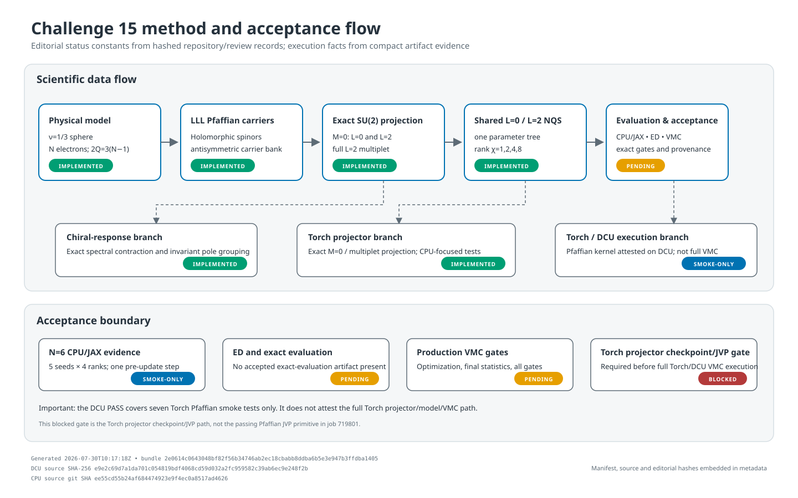
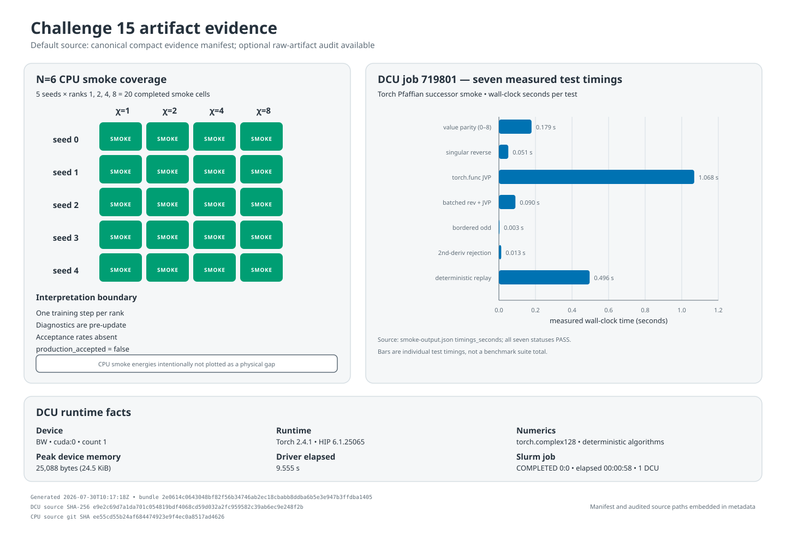

# 挑战15汇报

> **证据与声明边界。** 本报告以仓库、配置、下载产物和本次只读校验为依据。Git `HEAD` 基线是 `ee55cd55b24af684474923e9f4ec0a8517ad4626`（简称 `ee55cd5`）；手性响应、Torch/DCU 适配和本报告属于其后的**未提交工作树成果**。文中分别使用“已实现”“smoke 已运行”和“生产已接受”，避免混淆不同成熟度。

当前状态：

- 已有 \(N=6\) 的五个种子 × \(\chi=1,2,4,8\)，共 20 个 **one-step、pre-update CPU smoke** 单元；五份产物均为 `production_accepted=false`。
- 已有 DCU Slurm job `719801` 的 Torch Pfaffian target smoke `PASS` 证据，确立了后续 projector、完整 NQS 与 VMC 适配的目标运行时基础。
- 已完成对称 JAX NQS、ED/VMC 验收框架、生产证据系统、手性响应实现，以及 Torch Pfaffian、carriers 和 projector 的主体开发。
- 下一阶段聚焦 \(N=7/8\)、最终 exact evaluation、能隙与误差棒、\(\langle L^2\rangle=6\)、五重多重态和手性响应的生产验收。
- Torch projector 还需处理 Torch 2.4.1 checkpoint/JVP 兼容性，并补直接节点顺序断言和完整送审 diff；这是范围明确的软件收尾项。

入口：[Challenge #15](https://github.com/QuantumBFS/quantum.harness/issues/15) · [暑期学校指南](https://giggleliu.github.io/summer-school-2026/zh/guide) · Cursor 会话 ID：`062219a1-d7ad-4b3c-ac45-18b170c81af3`

## 正文

### 1. 物理背景与挑战意义

Challenge 15 研究 Laughlin 填充 \(\nu=1/3\) 的分数量子霍尔体系。采用 Haldane 球面：\(N\) 个完全自旋极化电子处于磁单极子通量

\[
N_\phi=2Q=3(N-1)
\]

下的最低朗道能级（LLL），球半径 \(R=\sqrt Q\,\ell_B\)，能量单位

\[
E_C=\frac{e^2}{4\pi\epsilon_0\epsilon\ell_B}.
\]

项目目标量是有限尺寸最低 \(L=2\) **扇区**相对 \(L=0\) 基态的差：

\[
\Delta_2(N)=E_{\min}(L=2;N)-E_{\min}(L=0;N).
\]

这一定义有三条重要边界：

1. \(\Delta_2\) 不自动等于全谱绝对最低中性激发；后者需要独立低能全扇区扫描。
2. 一个真正的 \(L=2\) 表示理论上有 \(M=-2,\ldots,2\) 五个分量，但本项目尚未完成数值五重多重态认证。
3. “最低 \(L=2\) 扇区态”不等于“手性引力子”。手性还要求秩二探针的谱权重、两手性通道对比及磁通反转互换共同通过。

挑战的难点不只是优化一个能量数。电子交换反对称性、LLL 全纯性、每粒子恰为 \(2Q\) 次、单极线丛规范协变和总角动量 SU(2) 必须进入波函数构造。只固定 \(M_z=0\) 不能区分 \(L=0\) 与 \(L=2\)；只做数据增强或软惩罚也不能保证物理 Hilbert 空间正确。详细约定见 [`README.md`](README.md)、[`DESIGN.md`](DESIGN.md) 和 [`references/SOURCES.md`](references/SOURCES.md)。

### 2. 方法故事：先内蕴结构，再优化

偶数 \(N\) 使用固定次数的全纯 Pfaffian carriers，奇数 \(N\) 使用 bordered Pfaffian。多个 carrier 以显式秩 \(\chi\) 组合，再做精确 SU(2) 投影。一个共享、扇区条件化的参数树同时产生 \(L=0\) 与 \(L=2\)，联合目标为

\[
\mathcal L=w_0E_0+w_2E_2,\qquad w_0,w_2>0,\quad w_0+w_2=1.
\]

设计禁止两个扇区各有私有模型，也禁止可训练数组随 determinant 数或 \(\dim\mathcal M_L\) 增长。这样，反对称性、全纯次数、规范协变与目标 \(L\) 由构造或硬门验证，而不是训练后的经验猜测。

实现分为相互制衡的三层：

1. **JAX/x64 NQS/VMC：** 单极子自旋量、Pfaffian、精确投影、共享模型、坐标采样、联合训练和独立评估。
2. **占据数 ED oracle：** 独立构造有限球面 Coulomb Hamiltonian，验证能量、重叠、真正的 \(\mathrm{Var}(H_{\rm LLL})\)、角动量残差、投影秩与求积收敛。
3. **生产与证据层：** 内容寻址 envelope、原子发布、运行时证明、rank/seed lineage 和 fail-closed reducer。scheduler exit 0 从不等同于科学接受。



*图 1｜实际生成的方法与状态图。执行事实来自紧凑证据清单中的 CPU/DCU 产物摘要；`IMPLEMENTED/PENDING/BLOCKED` 是由仓库源码、README/DESIGN、手性/DCU progress 与评审记录哈希冻结的编辑常量，不是生产产物自行给出的状态。`IMPLEMENTED` 仅表示实现存在；Torch projector checkpoint/JVP gate 仍为 `BLOCKED`。脚本为 [`tools/generate_challenge15_report_figures.py`](tools/generate_challenge15_report_figures.py)。SVG SHA256：`f60369fc054093e8477ecbb0322d042b02da52bebd2fad11a9cbe5547db7ba78`。*

### 3. 实际完成的工作

科学与软件主线已经实现到以下程度：

- Haldane 球面规格、北/南图册单极子轨道、有序 determinant 与 CAR 符号；
- 两条独立有限球面 Coulomb 构造、\(L_z,L_\pm,L^2\) 和稀疏目标 irrep oracle；
- 可微 JAX Pfaffian、偶/奇 carriers、精确投影、共享 \(L=0/2\) NQS、NQS–ED bridge；
- 坐标 VMC、联合优化、嵌套 rank 扩展、精确评估、约化、终审状态机与 CLI；
- 手性源、两套 rank-2 response families、精确/混合谱收缩、谱和规则与磁通反转检查；
- 后端中性 physics/projection 数据、非 pickle checkpoint codec，以及 Torch Pfaffian/carrier/projector 实现；
- DCU runtime 探针、不可变 smoke bundle 和下载后 hash 校验；
- 由真实产物驱动、可确定重生成的两张 SVG 证据图。

这些主要是未提交工作树状态；生产冻结必须从干净提交重新生成 source manifest 和 runtime attestation。

### 4. 已运行结果及其正确读法

#### 4.1 N=6 CPU smoke

五个 seed 各运行 \(\chi=1,2,4,8\) 和一步训练。下列为每个 rank 的**更新前**诊断 \((E_0;E_2)\)：

- seed 0：\((4.0133,4.0056)\)、\((4.0080,4.0048)\)、\((4.0035,4.0041)\)、\((3.9999,4.0033)\)；
- seed 1：\((5.2420,5.2447)\)、\((5.2413,5.2447)\)、\((5.2404,5.2446)\)、\((5.2391,5.2446)\)；
- seed 2：\((3.8797,4.1275)\)、\((3.8543,4.1032)\)、\((3.8474,4.0678)\)、\((3.8428,4.0263)\)；
- seed 3：\((4.7045,4.9573)\)、\((4.6999,4.9557)\)、\((4.6950,4.9541)\)、\((4.6896,4.9524)\)；
- seed 4：\((5.0967,5.0707)\)、\((5.0967,5.0608)\)、\((5.0969,5.0451)\)、\((5.0971,5.0162)\)。

这些记录证明五种子、四个 rank、共享扇区前向/梯度/一步更新可以执行。不同种子初始值明显分散，acceptance rate 尚未记录，且产物写明 `pending exact evaluation and all production gates`；因此这些 \(E_2-E_0\) 仅是 smoke 诊断，不作为最终 gap、误差棒或 rank 收敛结论。

#### 4.2 DCU smoke

job `719801` 在 Torch 2.4.1、HIP `6.1.25065`、设备名 `BW`、`cuda:0`、complex128 和 deterministic algorithms 下完成七项 Pfaffian smoke：

- value parity（矩阵尺寸 0、2、4、6、8）；
- 奇异矩阵 all-minor reverse；
- `torch.func.jvp`；
- batched reverse 与 JVP；
- odd bordered Pfaffian；
- 二阶导数拒绝；
- deterministic replay。

输出为 `PASS`，driver elapsed `9.555 s`，峰值设备内存 `25,088 bytes`；Slurm accounting 为 `COMPLETED 0:0`、`00:00:58`、1 DCU。前序 job `719643` 是不可变失败 fixture：它错误要求一个实际应为零的 nonzero-cofactor cardinality，失败不归因于后端 Pfaffian 契约。job 719801 的 receipt 显式绑定并取代该 lineage。



*图 2｜实际生成的证据分层图。20 个绿色 CPU 单元标为 `SMOKE`，且 `production_accepted=false`；右侧计时仅来自 job 719801 的 Torch Pfaffian tests。图中刻意不画 CPU 诊断能量，避免误解为物理 gap。默认来源是 [`report_assets/challenge15-report-evidence.json`](report_assets/challenge15-report-evidence.json)，完整原始产物可作可选独立审计。SVG SHA256：`c03a0448d6bcc32156c4e4bf756a336cc42b7947240cc88e860b58627d36a7b8`。*

### 5. 为什么当前成果仍然有用

当前成果首先提供了一套能够约束物理错误、记录运行证据并继续扩展的计算基础：

1. 波函数结构直接保证交换反对称和 LLL 次数，精确投影隔离目标 SU(2) irrep。
2. Coulomb 与角动量有独立构造和残差门，ED 只作验收 oracle，不向 NQS 注入目标态。
3. VMC 明确区分 bare-potential sampling variance 与 \(\mathrm{Var}(H_{\rm LLL})\)，避免把错误统计量当作本征态方差。
4. rank、seed、runtime、源码与产物均有 hash/lineage；缺失或不一致时 fail closed。
5. 两张图由真实产物确定生成，图示状态与文字声明使用同一证据边界。

因此可以可靠声称：**形成了受物理约束的计算管线，并获得 CPU 与 DCU 两类 smoke 证据；这些证据为完成 clean commit/source freeze/runtime gates/blocker fixes 后的生产提供可审计基础。** 最终能隙、手性、数值五重简并和热力学结论留待生产验收后给出。

### 6. 局限与接受清单

要接受最终有限尺寸结果，以下门必须同时成立：

- [ ] N=6、7、8 正式 VMC 和独立 coordinate evaluation 完成；
- [ ] exact evaluation 和全扇区低能扫描完成；
- [ ] 五种子最终 rank 至少四个通过，且连续两次 rank doubling 满足能量与 gap 收敛；
- [ ] ESS≥1000、split-\(\hat R\le1.01\)、接受率与自相关门通过；
- [ ] Hermiticity、Coulomb 双构造、SU(2)、图册规范、中心元和求积残差通过；
- [ ] NQS 与 ED 的能量误差、gap 差、overlap 和 \(\mathrm{Var}(H_{\rm LLL})\) 门通过；
- [ ] \(\langle L^2\rangle=6\) 与完整 \(L=2\) multiplet 得到数值认证；
- [ ] Torch projector checkpoint/JVP blocker 修复并在 Torch 2.4.1 目标运行时复验；
- [ ] response tensor、adjoint、磁通反转、谱和规则与通道对比全部通过；
- [ ] 只有前三个尺寸均获接受后，才讨论误差棒和有限尺寸/热力学外推。

截至本报告，以上项目均未形成完整 accepted terminal artifact；因此 `production_accepted=false` 是唯一正确状态。

## 支撑材料（附录）

### A. 固定物理约定

物理空间为

\[
\mathcal H_{N,Q}=\wedge^N V_Q,\qquad
m=-Q,\ldots,Q,\qquad 2Q+1=3N-2.
\]

两点夹角 \(\gamma_{ij}\) 的弦长和相互作用为

\[
r_{ij}=2\sqrt Q\,\ell_B\sin(\gamma_{ij}/2),\qquad
V_{ij}=\frac{e^2}{4\pi\epsilon_0\epsilon r_{ij}}.
\]

不以平面赝势替代有限 \(Q\) 球面 Coulomb，不静默做密度重标度。均匀中和壳只贡献同尺寸 \(L=0/2\) 相减时抵消的常数。

轨道按递增 \(2m\) 排列；determinant 为
\(c^\dagger_{m_1}\cdots c^\dagger_{m_N}|0\rangle\)，
\(m_1<\cdots<m_N\)。创建/湮灭第 \(p\) 个轨道的符号是
\((-1)^{n_{<p}}\)。该顺序固定 CAR、两体矩阵与 Pfaffian 系数符号。

### B. Hilbert 空间、Coulomb 与 SU(2) oracle

- [`src/challenge15/spec.py`](src/challenge15/spec.py)：`SphereSpec`，统一给出 `two_q/q/orbital_count/radius/l_max/full_dimension`。
- [`src/challenge15/monopole.py`](src/challenge15/monopole.py)：归一化 spinor、北/南图册 LLL 轨道与旋转。
- [`src/challenge15/fermions.py`](src/challenge15/fermions.py)：determinant basis、固定宽度 block、creation/annihilation 与 one-body 作用。
- [`src/challenge15/two_body.py`](src/challenge15/two_body.py)：按固定 CAR 符号组装 domain/codomain CSR 两体算符。
- [`src/challenge15/coulomb.py`](src/challenge15/coulomb.py)：密度多极积分和有限球赝势/CG 两条独立 Coulomb 构造。
- [`src/challenge15/angular.py`](src/challenge15/angular.py)：\(L_z,L_\pm,L^2\)、目标 irrep isometry 与 multiplet ladder 验证。
- [`src/challenge15/oracle.py`](src/challenge15/oracle.py)：小系统完整 oracle、N≥6 必要稀疏目标扇区、缓存复验与 exact NQS 评价。

目标 multiplicity 必须满足

\[
\dim M_L=\dim\mathcal H_{M=L}-\dim\mathcal H_{M=L+1},
\qquad
\sum_L(2L+1)\dim M_L=\binom{2Q+1}{N}.
\]

实现只存 \(D\times r\) basis 和 \(r\times r\) Gram/规范矩阵，不构造 \(D\times D\) projector。设计门限包括 Gram defect \(\le10^{-12}\)、目标 \(L^2\) 残差 \(\le10^{-11}\)、intertwining 残差 \(\le10^{-11}\)。N=6、7、8 完整 determinant 维数分别为 8008、50388、319770。

### C. Pfaffian carriers 与精确投影

偶数 \(N\)：

\[
\Phi_s=\operatorname{Pf}G_s,\qquad
G_s(i,j)=\sum_{m>0}g_s(m/Q,L)
[\phi_m(i)\phi_{-m}(j)-\phi_m(j)\phi_{-m}(i)].
\]

奇数 \(N\)：

\[
\Phi_s=\operatorname{Pf}
\begin{pmatrix}G_s&h_s\\-h_s^T&0\end{pmatrix},
\qquad h_s(i)=b_s(L)\phi_0(i).
\]

每项每粒子恰出现一次，因此交换反对称、每粒子次数为 \(2Q\)，并处于实验室 \(M_z=0\)。

JAX [`src/challenge15/pfaffian.py`](src/challenge15/pfaffian.py) 以 `custom_jvp` 实现

\[
\mathrm d\,\mathrm{Pf}(A)=
\sum_{i<j}(-1)^{i+j+1}
\mathrm{Pf}(A_{\widehat i\widehat j})\,\mathrm dA_{ij},
\]

不依赖 \(A^{-1}\)，因此奇异矩阵仍有正确方向导数。Torch [`src/challenge15/torch_pfaffian.py`](src/challenge15/torch_pfaffian.py) 提供 elimination、cofactor、自定义 reverse/JVP 与 bordered Pfaffian，并显式拒绝二阶导。

对 carrier 的 \(K=0\) 右指标，精确投影为

\[
\Psi_{L0}(z)=\frac{2L+1}{4\pi}
\int_0^{2\pi}d\alpha\int_{-1}^{1}dx\,P_L(x)
[R_z(\alpha)R_y(\arccos x)\Phi](z).
\]

有限带宽 \(L_{\max}=NQ\) 给出

\[
n_\alpha\ge2L_{\max}+1,\qquad
2n_\beta-1\ge L_{\max}+L.
\]

[`src/challenge15/projection_data.py`](src/challenge15/projection_data.py) 固定 beta-major、alpha-fastest 节点顺序、active \(R_zR_y\)、padding mask 和不可变后端中性数组；JAX 与 Torch projector 消费同一数据约定。Torch projector 使用固定 next-power-of-two pairwise reduction、非重入 checkpoint 和设备内 complex128。

### D. 共享模型、VMC 与 exact bridge

[`src/challenge15/model.py`](src/challenge15/model.py) 的 `ProjectedPfaffianNQS` 使用单一实参数树；carrier token、\(m/Q\) Fourier 特征和 sector token 经同一 hypernetwork 产生复 pair/border weight。`embed_rank` 保留旧参数，只初始化新 token 并把新 gate 置零。

坐标 VMC 采样

\[
|\Psi_{L0}(z)|^2\prod_i\frac{d\Omega_i}{4\pi}.
\]

以 \(O_\theta=\partial_\theta\log\Psi_\theta\) 记，能量梯度为

\[
\partial_\theta E=2\,\mathrm{Re}
[\langle O_\theta^*V\rangle-
\langle O_\theta^*\rangle\langle V\rangle].
\]

有限样本协方差修正不消除链相关、有限链归一化和更新后分布变化。坐标样本的 \(V(z)\) 方差只是 sampling variance，不是
\(\langle H^2\rangle-\langle H\rangle^2\)；后者由 ED/显式投影 Hamiltonian 在系数空间计算。

[`src/challenge15/vmc.py`](src/challenge15/vmc.py) 提供 sphere Metropolis、局部 SU(2)/刚体旋转 proposal、自相关与 split-\(\hat R\)；[`src/challenge15/production_vmc.py`](src/challenge15/production_vmc.py) 提供正式训练、独立 coordinate evaluation、Adam、OOM block fallback 和快照。正式配置是每扇区 \(32\times32=1024\) walkers、10000 steps；终评 32 chains × 4096 draws。

[`src/challenge15/nqs_bridge.py`](src/challenge15/nqs_bridge.py) 将投影 NQS 转为规范 \(M=0\) determinant state；[`src/challenge15/exact_eval.py`](src/challenge15/exact_eval.py) 做静态 block exact evaluation 和 primitive metric 等价比较。

### E. rank 与统计门

秩按 \(1,2,4,\ldots\) 嵌套增长。最终 rank 前需两次连续 doubling，并对 \(L=0,2\) 满足

\[
|\delta E_L|+2\sigma_{\rm diff}\le10^{-4}E_C,
\qquad
|\delta\Delta_2|+2\sigma_{\rm diff}\le0.002|\Delta_2|.
\]

随机分析至少两个完全配对 seed；噪声只能增大左侧，不能放宽门。最后一次 doubling 的 overlap 变化需 \(\le10^{-3}\)。每 rank 五 seed 全覆盖，最终 rank 至少四 seed 通过。[`src/challenge15/train.py`](src/challenge15/train.py) 计算收敛，[`src/challenge15/reducer.py`](src/challenge15/reducer.py) 从 primitive metrics 重算门，而不信任 producer 的 gate 布尔值。

### F. 手性 response

固定 \(Q>0\)、电子电荷 \(-e\)。平面源归一化为

\[
S_-=-\sum_{i<j}\int\frac{d^2q}{(2\pi)^2}
V(q)e^{-k^2/2}k_-^2e^{iq\cdot(R_i-R_j)},
\qquad S_+=S_-^\dagger.
\]

奇数相对角动量 \(r\) 的幅度

\[
\frac{A_r}{E_C}=
\frac{1}{2\sqrt{(r+1)(r+2)}}
\sum_{k=0}^{r}(-1)^k {r+2\choose r-k}
\frac{\Gamma(k+5/2)}{k!}.
\]

\(O_+\) 只由

\[
O^{(2)}_{+,M}=(-1)^M(O^{(2)}_{-,-M})^\dagger
\]

构造。helicity \(\sigma=\pm\) 与球张量分量 \(M=-2,\ldots,2\) 是不同索引。

[`src/challenge15/chiral_source.py`](src/challenge15/chiral_source.py) 生成 reduced source；[`src/challenge15/response_operator.py`](src/challenge15/response_operator.py) 组装五个 CSR 分量并检查 tensor/adjoint/monopole reversal；[`src/challenge15/spectral_response.py`](src/challenge15/spectral_response.py) 做 invariant pole grouping 和 exact/mixed spectrum：

\[
w_{\sigma n}=\sum_M|\langle n,2,M|O_{\sigma,M}|0,0\rangle|^2,\quad
C=\frac{w_{-,0}-w_{+,0}}{w_{-,0}+w_{+,0}}.
\]

接受要求 tensor commutator \(\le10^{-10}\)、adjoint 与 monopole reversal \(\le10^{-12}\)、eigenpair residual \(\le10^{-10}\)、谱和回收率至少 0.99，并有可分辨通道对比。当前没有 accepted response artifact。

### G. API/模块地图

1. **物理数据：** `spec.py`、`monopole.py`、`physics_data.py`、`projection_data.py`。
2. **精确代数：** `fermions.py`、`two_body.py`、`coulomb.py`、`angular.py`、`oracle.py`。
3. **NQS：** `pfaffian.py`、`carriers.py`、`projector.py`、`model.py`、`nqs_bridge.py`。
4. **VMC/生产：** `vmc.py`、`production_vmc.py`、`train.py`、`exact_eval.py`、`reducer.py`、`finalization.py`。
5. **手性：** `chiral_source.py`、`response_operator.py`、`spectral_response.py`。
6. **Torch：** `torch_pfaffian.py`、`torch_carriers.py`、`torch_projector.py`。
7. **契约：** `named_arrays.py`、`checkpoint_codec.py`、`production_schema.py`、`artifacts.py`、`provenance.py`、`generations.py`、`transfers.py`、`orchestrator.py`。
8. **入口：** [`src/challenge15/cli.py`](src/challenge15/cli.py)；生产设计见 [`PRODUCTION_DESIGN.md`](PRODUCTION_DESIGN.md)。

### H. provenance 与 artifact 合约

通用 envelope 为 `{"schema","payload","payload_sha256"}`。canonical JSON、schema 语义和 hash 由 `production_schema.py` 验证。`artifacts.py` 采用唯一 sibling partial、写入/fsync、验证、原子替换和父目录 fsync；create-only publication 拒绝 symlink、不明 ownership 与冲突对象。

`provenance.py` 绑定 Git、源码/锁文件、Python/JAX/jaxlib/Flax/Optax/NumPy/SciPy/SymPy/h5py、x64、backend、platform 和 policy。`generations.py` 只接受唯一 root→child 链并拒绝 fork/rank gap。`transfers.py` 使用排序 `SHA256SUMS` 与 import receipt。

checkpoint codec 是非可执行格式 `C15NQS1/challenge15-named-arrays-v1`，每数组和总 payload 都有 SHA256，拒绝重复 path、offset gap/overlap、错误 dtype、非有限数、截断与额外字节；不使用 pickle。

报告另提供 [`report_assets/challenge15-report-evidence.json`](report_assets/challenge15-report-evidence.json)：它是 canonical JSON、自带 payload SHA256 的紧凑证据清单，使 fresh checkout 无需 `.production-results` 即可同字节生成图形。信任边界是：该清单用于图文一致性与来源摘要校验；完整科学复核仍需取得原始五份 CPU envelope、job 719801 bundle 和不可变前序 job 719643 bundle。报告没有发布或承诺可下载这些未跟踪原始产物。

生产 orchestrator 的高层阶段为（不是穷尽的内部状态枚举）：

`VERIFY_INPUTS → ENSURE_ORACLE → CLAIM_SEEDS → PREPARE/TRAIN/COORDINATE/EXACT → REDUCE → PROVISIONAL_FINALIZE → CLASSIFY → SELECT_TERMINAL`

每个 transition 先持久化 intent/correlation ID，再 submit-once/transfer-once。N=7 必须消费 N=6 accepted terminal，N=8 必须消费 N=7。

### I. 测试与评审证据

以下计数是**历史来源报告**，本次定稿未把它们重新合并成一次“全局通过”：

- Torch Task 5–7 聚焦回归曾记录 `117 passed, 1 skipped`；
- JAX carrier/projector/model/freeze 相关回归曾记录 `124 passed`；
- Task 11 实现已获批；清理复审被 withheld 的唯一原因是旧报告错误声称 `production` package 缺失，并遗漏以下两条更正调用的 `28/28` 历史记录：

```bash
uv run python -m pytest tests/test_dcu_runtime_smoke.py
PYTHONPATH=. uv run pytest tests/test_dcu_runtime_smoke.py
```

这两个计数仍是来源评审记录，不是本报告生成时的新执行。

评审边界：

- 手性 Tasks 1–10 已评审，Task 11 实现获批；代码可称“已实现并有测试记录”，不能称 chiral production acceptance 已完成。
- Torch projector Task 7 尚未进入生产验收。正式独立评审 `WITHHELD` 对应三项范围明确的后续工作：修复 Torch 2.4.1 checkpoint/JVP 兼容性、补直接 node-order assertion、提供完整送审 diff。
- job 719801 的 Pfaffian JVP PASS 不解除 projector checkpoint/JVP blocker。

本次只执行有界报告检查：图形生成器从紧凑清单重写两张 SVG，并以完整 artifact root 只读审计五个 CPU envelope/payload/source hash、20 个 smoke 单元，以及 job 719801 与不可变前序 job 719643 bundle 的下载 hash、schema/status/test/runtime/Slurm/lineage facts。未运行 JAX/Torch/chiral/global tests、oracle、VMC、exact evaluation、response 或新 Slurm 作业。

### J. 集群与 DCU 证据

五份 CPU smoke 产物记录的 wall time 依次为 10573.01、10655.82、11076.73、12266.32、10428.91 s；peak RSS 依次为 2905.88、2907.72、2928.36、2903.90、2913.02 MiB。产物运行时是 Python 3.12.13、JAX/jaxlib 0.4.38、Flax 0.10.2、Optax 0.2.4、CPU、x64=true；execution fingerprint 为 `d9aa5e47f2a5d5d5adca44df189b87f3909de9cb332f44bbe7da6a8555376e07`。原始证据不支持 CPU Slurm job ID，因此不在报告中推断或列出。

DCU runtime lock 记录 PyTorch 2.4.1、Python 3.10/cp310、DTK 25.04、HIP `6.1.25065` 和 Apptainer 1.3.4；job 719801 的 `smoke-output.json` 另外记录精确 Python 3.10.12 与 `torch.complex128`。SIF SHA256：
`528cad28775057afd7fabaebcbbdceff35bd7d887f6305d0e3d5484e9527aea6`。

job 719801：

- bundle：`2e0614c0643048bf82f56b34746ab2ec18cbabb8ddba6b5e3e947b3ffdba1405`
- source：`e9e2c69d7a1da701c054819bdf4068cd59d032a2fc959582c39ab6ec9e248f2b`
- output：`a5c729fc308aad3a8be7bab0b2da2efe32b549c11eb75e6e85c28879816e6fae`

调度 profile 只按仓库公开配置描述：Qdeshell 训练/坐标角色为 A800 80GB；LASG02 oracle/exact/reducer 为 CPU 角色；WUZH02 仍是 inactive discovery record，N=8 所需 live-audited 大内存 profile 尚未具备。不要从配置推断任务已经运行。

### K. 复现命令与预期输出

以下命令假定：

```bash
REPO_ROOT=${REPO_ROOT:?set REPO_ROOT to a quantum.harness checkout}
CLEAN_PKG=${CLEAN_PKG:?set CLEAN_PKG to a clean Challenge 15 package checkout}
test "$CLEAN_PKG" = "$REPO_ROOT/tracks/qmc/solutions/frustration-free/challenge-15"
```

#### K.1 已执行：确定性重生成两张图

默认只需要仓库内的紧凑清单：

```bash
cd "$CLEAN_PKG"
python3 tools/generate_challenge15_report_figures.py \
  --output-dir report_assets
sha256sum report_assets/challenge15-method-flow.svg \
  report_assets/challenge15-evidence.svg \
  report_assets/challenge15-report-evidence.json
```

预期关键输出：

```text
validated compact manifest: 5 CPU results, 20 smoke cells, DCU jobs 719801/719643
f60369fc054093e8477ecbb0322d042b02da52bebd2fad11a9cbe5547db7ba78  report_assets/challenge15-method-flow.svg
c03a0448d6bcc32156c4e4bf756a336cc42b7947240cc88e860b58627d36a7b8  report_assets/challenge15-evidence.svg
16b9b96140993edb043f4c76d88d9445d5083616e82491d3ecfdc7ea16751383  report_assets/challenge15-report-evidence.json
```

本次原始审计来源只泛化记录为 `<WORKTREE_ROOT>/.production-results`。紧凑清单用于报告一致性和图形重现；完整原始产物未随报告发布，仍是科学复核所必需。

#### K.2 已执行：工作树与 HEAD 检查

```bash
cd "$REPO_ROOT"
git rev-parse HEAD
git status --short --untracked-files=all
```

预期 `HEAD` 为 `ee55cd55b24af684474923e9f4ec0a8517ad4626`，且状态非空。脏工作树会被 `--require-clean`、direct runner 和生产包装器拒绝；不能在此状态发布最终 source manifest。

#### K.3 本报告生成时未执行；审阅者可只读执行：CPU 证据检查

此检查需要完整 artifact root；它通过紧凑清单逐项核对 envelope `payload_sha256`、结果文件 hash、全部源码 hash、Git revision、五个 seed、四个 rank、一步和 pre-update 语义、40 个精确/四位显示能量，以及 wall time/RSS：

```bash
ARTIFACT_ROOT=${ARTIFACT_ROOT:?set ARTIFACT_ROOT to the full .production-results directory}
cd "$CLEAN_PKG"
python3 - "$ARTIFACT_ROOT" <<'PY'
import hashlib
import json
import sys
from pathlib import Path

def canonical_payload(value):
    return json.dumps(
        value, ensure_ascii=True, separators=(",", ":"), sort_keys=True
    ).encode()

artifact_root = Path(sys.argv[1])
manifest_doc = json.loads(
    Path("report_assets/challenge15-report-evidence.json").read_text()
)
cpu = manifest_doc["payload"]["cpu"]
run_root = artifact_root / cpu["run_id"]
assert [item["seed"] for item in cpu["results"]] == [0, 1, 2, 3, 4]
for expected in cpu["results"]:
    seed = expected["seed"]
    path = run_root / f"seed-{seed}" / "result.json"
    raw = path.read_bytes()
    envelope = json.loads(raw)
    payload = envelope["payload"]
    assert envelope["schema"] == "challenge15.artifact.v1"
    assert hashlib.sha256(canonical_payload(payload)).hexdigest() == envelope["payload_sha256"]
    assert envelope["payload_sha256"] == expected["payload_sha256"]
    assert hashlib.sha256(raw).hexdigest() == expected["result_file_sha256"]
    assert payload["code_provenance"]["git_revision"] == cpu["git_revision"]
    assert payload["execution_fingerprint"]["digest"] == cpu["execution_fingerprint"]["digest"]
    assert payload["execution_fingerprint"]["source_hashes"] == cpu["source_files_sha256"]
    for name, digest in payload["code_provenance"]["source_hashes"].items():
        assert cpu["source_files_sha256"][name] == digest
    config = payload["configuration"]
    assert config["particles"] == 6
    assert config["seeds"] == [seed]
    assert config["ranks"] == [1, 2, 4, 8]
    assert config["steps"] == 1
    assert payload["completed"] == [[1, seed], [2, seed], [4, seed], [8, seed]]
    assert payload["production_accepted"] is False
    assert len(payload["records"]) == 4
    for actual, recorded in zip(payload["records"], expected["records"], strict=True):
        step = actual["steps"]
        assert len(step) == 1
        assert actual["seed"] == seed
        assert actual["rank"] == recorded["rank"]
        assert step[0]["diagnostic_parameter_state"] == "pre_update"
        assert step[0]["acceptance_rate_l0"] is None
        assert step[0]["acceptance_rate_l2"] is None
        assert step[0]["energy_l0"] == recorded["energy_l0"]
        assert step[0]["energy_l2"] == recorded["energy_l2"]
        assert f'{step[0]["energy_l0"]:.4f}' == recorded["energy_l0_display_4dp"]
        assert f'{step[0]["energy_l2"]:.4f}' == recorded["energy_l2_display_4dp"]
        print(
            f"seed={seed} rank={actual['rank']} "
            f"E0={recorded['energy_l0_display_4dp']} "
            f"E2={recorded['energy_l2_display_4dp']}"
        )
    telemetry = payload["telemetry"]
    assert telemetry["elapsed_wall_seconds"] == expected["telemetry"]["elapsed_wall_seconds"]
    assert telemetry["peak_rss_mib"] == expected["telemetry"]["peak_rss_mib"]
    print(
        f"seed={seed} wall_seconds={telemetry['elapsed_wall_seconds']} "
        f"peak_rss_mib={telemetry['peak_rss_mib']}"
    )
print("CPU_RAW_AUDIT_OK 40 energies")
PY
```

预期逐行打印 40 个与正文一致的四位能量、五组 wall/RSS，并结束于 `CPU_RAW_AUDIT_OK 40 energies`。

#### K.4 本报告生成时未执行；审阅者可只读执行：DCU 下载证据检查

此检查同样需要完整 artifact root：

```bash
ARTIFACT_ROOT=${ARTIFACT_ROOT:?set ARTIFACT_ROOT to the full .production-results directory}
cd "$CLEAN_PKG"
python3 - "$ARTIFACT_ROOT" <<'PY'
import hashlib, json
import sys
from pathlib import Path
root = Path(sys.argv[1]) / "dcu-task5-smoke/2e0614c0643048bf82f56b34746ab2ec18cbabb8ddba6b5e3e947b3ffdba1405"
v = json.loads((root/"local-verification.json").read_text())
r = json.loads((root/"receipt.json").read_text())
o = json.loads((root/"smoke-output.json").read_text())
assert v["all_checks_pass"] is True
assert r["job_id"] == "719801" and r["status"] == "PASS"
assert o["status"] == "PASS" and len(o["tests"]) == 7
for name, expected in v["download_sha256"].items():
    assert hashlib.sha256((root/name).read_bytes()).hexdigest() == expected
print(r["job_id"], o["facts"]["runtime"], o["peak_device_memory_bytes"])
PY
```

预期 job 为 719801、Torch 为 2.4.1、设备为 `BW`、峰值为 25088 bytes。此命令不提交作业，也不测试 projector。

#### K.5 **DO NOT CLAIM EXECUTED：安装与测试**

```bash
cd "$CLEAN_PKG"
uv sync --frozen
uv run python -m pytest -q
uv run python -m pytest -q \
  tests/test_chiral_source.py tests/test_response_operator.py \
  tests/test_spectral_response.py tests/test_response_cli.py
uv run python -m pytest -q \
  tests/test_named_arrays.py tests/test_checkpoint_codec.py \
  tests/test_torch_pfaffian.py tests/test_torch_carriers.py \
  tests/test_torch_projector.py
```

这些命令本次未执行；不得把历史测试计数当作上述命令的新输出。

#### K.6 **DO NOT CLAIM EXECUTED：有界 N=4 功能复现**

```bash
cd "$CLEAN_PKG"
OUT="$PWD/.reproduction/n4"
uv run python -m challenge15.cli oracle --particles 4 --output "$OUT/oracle"
uv run python -m challenge15.cli train \
  --particles 4 --ranks 1,2,4 --seeds 0,1,2,3,4 --steps 1 \
  --output "$OUT/train"
uv run python -m challenge15.cli evaluate \
  --checkpoint "$OUT/train/checkpoint.json" \
  --oracle "$OUT/oracle/result.json" --output "$OUT/evaluate"
uv run python -m challenge15.cli verify \
  --artifact "$OUT/evaluate/evaluation.json"
uv run python -m challenge15.cli response \
  --oracle "$OUT/oracle/result.json" --output "$OUT/response"
uv run python -m challenge15.cli verify \
  --artifact "$OUT/response/response.json"
```

预期得到带 schema 与 payload hash 的 oracle/train/evaluation/response artifacts；有界 N=4 运行不构成 N=6–8 生产接受。

#### K.7 **DO NOT CLAIM EXECUTED：正式 direct/production**

```bash
REPO_ROOT=${REPO_ROOT:?set REPO_ROOT to a quantum.harness checkout}
CLEAN_PKG=${CLEAN_PKG:?set CLEAN_PKG to a genuinely clean Challenge 15 package checkout}
PYTHON_BIN=${PYTHON_BIN:?set PYTHON_BIN to the frozen runtime interpreter}
RUN_DIR=${RUN_DIR:?set RUN_DIR to an absolute run directory}
OUTPUT_ROOT=${OUTPUT_ROOT:?set OUTPUT_ROOT to an absolute output root}
DOWNLOADED_OUTPUTS=${DOWNLOADED_OUTPUTS:?set DOWNLOADED_OUTPUTS to an absolute download directory}
test "$CLEAN_PKG" = "$REPO_ROOT/tracks/qmc/solutions/frustration-free/challenge-15"
test -z "$(git -C "$REPO_ROOT" status --porcelain)"
cd "$CLEAN_PKG"
uv run python production/direct/prepare_run.py \
  --source-root "$CLEAN_PKG" \
  --config "$CLEAN_PKG/production/config/base-n6.json" \
  --interpreter "$PYTHON_BIN" \
  --run-dir "$RUN_DIR" \
  --output-root "$OUTPUT_ROOT" \
  --particles 6 --rank 1 --seeds 0,1,2,3,4 --steps 1
sbatch --test-only "$CLEAN_PKG/production/direct/n6_train_qdeshell.sbatch" \
  "$RUN_DIR/run.json"
uv run python production/direct/submit_run.py "$RUN_DIR/run.json"
uv run python production/direct/verify_download.py \
  --manifest "$RUN_DIR/run.json" \
  --outputs "$DOWNLOADED_OUTPUTS"
```

正式 N=6–8 还需 clean source freeze、allowed-runtime、deployment receipt、runtime-attestation-set 与 profile test-only，然后按 N=6→N=7→N=8 调用 `production-orchestrate-size --create-only`。这些步骤未执行完，不能补写预期能量。

### L. 故障排查

- **默认生成报 manifest/self-hash/source mismatch：** 确认紧凑清单、生成器和被哈希的仓库源码来自同一 checkout；不要手工编辑 canonical JSON。
- **`--artifact-root` 审计报 mismatch：** 确认它指向完整仓库级 `.production-results`，包含五份 CPU results 和两个 DCU bundles；不要修改下载证据。
- **SVG hash 不一致：** 精确字节基线实测使用 CPython 3.14.4；生成时间取 receipt，不依赖当前时钟。生成器预期与包括 3.12.x 在内的现代 CPython 逻辑兼容，但其他版本不声明同字节。
- **production 命令拒绝 dirty tree：** 这是设计行为。将变更提交到可审计分支并从干净 checkout 重新 freeze，不能关闭 clean gate。
- **Torch 2.4.1 projector checkpoint/JVP 兼容性待修复：** Pfaffian primitive 的 JVP PASS 是独立成就，但不替代 projector gate。下一步是在目标运行时做不含 checkpoint 的最小复现，再调整 checkpoint 策略并补直接 node-order assertion。
- **只有 sampling variance：** 不得命名为 \(\mathrm{Var}(H_{\rm LLL})\)；运行 exact coefficient-space evaluation。
- **seed/rank 缺失或 lineage fork：** reducer 应返回 pending/hard fail；不要手工拼接或把 scheduler success 改写为 accepted。

### M. 证据索引与哈希

CPU `result.json` 文件 SHA256：

- seed 0：`6444ec87052c86aa04e0885c496433b69124aea447f6eac3bda48a9212cb8004`
- seed 1：`8a3f0e91aac904adedcabedbd030f08b0b7c8dd663b60fe588e37ba3bd2b3665`
- seed 2：`ec27153b26fbe4de98afb755bb6dff504c1e2358fc10e8451bd3a16d6df6e215`
- seed 3：`2c6950ec2b2beae74652a7c32bda230ade693a929322fc6ecaee299362e111df`
- seed 4：`c784ab86cd284c55afee322c67a0ecaa9a676cfccb67ff77800fbe082eb6b141`

DCU：

- bundle ID：`2e0614c0643048bf82f56b34746ab2ec18cbabb8ddba6b5e3e947b3ffdba1405`
- `receipt.json`：`aff5ae314d0e4b3f6c60f5adff0f4cdb0d0b7cc9db487ac4a4dff1856e7aa374`
- `smoke-output.json`：`a5c729fc308aad3a8be7bab0b2da2efe32b549c11eb75e6e85c28879816e6fae`
- predecessor bundle：`4f591a485b9e286948e03d6636523fe5bb5b76c451c0c64d349b62bdc3899f7b`（job 719643，immutable failed fixture）

报告资产：

- `report_assets/challenge15-report-evidence.json`：`16b9b96140993edb043f4c76d88d9445d5083616e82491d3ecfdc7ea16751383`
- `report_assets/challenge15-method-flow.svg`：`f60369fc054093e8477ecbb0322d042b02da52bebd2fad11a9cbe5547db7ba78`
- `report_assets/challenge15-evidence.svg`：`c03a0448d6bcc32156c4e4bf756a336cc42b7947240cc88e860b58627d36a7b8`
- 生成与校验说明：[`report_assets/README.md`](report_assets/README.md)

## Prompt

> **整理说明。** 本附录依据 Cursor 会话 ID `062219a1-d7ad-4b3c-ac45-18b170c81af3`、设计文档、实现和生产配置整理，是按阶段编排、经过隐私清理的提示词纪要，不是逐字 transcript。重复确认和自动通知已合并；凭据、账号、主机私有信息、密钥路径、令牌和私有 transcript 路径均未收录。

### 1. 选题、隔离工作区与读题

> 你做15，你看到15的文件夹了吗，你进入15的分支，准备开始做

> 别急着做啊，还没让你做啊

> 15题题目说的啥，详细读一遍

> 等变神经网络，方法专家提示道。好像就是能内蕴对称性的那种神经网络

> 这个题大概怎么做，你仔细读题，想想

由此先冻结独立工作区边界，再把问题拆成 Haldane 球面、\(\nu=1/3\)、交换反对称、旋转等变、共享 \(L=0/2\) NQS 和有限尺寸 gap；同时明确 \(L=2\) 本身不是手性证明。

### 2. 文献与物理审计

> 有需要下载的文章或者代码吗？下载一下

> 这道题怎么做？你现在大概懂了吗？

> 你审计一下你现在的方案物理上对不对。审计一下有没有蕴含所有需要蕴含的对称性。

> 先按审计结果修订设计，修订完了再审计一次物理对不对

这些提示推动建立 `references/SOURCES.md`，并把普通球面坐标网络加软惩罚的草案判为不足。二次审计固定真实 Hilbert 空间、每粒子 \(2Q\) 次全纯性、单极线丛规范协变、有限球面 chord Coulomb 和精确 SU(2) 扇区。

### 3. 对称性工程与核心实现

> 想想工程上怎么做才能比较好地内蕴这些对称性

路线收敛为偶数 Pfaffian、奇数 bordered Pfaffian、共享 sector-conditioned hypernetwork 和带限 Euler 角精确投影；独立 occupation-space ED 只作验收 oracle。批准后按测试驱动顺序实现 sphere/monopole、fermions、angular/Coulomb、schema/artifact、Pfaffian/projector/model、NQS–ED bridge、VMC、rank/recovery 和 CLI。

### 4. 生产与 HPC

> 开始做：  
> 将 N=6 多 seed、χ=1,2,4... 生产任务迁移到集群。  
> 检查能量、gap、overlap、对称性及连续两次秩加倍收敛。  
> 通过后依次跑 N=7、N=8。  
> 汇总最终结果并生成报告。  
> 再单独实现手性 metric-response/spectral-weight 验证。  
> 需要集群的时候先把优化做好，然后猛猛用集群，资源管够。

> 现在在做什么，优化做差不多了直接上集群吧

> 用超算的话，多用点资源，别省

由此形成 `PRODUCTION_DESIGN.md` 的 N=6→7→8 前置关系、五 seed、rank ladder、运行时角色、内容寻址产物、跨控制器传输与 submit-once 状态机。配置存在不代表全部任务已执行。

### 5. 手性响应

手性作为独立阶段实现：保持圆球几何和 chord Coulomb，构造 \(\sigma=\pm\) 两套 rank-2 tensor family，并以 tensor commutator、adjoint、磁通反转、large-\(Q\) fixture、谱和规则及通道权重验收。

> 别问，always run

该指令表示冻结路线内继续有界实现与测试，不取消物理门、资源门或后续停止命令。

### 6. DCU/PyTorch

> NQS 暂时不能直接上这批 DCU：当前 JAX 与 DTK ABI 不兼容。需要厂商 PyTorch 后端适配；在此之前，NQS 继续等今晚的 Qdeshell A800。

> PyTorch 后端适配做完了吗？

> 新卡现在能用吗？

> DCU PyTorch做好了以后能不用A800完成这个问题吗

由此新增 Torch Pfaffian、carriers、projector 与 runtime smoke。最终证据只支持“基础 runtime 与 Pfaffian target smoke 已验证”；完整 projector/model/VMC 路径仍受 Task 7 JVP blocker 限制。

### 7. 中断恢复

> 刚刚断了，继续。本地别跑大的

> 刚刚断了，继续，包括后台的subagent

恢复原则是先核对文件、测试、产物与调度状态，再从可信边界续作；本地只做有界 smoke，不因 UI 状态假定后台仍活跃，也不重复提交不可变生产动作。

### 8. 停止与报告

> 停掉吧，来不及做完了，做了多少就汇报多少

> 在这个包里写一个md，用中文，标题叫做挑战15汇报。里面包括正文，支撑材料，prompt。

> 代码目前没有全部运行完成。请基于仓库中真实存在的代码、配置、日志、数据、图片和 Git 记录进行汇报。不要虚构结果，不要把计划写成已完成工作。

> 正文需要介绍挑战物理背景还有我们做了什么，包括相关的结果，讲一个完整的故事，做到哪说到哪。

> 支撑材料需要包括代码实现的全部细节，包括如何复现正文的全部内容。

> prompt 需要尽可能按顺序记录完成这个项目用的提示词。

> 足够的信息去复现结果；一个清晰的给人看的文件论证结果的有用性和正确性。

> 最后放在挑战解答目录内。

本报告以该停止边界为准：保留已实现代码、历史测试与已下载 smoke 证据；N=6–8 生产验收、完整 Torch NQS 和最终手性结论作为后续明确范围的工作。
