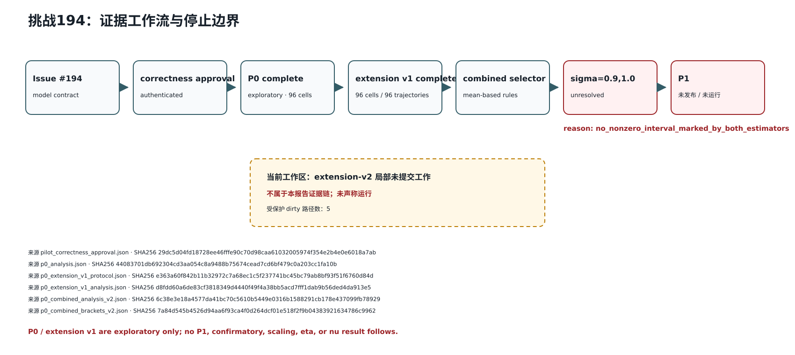
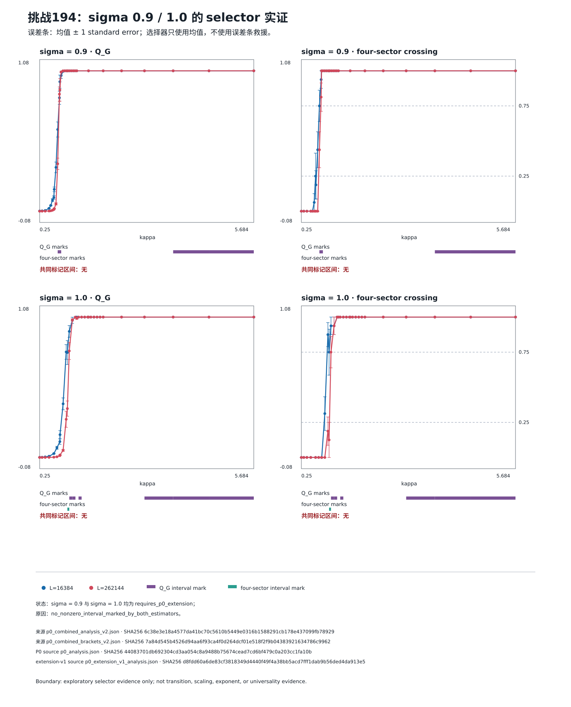

# 挑战194汇报

## 摘要

挑战 194 研究一维长程 `q=1` Fortuin–Kasteleyn（FK）随机团簇/长程渗流模型在衰减指数 `σ` 经过边缘点 `σ=1` 时的临界行为。当前成果不是临界指数答案，而是一条经过认证的、可停止的前置证据链：固定了模型约定；实现并验证了独立二次 oracle、几何跳跃采样器和生产 Poisson/Newman–Ziff 扫描；完成了真实 P0 与 P0 extension v1 集群采样；对不可变结果做了组合分析并原样重跑冻结 selector。最终 `σ=0.9` 和 `σ=1.0` 仍为 `requires_p0_extension`，原因都是 `no_nonzero_interval_marked_by_both_estimators`，所以 `p1_protocol.json` 未发布，P1 未运行。

这项工作虽不完整但仍有用：它把“模型定义错误、采样器错误、随机流不可复现、产物被覆盖、窗口被事后挑选”这些常见失效模式挡在指数拟合之前，并用可审计的失败结果阻止了不受证据支持的后续计算。当前只能报告探索性窗口选择证据，不能回答题目最终要求的 `2/3`、`η`、`ν`、标度形式或普适性问题。

## 题目与模型约定

[Issue #194](https://github.com/QuantumBFS/quantum.harness/issues/194) 指出，原始“`ν≈2/3, η≈0`”表述没有唯一指定随机过程、控制参数、相关函数和指数约定。项目因此固定研究偶数 `L` 环上的 `q=1` FK 模型。每个无序点对 `{i,j}` 独立开放：

```text
p_ij(kappa, sigma) = 1 - exp[-kappa J_L,sigma(i-j)]
J_L,sigma(r) = sum_{n in Z} |r+nL|^[-(1+sigma)].
```

约定是周期镜像和、每个无序点对只取一次、无距离截断、无 Kac 归一化、无独立最近邻参数；全部边采样后由并查集给出连通分量。`σ=1` 时有解析恒等式

```text
J_L,1(r) = (pi/L)^2 csc^2(pi r/L).
```

这不是 minimum-image `C/r^(1+σ)` 模型，不能混用阈值。Issue 给出的 Cardy `q→1` 延拓 `ν̃=2/3` 是待检验假设，不是本模型已经成立的结论；`σ>1` 的 `σ=1.1` 只作为 crossover 负对照，不能称为有限临界点。

物理上，生产计划原本要区分代数有限尺寸标度、essential singularity、巨团簇不连续出现或无有限耦合相变；并分别处理未减去巨团簇的连接度、有限团簇连接度、直接衰减指数和 Fisher 约定。但本轮真实数据只走到了窗口 selector。

## 本次完成范围

完成并由 Git 记录的实现包括：

- `model.py`/`kernel.py`：固定模型与周期镜像核；`σ=1` 使用 `csc²` 身份，其他 `σ` 使用对称 Hurwitz-zeta 表达。
- `counter_rng.py`：Philox4x32-10 计数型随机流；键由 master seed、phase、`L`、sigma grid ID、replica、stream ID 派生；有界整数用拒绝采样而非取模。
- `alias.py`/`edge_set.py`：按 `M_d J_d` 的确定性 Walker alias 表和 `uint64` 开边集合。
- `production_union_find.py`/`observables.py`：增量并查集、分量矩、最大/次大分量与四分区掩码。
- `poisson_reference.py`/`poisson_sweep.py`/`trajectory.py`：独立参考过程及生产 Poisson/Newman–Ziff 单调耦合扫描。
- `artifacts.py`、Pilot 与 Slurm 脚本：请求、环境、kernel、seed manifest、轨迹、batch、progress 和 manifest 的哈希绑定、原子发布、no-clobber、恢复和下载后深验证。
- `pilot_analysis.py` 与 `analyze_pilot.py`：按完整轨迹为重采样单位计算均值/标准误，认证 P0 与 extension v1，组合证据并执行冻结 selector。

真实分析仅覆盖 `L=2^10, 2^14, 2^18`，且只聚合四个基本可观测量：`S1/L`、`S2/L`、`Q_G`、`four-sector crossing`。P0 是 `σ=0.8,0.9,1.0,1.1` 的 96 个 cell/96 条轨迹；extension v1 只覆盖 `σ=0.9,1.0`，也是 96 个 cell/96 条轨迹。后者每个 sigma 使用 17 个已冻结 coupling checkpoint、replica `24..39`，没有改变科学引擎或 selector。

本报告产生前，仓库和结果目录中没有任何 challenge-194 科学图。下面两张 SVG 都是报告编写时从既有、认证 JSON 作出的确定性重绘，不是采样阶段产物，也不是新增科学计算；生成器不修改任何结果 JSON。

## 正确性与可复现性基础

正确性审批文件 `pilot_correctness_approval.json` 认证 revision `877ab9393f320bfe31ff74a26c3db1fb205d7ef3` 的 120-cell 验证包：共 22,755 个检查，报告 SHA256 `036b4b8a06164716aff5f40cc38ac4855a212026a556e1c5fe33ce32ce0babb8`，scientific-engine aggregate SHA256 `457fa669da897e59b03681039db6121fde4d7be9295bb46a743c8448875b3ee9`。验证范围包括核恒等式、总 rate、无边概率、开边数矩、`L≤6` 全图枚举、二次/几何/Poisson 三路一致性、极限值、antipodal class、随机流分离以及调度顺序不变性。

Capability benchmark 必须准确表述：Task 10 的 `L=2^18 ≤120 s`、峰值 RSS `≤4 GiB` gate 和 Task 11 优化被用户在正确性 gate 后豁免/取消，状态为 `cancelled-without-capability-report`，不是 passed。实际 P0/extension 仍在集群单核 worker 上运行，但“作业完成”不能倒推为冻结 gate passed。

两次真实 run spec 记录的环境均为 CPython 3.12.13、NumPy 2.2.6、SciPy 1.15.3、Numba 0.66.0、llvmlite 0.48.0、h5py 3.14.0、Linux x86_64，`fastmath=false`、`boundscheck=true`、`NUMBA_DISABLE_JIT=false`。worker 固定单线程，清理有影响的 Python/Numba/动态链接环境变量，并使用新建的私有 node-local Numba cache。

## P0 与 extension v1 的探索性流程

P0 protocol 使用 master seed `19420260729`、replica `0..7`，sigma 顺序 `0.8,0.9,1.0,1.1`，长度顺序 `1024,16384,262144`，16 个 coupling（含零点），得到 96 条单调轨迹。认证本地结果 root 为 `pilot-p0-739880d`；canonical Slurm array job 为 `41506576`，构建日志 job `41506541`，合并日志 job `41506709`。运行时用 Wuzh02 `wzacnormal03`，每个 cell 一 CPU、1800 MiB；run spec 和每个 cell 的 request/RNG/kernel/environment 都有独立哈希。

初始 P0 selector 为 `σ=0.8` 选择了探索性 transition-refinement 窗口，却无法为 `σ=0.9,1.0` 找到两个 estimator 同时标记的非零相邻区间；`σ=1.1` 只选择 crossover-refinement 窗口。于是产生了版本化 extension v1，而不是手工放宽阈值。

Extension v1 使用 master seed `19420262729`、replica `24..39`，与 P0 `0..7` 及预留 P1 `8..23` 分离；每个 sigma 的 17 点轴来自认证 P0 组件、guard interval 与四层 binary64 midpoint。实际 Wuzh02 作业为 build `41535048`、smoke `41535233`、两组数组 `41535277` 和 `41535294`；每个 worker 一 CPU、1800 MiB、40 分钟调度上限，无 GPU，数组任务严格映射到 96 个 cell。40 分钟是资源上限，也不是性能 gate 通过证据。

下载使用 checksummed、partial-safe、no-delete 的 `rsync` 合约；transfer log `pilot-p0-extension-v1.download-state/logs/transfer-261942-15440.log` 显示 immutable cell 树、HDF5 trajectory 及 SHA256 sidecar 被传输。最终 progress 证明恰好 96 cells/96 trajectories，`physics_claims_authorized=false`。



图 1 展示从 issue/model contract、正确性审批、P0、extension v1 到组合 selector 的证据链；虚线 extension-v2 框明确不接入科学证据链。来源是 `pilot_correctness_approval.json`、`p0_analysis.json`、`p0_extension_v1_protocol.json`、`p0_extension_v1_analysis.json`、`p0_combined_analysis_v2.json`、`p0_combined_brackets_v2.json`，完整 SHA256 见附录 A。该图不证明相变或指数；其中 P1 的状态只是“未发布/未运行”。

## 实际 selector 证据

冻结 selector 只使用两个最大尺寸 `L=16384,262144` 的均值：

1. `Q_G`：对每个非零相邻 coupling 区间，检查 `mean(Q_G,L=16384)-mean(Q_G,L=262144)` 是否在端点间变号或触零。
2. `four-sector crossing`：任一上述尺寸的两个端点均值必须覆盖闭区间 `[0.25,0.75]`。
3. 对 `σ≤1`，同一个相邻区间必须同时被两条规则标记；误差条不参与 selector，也不允许插值、平滑、nearest fallback 或人工选窗。



图 2 从 `p0_combined_analysis_v2.json`（文件 SHA256 `6c38e3e18a4577da41bc70c5610b5449e0316b1588291cb178e437099fb78929`）逐点读取 `Q_G` 与 four-sector crossing 均值及标准误，并从 `p0_combined_brackets_v2.json`（文件 SHA256 `7a84d545b4526d94aa6f93ca4f0d264dcf01e518f2f9b04383921634786c9962`）认证最终状态。误差条为均值 `±1 standard error`；它们只表达 8 或 16 条独立轨迹均值的不确定性，selector 仍只用均值。P0 source `p0_analysis.json` 文件 SHA256 为 `44083701db692304cd3aa054c8a9488b75674cead7cd6bf479c0a203cc1fa10b`，extension-v1 source `p0_extension_v1_analysis.json` 文件 SHA256 为 `d8fdd60a6de83cf3818349d4440f49f4a38bb5acd7fff1dab9b56ded4da913e5`。图中没有插值、合成点或视觉估值，也不建立相变、标度或指数结论。

实际窗口/状态如下：

- `σ=0.8`：`selected`，用途严格为 `transition_refinement`，窗口 `[0x1.f400000000000p-2, 0x1.3880000000000p-1]`。
- `σ=0.9`：`requires_p0_extension`，原因 `no_nonzero_interval_marked_by_both_estimators`。
- `σ=1.0`：`requires_p0_extension`，原因 `no_nonzero_interval_marked_by_both_estimators`。
- `σ=1.1`：`selected`，用途严格为 `crossover_refinement`，窗口 `[0x1.312d000000000p+0, 0x1.7d78400000000p+0]`；它不是 transition。

Extension v1 的六项验收中，第 4 项（`σ=0.9,1.0` 都有共同标记区间）和第 6 项（`requires_p0_extension=false` 且独立重算字节相同）失败。因此结果是“selector 仍 unresolved”，不是“计算给出了负的临界结论”。

## 当前结论与严格边界

P0 与已完成的 P0 extension v1 仅构成探索性窗口选择证据，不构成相变、临界点、临界指数、标度律或普适性结论。

在未改变 selector 的前提下，σ=0.9 与 σ=1.0 均没有得到被 Q_G 与 four-sector crossing 两个估计量共同标记的非零相邻区间。

因此 p1_protocol.json 未发布，P1 未运行。

名为 challenge-194-p0-combined-analysis-v2 的已认证 JSON 是组合分析 schema v2，不等于 extension-v2 采样已运行。

当前工作区存在未完成、未提交的 extension-v2 局部修改；它们与受保护 scratch 均不属于本报告证据链，也没有被本报告修改。

本项目尚未执行临界标度拟合，也没有给出 η 或 ν 的数值估计。

还需明确：只分析了 `L=2^10,2^14,2^18` 和四个基本可观测量；没有分析 `S1/L` histogram、bond-length histogram、有限团簇分布、pair connectivity、connected connectivity、spectral scale、density-jump bimodality，也没有完成 model comparison、confirmatory sampling、P1、`η`、`ν` 或任何 scaling 结果。P1 和 extension-v2（v2）作业从未运行。v2 design 与 implementation plan 已存在，但当前只完成了 Task 1 的局部 dirty 工作，既不是完整实现，也没有 protocol/run spec/作业/结果。此前没有 challenge-194 科学图；本报告 SVG 是 report-time deterministic redraw。

## 完整复现步骤

以下命令从 repository root 或 solution directory 执行，只认证和重绘现有证据，不重跑科学 campaign：

```bash
REPO=/home/footman/code/quantum.harness-challenge-194
SOLUTION="$REPO/tracks/qmc/solutions/frustration-free/challenge-194"
RESULTS="$REPO/results/challenge-194"

uv sync --project "$SOLUTION" --python 3.12
uv run --project "$SOLUTION" pytest -q

cd "$REPO"
sha256sum \
  "$SOLUTION/pilot_correctness_approval.json" \
  "$RESULTS/p0_analysis.json" \
  "$RESULTS/p0_extension_v1_analysis.json" \
  "$RESULTS/p0_combined_analysis_v2.json" \
  "$RESULTS/p0_combined_brackets_v2.json" \
  "$RESULTS/p0_extension_v1_protocol.json" \
  "$RESULTS/pilot-p0-739880d/run_spec.json" \
  "$RESULTS/pilot-p0-739880d/progress.json" \
  "$RESULTS/pilot-p0-extension-v1/run_spec.json" \
  "$RESULTS/pilot-p0-extension-v1/progress.json"

cd "$SOLUTION"
uv run python scripts/generate_report_figures.py \
  --approval pilot_correctness_approval.json \
  --p0-analysis "$RESULTS/p0_analysis.json" \
  --extension-protocol "$RESULTS/p0_extension_v1_protocol.json" \
  --extension-analysis "$RESULTS/p0_extension_v1_analysis.json" \
  --combined-analysis "$RESULTS/p0_combined_analysis_v2.json" \
  --brackets "$RESULTS/p0_combined_brackets_v2.json" \
  --output-dir assets
```

生成器先校验六个源文件的固定 whole-file SHA256、五个 embedded document SHA256、schema、source cross-link、canonical `float.hex()` 轴、有限均值/非负标准误及两个 unresolved bracket；任何不一致均停止。SVG 使用固定 viewBox、颜色、元素顺序、十进制格式和 font fallback，不含时间、hostname、绝对路径、随机 ID 或当前 Git revision。内存中完成字节后以私有临时文件、`fsync` 和 no-clobber hard-link 发布；相同文件只验证，不同文件拒绝覆盖。

P0 与 extension v1 的分析/组合命令属于历史 provenance，不能在本报告构建中运行。尤其当前工作树含受保护 partial v2 修改，禁止运行 `combine`、`select`、`build-p1`、任何 v2 builder/worker、P1 worker、scaling fit、`η` fit 或 `ν` fit。只可在对应历史 revision 和不可变输入上按 README 所列命令复核；unresolved 时明确不要运行 `build-p1`。

## 参考资料

- Challenge issue #194：<https://github.com/QuantumBFS/quantum.harness/issues/194>。Issue 定义完整科学问题；本报告只记录更窄的探索性停止点。
- 智御量子 2026 指南：<https://giggleliu.github.io/summer-school-2026/zh/guide>。指南要求可复现成果、最终中文汇报与如实说明未完成项。
- 本地文献与哈希注册表：`references/README.md`。
- J. L. Cardy, *One-dimensional models with 1/r² interactions*, <https://doi.org/10.1088/0305-4470/14/6/017>。
- E. Luijten and H. Meßingfeld, *Criticality in one dimension with inverse square-law potentials*, <https://arxiv.org/abs/cond-mat/0104175>。
- M. Aizenman and C. M. Newman, *Discontinuity of the percolation density in one dimensional 1/|x-y|² percolation models*, <https://doi.org/10.1007/BF01205489>。
- H. Duminil-Copin, C. Garban, and V. Tassion, *Long-range models in 1D revisited*, <https://arxiv.org/abs/2011.04642>。
- G. Gori et al., *One-dimensional long-range percolation: A numerical study*, <https://arxiv.org/abs/1610.00200>。其 minimum-image 模型只作比较，不是本项目 oracle。

## 附录 A：文件、schema 与 SHA256 证据账本

Whole-file SHA256：

- `pilot_correctness_approval.json` — `29dc5d04fd18728ee46fffe90c70d98caa61032005974f354e2b4e0e6018a7ab`
- `p0_analysis.json` — `44083701db692304cd3aa054c8a9488b75674cead7cd6bf479c0a203cc1fa10b`
- `p0_extension_v1_analysis.json` — `d8fdd60a6de83cf3818349d4440f49f4a38bb5acd7fff1dab9b56ded4da913e5`
- `p0_combined_analysis_v2.json` — `6c38e3e18a4577da41bc70c5610b5449e0316b1588291cb178e437099fb78929`
- `p0_combined_brackets_v2.json` — `7a84d545b4526d94aa6f93ca4f0d264dcf01e518f2f9b04383921634786c9962`
- `p0_extension_v1_protocol.json` — `e363a60f842b11b32972c7a68ec1c5f237741bc45bc79ab8bf93f51f6760d84d`
- `pilot-p0-739880d/run_spec.json` — `d17d3df9528a09f0d834ebe9d5ce6f283e488d2326f6cb14873a90923c5d9840`
- `pilot-p0-739880d/progress.json` — `ea29a8163a5d3e85768842d64fac4c719f5aeadf965b3318b305fb7a2cc2d15f`
- `pilot-p0-extension-v1/run_spec.json` — `c1ca9b6c8ba751919c6d9337fe1cd4c09a57ed9b99abbb9d3ebfed7f89c3d32e`
- `pilot-p0-extension-v1/progress.json` — `c78d1fb03daf19297ef9e0617410c68a6a364bffc2f2888dfa9067e7e8d6b65f`
- `challenge-194-selector-evidence.svg` — `40fa91c741272cf9b1d15f5a0ff35f496d7d876ec6180741b84d744ad18ad7c2`
- `challenge-194-workflow-status.svg` — `252537c3084ee641432c78520de8579f7e41b49aa5d3e2aec1848884254a8a5b`

Embedded identity：

- `p0_analysis.json` / `analysis_document_sha256` — `e42ef6b9f82380305f80ceaba384bc29cb9fe2da0848d4c72a904f4cb4c8c7c8`
- `p0_extension_v1_protocol.json` / `protocol_sha256` — `a37ab41f3224594e61f4eebbe292975aeec449b9ecb7893e3e54f18d82d53321`
- `p0_extension_v1_analysis.json` / `analysis_document_sha256` — `79232574d314348c29a40cd2fbb7690e96f3cae5f26843bd4f1cf07cb6a1f45b`
- `p0_combined_analysis_v2.json` / `analysis_document_sha256` — `36f85c40e9159ef2e69742672c261769fb28d2f3c947780ba63e4ef5fe5975c3`
- `p0_combined_brackets_v2.json` / `bracket_document_sha256` — `098f19d8883097d5f1f274ce759416328c086958fa5301c034a0b46dcbd562df`

Cross-link 为：combined analysis 同时绑定 P0 document `e42e…c7c8` 与 extension document `7923…f45b`；brackets 再绑定 combined document `36f8…75c3`。P0 analysis 有 192 estimate rows；extension v1 有 102 rows；combined 有 282 rows。两棵 progress 均严格记录 96 cells/96 trajectories。

## 附录 B：Selector 定义与逐项结果

算法只在每个 sigma 已排序且非零的相邻 `κ_i,κ_{i+1}` 上运行：

```text
D_i(L_a,L_b) = mean Q_G(L_a,kappa_i) - mean Q_G(L_b,kappa_i)
Q mark(i) <=> min(D_i,D_{i+1}) <= 0 <= max(D_i,D_{i+1})

C mark(i) <=> exists L in {16384,262144}:
  min(C_L(kappa_i),C_L(kappa_{i+1})) <= 0.25
  and max(C_L(kappa_i),C_L(kappa_{i+1})) >= 0.75

common(i) = Q mark(i) and C mark(i)
```

标准误只按 `mean ± SE` 绘制。没有 interpolation、smoothing、digitization、synthetic point、confidence-interval rescue 或人工窗口。`σ=0.9`、`1.0` 均无 `common(i)`；因此状态与原因完全相同。`σ=0.8` 的 transition-refinement 与 `σ=1.1` 的 crossover-refinement 只保留其认证标签。

## 附录 C：完整复现命令

### C.1 报告图测试、生成与字节确定性

```bash
cd "$SOLUTION"
uv run pytest tests/test_generate_report_figures.py -q
uv run python -m py_compile scripts/generate_report_figures.py
uv run python scripts/generate_report_figures.py --help

SVG_A="$(mktemp -d /tmp/ch194-svg-a.XXXXXX)"
SVG_B="$(mktemp -d /tmp/ch194-svg-b.XXXXXX)"
for out in "$SVG_A" "$SVG_B"; do
  uv run python scripts/generate_report_figures.py \
    --approval pilot_correctness_approval.json \
    --p0-analysis "$RESULTS/p0_analysis.json" \
    --extension-protocol "$RESULTS/p0_extension_v1_protocol.json" \
    --extension-analysis "$RESULTS/p0_extension_v1_analysis.json" \
    --combined-analysis "$RESULTS/p0_combined_analysis_v2.json" \
    --brackets "$RESULTS/p0_combined_brackets_v2.json" \
    --output-dir "$out"
done
cmp "$SVG_A/challenge-194-selector-evidence.svg" "$SVG_B/challenge-194-selector-evidence.svg"
cmp "$SVG_A/challenge-194-workflow-status.svg" "$SVG_B/challenge-194-workflow-status.svg"
cmp assets/challenge-194-selector-evidence.svg "$SVG_A/challenge-194-selector-evidence.svg"
cmp assets/challenge-194-workflow-status.svg "$SVG_A/challenge-194-workflow-status.svg"
sha256sum assets/*.svg
```

### C.2 历史 campaign provenance（不要为本报告重跑）

原始 P0 使用 `scripts/pilot_array_slurm.sh` 的 array `1..96 → cell 0..95`；extension v1 使用 smoke `1-2%2`、light/medium `3-32,49-80%16`、heavy `33-48,81-96%8`。历史分析命令及全部 trust inputs 记录在 `README.md`。只有 exact historical revision `143d35ac52923cff2d24c43d304a75c2d04d3c66` 能对 P0 analysis 返回 `verified-existing`；当前 HEAD 不应改写它。

本报告不得运行下列命令：

```text
analyze_pilot.py combine
analyze_pilot.py select
analyze_pilot.py build-p1
任何 extension-v2 builder/worker
任何 P1 worker
任何 scaling / eta / nu fit
```

### C.3 数据布局与安全边界

```text
results/challenge-194/
├── pilot-p0-739880d/
│   ├── run_spec.json
│   ├── progress.json
│   └── cells/<cell-id>/run/{request,environment,kernel,seed-manifest,
│       capability,trajectories,batches,progress,manifest}
├── pilot-p0-extension-v1/        # 同构的 96-cell immutable tree
├── *.download-state/             # root 外的 source/verified/log
├── p0_analysis.json
├── p0_extension_v1_protocol.json
├── p0_extension_v1_analysis.json
├── p0_combined_analysis_v2.json
└── p0_combined_brackets_v2.json
```

Canonical JSON 为 sorted keys、compact separators、UTF-8、一个末尾换行、有限数值。publication 是 fsync 后 atomic no-clobber；`.partial`、`.intent`、unexpected path、hash mismatch、ABA replacement 和 runtime/source drift 均 fail closed 并保留诊断。下载状态与 transfer log 在 immutable root 外。报告生成器只读六个认证 JSON，既不 import 当前 dirty 的 `pilot_extension.py`/`analyze_pilot.py`，也不写 `results/challenge-194/`。

## 附录 D：实现与验证范围

### D.1 算法、复杂度与随机数

- Quadratic oracle：逐个 `i<j`，以 `p=-expm1(-κJ_d)` 独立采样，`O(L²)` 时间、`O(L)` 内存，主要用于 `L≤256` 交叉验证。
- Geometric skipping：同一 distance class 内利用 closed-run 的几何分布，期望复杂度 `O(L+E_open α(L))`。
- Poisson/Newman–Ziff：总 rate `Λ=Σ_e J_e=L ζ(1+σ)[1-L^-(1+σ)]`；按 `M_dJ_d` alias 抽 distance class，再抽 offset。重复 event 被忽略，新 edge 才 union；一次轨迹共享全部 `κ`，所以 bootstrap 单位必须是整条轨迹。
- `Q_G=Σ_C|C|⁴/(Σ_C|C|²)²`；four-sector crossing 表示有分量同时碰到四个固定 quarter-ring arc。
- Philox stream 与调度、数组顺序和 retry 解耦；P0、v1、预留 P1 的 replica/master seed 互不重用。

### D.2 Git 里程碑

- `e639b437…`（2026-07-29 03:52 +08）定义科学 protocol。
- `55cf1f9f…`（04:08）固定模型。
- `db29995c…`（05:43）规划 production engine。
- `877ab939…`（2026-07-30 03:31）稳定 production-size Pilot numerics。
- `06ce05c0…`（04:12）批准稳定 engine。
- `739880d9…`（04:56）绑定 P0 ancestors。
- `11b1e59f…`（11:30）发布 immutable extension protocol。
- `9308087c…`（13:17）要求显式 P0 evidence root。
- `aca4ea24…`（13:38）加入 bounded extension aggregation。
- `b62d0d33…`（13:49）组合 verified evidence。
- `95ac875e…`（14:03）原样重跑冻结 selector。
- `37d90fb1…`（15:07）记录 extension boundary evidence。
- `30c1be09…`（15:28）认证 combined evidence。

### D.3 已验证与未验证

已验证的是模型/核/采样器基本正确性、artifact/provenance、安全发布、P0 与 v1 root、四个基本 observable 聚合、source-bound selector 和本报告图的源哈希/确定性。性能 gate 是 waived/cancelled，不是 passed。

本报告新增 focused suite 最新一次为 `6 passed in 0.06s`；完整 solution suite 为 `835 passed in 206.19s`。此外已验证两次独立临时目录生成与已发布 SVG 三方逐字节相同、XML 可解析、强制标签/来源 caption 存在、Markdown 本地链接可解析、24 条 curated prompt 时间有序、claim-boundary regex 通过、账本哈希与当前文件一致、`git diff --check` 无输出。

明确未完成：全 `L=2^10,2^12,2^14,2^16,2^18` production；`σ=1` 中间尺寸；histogram/connectivity/finite-cluster scale；12 点以上 near-critical retained window；density jump；essential/free-essential/algebraic/log-corrected model comparison；nested bootstrap/deletion stability；confirmatory phase；P1；v2 campaign；`η`、`ν` 和任何 scaling 结论。

## 附录：Prompt 时间线

来源为本项目 canonical Cursor transcript `ca5a598d-f70e-482b-9024-c381ba92d7c7`，从首次明确指派 Challenge 194 开始。以下按原时间顺序保留 substantive user prompts 的关键原文；重复的“继续/状态/自动 follow-up”只在阶段边界合并说明。包含凭据文件路径、主机账号等敏感内容的 prompt 被排除；不包含 hidden reasoning、tool payload 或 credential。实现 prompt 的生成来源是批准的 `docs/superpowers/plans/2026-07-30-challenge-194-report.md`，在末尾单列关键原文。

### Prompt 1 — Wednesday, Jul 29, 2026, 3:00 AM (UTC+8)

```text
你做194，你看到194的文件夹了吗，你进入194的分支，准备开始做
```

### Prompt 2 — Wednesday, Jul 29, 2026, 3:13 AM (UTC+8)

```text
https://giggleliu.github.io/summer-school-2026/zh/guide 话说按照要求最后分支合并以后要是一个能交的pr，我们应该在哪写代码，现在多个agent的做法合理吗？
```

### Prompt 3 — Wednesday, Jul 29, 2026, 3:22 AM (UTC+8)

```text
现在我们的工作流是这样的：
可以采用“4 个开发 worktree + 1 个集成 worktree + 1 个最终 PR”的模式。技术上可并行，提交上仍保持一个入口。
```

### Prompt 4 — Wednesday, Jul 29, 2026, 3:25 AM (UTC+8)

```text
有需要下载的文章或者代码吗？下载一下
```

### Prompt 5 — Wednesday, Jul 29, 2026, 3:34 AM (UTC+8)

```text
你看懂题了吗，仔细读题，想想怎么做
```

### Prompt 6 — Wednesday, Jul 29, 2026, 3:59 AM (UTC+8)

```text
确认
```

### Prompt 7 — Wednesday, Jul 29, 2026, 5:16 AM (UTC+8)

```text
目前做了啥，算了啥，结果如何？
```

### Prompt 8 — Wednesday, Jul 29, 2026, 5:22 AM (UTC+8)

```text
实现生产采样器
Poisson/Newman–Ziff 扫描、计数型随机数、增量并查集和可重启数据产物。

性能与正确性标定
与当前 O(L²) oracle、几何采样器交叉验证，测量内存和每样本耗时。

小规模 pilot
运行 σ=0.8、0.9、1.0、1.1，初步扫描 κ，定位相变区域。

大尺寸生产计算
扩展至 L=2¹⁰、2¹⁴、2¹⁸；耗时超过本地阈值时迁移集群。
```

### Prompt 9 — Wednesday, Jul 29, 2026, 12:20 PM (UTC+8)

```text
算不动的话可以上超算
```

### Prompt 10 — Wednesday, Jul 29, 2026, 7:01 PM (UTC+8)

```text
10和11是必须的吗，如果代码性能也没有很差的话可以继续往后做
```

### Prompt 11 — Wednesday, Jul 29, 2026, 8:43 PM (UTC+8)

```text
刚刚意外中断了，你跑的这个太重了，停掉
```

### Prompt 12 — Wednesday, Jul 29, 2026, 11:13 PM (UTC+8)

```text
还在跑吗？刚刚断了，继续。本地别跑大的
```

### Prompt 13 — Wednesday, Jul 29, 2026, 11:25 PM (UTC+8)

```text
现在在算什么物理问题，最后要算哪些物理问题
```

### Prompt 14 — Wednesday, Jul 29, 2026, 11:34 PM (UTC+8)

```text
为什么要证明“单条轨迹 ≤120 秒、≤4 GiB”。是题目的要求吗？
```

### Prompt 15 — Wednesday, Jul 29, 2026, 11:36 PM (UTC+8)

```text
我觉得没必要有这一步，直接开始跑题目吧，优化估计已经够好了
```

### Prompt 16 — Thursday, Jul 30, 2026, 3:11 AM (UTC+8)

```text
修复该并发检查并续跑失败的 77 个单元
```

### Prompt 17 — Thursday, Jul 30, 2026, 5:04 AM (UTC+8)

```text
下载 P0 产物并在本地再次验证。
分析四个 σ 的可观测量，确定临界 κ 窗口。
冻结 P1 参数、细化 κ 网格和新 RNG 副本。
集群运行 P1。
根据 P1 预注册正式生产参数，运行更大尺寸和更多独立轨迹。
做有限尺寸标度、临界点/指数拟合、误差分析、绘图和最终报告。
完成 Task 12 的公开 API 与 README。
```

### Prompt 18 — Thursday, Jul 30, 2026, 10:56 AM (UTC+8)

```text
P0你跑的是什么，也是真实数据吗，是题目里问的吗
```

### Prompt 19 — Thursday, Jul 30, 2026, 1:32 PM (UTC+8)

```text
所以这个问题的超算环节做完了吗
```

### Prompt 20 — Thursday, Jul 30, 2026, 3:12 PM (UTC+8)

```text
啥情况，跑了哪些，接下来还需要在超算上跑哪些？
```

### Prompt 21 — Thursday, Jul 30, 2026, 3:16 PM (UTC+8)

```text
p1不是算完了吗，现在在干嘛
```

### Prompt 22 — Thursday, Jul 30, 2026, 6:21 PM (UTC+8)

```text
停掉吧，来不及做完了，做了多少就汇报多少
```

### Prompt 23 — Thursday, Jul 30, 2026, 6:49 PM (UTC+8)

```text
https://giggleliu.github.io/summer-school-2026/zh/guide https://github.com/QuantumBFS/quantum.harness/issues/194 
在这个包里写一个md，用中文，标题叫做挑战194汇报
里面包括正文，支撑材料，prompt
代码目前没有全部运行完成。请基于仓库中真实存在的代码、配置、日志、数据、图片和 Git 记录进行汇报。不要虚构结果，不要把计划写成已完成工作。
正文。需要介绍挑战物理背景还有我们做了什么，包括相关的结果（图表或者图片），讲一个完整的故事，做到哪说到哪。
支撑材料也就是附录。需要包括代码实现的全部细节，可以额外做一张矢量图，包括如何复现正文的全部内容
prompt。需要尽可能按顺序记录完成这个项目用的提示词
注意：
1. 足够的信息去复现结果，2. 一个清晰的给人看的文件论证你的结果有用性和正确性。
```

### Prompt 24 — Thursday, Jul 30, 2026, 6:59 PM (UTC+8)

批准的 implementation plan 关键原文：

```text
Goal: Produce one Chinese report, 挑战194汇报.md, with a detailed supporting appendix and chronological prompts, plus two deterministic SVGs derived only from authenticated P0 + extension-v1 evidence.

Task Order
1. Freeze protected-work and evidence hashes.
2. Write failing generator tests.
3. Implement and test the authenticated generator.
4. Generate and deterministically validate the two SVGs.
5. Extract and curate the prompt chronology.
6. Write the single Chinese report and embedded appendices.
7. Validate links, hashes, claims, determinism, chronology, and untouched dirty work.
```

重复的自动 follow-up prompt 主要为 `Perform any necessary follow-up actions in response to the subagent completion above...`；重复状态/恢复 prompt 主要为 `刚刚断了，继续，包括后台的subagent`、`跑完了吗`、`接下来需要做哪些？`。它们作为过程控制被合并记录，没有被误作科学要求或完成证据。

## 附录 E：主张—证据—边界矩阵

### E.1 模型已固定

- 证据：`DESIGN.md`、Issue #194、commit `55cf1f9f…`、kernel/oracle tests。
- 允许：报告周期镜像和 `q=1` 独立 Bernoulli 边模型。
- 禁止：套用 minimum-image 模型阈值或说原始题意已被唯一识别。

### E.2 科学引擎经过正确性审批

- 证据：`pilot_correctness_approval.json` whole-file SHA256 `29dc…a7ab`，内部 report/check registry/engine hashes。
- 允许：说审批的 engine 通过冻结正确性 gate。
- 禁止：把未执行的性能 gate 说成 passed。

### E.3 P0 与 extension v1 真正运行并完成

- 证据：两份 authenticated run spec/progress；分别 96 cells/96 trajectories；scheduler logs 和 transfer log。
- 允许：说真实探索性 campaign 完成并通过 artifact 深验证。
- 禁止：说它们是 confirmatory、production scaling 或物理结论。

### E.4 `σ=0.9,1.0` unresolved

- 证据：`p0_combined_analysis_v2.json` whole-file SHA256 `6c38…8929` 与 `p0_combined_brackets_v2.json` `7a84…9962`；图 2 为其确定性重绘。
- 允许：`requires_p0_extension` / `no_nonzero_interval_marked_by_both_estimators`。
- 禁止：插值制造窗口、用误差条救援 selector、声称不存在相变。

### E.5 `σ=0.8` 和 `1.1` 窗口

- 证据：认证 brackets。
- 允许：`σ=0.8 transition_refinement`、`σ=1.1 crossover_refinement` 的探索性窗口。
- 禁止：把 `σ=1.1` crossover 称为确认相变。

### E.6 P1、v2、scaling 与指数均没有结果

- 证据：`p1_protocol.json` 不存在；结果目录没有 v2 protocol/root/analysis；工作区只有五个受保护 dirty partial-v2 路径；v2 design/plan 明说设计与未来工作。
- 允许：P1/v2 未运行，Task 1 只是 partial dirty work，`η`/`ν` 未估计。
- 禁止：把 schema 名 `challenge-194-p0-combined-analysis-v2` 当作 extension-v2 运行，把计划 cardinality/job 命令写成完成事实。

### E.7 本报告图的身份

- 证据：`scripts/generate_report_figures.py`、focused tests、两次临时目录 byte comparison、SVG SHA256。
- 允许：从认证 JSON 的 report-time deterministic redraw。
- 禁止：声称此前已有 challenge-194 科学图，或把 redraw 当作新采样/拟合结果。
