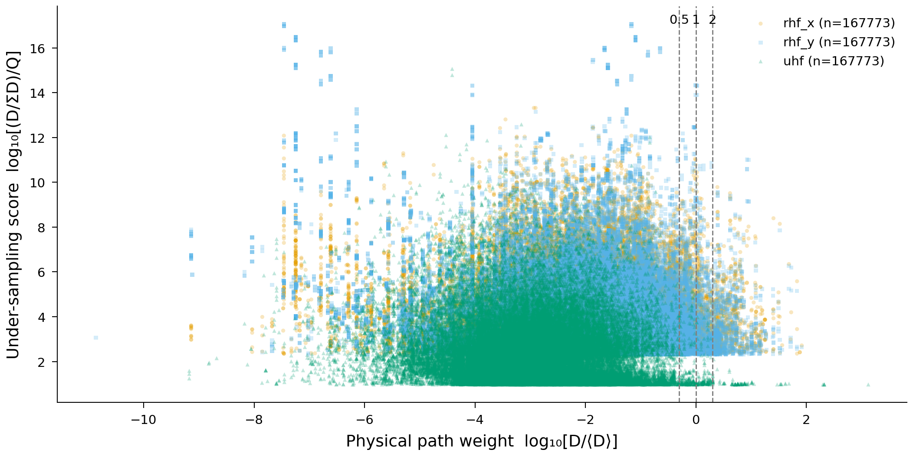
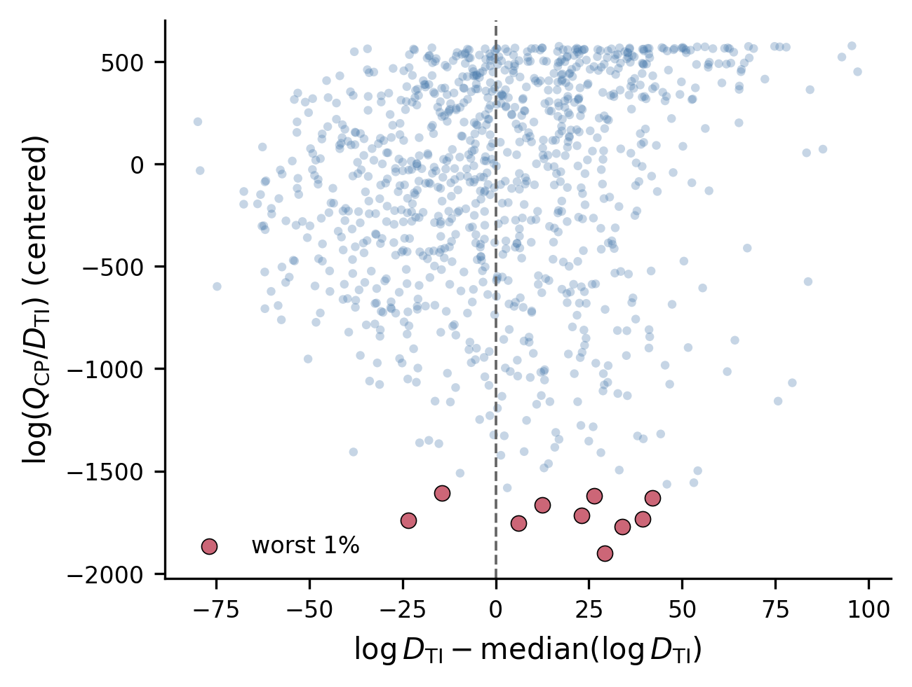
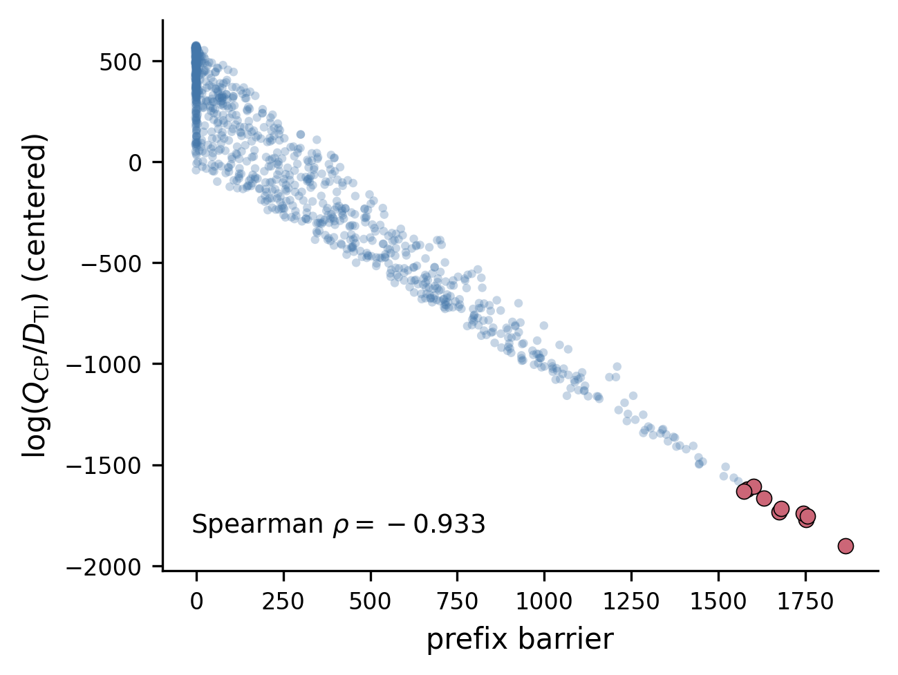

# Diagnosing Practical Ergodicity Breaking in Constrained-Path AFQMC from Auxiliary-Field Paths

## Abstract

Constrained-path auxiliary-field quantum Monte Carlo (CP-AFQMC) can show a
systematic bias even at half filling, where the repulsive Hubbard model has no
fermion sign problem.  The usual geometric picture attributes this behavior to
artificial nodal surfaces of the trial wave function in a high-dimensional
Slater-determinant space, but that space is difficult to visualize or enumerate.
We instead diagnose the problem directly in auxiliary-field path space.  For a
2x2 periodic Hubbard model we enumerate every path and compare its physical
projector-QMC weight with its exact CP generation probability.  For a 4x4
system, we draw physically relevant paths with sign-free projector QMC (PQMC)
and replay the complete 6,720-field history under the UHF-guided CP proposal.
Both calculations identify positive-weight, physically important paths whose CP
probabilities are extraordinarily small.  The dominant mechanism is not a
single zero-overlap event: many near-node, low-conditional-probability choices
accumulate along a long trajectory.  A prefix-barrier diagnostic has Spearman
correlation −0.933 with the CP sampling efficiency.  Direct ratio-of-sums
reweighting of 96,000 PQMC paths gives an energy of −13.6155(140), consistent
with the exact −13.62192 and clearly separated from direct UHF-CP,
−13.4683(31).  Finally, we propose eliminating the failure at its source by
maximizing the trial-overlap margin on the dynamically reachable set.  We give
a strict constructive example: after a partial particle-hole transformation, a
special transverse GHF trial has overlap equal to the determinant of a
positive-definite Gram matrix, and is therefore uniformly node-free on the
symmetry-paired reachable sector.  This supplies both a practical diagnostic
and a principled route for removing CP ergodicity bias in sign-problem-free
systems.

## 1. Challenge and significance

The CP constraint retains walkers satisfying

$$
h_T(\phi) \equiv \langle\Psi_T|\phi\rangle > 0
$$

and removes a walker when its overlap with the trial wave function reaches the
artificial nodal surface, $h_T(\phi)=0$.  Challenge
[#90](https://github.com/QuantumBFS/quantum.harness/issues/90) asks whether the
full positive-overlap region is actually explored and how disconnected or
poorly connected sampling domains can be visualized.

This question matters even without a sign problem.  At half filling on a
bipartite lattice, the exact auxiliary-field weight is nonnegative, yet the
usual UHF/spin-HS constrained calculation for a 4x4 periodic lattice gives
$E=-13.478(2)$ instead of the exact $-13.62192$ [Qin, Shi, and Zhang
(2016)](https://arxiv.org/abs/1605.09421).  Thus “no negative weights” does not
imply that an approximate trial nodal surface is harmless.  A finite walker
population can fail to cross from one physically relevant part of path space
to another even when every required transition has a formally nonzero
probability.

Our central shift in viewpoint is to avoid reconstructing the full Slater
manifold.  A point in that manifold has gauge redundancies and a dimension that
grows with system size, whereas a complete auxiliary-field history is discrete,
reproducible, and can be evaluated under two measures:

- $D(X)$: its physical PQMC weight;
- $Q_{\mathrm{CP}}(X)$: the product of the conditional probabilities with
  which a specified CP heat-bath walk generates the same path.

The ratio between these measures directly answers whether an important
physical path can be generated efficiently by CP.

## 2. Models and path-space diagnostic

We study the repulsive Hubbard Hamiltonian

$$
H=-t\sum_{\langle ij\rangle,\sigma}
\left(c^\dagger_{i\sigma}c_{j\sigma}+\mathrm{h.c.}\right)
+U\sum_i n_{i\uparrow}n_{i\downarrow},
$$

with $t=1$, periodic boundaries in both directions, and half filling.  The real
binary Hirsch spin decomposition is

$$
e^{-\Delta\tau U(n_\uparrow-\frac12)(n_\downarrow-\frac12)}
=\frac{e^{-\Delta\tau U/4}}{2}
\sum_{x=\pm1}e^{\gamma x(n_\uparrow-n_\downarrow)},\qquad
\cosh\gamma=e^{\Delta\tau U/2}.
$$

The prefactor is path independent and does not affect the probability ratios
used below.

For a sequence $X=(x_1,\ldots,x_K)$, the CP proposal probability is

$$
Q_{\mathrm{CP}}(X)=\prod_{k=1}^{K}
q_k(x_k|x_1,\ldots,x_{k-1}).
$$

We define the log sampling efficiency

$$
\ell_{\mathrm{eff}}(X)
=\log Q_{\mathrm{CP}}(X)-\log D(X).
$$

Unknown global normalization constants shift every value equally and therefore
do not change rankings, correlations, or the identification of inefficient
paths.

For the 4x4 calculation we also define a prefix barrier.  Let
$L_m(X)=\sum_{k\le m}\log q_k$ and let $\widetilde L_m$ be the median prefix
trajectory in a training set of ordinary positive-weight paths.  Then

$$
B(X)=-\min_m\left[L_m(X)-\widetilde L_m\right].
$$

$B(X)$ records the deepest cumulative proposal deficit.  It is sensitive to a
long sequence of moderately unfavorable choices, not only to the smallest
single-step probability.

## 3. Exact 2x2 enumeration

The first calculation uses a 2x2 periodic lattice at $U=8$,
$\Delta\tau=0.1$, and six time slices.  There are $4\times6=24$ binary fields,
so all $2^{24}=16,777,216$ paths can be enumerated exactly for each of RHF-x,
RHF-y, and UHF trials.  We select the one percent with the largest discrepancy
between normalized physical weight and CP generation probability.

**Figure 1. Exhaustive 2x2 path audit.**  Each marker belongs to the exact worst
one percent in CP sampling efficiency for one trial
($n=167,773$ out of $16,777,216$).  The horizontal coordinate is physical path
weight relative to the mean; vertical dashed lines mark
$D/\langle D\rangle=0.5,1,2$.  The vertical coordinate is the number of
base-10 orders by which normalized physical weight exceeds CP generation
probability.  The worst tail contains 4,140 RHF-x, 4,618 RHF-y, and 799 UHF
paths with at least the mean physical weight.  Some important paths are
under-sampled by more than ten orders of magnitude.
([Vector PDF](figures/exhaustive_2x2_weight_efficiency.pdf))

This is already a direct counterexample to the intuition that poor CP sampling
is confined to negligible-weight configurations.  UHF improves the typical
efficiency relative to RHF but does not eliminate the important, inefficient
tail.

Path-resolved replay explains why.  For the important subset of the worst tail,
the leading attribution is **near-orthogonal recovery**: a trial–walker overlap
becomes small during propagation, so the required branch receives a small
heat-bath probability, but later propagation restores a large physical path
weight.  A sampler guided only by the partial overlap cannot know that this
low-probability branch has important descendants.

## 4. 4x4 PQMC-to-CP audit

The production calculation uses a 4x4 periodic lattice at $U=4$ with
$N_\uparrow=N_\downarrow=8$, $\Delta\tau=0.05$, projection length
$\Theta=10$, and 420 time slices.  ALF uses a free determinant on the right and
an $U_{\mathrm{eff}}=4$ UHF determinant on the left.  Complete PQMC
configurations are replayed in a C++/oneMKL implementation of the CP
$K/2$–$V$–$K/2$ propagation, with the same UHF trial used for the constraint.
We call this left-trial/right-free boundary choice the TI ensemble and denote
its physical path weight by $D_{\mathrm{TI}}$.

The initial audit contains 1,024 TI paths from 128 independent Markov chains;
976 positive, fully propagated paths enter the efficiency analysis.  The ten
lowest-efficiency paths are highlighted below.

**Figure 2. Important 4x4 PQMC paths can be practically inaccessible to CP.**
The horizontal coordinate is the PQMC path log weight centered by its median;
the vertical coordinate is centered
$\log(Q_{\mathrm{CP}}/D_{\mathrm{TI}})$.  Eight of the ten worst-efficiency
paths (red) have physical weights above the sample median, yet their sampling
efficiencies are separated from the ordinary population by roughly
$1,600$–$1,900$ natural-log units.  All plotted paths have positive physical
weight and nonzero CP proposal probability.
([Vector PDF](figures/pqmc_weight_efficiency.pdf))

The result must be interpreted correctly.  These paths are not forbidden in
exact arithmetic; they are **practically inaccessible** to any realistic finite
walker population.  This is the relevant form of ergodicity breaking for the
simulation: formal irreducibility does not imply useful mixing on a finite
computational timescale.

## 5. Repeated near-node encounters are the main mechanism

The strongest predictor of low final efficiency is the prefix barrier.

**Figure 3. The efficiency loss is cumulative.**  The same 976 paths are shown
against their deepest deficit relative to a reference prefix trajectory.
Sampling efficiency and prefix barrier have Spearman correlation
$\rho=-0.933$.  All ten worst paths lie at the far end of the barrier
distribution, and all reach their maximum deficit in the last quarter of the
420-slice trajectory.  The almost linear envelope is the signature of repeated
conditional-probability suppression along a long path.
([Vector PDF](figures/prefix_barrier.pdf))

A detailed local replay of five low-proposal cases and five matched controls
supports the same conclusion:

| Trajectory statistic | Low-efficiency cases | Matched controls |
|---|---:|---:|
| Total surprisal, $-\sum_k\log q_k$ | 6,748.1 | 5,619.0 |
| Updates with $q_k<10^{-3}$ | 46.4 | 23.2 |
| Updates with $q_k<10^{-6}$ | 2.2 | 0.8 |
| Largest single-event surprisal | 16.57 | 14.02 |
| Share from the 100 largest events | 11.21% | 10.53% |

The low-efficiency paths accumulate about 1,129 more units of surprisal and
encounter twice as many $q_k<10^{-3}$ updates.  Yet the largest 100 events carry
almost the same fraction of total surprisal in cases and controls.  The deficit
therefore cannot be assigned to one absolute node or a handful of catastrophic
updates.  It arises from many biased decisions whose product becomes
astronomically small.

The matrix-level near-node diagnostic is the trial–walker overlap matrix

$$
S_\sigma=\Psi_{T,\sigma}^\dagger\Phi_\sigma,\qquad
h_T(\Phi)=\det S_\uparrow\det S_\downarrow.
$$

A node occurs when $S_\sigma$ loses rank.  The smallest singular value
$\sigma_{\min}(S_\sigma)$ measures proximity to that condition.  In the 4x4
sample, efficiency correlates positively with
$\log_{10}\sigma_{\min}$ ($\rho=0.758$), confirming the nodal interpretation,
but the prefix barrier is more predictive because it integrates all near-node
encounters along the path.

No single local auxiliary-field pattern explains the effect.  The ten
bottleneck slices have ten different 16-bit masks; their uniform,
checkerboard, staggered, and domain-wall statistics are close to those of
ordinary paths.  The robust pattern is temporal, not a single all-$+1$,
all-$-1$, or checkerboard slice.

## 6. Complete-path direct reweighting passes the observable check

To test whether sampling the positive PQMC path ensemble—including paths
strongly suppressed by the CP proposal—recovers the correct observable, we
performed a separate direct ratio-of-sums calculation with 1,920 independent
chains and 50 paths per chain.  No CP rejection or low-probability cutoff was
applied.  For each common bin, numerator and denominator were first summed
across chains, and the 50 cross-chain bins were then used for the uncertainty
estimate.

| Calculation | Energy |
|---|---:|
| Exact 4x4 ground state | −13.62192 |
| ALF PQMC, free/UHF boundaries | −13.62340(345) |
| PQMC paths, direct symmetric-cut reweighting | **−13.61548(1405)** |
| Direct MATLAB UHF-CP | −13.46832(312) |
| Qin *et al.* UHF/spin-HS CP | −13.478(2) |
| Qin *et al.* GHF/spin-HS CP | −13.623(1) |

The direct reweighted estimate is $0.0064$ above the exact energy, less than
half of its standard error.  It differs from the direct UHF-CP result by
$0.1472$, more than ten combined standard errors.  The reweighting is not
dominated by a few paths: its effective sample size is 95,727 out of 96,000,
and the largest normalized weight is $1.44\times10^{-5}$.

This does not mean that every auxiliary-field configuration has been stored or
that a finite sample proves a topological decomposition of determinant space.
The reweighting test alone also does not assign the energy difference to one
chosen efficiency percentile.  Its role is to close the consistency loop: the
unconstrained positive path ensemble recovers the exact observable, direct
UHF-CP is biased, and the pathwise comparison directly exhibits important
members of that physical ensemble that UHF-CP suppresses.  Together these
observations identify incomplete practical coverage as the mechanism supported
by the data.

## 7. Resolution principle: remove nodes on the reachable set

The useful mathematical objective is not a globally node-free real wave
function on the complete oriented Slater manifold.  Such a state cannot exist:
a continuous orbital rotation can connect an oriented determinant $|\Phi\rangle$
to $-|\Phi\rangle$, forcing any real overlap to change sign somewhere.

What CP needs is a positive margin on its **dynamically reachable**, normalized
walker set $\mathcal R$:

$$
m_T=\inf_{\Phi\in\mathcal R}
\frac{\langle\Psi_T|\Phi\rangle}
{\|\Psi_T\|\,\|\Phi\|}>0.
$$

This condition excludes exact artificial nodes and uniformly controls the
near-node bottlenecks that generate products of tiny conditional
probabilities.  It suggests two practical routes:

1. optimize a multideterminant or symmetry-restored trial so that different
   components cover one another's low-overlap regions, while constraining their
   total overlap to remain positive on representative reachable paths; or
2. use a symmetry-adapted trial whose overlap is analytically positive on the
   entire reachable sector.

A naive linear combination is not automatically safe because cancellation can
create new nodes.  The optimization target must be the minimum reachable-set
margin, not only variational energy.

### 7.1 Strict example: a transverse GHF trial

We now prove that the special GHF construction used by Qin *et al.* is an
example of the second route under explicit assumptions.

**Assumptions.**  Consider a real, half-filled repulsive Hubbard model on a
bipartite lattice; use the real spin HS transformation; initialize in the
particle-hole-paired sector; and use the transverse GHF state obtained by
inverse partial particle-hole transformation of a real singlet BCS state whose
pair matrix $F$ is symmetric positive definite.

Apply the partial particle-hole transformation to one spin species,

$$
\mathcal P^\dagger c^\dagger_{i\uparrow}\mathcal P
=\eta_i c_{i\uparrow},\qquad \eta_i=\pm1
$$

on the two sublattices.  At half filling it maps the repulsive spin-HS
propagator to an attractive charge-HS propagator.  The two spin sectors then
experience the same real one-body matrix.  Every full-rank reachable walker can
therefore be written, in the transformed representation, with one orbital
matrix $\Phi$ in both sectors.

The number-projected BCS trial has pair form

$$
|\mathrm{BCS}_F\rangle\propto
\left(\sum_{ij}F_{ij}
c^\dagger_{i\uparrow}c^\dagger_{j\downarrow}\right)^{N_p}|0\rangle .
$$

Its overlap with the paired walker is the determinant identity

$$
\langle\mathrm{BCS}_F|\phi(\Phi)\rangle
=C_F\det\!\left(\Phi^{\mathsf T}F\Phi\right),
$$

where $C_F>0$ is a path-independent normalization.  Because $F$ is positive
definite and $\Phi$ has full column rank, for every nonzero vector $v$,

$$
v^{\mathsf T}\Phi^{\mathsf T}F\Phi v
=(\Phi v)^{\mathsf T}F(\Phi v)>0.
$$

Thus $\Phi^{\mathsf T}F\Phi$ is positive definite and

$$
\det(\Phi^{\mathsf T}F\Phi)>0
$$

for every reachable walker.  If the propagated orbitals are represented with
orthonormal columns, $\Phi^{\mathsf T}\Phi=I$, the Rayleigh bound strengthens
this to

$$
\det(\Phi^{\mathsf T}F\Phi)
\ge [\lambda_{\min}(F)]^{N_p}>0.
$$

The inverse particle-hole transformation preserves the overlap, so the
corresponding transverse GHF determinant has no nodes and a uniform positive
overlap margin on the original spin-HS reachable sector.  This is a strict
constructive result, not an inference from the energy table.  It also explains
why the published GHF/spin-HS result recovers the exact 4x4 energy while the
collinear UHF/spin-HS calculation does not.

The qualifier “special” is essential.  An arbitrary GHF determinant need not
produce a positive-definite pair matrix, and the theorem does not claim a
globally node-free state on the complete Slater manifold.  It proves exactly
the property required by the dynamics in the half-filled symmetry-paired
sector.

## 8. Innovation, scope, and next steps

The main innovation is a closed loop from diagnosis to construction:

- **diagnose in path space:** sample the physical distribution with PQMC and
  evaluate the exact probability of the same path under CP;
- **localize the mechanism:** use prefix barriers and overlap singular values
  to distinguish cumulative near-node suppression from a single forbidden
  event;
- **verify the observable consequence:** directly reweight the physical paths
  and recover the missing energy contribution; and
- **remove the cause:** design the guide around a positive reachable-set
  margin, with a rigorously node-free GHF example.

The present calculations establish practical ergodicity breaking for a
specific UHF/spin-HS implementation.  They do not prove global disconnectedness
of the positive-overlap determinant space, nor do they claim that nodes are the
only possible source of slow mixing.  The next decisive test is to run the same
path audit with the constructive GHF guide and with optimized multideterminant
guides, measuring how the worst efficiency tail and prefix-barrier distribution
change—not only how the final energy changes.

## Data and code availability

The compact path table, summary statistics, direct-reweight result, figure
generator, C++ enumerator/replayer, ALF patches, MATLAB driver, and Slurm scripts
are included in this solution.  See [REPRODUCE.md](REPRODUCE.md) for commands
and [EXECUTION_REPORT.md](EXECUTION_REPORT.md) for the run inventory.

## References

1. M. Qin, H. Shi, and S. Zhang, “Benchmark study of the two-dimensional
   Hubbard model with auxiliary-field quantum Monte Carlo method,” *Physical
   Review B* **94**, 085103 (2016),
   [arXiv:1605.09421](https://arxiv.org/abs/1605.09421).
2. H. Shi and S. Zhang, “Symmetry in auxiliary-field quantum Monte Carlo
   calculations,” *Physical Review B* **88**, 125132 (2013),
   [arXiv:1307.2147](https://arxiv.org/abs/1307.2147).
3. F. F. Assaad and T. C. Lang, “Diagrammatic determinantal quantum Monte
   Carlo methods: Projective schemes and applications to the Hubbard-Holstein
   model,” *Physical Review B* **76**, 035116 (2007),
   [arXiv:cond-mat/0702455](https://arxiv.org/abs/cond-mat/0702455).
