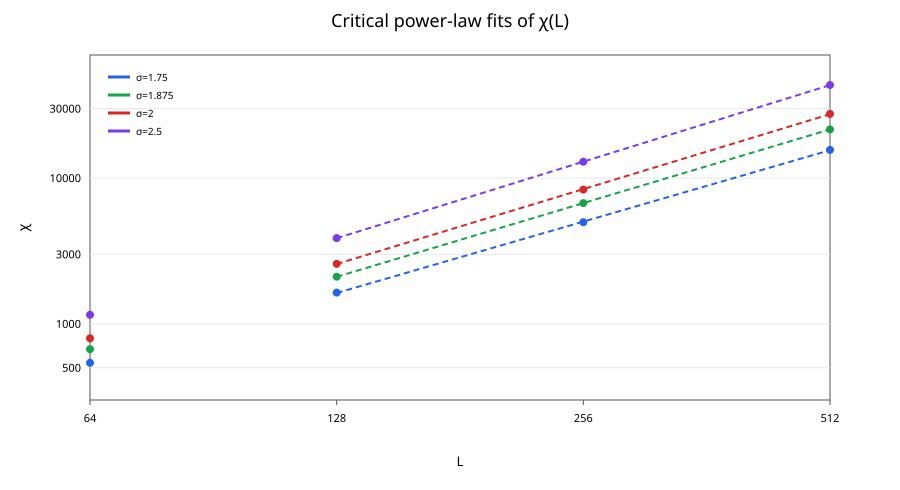
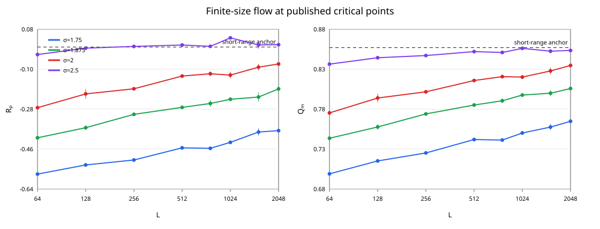
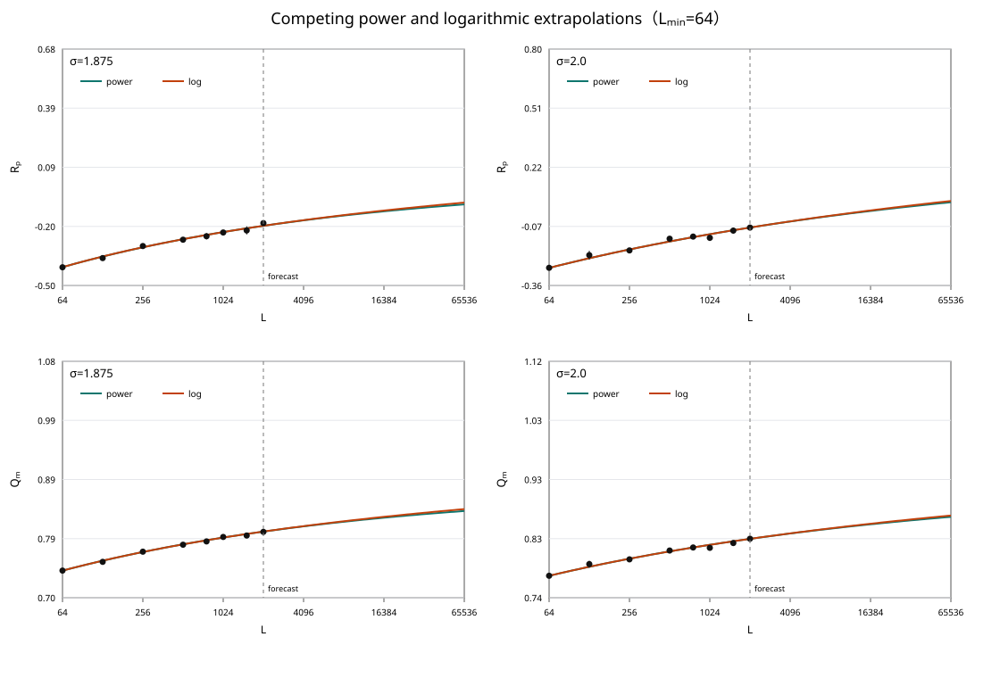
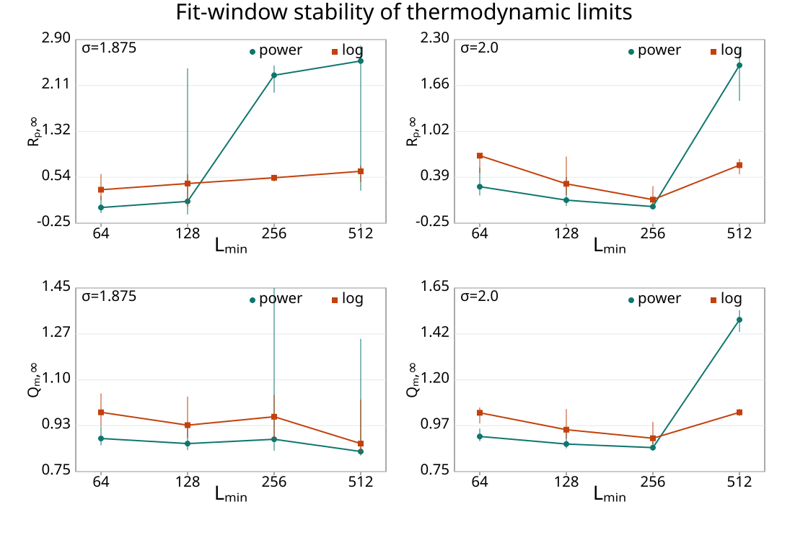
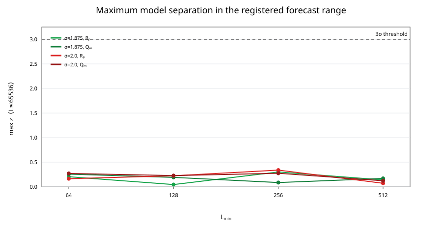

<!-- BILINGUAL SYNC: when changing conclusions, numbers, tables, figures, or captions, check track_a_report_zh.md and update it when applicable. -->

# Issue #86 Track A Reproduction and Extension Report (English)

**Project:** Long-range/short-range universality boundary in the 2D classical long-range Ising model

**Official challenge:** [QuantumBFS/quantum.harness Issue #86](https://github.com/QuantumBFS/quantum.harness/issues/86)

**Methods:** Fukui–Todo/FK $O(N)$ cluster Monte Carlo; independent Clock factorized-Metropolis cross-check

**Data cutoff:** 2026-07-30

**Conclusion label:** **Finite-size reproduction successful; thermodynamic discrimination remains inconclusive at the completed scales.**

---

## 1. Executive summary

We selected Track A of Issue #86 and studied the two-dimensional square-lattice
long-range Ising model

$$
H=-\sum_{i<j}\frac{c(\sigma,L)}{r_{ij}^{2+\sigma}}s_i s_j,
\qquad
\sum_{j\ne i}J_{ij}=4,
$$

using the minimum-image periodic convention and the published critical inverse
temperatures. The official scientific question is whether the crossover is
controlled by the Sak boundary
$\sigma_*=2-\eta_{\rm SR}=7/4$ or the geometric boundary
$\sigma_*=2$.

The base production covered
$\sigma=\{1.75,1.875,2.0,2.5\}$,
$L=\{64,128,256,512\}$, three temperatures around criticality, and two
independent seeds, yielding 96 successful cells. The extension snapshot
contains 36 successful cells: 30 central-$\beta_c$ cells and six incomplete
large-size crossing cells. Central data reach $L=2048$. The independent
Clock production completed 16/16 cells.

We observe three connected results. First, at $\sigma=2.5$, $R_p$ flows
toward the short-range anchor zero, the extrapolated $Q_m$ is 0.85623, and
$\eta=0.2546$ is close to the two-dimensional short-range Ising value $1/4$.
In contrast, all $\sigma\le2$ points remain visibly separated from these
anchors at $L=2048$. The data therefore resolve a finite-size flow from
long-range to short-range behavior and are compatible with a universality
change near $\sigma=2$. At $\sigma=1.875,L=2048$, we obtain
$R_p=-0.1885(103)$ and $Q_m=0.80589(17)$, differing from the published
thermodynamic estimates by about $1.35\sigma$ and $1.11\sigma$. This
supports the consistency of the implementation, normalization, and FK
observable definitions.

Second, the finite-size flow does not have a unique thermodynamic
interpretation. Power and marginal/log corrections have
$|\Delta\mathrm{AICc}|\le0.18$ in the key windows, while both the preferred
model and extrapolated limit change with $L_{\min}$. The observed drift can
therefore represent either a long-range fixed point in the $\sigma_*=2$
scenario or an unfinished long-range-to-short-range crossover under
$\sigma_*=7/4$. With the current error model, forecasts of the same data type
do not reach stable $3\sigma$ discrimination by $L=65536$.

Third, the independent Clock method agrees with FK for $Q_m,\chi$ through
$L=256$, but at $L=512$ it develops
$\tau_{\rm int}\sim8\times10^3$ and deviations beyond $3\sigma$. This
identifies inadequate local-update mixing rather than conflicting equilibrium
physics.

The result is thus a successful finite-size reproduction compatible with the
$\sigma_*=2$ proposal, but it does not exclude the Sak boundary
$\sigma_*=7/4$. Thermodynamic boundary discrimination remains inconclusive.

---

## 2. Model, observables, and numerical methods

### 2.1 Pinned conventions

- Geometry: $L\times L$ square torus;
- distance: minimum image;
- interaction: $J(r)\propto r^{-(2+\sigma)}$;
- normalization: $\sum_{j\ne i}J_{ij}=4$ at every site;
- critical inverse temperatures:

| $\sigma$ | $\beta_c$ |
|---:|---:|
| 1.75 | 0.329136 |
| 1.875 | 0.336985 |
| 2.0 | 0.344439 |
| 2.5 | 0.369446 |

### 2.2 Primary observables

$$
Q_m=\frac{\langle M^2\rangle^2}{\langle M^4\rangle},
\qquad
R_p=\langle R_2\rangle-2\langle R_0\rangle,
\qquad
\chi=L^2\langle m^2\rangle.
$$

$R_2$ denotes an FK cluster wrapping both torus directions and $R_0$
denotes no wrapping. $R_p$ and $Q_m$ are primary. The secondary exponent
$\eta$ is estimated from $\chi\sim L^{2-\eta}$.

### 2.3 Primary FK algorithm

The main calculation uses a Poisson-event FK cluster update equivalent to the
Fukui–Todo event representation. The expected event count per sweep is
$O(N)$, while retaining the cluster topology needed for $R_p$. Each base
production cell used 10,000 thermalization and 100,000 measurement sweeps and
stored a summary, 20 raw blocks, seed, normalization error, autocorrelation
estimate, runtime metadata, and Slurm logs.

### 2.4 Independent Clock algorithm

We independently implemented a factorized-Metropolis Clock local update. On a
fixed $L=4$ configuration, 200,000 one-step proposals gave:

- Clock acceptance: 0.377645;
- explicit factorized-Metropolis acceptance: 0.377270;
- six-standard-error tolerance: 0.006504.

The correctness gate passed. Clock does not construct FK clusters, so it
cross-checks $Q_m$ and $\chi$, but not $R_p$.

---

## 3. Data integrity and reproducibility

### 3.1 Frozen data

| Dataset | Successful cells | summaries | blocks | metadata | non-empty stderr |
|---|---:|---:|---:|---:|---:|
| Base FK production | 96 | 96 | 96 | 96 | 0 |
| Large-size cutoff snapshot | 36 | 36 | 36 | 36 | old timeout logs only |
| Clock production | 16 | 16 | 16 | 16 | 0 |

The large-size snapshot contains:

- 30 central-$\beta_c$ cells;
- six partial crossing cells;
- central data through $L=2048$ for every $\sigma$;
- one missing seed at both $L=1024$ and $L=2048$ for $\sigma=2.5$;
- an incomplete large-size crossing grid, which is retained but not
  extrapolated.

### 3.2 Locked analysis and honesty rule

Before inspecting the full production aggregate, we registered:

- power correction:
  $O(L)=O_\infty+aL^{-\omega}$;
- marginal/log correction:
  $O(L)=O_\infty+a/\log(L/L_0)$;
- AICc, BIC, and leave-one-size-out prediction error;
- stability after removing the smallest sizes;
- no extrapolation from incomplete grids;
- an **inconclusive** label whenever the conclusion changes with model or
  window.

The cutoff analysis used 1,000 parametric-bootstrap replicas.

---

## 4. Compliance with the official Track A requirements

| Official requirement | Status | Evidence and qualification |
|---|---|---|
| Model, minimum-image convention, and $\sum J=4$ | Complete | Production normalization errors are at floating-point roundoff |
| Exact NN $\beta_c$ | Complete | Used $\ln(1+\sqrt2)/2$ |
| NN $Q_m=0.856216(1)$ | Substantially complete | $L=8,16,32$: 0.8584, 0.8593, 0.8574 |
| NN $R_p=0$ | Partial | 0.0200(146), 0.0272(172), 0.0317(140); close but not a high-precision confirmation |
| NN $\eta=1/4$ | Not separately completed | No dedicated multi-size NN eta fit is present |
| Published $\sigma=2.5$ LR/SR control | Substantially complete | $R_p$ trends toward zero; $\eta=0.2546$; extrapolated $Q_m=0.85623$, containing 0.857 |
| Required $\sigma$ and $L=64$–$512$ grid | Complete | 96/96 base cells successful |
| $R_p,Q_m$ curves and crossings | Complete for the base grid | All 24 base crossings were interpolated inside the registered beta window |
| Power and log correction models | Complete | AICc/BIC, bootstrap, and window stability are reported |
| Drop-smallest-size stability | Complete | Limits are unstable; result remains inconclusive |
| Raw-data escrow | Complete in this submission | 787 frozen files are published with generation revision `26234d4` and a SHA-256 manifest |
| Blind adjudication | Pending | No independent conflict-free adjudicator has yet applied the locked rules |
| No one-fit overclaim | Complete | Neither Sak nor geometric scenario is selected |

### 4.1 Official crossing results

The largest base size-pair crossings, $256/512$, are:

| $\sigma$ | published $\beta_c$ | $R_p$ crossing | $Q_m$ crossing |
|---:|---:|---:|---:|
| 1.75 | 0.329136 | 0.329148 | 0.329434 |
| 1.875 | 0.336985 | 0.337304 | 0.337593 |
| 2.0 | 0.344439 | 0.344857 | 0.345165 |
| 2.5 | 0.369446 | 0.370195 | 0.370435 |

Every crossing lies inside the preregistered $\beta_c\pm0.002$ window and
shows the expected finite-size drift.

### 4.2 Secondary exponent $\eta$

Using the base data with $L\ge128$:

| $\sigma$ | $\eta$ |
|---:|---:|
| 1.75 | 0.3729 |
| 1.875 | 0.3204 |
| 2.0 | 0.2915 |
| 2.5 | 0.2546 |

The $\sigma=1.875$ value remains above the published thermodynamic estimate
0.293(3), consistently with strong finite-size corrections. The
$\sigma=2.5$ value is close to the short-range Ising value $1/4$.

**Figure 1 | Finite-size fit of eta.** Points and error bars are the
central-critical-point data; dashed lines are fits of
$\chi\propto L^{2-\eta}$ using $L\ge128$. The dedicated multi-size NN anchor
will be added in the same form when the $L=256$ production completes.

**Figure 2 | Finite-size flow.** Points and error bars are the frozen central
data; dashed horizontal lines mark the two-dimensional short-range Ising
anchors. The plot shows the flow over accessible sizes and does not by itself
determine the $L\to\infty$ boundary.

---

## 5. Results for the official scientific question

### 5.1 Largest central values

| $\sigma$ | $R_p(L=2048)$ | $Q_m(L=2048)$ | seeds |
|---:|---:|---:|---:|
| 1.75 | -0.376800(16) | 0.76486(21) | 2 |
| 1.875 | -0.1885(103) | 0.80589(17) | 2 |
| 2.0 | -0.076125(19) | 0.83474(11) | 2 |
| 2.5 | 0.01065 | 0.85351 | 1 |

At $\sigma=1.875$, the $L=2048$ values agree with the published
thermodynamic estimates at roughly the $1$–$1.5\sigma$ level, supporting
the end-to-end implementation and normalization.

### 5.2 Competing correction models

For the full $L=64$–$2048$ window:

| $\sigma$ | observable | AICc power | AICc log | $|\Delta\mathrm{AICc}|$ |
|---:|---|---:|---:|---:|
| 1.875 | $R_p$ | 17.54 | 17.36 | 0.18 |
| 1.875 | $Q_m$ | 13.99 | 14.06 | 0.07 |
| 2.0 | $R_p$ | 19.06 | 19.12 | 0.06 |
| 2.0 | $Q_m$ | 20.95 | 21.04 | 0.10 |

These differences are far too small for model selection. Removing smaller
sizes makes the three-parameter limits less stable. Several $\sigma=1.75$
fits and the $\sigma=2.5$ $R_p$ fits have poor absolute chi-square or hit
parameter bounds; their formal $O_\infty$ values are not physically
interpretable.

**Figure 3 | Competing extrapolations.** Black points are the frozen
$L\le2048$ data. Green and orange curves are the power and marginal/log fits
using the full $L_{\min}=64$ window. They describe the measured interval
almost equally well but diverge in the forecast region. Curves beyond the
measured range visualize model ambiguity and are not evidence for unmeasured
physics.

**Figure 4 | Extrapolation-window stability.** The horizontal axis is the
smallest retained size and the vertical axis is the model-dependent
thermodynamic limit; error bars are the 16%–84% intervals from 1,000 bootstrap
replicas. Strong model and window dependence prevents a stable
$L\to\infty$ conclusion.

The result for the official question is:

> The expected finite-size drift is reproduced, but the registered analysis
> does not distinguish $\sigma_*=7/4$ from $\sigma_*=2$.

---

## 6. Added Challenge 1: extend the size ladder to $L=2048$

### Question

Is the official $L\le512$ ladder simply too small? Does extending the
central data to $L=768,1024,1536,2048$ stabilize the extrapolation?

### Results

- Central data reach $L=2048$ with two seeds for
  $\sigma=1.75,1.875,2.0$;
- $\sigma=2.5$ has one successful seed at $L=1024,2048$;
- $R_p,Q_m$ at $\sigma=1.875$ move clearly toward the published
  thermodynamic estimates;
- $R_p=-0.0761$ at $\sigma=2.0,L=2048$, so finite-size effects remain
  visible;
- the larger ladder reduces strict underdetermination but does not remove
  model and window dependence.

### Assessment

The extension strengthens the reproduction but does not adjudicate the
boundary. It supports the officially accepted negative result that accessible
scales remain insufficient to distinguish the scenarios.

---

## 7. Added Challenge 2: forecast the distinguishable size

### Question

If the current ladder is inconclusive, at what size does the separation
between the two fitted means exceed propagated parameter and Monte Carlo
uncertainty by $3\sigma$?

### Method

We evaluated
$$
L=3072,4096,6144,8192,12288,16384,32768,65536
$$
and propagated both parameter covariance and the achieved statistical error.

### Result

Every registered forecast for the primary observables returns `>65536`.
This does not prove that $L=65536$ is physically insufficient. It means
that, under the current model ambiguity and error budget, merely extending the
same type of data does not guarantee discrimination.

**Figure 5 | Distinguishable-size forecast.** Each point is the maximum
power–log separation reached over the registered candidate sizes
$3072\le L\le65536$ for the corresponding $L_{\min}$ fit. The dashed line is
the $3\sigma$ decision threshold. Every $\sigma=1.875,2.0$ forecast for
$R_p,Q_m$ remains far below it, so `>65536` is a planning result after
uncertainty propagation, not a claim about unmeasured physics.

### Assessment

This is a principal new result. The bottleneck is not only the maximum size,
but also non-identifiable correction structure and critical-point systematic
error. More efficient future work should prioritize:

1. denser critical windows and improved $\beta_c$;
2. theoretically constrained joint fits rather than free three-parameter
   single-observable fits;
3. independent observables or algorithms;
4. sizes chosen to maximize model-prediction separation.

---

## 8. Added Challenge 3: independent Clock-algorithm cross-check

### Question

Can a local Clock implementation with different systematic errors reproduce
the FK thermodynamic observables?

### Results

Through $L=256$, all six comparisons pass the preregistered $3\sigma$
gate:

| $\sigma$ | $L$ | $Q_m$ difference | $\chi$ difference |
|---:|---:|---:|---:|
| 1.875 | 64 | +0.44σ | +0.45σ |
| 1.875 | 128 | +0.33σ | +0.29σ |
| 1.875 | 256 | +0.63σ | +0.24σ |
| 2.0 | 64 | +2.06σ | +2.16σ |
| 2.0 | 128 | +1.17σ | +1.13σ |
| 2.0 | 256 | +1.04σ | +0.86σ |

At $L=512$:

- $\sigma=1.875$: $Q_m$ differs by $-3.21\sigma$;
- $\sigma=2.0$: $Q_m$ differs by $-4.38\sigma$;
- maximum $\tau_{\rm int}$ is approximately 7,860 and 8,372 sweeps.

### Assessment

The $L=512$ discrepancy occurs together with a sharp increase in
autocorrelation, showing that one million local-update sweeps are not
sufficiently mixed. This is a scale limit of local Clock dynamics, not a
refutation of the equilibrium FK result. The negative result demonstrates
that independent algorithm comparisons must audit mixing and autocorrelation,
not only final means.

---

## 9. Limitations

1. A dedicated high-precision NN $\eta=1/4$ multi-size validation is absent.
2. The NN $R_p=0$ anchor is consistent only at roughly the two-error level
   and should be improved.
3. Only six large-size crossing cells are available; the registered crossing
   grid is incomplete.
4. One $\sigma=2.5$ seed is missing at both $L=1024$ and $L=2048$.
5. Some free three-parameter fits hit bounds or have poor absolute fit quality;
   their $O_\infty$ values cannot be interpreted.
6. Clock is insufficiently mixed at $L=512$.
7. Blind adjudication has not yet been performed.
8. The public escrow records the generation revision and file checksums, but
   public packaging follows the local analysis; timestamps and locked records
   therefore remain part of the chronology audit.

---

## 10. Final conclusion and deliverable assessment

### Scientific conclusion

**Finite-size reproduction successful; thermodynamic discrimination remains
inconclusive.**

This is an explicitly accepted outcome of the official challenge. The data do
not support choosing either the Sak or geometric boundary under the locked
rules. A claim based on one preferred fit would violate the official
no-one-fit rule.

### Deliverable status

- Short-range/long-range controls: substantially complete;
- base finite-size curves and crossings: complete;
- competing corrections, model selection, and window stability: complete;
- raw data and locked records: published in this PR with a checksum manifest;
- new research edge: an uncertainty-controlled negative result and an
  independent algorithmic scale audit;
- before final submission: add the NN eta validation and obtain blind
  adjudication.

---

## 11. Main artifacts

- `locked_analysis.md`: official base-analysis registration;
- `locked_extension_analysis.md`: extension-analysis registration;
- `clock_crosscheck_protocol.md`: Clock cross-check gate;
- `data_manifest.md` and `data_manifest.sha256`: public frozen-data escrow,
  generation revision, and integrity hashes;
- `results/track_a_20260727/analysis/aggregated.csv`: base aggregate;
- `results/track_a_20260727/analysis/crossings.csv`: base crossings;
- `results/track_a_20260727/analysis/eta_fits.csv`: eta fits;
- `results/track_a_cutoff_analysis_20260730/combined_critical.csv`: cutoff
  central data;
- `results/track_a_cutoff_analysis_20260730/model_fits.csv`: 1,000-bootstrap
  model fits;
- `results/track_a_cutoff_analysis_20260730/distinguishable_size.csv`:
  distinguishable-size forecast;
- `results/clock_production_20260729/comparison_cutoff.csv`: Clock–FK
  comparison;
- `research_log.md`: complete research log.
