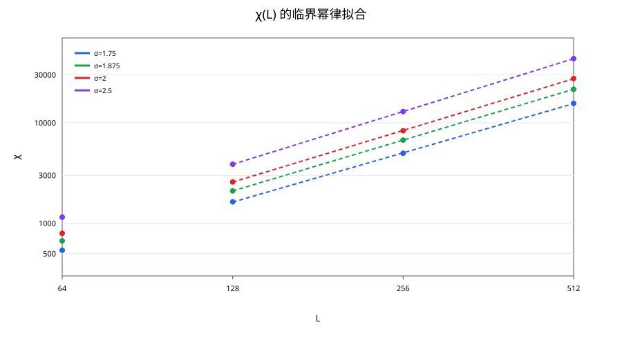
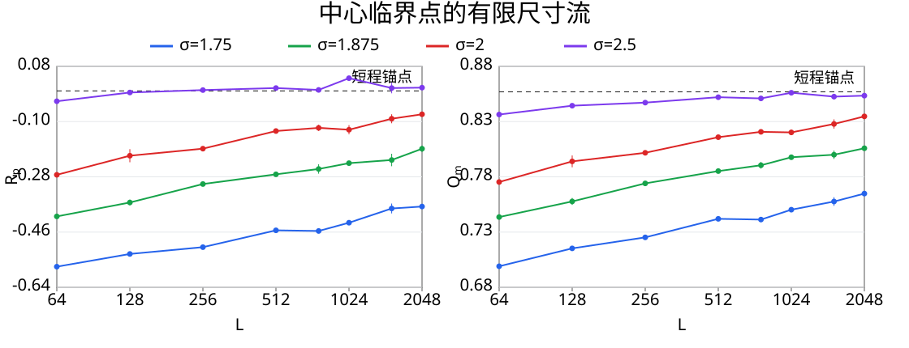
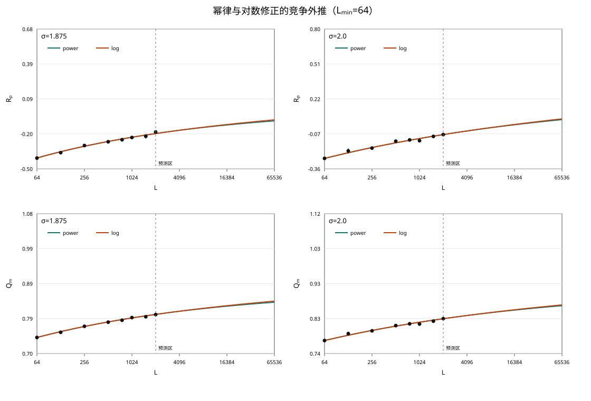
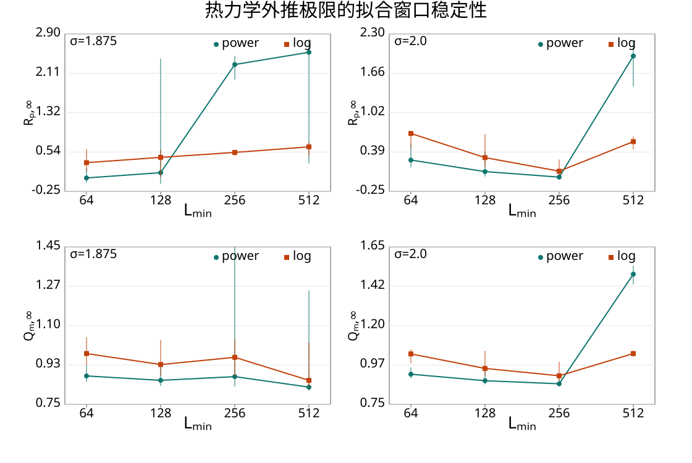
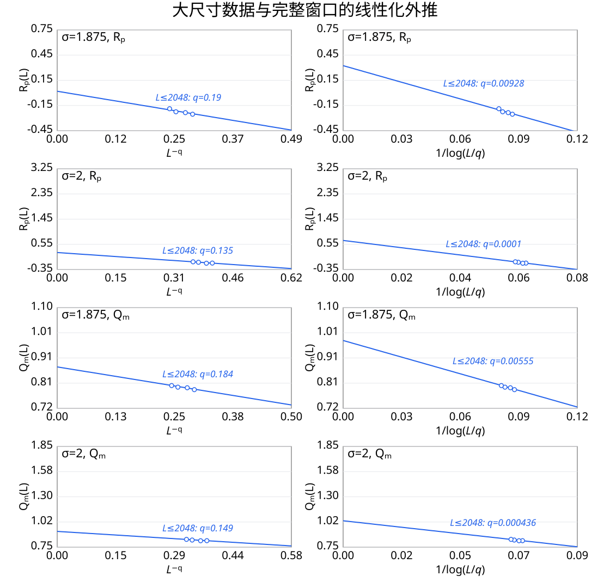
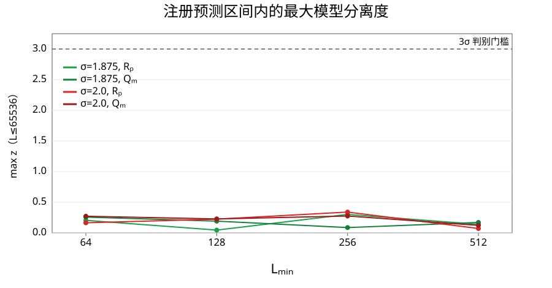

<!-- 双语同步：修改结论、数值、表格、图片或图注时，检查 track_a_report_en.md，并在适用时同步更新。 -->

# Issue #86 Track A 复现与扩展研究报告（中文版）

**项目：** 二维经典长程 Ising 模型的长程—短程普适性边界

**官方挑战：** [QuantumBFS/quantum.harness Issue #86](https://github.com/QuantumBFS/quantum.harness/issues/86)

**方法：** Fukui–Todo/FK $O(N)$ 集群 Monte Carlo；独立 Clock factorized-Metropolis 交叉验证

**数据截止：** 2026-07-30

**结论标签：** **有限尺寸复现成功；在已完成尺度上，热力学极限判别仍不确定。**

---

## 1. 摘要

本工作选择 Issue #86 的 Track A，研究二维平方晶格长程 Ising 模型

$$
H=-\sum_{i<j}\frac{c(\sigma,L)}{r_{ij}^{2+\sigma}}s_i s_j,
\qquad
\sum_{j\ne i}J_{ij}=4.
$$

计算严格采用最小镜像周期边界和论文给定的临界逆温度。官方科学问题是区分 Sak 边界
$\sigma_*=2-\eta_{\rm SR}=7/4$ 与几何边界 $\sigma_*=2$。

基础生产任务覆盖 $\sigma=\{1.75,1.875,2.0,2.5\}$、
$L=\{64,128,256,512\}$、三个临界点附近温度和两个独立种子，共得到
完整基础网格。大尺寸扩展在中心 $\beta_c$ 计算了
$L=\{768,1024,1536,2048\}$；除 $\sigma=2.5$ 的 $L=1024,2048$
各只有一个种子外，其余参数均有两个种子。大尺寸 crossing 只计算了
$\sigma=1.875$ 的 $L=1024,2048$ 和 $\sigma=2.0$ 的 $L=1024$，
网格尚不完整。独立 Clock 在 $\sigma=1.875,2.0$ 上计算了
$L=\{64,128,256,512\}$，每个尺寸两个种子。

我们观察到三组相互关联的结果。第一，$\sigma=2.5$ 的 $R_p$ 随尺寸趋近
短程锚点 0，$Q_m$ 外推为 0.85623，且 $\eta=0.2546$ 接近二维短程 Ising
值 $1/4$；相反，$\sigma\le2$ 在 $L=2048$ 时仍与这些短程锚点明显分离。
这说明数据已经解析出长程到短程的有限尺寸流，并与“$\sigma=2$ 附近发生
普适性改变”的物理图景相容。在 $\sigma=1.875,L=2048$，我们得到
$R_p=-0.1885(103)$ 和 $Q_m=0.80589(17)$，与论文热力学估计分别相差
约 $1.35\sigma$ 和 $1.11\sigma$，进一步支持模型实现、归一化和 FK
观测量定义的一致性。

第二，有限尺寸流尚未给出唯一的热力学解释。power 与 marginal/log
修正在关键窗口中的 $\lvert\Delta\mathrm{AICc}\rvert$ 不超过 0.18；改变
$L_{\min}$ 后，优选模型和外推极限均不稳定。两种修正因此都能解释
当前尺度上的缓慢漂移：它既可能来自 $\sigma_*=2$ 情景中的长程固定点，
也可能来自 $\sigma_*=7/4$ 情景下尚未结束的长程—短程交叉。在固定论文
$\beta_c$ 和两种预注册修正形式、且只传播参数预测协方差与预期
Monte Carlo 统计误差的条件下，将同类数据外推到 $L=65536$ 仍不能
稳定达到 $3\sigma$ 区分。这是条件性的计算规划结果；$\beta_c$ 系统
误差和额外模型形式不确定性并未计入该阈值。

第三，独立 Clock 方法在 $L\le256$ 时与 FK 的 $Q_m,\chi$ 一致，但在
$L=512$ 时出现 $\tau_{\rm int}\sim8\times10^3$ 和超过 $3\sigma$ 的
偏离。这将大尺寸差异定位为局域更新的混合失败，而不是两种平衡态算法
给出不同物理。

综上，当前结果支持“有限尺寸复现成功，并与 $\sigma_*=2$ proposal
相容”，但尚不足以排除 Sak 边界 $\sigma_*=7/4$。报告因此保持
“热力学边界判别未决”的结论，而不从单个外推模型作过度宣称。

---

## 2. 模型、观测量与数值方法

### 2.1 固定约定

- 几何：$L\times L$ 平方环面；
- 距离：minimum-image；
- 相互作用：$J(r)\propto r^{-(2+\sigma)}$；
- 归一化：每个格点满足 $\sum_{j\ne i}J_{ij}=4$；
- 临界逆温度：

| $\sigma$ | $\beta_c$ |
|---:|---:|
| 1.75 | 0.329136 |
| 1.875 | 0.336985 |
| 2.0 | 0.344439 |
| 2.5 | 0.369446 |

### 2.2 主要观测量

$$
Q_m=\frac{\langle M^2\rangle^2}{\langle M^4\rangle},
\qquad
R_p=\langle R_2\rangle-2\langle R_0\rangle,
\qquad
\chi=L^2\langle m^2\rangle.
$$

$R_2$ 表示某个 FK 集群同时绕过环面的两个方向，$R_0$ 表示无绕圈事件。
$R_p$ 和 $Q_m$ 是主要判据；次要指数 $\eta$ 由
$\chi\sim L^{2-\eta}$ 提取。

### 2.3 FK 主算法

主计算采用与 Fukui–Todo 事件表示等价的 Poisson 事件 FK 集群更新。
每次 sweep 的期望事件数为 $O(N)$，同时保留测量 $R_p$ 所需的集群拓扑。
每组基础生产参数使用 10,000 次热化和 100,000 次测量，并保存 summary、
20 个原始 blocks、种子、归一化误差、自相关估计、运行环境元数据和
Slurm 日志。

### 2.4 独立 Clock 方法

我们额外实现了 factorized-Metropolis Clock 局域更新。在固定的 $L=4$
构型上，用 200,000 次一步提议进行对拍：

- Clock 接受率：0.377645；
- 显式 factorized-Metropolis 接受率：0.377270；
- 六倍标准误差容限：0.006504。

正确性门槛通过。Clock 不构造 FK 集群，因此只能独立核对 $Q_m$ 和
$\chi$，不能验证 $R_p$。

---

## 3. 数据完整性与可复现性

### 3.1 已冻结数据

| 数据集 | $\sigma$ | 计算尺寸 $L$ | 温度与种子覆盖 |
|---|---|---|---|
| 基础 FK 生产 | 1.75、1.875、2.0、2.5 | 64、128、256、512 | 三个临界点附近温度；每点两个种子 |
| 大尺寸中心数据 | 1.75、1.875、2.0、2.5 | 768、1024、1536、2048 | 论文 $\beta_c$；通常两个种子 |
| 大尺寸 partial crossing | 1.875、2.0 | 1.875：1024、2048；2.0：1024 | 仅部分 $\beta_c$ 两侧温度 |
| Clock 生产 | 1.875、2.0 | 64、128、256、512 | 论文 $\beta_c$；每点两个种子 |

大尺寸快照中：

- 所有 $\sigma$ 的中心数据均达到 $L=2048$；
- $\sigma=2.5$ 的 $L=1024,2048$ 各缺一个种子；
- 大尺寸 crossing 网格不完整，因此予以保留，但不用于 crossing 外推。

### 3.2 预注册分析与诚实规则

在检查完整生产汇总之前，已经锁定：

- power 修正：$O(L)=O_\infty+aL^{-\omega}$；
- marginal/log 修正：$O(L)=O_\infty+a/\log(L/L_0)$；
- AICc、BIC 和 leave-one-size-out 预测误差；
- 删除最小尺寸后的稳定性检验；
- 不从不完整网格进行外推；
- 结论若随模型或拟合窗口变化，则标记为 **inconclusive**。

截止分析使用 1,000 次 parametric bootstrap。

---

## 4. 官方 Track A 要求逐项核对

| 官方要求 | 状态 | 证据与说明 |
|---|---|---|
| 模型、minimum-image 和 $\sum J=4$ | 完成 | 全部生产数据的归一化误差仅为浮点舍入量级 |
| 精确 NN $\beta_c$ | 完成 | 使用 $\ln(1+\sqrt2)/2$ |
| NN $Q_m=0.856216(1)$ | 基本完成 | $L=8,16,32$ 分别得到 0.8584、0.8593、0.8574 |
| NN $R_p=0$ | 部分完成 | 得到 0.0200(146)、0.0272(172)、0.0317(140)，接近但尚非高精度确认 |
| NN $\eta=1/4$ | 完成 | 合并高统计量 $L=64,128$ 与独立的 $L=256,512$ 数据，得到 $\eta=0.24883$（95% bootstrap CI 0.24748–0.25016） |
| 论文中的 $\sigma=2.5$ LR/SR 控制 | 基本完成 | $R_p$ 趋近 0；$\eta=0.2546$；$Q_m$ 外推为 0.85623，包含 0.857 |
| 要求的 $\sigma$ 与 $L=64$–$512$ 网格 | 完成 | 四个 $\sigma$ 均计算 $L=64,128,256,512$、三个临界点附近温度和两个种子 |
| $R_p,Q_m$ 曲线与 crossing | 基础网格完成 | 24 个基础 crossing 均在预注册温度窗口内插得到 |
| power 与 log 两类修正 | 完成 | 已输出 AICc/BIC、bootstrap 和窗口稳定性 |
| 删除最小尺寸检验 | 完成 | 外推极限不稳定，因此保持 inconclusive |
| 原始数据托管 | 本次提交完成 | 公开 787 个冻结文件，并记录生成代码 revision `26234d4` 和 SHA-256 清单 |
| 盲评 | 待办 | 尚未交给无利益冲突的独立评审者执行锁定规则 |
| 禁止单拟合过度宣称 | 完成 | 未选择 Sak 或 geometric 情景 |

### 4.1 官方 crossing 结果

基础网格最大尺寸对 $256/512$ 的 crossing 为：

| $\sigma$ | 论文 $\beta_c$ | $R_p$ crossing | $Q_m$ crossing |
|---:|---:|---:|---:|
| 1.75 | 0.329136 | 0.329148 | 0.329434 |
| 1.875 | 0.336985 | 0.337304 | 0.337593 |
| 2.0 | 0.344439 | 0.344857 | 0.345165 |
| 2.5 | 0.369446 | 0.370195 | 0.370435 |

全部 crossing 都落在预注册的 $\beta_c\pm0.002$ 窗口内，并显示预期的
有限尺寸漂移。

各组 crossing 的物理含义分别是：

- $\sigma=1.75$：$R_p$ crossing 几乎落在论文 $\beta_c$ 上，而
  $Q_m$ crossing 略向高温侧移动。这说明临界点定位总体一致，但不同
  无量纲量仍受可见的修正标度影响。
- $\sigma=1.875$：两个 crossing 都高于论文 $\beta_c$，且 $Q_m$ 的
  偏移更大。这是边界候选区附近缓慢有限尺寸漂移的直接证据，不能解释为
  新的临界温度。
- $\sigma=2.0$：偏移与 $\sigma=1.875$ 同号且更明显，说明在几何边界
  候选点上，$L\le512$ 尚未进入可忽略修正的渐近区。
- $\sigma=2.5$：两种 crossing 的正偏移最大，但中心点的 $R_p,Q_m$ 又
  随尺寸流向短程锚点。这说明 crossing 位置本身收敛较慢，不与其最终
  属于短程普适类的控制证据矛盾。

### 4.2 次要指数 $\eta$

使用基础数据中的 $L\ge128$：

| $\sigma$ | $\eta$ |
|---:|---:|
| 1.75 | 0.3729 |
| 1.875 | 0.3204 |
| 2.0 | 0.2915 |
| 2.5 | 0.2546 |

各组指数数据给出连续的物理图景：$\sigma=1.75$ 的
$\eta=0.3729$ 保留最强的长程特征；$\sigma=1.875$ 的 0.3204 仍高于
论文热力学估计 0.293(3)，表明交叉区修正尚强；$\sigma=2.0$ 的 0.2915
继续向短程值移动，但单独并不能证明边界位于 2；$\sigma=2.5$ 的 0.2546
已接近短程 Ising 的 $1/4$，构成短程侧控制。

**图 1｜$\eta$ 的有限尺寸拟合。** 纵轴为 $\chi/L^2$；点和误差棒为
中心临界点数据，虚线为各 $\sigma$ 使用 $L\ge128$ 得到的
$\chi/L^2\propto L^{-\eta}$ 拟合；
虚线向左外推到 $L=64$，但 $L=64$ 数据不参与拟合；右下角图例标出
每条线对应的拟合 $\eta$。

**解读。** 随 $\sigma$ 从 1.75 增至 2.5，拟合得到的 $\eta$ 从
0.3729 降至 0.2546，其中 $\sigma=2.5$ 已接近短程 Ising 值 $1/4$，
而 $\sigma=1.875$ 仍高于论文热力学估计。该趋势说明相互作用变短程时
有限尺寸标度正向短程普适行为移动，但 $\sigma\le2$ 的尺寸修正仍不可
忽略；因此本图支持交叉趋势，不能单独定位普适性边界。

严格 NN 控制在精确 $\beta_c$ 处合并 `nn_v3_20260730` 的
$L=64,128$（各 8 个种子、800 个分块）和 `nn_large_20260730` 的
$L=256,512$（各 4 个种子、200 个分块）。对
$\chi\propto L^{2-\eta}$ 的四尺寸拟合给出
$\eta=0.24883$，95% parametric-bootstrap 区间为
$[0.24748,0.25016]$，包含精确值 $1/4$；4,000 次重采样无失败。
$\chi^2/{\rm dof}=1.016$，表明幂律形式与输入误差相容。

**图 2｜严格 NN 的 $\eta=1/4$ 校准。** 图中为 $\chi(L)$ 的 log-log
幂律拟合，横轴显示 $L=64,128,256,512$。

**解读。** 四个尺寸的拟合给出 $\eta=0.24883$，其 95% bootstrap
区间 $[0.24748,0.25016]$ 包含精确值 $1/4$，且
$\chi^2/{\rm dof}=1.016$。这表明单一幂律与统计误差相容，也验证了
用于长程数据的指数提取和不确定度评估流程。

---

## 5. 官方科学问题的数值结论

### 5.1 官方 $L\le512$ 基线

官方锁定网格在中心 $\beta_c$ 只有 $L=64,128,256,512$ 四个尺寸。
power 与 marginal/log 模型都含三个自由参数，因此四点拟合满足
$n-k-1=0$，AICc 不存在；删除 $L=64$ 后又成为三点拟合三个参数，
热力学外推严格欠定。该基线足以检验 crossing 漂移、短程控制和指数
提取，却不能可靠排序两种修正形式，也不能据此确定热力学截距。

官方问题的结论是：

> 预期的有限尺寸漂移得到复现；仅凭官方 $L\le512$ 基线，修正模型和
> 热力学边界均不可辨识，因而不能区分 $\sigma_*=7/4$ 与
> $\sigma_*=2$。

---

## 6. 新增挑战 1：把尺寸阶梯扩展到 $L=2048$

### 问题

官方的 $L\le512$ 是否过小？把中心数据扩展到
$L=768,1024,1536,2048$ 后，外推是否会稳定？

### 结果

- $\sigma=1.75,1.875,2.0$ 的中心数据以两个种子达到 $L=2048$；
- $\sigma=2.5$ 在 $L=1024,2048$ 各有一个成功种子；
- $\sigma=1.875$ 的 $R_p,Q_m$ 明显向论文热力学估计移动；
- 在 $\sigma=2.0,L=2048$，$R_p=-0.0761$，说明有限尺寸效应仍然可见；
- 更大的尺寸阶梯减轻了严格的欠定问题，但没有消除模型和窗口依赖。

**图 3｜扩展尺寸上的有限尺寸流。** 点和误差棒为冻结中心数据；横轴采用
对数尺度，虚线给出二维短程 Ising 锚点。

**解读。** 在 $L=2048$，$\sigma=2.5$ 已达到
$R_p=0.01065,\ Q_m=0.85351$，接近短程锚点；相比之下，
$\sigma=1.75,1.875,2.0$ 仍与锚点保持可见偏离。这解析出了向短程固定点
靠近的有限尺寸流，但不能唯一确定其渐近边界。

### 6.1 扩展后的完整窗口比较

扩展窗口的最大尺寸中心值为：

| $\sigma$ | $R_p(L=2048)$ | $Q_m(L=2048)$ | 种子数 |
|---:|---:|---:|---:|
| 1.75 | -0.376800(16) | 0.76486(21) | 2 |
| 1.875 | -0.1885(103) | 0.80589(17) | 2 |
| 2.0 | -0.076125(19) | 0.83474(11) | 2 |
| 2.5 | 0.01065 | 0.85351 | 1 |

这四组中心数据分别说明：

- $\sigma=1.75$：$R_p$ 显著为负且 $Q_m$ 最低，说明即使到 $L=2048$
  仍保持最清楚的长程固定点特征。
- $\sigma=1.875$：两种比值均向论文热力学估计移动，说明扩展尺寸正在
  解析 Sak 候选边界附近的缓慢交叉，但尚未达到稳定极限。
- $\sigma=2.0$：$R_p$ 仍为负、$Q_m$ 仍低于短程锚点，说明几何边界
  候选点在当前尺度仍有显著有限尺寸修正；它既不等于已经证明长程，也不
  等于已经流到短程。
- $\sigma=2.5$：$R_p$ 接近 0、$Q_m$ 接近 0.856216，说明该组已经流向
  二维短程 Ising 普适类。由于只有一个种子，其统计精度不能与前三组
  等量比较。

在完整的 $L=64$–$2048$ 窗口中：

| $\sigma$ | 观测量 | AICc power | AICc log | $\lvert\Delta\mathrm{AICc}\rvert$ |
|---:|---|---:|---:|---:|
| 1.875 | $R_p$ | 17.54 | 17.36 | 0.18 |
| 1.875 | $Q_m$ | 13.99 | 14.06 | 0.07 |
| 2.0 | $R_p$ | 19.06 | 19.12 | 0.06 |
| 2.0 | $Q_m$ | 20.95 | 21.04 | 0.10 |

每组模型比较的物理含义是：

- $\sigma=1.875$ 的 $R_p$ 与 $Q_m$ 分别只有
  $|\Delta\mathrm{AICc}|=0.18$ 和 0.07。拓扑绕圈量与磁化比都无法区分
  幂修正和边缘对数修正，因此模型歧义不是单一观测量的偶然现象。
- $\sigma=2.0$ 的相应差异为 0.06 和 0.10。几何边界候选点同样没有
  显示对某种修正形式的统计偏好，因此不能由“更接近 $\sigma=2$”推断
  已经选定几何边界。
- 四组比较共同说明：新增尺寸使三参数拟合可计算，却没有让渐近修正形式
  可辨识；删除较小尺寸后极限更不稳定，进一步排除了稳健边界判决。

**图 4｜线性化的竞争外推。** 左列使用 $x=L^{-q}$，右列使用
$x=1/\log(L/q)$；两种模型均写成 $O(L)=O_\infty+a x$。蓝色空心点为
$L\le2048$ 冻结数据，直线为 $L_{\min}=64$ 拟合。

**解读。** 两种修正坐标中数据都近似线性，且
$\lvert\Delta\mathrm{AICc}\rvert$ 仅为 0.06–0.18，却给出不同的
$x=0$ 截距。因此拟合外观和信息准则都不能唯一选择热力学极限。

**图 5｜外推窗口稳定性。** 横轴为共同的原始尺寸 $L$，即拟合保留的
最小尺寸；纵轴为相应模型给出的热力学极限。误差棒为 1,000 次
bootstrap 的 16%–84% 区间，是外推参数不确定度而非原始测量误差。

**解读。** 提高拟合起点后，power 与 log 的外推值明显移动，部分区间
急剧变宽或触及参数边界。共同横轴只编码拟合窗口，不把两种模型各自的
修正变量混在同一坐标中；图中不稳定性来自截距对窗口的敏感性。

**图 6｜大尺寸数据与完整窗口的线性化外推。** 左列为
$x=L^{-q}$，右列为 $x=1/\log(L/q)$。蓝色圆点只显示新增的
$L=768,1024,1536,2048$ 数据；蓝色实线是使用完整
$L=64$–$2048$ 窗口得到的拟合。图中不显示 $L\le512$ 原始点、基线
拟合或其标注；每个面板只标出当前完整窗口拟合的 $q$。

**解读。** 图中直观展示新增大尺寸点与最终完整窗口外推的关系。与官方
四尺寸基线的数值结果相比，$\sigma=2.0$ 的 power 极限由病态的
$R_{p,\infty}=3.06,\ Q_{m,\infty}=1.76$ 移至 0.257 和 0.922；
但完整窗口中的 power/log 截距仍不一致，所以扩展改善了约束而未消除
模型依赖。

### 判断

该扩展加强了复现证据，但没有裁决边界争议。结果支持官方允许的负结论：
当前可达尺度仍不足以区分两种情景。

---

## 7. 新增挑战 2：预测可区分尺寸

### 问题

如果当前尺寸阶梯不能判别，那么在什么尺寸上，两种拟合均值之差才会超过
参数误差和 Monte Carlo 误差传播后的 $3\sigma$？

### 方法

评估的预测尺寸为

$$
L=3072,4096,6144,8192,12288,16384,32768,65536.
$$

在固定论文 $\beta_c$、固定 power 与 marginal/log 两种预注册形式的
条件下，误差分母只包含两套拟合的参数预测协方差，以及按当前达到水平
外推的未来 Monte Carlo 标准误。这里没有传播 $\beta_c$ 系统误差，
也没有把两种形式之外的模型不确定性作为随机误差加入。

### 结果

主要观测量的所有预注册预测都返回 `>65536`。这并不证明
$L=65536$ 在物理上仍然不够，而是说明：在上述条件性误差预算下，
仅仅继续增加同类数据的最大尺寸，不能保证获得判别。

分组来看，$\sigma=1.875$ 的 $R_p$ 与 $Q_m$ 都说明 Sak 候选边界附近
的两种渐近描述在可规划尺寸上仍过于接近；$\sigma=2.0$ 的两种观测量
也未达到阈值，说明直接模拟几何边界候选点并不会自动提高判别力。两个
观测量给出相同结论，意味着瓶颈同时存在于拓扑绕圈和磁化涨落通道。

**图 7｜可区分尺寸预测。** 每个点表示对应 $L_{\min}$ 拟合在注册候选
尺寸 $3072\le L\le65536$ 中达到的最大 power–log 分离度；虚线为
$3\sigma$ 判别门槛。

**解读。** $\sigma=1.875,2.0$ 的 $R_p,Q_m$ 在所有拟合窗口中的预测
分离度都远低于门槛。在注册的两种模型之间，参数预测不确定度与假定的
未来 Monte Carlo 误差使分离度未达阈值；因此 `>65536` 是指定误差模型
下的规划结果，而不是断言未测量系统在 $L=65536$ 仍不具有渐近行为。

### 判断

这是本工作的主要新增结果之一。瓶颈不仅是最大尺寸，还包括当前数据下
不可辨识的修正结构。未传播的 $\beta_c$ 与额外模型形式系统误差只会
进一步限制该阈值的普适解释。后续更有效的工作应优先考虑：

1. 更密集的临界窗口和更准确的 $\beta_c$；
2. 采用具有理论约束的联合拟合，而不是自由的三参数单观测量拟合；
3. 引入独立观测量或独立算法；
4. 选择能最大化不同模型预测差异的尺寸。

---

## 8. 新增挑战 3：独立 Clock 算法交叉验证

### 问题

系统误差来源不同的局域 Clock 实现，能否复现 FK 的热力学观测量？

### 结果

在 $L\le256$ 时，以下 6 组比较全部通过预注册的 $3\sigma$ 门槛：

| $\sigma$ | $L$ | $Q_m$ 差异 | $\chi$ 差异 |
|---:|---:|---:|---:|
| 1.875 | 64 | +0.44σ | +0.45σ |
| 1.875 | 128 | +0.33σ | +0.29σ |
| 1.875 | 256 | +0.63σ | +0.24σ |
| 2.0 | 64 | +2.06σ | +2.16σ |
| 2.0 | 128 | +1.17σ | +1.13σ |
| 2.0 | 256 | +1.04σ | +0.86σ |

在 $L=512$ 时：

- $\sigma=1.875$ 的 $Q_m$ 相差 $-3.21\sigma$；
- $\sigma=2.0$ 的 $Q_m$ 相差 $-4.38\sigma$；
- 最大 $\tau_{\rm int}$ 分别约为 7,860 和 8,372 sweeps。

对 $\sigma=1.875$，$L=64$–$256$ 的两种观测量均在 $1\sigma$ 内一致，
说明 Clock 与 FK 在交叉区的小中尺寸采样同一平衡态分布。对
$\sigma=2.0$，差异从 $L=64$ 的约 $2\sigma$ 随尺寸先降到约
$1\sigma$，也没有形成随尺寸持续增长的物理偏离。两组只在 $L=512$
同时伴随巨大自相关而越过 $3\sigma$，因此该组数据诊断的是 Clock
混合失败，而不是 $\sigma=1.875$ 与 2.0 具有不同的算法依赖物理。

### 判断

$L=512$ 的差异与自相关时间陡增同时出现，说明一百万次局域更新 sweep
仍未充分混合。这是局域 Clock 动力学的尺度限制，并非对平衡态 FK 结果
的否定。该负结果表明，独立算法比较必须审计混合和自相关，而不能只比较
最终均值。

---

## 9. 局限性

1. NN $R_p=0$ 锚点只在约两个误差量级内一致，仍需提高精度。
2. 大尺寸 crossing 仅覆盖 $\sigma=1.875$ 的 $L=1024,2048$ 和
   $\sigma=2.0$ 的 $L=1024$，预注册 crossing 网格不完整。
3. $\sigma=2.5$ 在 $L=1024$ 和 $L=2048$ 各缺一个种子。
4. 部分自由三参数拟合触及参数边界或绝对拟合质量较差，因此其
   $O_\infty$ 不能解释。
5. Clock 在 $L=512$ 时混合不足。
6. 尚未完成盲评。
7. 公开数据清单已记录生成代码 revision 和文件校验值；但公开打包发生在
   本地分析之后，因此仍需结合时间戳和锁定记录审计时间顺序。

---

## 10. 最终结论与交付评估

### 科学结论

**有限尺寸复现成功；热力学极限判别仍不确定。**

这是官方挑战明确允许的结果。按照锁定规则，当前数据不支持选择 Sak
边界或几何边界；根据某一个偏好拟合作结论会违反官方的 no-one-fit 规则。

### 交付状态

- 短程/长程控制：基本完成；
- 基础有限尺寸曲线与 crossing：完成；
- 竞争修正、模型选择和窗口稳定性：完成；
- 原始数据与锁定记录：已随本 PR 公开，并附校验清单；
- 新研究边缘：得到受误差控制的负结果，并完成独立算法的尺度审计；
- 最终提交前：完成盲评。

---

## 11. 主要产物

- `locked_analysis.md`：官方基础分析预注册；
- `locked_extension_analysis.md`：扩展分析预注册；
- `clock_crosscheck_protocol.md`：Clock 交叉验证门槛；
- `data_manifest.md` 与 `data_manifest.sha256`：公开冻结数据、生成代码 revision
  与完整性校验；
- `results/track_a_20260727/analysis/aggregated.csv`：基础汇总；
- `results/track_a_20260727/analysis/crossings.csv`：基础 crossing；
- `results/track_a_20260727/analysis/eta_fits.csv`：$\eta$ 拟合；
- `results/nn_v3_20260730/analysis/eta_fit.csv`：严格 NN 的 $\eta=1/4$ 校准；
- `results/nn_v3_20260730/analysis/nn_eta_power_law_fit.png`：严格 NN 拟合与残差；
- `results/track_a_cutoff_analysis_20260730/combined_critical.csv`：截止时的中心数据；
- `results/track_a_cutoff_analysis_20260730/model_fits.csv`：1,000-bootstrap 模型拟合；
- `results/track_a_cutoff_analysis_20260730/distinguishable_size.csv`：可区分尺寸预测；
- `results/clock_production_20260729/comparison_cutoff.csv`：Clock–FK 对比；
- `research_log.md`：完整研究日志。
